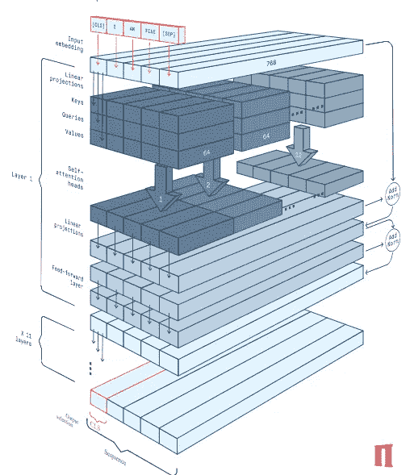
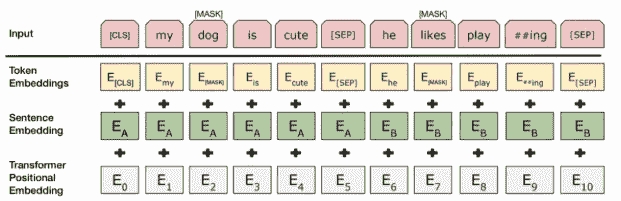
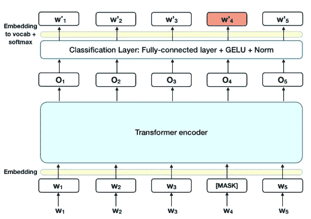

# 伯特:你需要知道的理论！！

> 原文：<https://medium.com/analytics-vidhya/bert-the-theory-you-need-to-know-ddd316794395?source=collection_archive---------11----------------------->

自从 BERT 登上舞台以来，自然语言处理一直是人工智能界的新话题。SOTA 超越了当时大多数精英模型之前实现的许多里程碑，并提出了甚至彻底改变谷歌搜索的结果。我将尝试以最简洁的形式解释来自变压器(伯特) 的 ***双向编码器表示。***

BERT paper 于 2018 年秋季提交，并通过超越当时成熟的模型，如 **GPT、nlnet、QAnet** 和**团队**中的许多其他模型以及 **GLUE** 基准，实现了最先进的性能。*(我附上了博客链接，以防你想看《胶水和小队》*。一个普遍的看法是，伯特也超过了人类的分数，这在我看来有些错误。创建基准分数时只有 3 个人参与，这显然是不合理的。想想吧！

# **建筑理论**

BERT 架构:[链接](https://peltarion.com/knowledge-center/documentation/modeling-view/build-an-ai-model/blocks/bert-encoder) (Peltarion Bert 博客)

BERT 基于由 12 个编码器层、12 个注意头和 110M 参数 ***(BERT base)*** 组成的变压器，同时还有多达 24 个编码器层、16 个注意头和 340M 参数 ***(BERT Large)。***

每个输入令牌被表示为一个 **768 长的向量**，然后乘以 **12 键、查询和值嵌入**。普通变压器也有相同数量的解码器，但在 BERT 中，我们根本没有解码器。**单个编码器层有 12 个自关注头和一个前馈神经网络**。最后，可以根据问题添加分类器层或任何其他合适的层。关于键、查询和其他嵌入的进一步研究，可以在最后找到附加的博客链接。

# **输入/输出原理**

伯特输入表示

BERT 的默认输入长度容量为 512 个标记，包括**【CLS】**和**【SEP】**标记。

[CLS](分类记号)是输入序列中的第一个记号，它携带了序列的大部分信息，并且通常对于分类问题来说是足够的。提取该令牌，因为它包含大部分信息。

[SEP](分隔符号)分隔输入序列的两个句子。使用 BERT 时，必须找到最大可能的输入长度(应小于 512)，并在所有比找到的最大序列长度短的序列中执行 ***填充和截断*** 。

**填充**是将填充标记放在所有较短句子末尾的过程，这样所有输入的大小必须相同。填充越多，模型的训练时间就越长，因此填充标记的数量应该最小。

**截断**是根据输出长度容量缩短输入长度的过程。这有时可能对模型无益，并导致性能下降，因此在大多数情况下应该避免。

BERT 使用不同种类的单词嵌入方法，这与 ***FastText 使用的方法非常相似(不完全相同)。*** 该方法称为 ***字块*** ***嵌入*** 。它将词汇表中缺失的单词分解成一组已知单词，并在每个子单词前面加上“ **##** ”。它给出了包含这些散列的输出，因此我们需要显式地删除和连接它们。

除了单词嵌入之外，段和位置嵌入也在输入中传递。 ***片段嵌入*** 在标记级别分离两个句子，并赋予每个句子身份。此外，如果执行填充，则需要输入 ***注意屏蔽*** ，其通过分别标记单词标记 1 和 0 来区分单词标记和填充标记。

# **预培训任务**

查看橙色(MLM)的掩码令牌输出:[链接](https://towardsdatascience.com/bert-explained-state-of-the-art-language-model-for-nlp-f8b21a9b6270)

伯特诱人表现的一半秘诀是前期训练任务。伯特接受了来自未标记文本语料库的 3200 万单词(维基百科+书籍)的预训练，这大概教会了伯特足够多的术语，以进一步理解任何其他问题。这个过程中涉及的两个无监督学习是-

**屏蔽语言建模(MLM):** 总输入标记的 15%被**【屏蔽】**标记屏蔽，并且只有这些屏蔽的标记被模型预测。在预测过程中，BERT 使用其双向能力来填充序列中的屏蔽词。掩蔽过程进一步遵循一些规则和分布策略，这些规则和分布策略可以在原始论文中读到。

**下一句预测(NSP):** 为了更好地理解句子之间的关系，原始的‘B’标记的句子有 50%的时间与‘A’句子对齐，而对于剩余的 50%，‘B’部分被标记为**‘not Next’**。这提高了在问答任务中有用的 BERT 的句子解释能力。

# **应用领域**

BERT 通过在 9 个不同的任务中表现出前所未有的成绩证明了它的优势。通过研究，我发现在一些语言任务上如 ***分类、命名实体识别(NER)、词性*** 和 ***问答、*** BERT 表现出惊人的结果。然而，这并不符合我们谈到的 ***文字生成*** 和 ***语言翻译*** 。在我看来，这是因为它缺少解码层。

**你可以在 BERT 应用上找到我的 Kaggle 笔记本进行问答**。[https://www . ka ggle . com/bunnyyy/Bert-example-of-q-a-from-Chris-McCormick-blog](https://www.kaggle.com/bunnyyy/bert-example-of-q-a-from-chris-mccormick-blog)

**参考资料:** [杰·阿拉玛](https://jalammar.github.io/illustrated-transformer/)， [CS224N 视频](https://www.youtube.com/watch?v=yIdF-17HwSk)，[胶水](https://mccormickml.com/2019/11/05/GLUE/)

**壁纸:** [壁纸洞穴](https://wallpapercave.com/language-wallpapers)