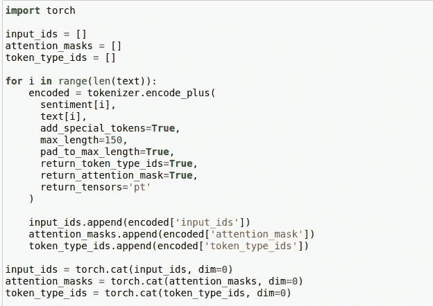
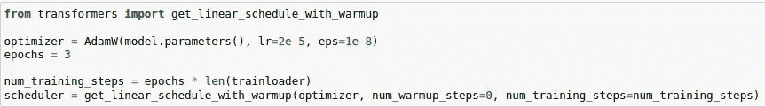

# 伯特:用 PyTorch 用拥抱脸提取情感

> 原文：<https://medium.com/analytics-vidhya/bert-using-hugging-face-for-sentiment-extraction-with-pytorch-2477980e7976?source=collection_archive---------3----------------------->

在这篇文章中，我将带你了解“情感提取”以及如何在这项任务中取得优异的成绩。

在本演练中，我将使用 kaggle 的“Tweet 情感提取”数据集。关于比赛和数据集的更多细节，你可以访问[https://www.kaggle.com/c/tweet-sentiment-extraction/](https://www.kaggle.com/c/tweet-sentiment-extraction/)。

我将在这篇文章中使用的所有代码都可以在 https://github.com/aksub99/bert-sentiment 的[获得。如果你觉得它有用，请给它加星，这样它可以到达更广泛的受众。](https://github.com/aksub99/bert-sentiment)

首先，任务到底是什么？

我们收到一条推文，它是一种情绪(积极的、消极的或中性的)，我们被要求预测推文中支持/表明这种情绪的部分。

我们可以看到，我们的数据集在“文本”栏中包含推文，在“情绪”栏中包含情绪。tweet 中代表情感的部分在“selected_text”列中给出。

我们的工作是在给定“文本”和“情绪”的情况下，创建一个模型来预测“selected_text”。

正如你可能已经观察到的，这个任务非常类似于问题回答。唯一的区别是，问题被情感取代，上下文/段落被推文取代，回答被推文表示情感的部分取代。

现在我们已经理解了任务和数据集，让我们进入实现细节。

首先，让我们检查数据集的 nan 值并删除相应的行。

我们将使用拥抱脸变形金刚。所以，让我们继续安装它。

不同的 NLP 算法需要输入单词序列的不同类型的记号化。BERT 体系结构要求输入单词被单词块标记化。“BertTokenizer”为我们做了这些。

这些代码行为我们获取了 BERT 模型所需的记号赋予器。稍后可以利用这一点将我们的输入序列转换成 BERT 所需的形式。

我们现在需要填充输入的句子，使它们长度相同。为了找出不同句子所需的填充量，我们首先需要确定最长输入句子的长度。

我们在推文中得到的最大长度是 110。因此，我们将不得不填充所有推文，以实现 110 的共同长度。

但是等等……因为我们的伯特的输入将是“情绪”和“推文”的串联，我们的组合序列将必须被填充以实现这个组合序列的最大长度，而不仅仅是推文的长度。

我们可以有把握地假设这个组合序列的最大长度为 150。因此，我们将填充组合的输入序列，以实现所有序列的公共长度 150。

此外，我们的模型需要某种方式来区分情绪和推文，因为我们将这些内容串联起来作为输入。类似地，我们的模型还需要能够区分对应于单词的标记和对应于填充标记的标记。

概括来说，我们需要:

1.  连接情绪和推文。
2.  根据 BERT 的要求对这个组合序列进行记号化。
3.  将这个组合序列填充到 150 的长度。
4.  有办法区分单词标记和 pad 标记，以及情绪和 tweet。

所有这些步骤都可以在名为 encode_plus 的神奇函数的帮助下执行，encode _ plus 是 Tokenizer 类下的一个可用方法。

我们在上面得到 3 个张量——“输入 _ 标识”、“注意 _ 屏蔽”和“令牌 _ 类型 _ 标识”。

1)“input _ ids”包含输入序列的标记化形式的 id 序列。

2)“attention _ masks”包含 0 和 1 的序列。它帮助我们区分输入的句子和 pad 标记。

3)“token _ type _ ids”还包含 0 和 1 的序列。它帮助我们区分第一个序列(情绪)和第二个序列(推文)。这将被模型用来在两个序列之间添加[SEP]标记。

让我们把这些张量打印出来，以便更好地理解它们所包含的内容。

最后，由于“selected_text”只是 tweet 的一部分，它可以很容易地表示为开始和结束索引。我们需要在训练时将这些作为标签输入到我们的模型中。

但是，请注意，这个开始和结束索引必须参考组合序列(情感+推文)，而不仅仅是推文。因此，我们现在将“selected_text”列转换为开始和结束位置。

用于提取开始和结束索引的代码在[https://github.com/aksub99/bert-sentiment](https://github.com/aksub99/bert-sentiment)中给出。为了简洁起见，我不会在这里展示它。

现在让我们将数据集分成训练集和验证集，并为它们创建 PyTorch 数据加载器。

我们现在将创建模型并加载预训练的重量。我们将使用“BertForQuestionAnswering ”,因为该任务与回答问题非常相似，因此需要相同的架构。

最后，让我们设置优化器和学习率调度器，并为 3 个时期训练我们的模型。

我们在下面看到，模型在第三个时期后才开始过度拟合。因此，我们不会继续下去。

我们走吧！

这就是你如何训练一个用于情感提取/问题回答的 huggingface BERT 模型。

如果你有任何问题，请让我知道。