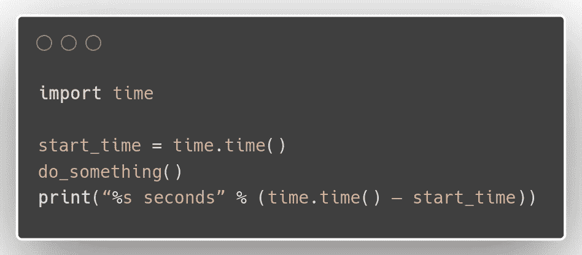
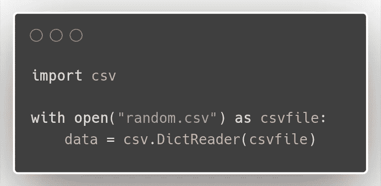
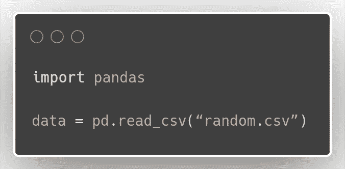
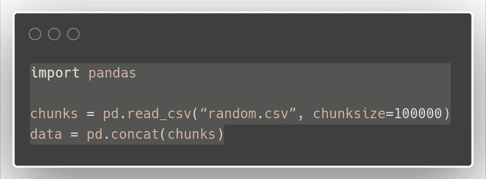
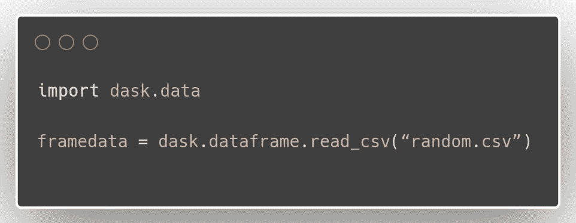
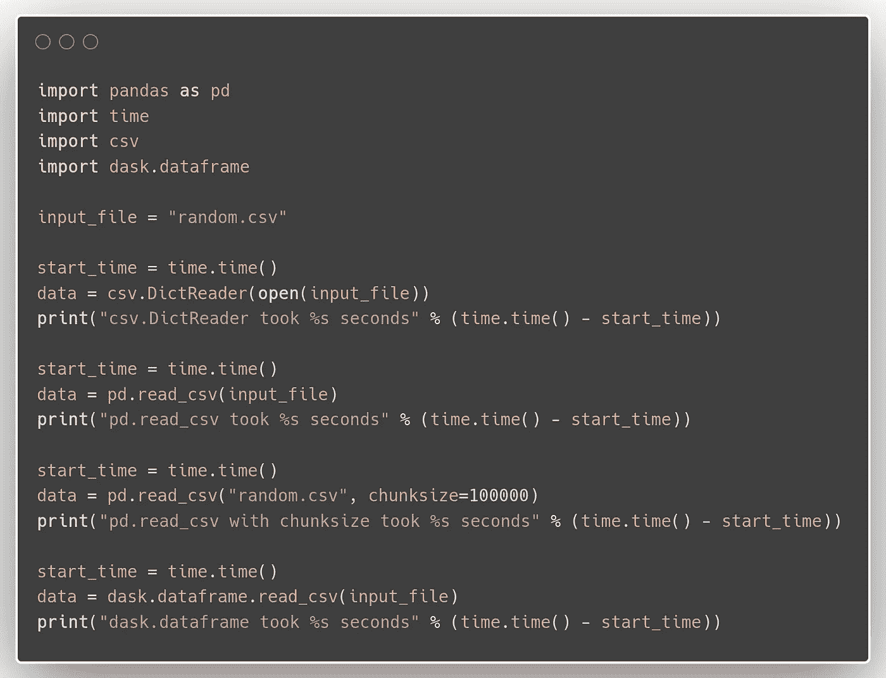

# 在 python 中为生产环境导入 csv 文件的最佳(最快)方法(pandas、CSV、dask)

> 原文：<https://medium.com/analytics-vidhya/best-fastest-ways-to-import-csv-files-in-python-for-production-environments-pandas-csv-dask-1407be42893e?source=collection_archive---------4----------------------->

在处理数据的工程师的生活中，处理 csv 文件是一项日常任务。在处理分析任务时，我们有时会选择忽略导入数据所消耗的时间，但这在生产环境中变得相当重要。并且在处理大文件时会有些问题。事实证明，如果你面对较大的输入文件(比如几百 MB 或更多)，最好使用某种分区或并行处理来导入，这一点在本文后面会变得更加清楚。

这篇文章不会关注超级精确的基准测试，而是关注如何执行每个 CSV 导入选项，以及如何自己运行一些简单的基准测试。基于这种偶然的分析，我们可以得出一些结论。这篇文章只关注 CSV 文件，因为这是表格数据的常用格式。

我将在这里介绍的选项有: **csv。DictReader()** ， **pandas.read_csv()** ， **dask.dataframe.read_csv()。**这绝不是 CSV 导入的所有方法的详尽列表。然而，这可能是一个最常用方法的详尽列表。

**我如何衡量时间效率**

这里我感兴趣的是使用各种方法导入一个 CSV 文件需要多少时间。这很简单。得到某个动作前后的时间，然后得到以秒为单位的差值。

这种方法得出的结果可能非常不稳定。每一秒钟，不同的过程以不同的强度在计算机上运行，因此它们会干扰测量结果。出于本文的目的，我们可以忽略这种干扰，因为我们对相对时间效率比绝对时间效率更感兴趣。

让我们继续主要的比较。

**csv。DictReader()**

`DictReader`是一个 Python 类，它将读取的数据映射为一个字典，除非指定，否则它的键是 CSV 的第一行。后续行中的所有值都将是字典值，可以使用各自的字典键进行访问。但是，这些值将作为字符串导入。对于数据分析任务，我个人并不经常使用这种方法，但是在某些其他情况下(使用 JSON 格式或者通过终端处理 CSV)这种方法很有价值。你可以这样做:

上面的代码片段将创建 CSV 对象(数据)。

**pandas.read_csv()**

pandas 是一个流行的库，它的数据结构适合于包含异质类型的列(整数、浮点数、像我们已经创建的随机数据一样的字符串)以及时间序列的表格数据。对于数据分析任务，Pandas 是我首选的数据结构，因为 pandas 非常容易操作和转换。在某种意义上，它们与 r 中的`data.frame`和`data.table`非常相似。

根据我遇到的许多意见，pandas 软件包已经过很好的优化，因此在许多任务中非常有效，包括数据导入等基本任务。

这里重要的一点是 pandas.read_csv()可以用 chunksize 选项运行。这将把输入文件分成块，而不是把整个文件加载到内存中。这将减少大型输入文件的内存压力，并且通过反复试验找到最佳的块大小，可以显著提高效率。下面的代码将把输入文件分割成 100 000 行的块。

熊猫的另一个重要功能是 **usecols** 参数。这允许您只读取选定的要读取的列，并跳过数据中不相关的列。这可以节省我们之前用来读取所有不必要的列的时间。

我发现[Gou tham balara man 的这篇文章](http://gouthamanbalaraman.com/blog/distributed-processing-pandas.html)非常有用，它也解释了如何将输入文件分成块来帮助加速进一步的处理。后来他编辑了他的帖子，说他发现 dask.dataframe 优于这种方法，这就把我们带到了下一种方法。

**dask.dataframe**

[dask.dataframe](http://dask.pydata.org/en/latest/dataframe.html) 是由索引(用于识别数据的行标签)分割的较小的 pandas 数据帧的集合，可以在一台机器上或集群上的多台机器上并行处理。我是从埃里克·布朗的这篇有用的[帖子](http://pythondata.com/dask-large-csv-python/)中了解到 dask 的。

显然，与带有 dask 的熊猫不同，数据没有完全加载到内存中，而是准备好进行处理。此外，某些操作可以再次执行，而无需将整个数据集加载到内存中。另一个优点是熊猫使用的大多数功能也可以用于 dask。差异源于 dask 的并行性。

**标杆管理**

我用下面的代码对 Python 方法进行了比较，上面已经介绍了所有这些代码:

上述代码使用的 csv 文件大约有 500，000 行，大小为 420 MB。

我得到的结果如下:

> **csv。DictReader** 耗时 **0.000013709068298339844 秒**
> PD . read _ CSV 耗时 **11.0141019821167 秒**
> **PD . read _ CSV**with**chunk size**耗时 **11.9807119369507 秒【T15**

csv。DictReader 是迄今为止最快的，但是正如我前面指出的，它以字符串的形式导入所有内容，而其他方法试图分别猜测每一列的数据类型，并可能在导入时进行多种其他验证。这意味着如果你使用 csv。数据分析任务的 DictReader 在分析内容之前，你可能需要对它进行一些转换。但是，如果您知道数据中的列都已经是字符串格式，那么可以使用 csv。DictReader 是值得一试的方法。

忽略 csv。DictReader，dask.dataframe 是目前最快的方法。这是可以理解的，因为它不像 pandas 方法那样将整个数据集加载到内存中。

**总结**

Pandas 在数据科学工作中非常受欢迎，并与许多其他库集成在一起。如果您正在处理一个大型数据集并且 RAM 不足，我建议您考虑 chunksize 选项。Dask 是一个极大提高导入速度的选项。不过我在数据分析任务上没怎么用过，不过从我的理解来看应该和熊猫挺像的，很有前途。

Csv。DictReader 仍然是最快的选择，但是正如我前面提到的，我不推荐它用于数据分析任务。可能使用 JSON 格式就是这种方法非常有用的一个领域。在生产环境中，当您已经分析了数据，比如说使用 pandas，并且只需要偶尔使用最终的预处理数据来重新训练模型，或者使用 csv 将更新的数据上传到搜索索引，如 elasticsearch index。DictReader 导入数据更有意义，因为它比其他选项更快。

这是我最近工作时观察到的一个简短概述。如果你有任何建议，请联系我。

干杯！