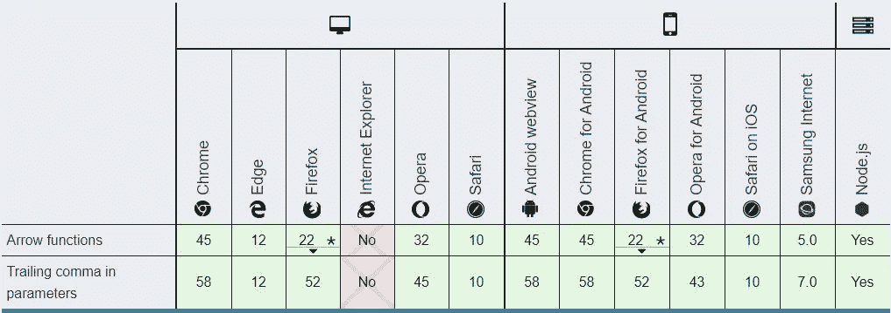

# 最佳 JavaScript (ES6)特性，可用于 0b 1111100100(2020)。

> 原文：<https://medium.com/analytics-vidhya/best-javascript-es6-features-thats-can-be-used-in-0b11111100100-2020-3ecbbd36edce?source=collection_archive---------14----------------------->


JavaScript 在过去的几年里取得了显著的进步。如果您是 JavaScript 新手，或者有一些经验，并且希望快速熟悉现代 JavaScript 最常用的特性，那么这篇文章就是为您准备的。

> 在本文中，我将介绍 JS ES6 的四个主要特性:
> 1。箭头功能
> 2。解构
> 3。`let`和`const`变量
> 4。模板文字

所有这些新的/旧的/更新的特性在所有现代浏览器中都得到了本地支持。你可以在[上查一下我能用](https://www.caniuse.com)吗？为了更好地理解，我建议您测试下面的代码片段，并编写更多的代码。只有有了更多的代码编写经验，你才会获得必要的知识！

所以，我们走吧！更少的单词更多的代码…

# 箭头功能

最有用的 ES6 特性之一。箭头函数为您提供了一个简洁明了的语法来编写函数表达式。例如:

```
**Function expression in ES5:**var test = function(a) { 
   return a * 4; 
}**Arrow Function in ES6:**const test = (a) => { 
   return a * 4; 
}
```

箭头函数允许我们编写更短的函数语法，我们去掉了`function`关键字，在参数和函数体之间放了一个粗箭头`=>`。

下一个示例是返回值的一行函数:

```
const test = (a) => a * 4;
```

这里我们可以去掉`return`关键字和花括号。
是更干净的代码吧？

如果我们的箭头函数只包含一个参数呢？那我们甚至可以去掉括号…

```
const test = x => x * number;
```

我喜欢它。我们得到了非常干净的代码。
如果我们的 arrow 函数没有任何参数怎么办？然后我们需要使用一对括号:

```
const test = () => {console.log('Test Me');};
```

更多箭头函数示例:

```
An empty arrow function returns **undefined**
let test = () => {};**Immediately Invoked Function Expression**
(() => 'test')();
**// Returns "test"****If/Else Statement with arrow function**
var simple = a => a > 21? 15 : a; 
simple(25); // 15
simple(20); // 20
```

**浏览器兼容性**



箭头功能

正如你所看到的，箭头函数非常有用，它为我们提供了一个选项来编写清晰易懂的代码。下一个主题是模板文字。

# 解构

什么是解构？**解构就是将复杂的结构分解成简单的部分。**在 JavaScript 中，这种复杂的结构通常是一个对象或者一个数组。使用析构语法，您可以从数组和对象中提取更小的片段。析构语法可用于 ***变量声明*** 或 ***变量赋值*** 。还可以通过使用嵌套析构语法来处理嵌套结构。

少说话，多举例。假设我们有这样一个对象:

```
const cat = { 
   name: 'Murzik',
   age: 3,
   address: '111 Find this st'
};
```

现在，我们需要在其他地方访问这些属性，并将它们的值存储在一组变量中:

```
const name = cat.name;
const age= cat.age; 
const address = cat.address;
```

我们一遍又一遍地重复这个代码:“猫”重复了 n 次。**对象析构**为我们提供了一个简洁明了的语法来提取一个对象中多个属性的值:

```
const { name, age, address} = cat;
```

就是这样！这段代码完全等同于上面的代码片段。我们在左边使用花括号来析构 cat 对象。在大括号内，我们定义了 3 个变量:**姓名**、**年龄、**和**地址**。它们的值将从地址对象的相应属性中提取。

注意，我们不必列出地址对象中的所有属性。也许我们只对**年龄**属性感兴趣:

```
const { age } = cat;
```

数组析构和对象析构有非常相似的功能。它使用方括号([])而不是花括号({})。

让我们看看它是如何工作的。例如，我们有一个数组，我们希望将数组中的项存储在不同的变量中:

```
**// ES5 Old Structure**
const colors = ['red', 'green', 'blue'];
const first = colors[0]; (gets 'red')
const second = colors[1]; (gets 'green')
const third = colors[2]; (gets 'blue')***With destructuring, we can re-write the above code like this:*****// ES6 The New One with Array Destructuring** const colors = ['red', 'green', 'blue']; 
const [color1, color2, color3] = colors;

console.log(`tone: ${color1}, grass: ${color2}, sky: ${color3}`); 
**//Result: tone: red, grass: green, sky: blue**
```

很酷，不是吗？

# 让和`const variables`

有了 JavaScript (ES6)，我们有了两种定义变量的新方法:`let`和`const`。在 ES6 之前，我们使用`var`关键字。有什么区别？`var`声明是全局作用域或函数作用域的，可以在其作用域内更新和重新声明。`let`和`const`是块范围的。`let`变量可以更新，但不能重新声明。`const`变量既不能更新也不能重新声明。让我们仔细看看它们:

以下是`var`关键词的一些例子:

```
function test() {
   for (var x = 0; x < 10; x++) { 
      // Technically, x should only be scoped to this block because this is 
      // where we have defined x. 
   }   // But it turns out that x is available here as well! 
   console.log(x); // 10
}
```

这不是大多数(如果不是所有的话)其他编程语言的行为方式！在一个块中定义的变量应该仅限于该块。在本例中，`x`应该不能在`for`块之外访问。

`var`关键字的另一个问题是，如果在函数之外的顶层使用它，它会在全局对象上创建一个属性:

```
var test = 10; 
console.log(window.test); // 10
```

让我们用`let`和`const`来检查例子

```
function test() {
   for (let x = 0; x < 10; x++) { 
      // With the "let" keyword, now x is only accessible in this block.
   }   // x is out of the scope here
   console.log(x); // x is not defined  
}
```

正如我在上面用`const`说过的，我们可以定义一个常数。所以我们以后不能重新分配它:

```
const test = 1; 
test = 2; // throws "Assignment to constant variable."
```

还有一点需要知道，与关键字`var`不同，`let`和`const`不会在全局对象上创建属性，如果你在顶层使用它们的话:

```
let test = 10; 
console.log(window.test); // undefined
```

*从我的经验来看:*

*   *对于 ES6 我尽量少用* `*var*` *关键词，只用* `*let*` *或者* `*const*` *。*
*   *只有当我需要重新分配标识符时，我才使用* `*let*` *。否则，我更喜欢使用* `*const*` *来防止意外地重新赋值一个常量。*

# 模板文字

在 ES6 之前，我们必须处理这些难看的字符串连接:

```
**Old Code version:**
var name = 'Codingforweb'; 
var message = 'Hi ' + name + ',';
```

现在，使用模板文字(以前称为模板字符串)，我们可以定义一个带有占位符的字符串，并去掉所有这些连接:

```
**ES6 code:**
var name = 'Codingforweb'; 
var message = `Hi ${name},`;
```

注意我在这里使用了反勾号。ES 6 提出了一种新的字符串类型，使用反勾号作为分隔符。这些文字允许嵌入基本的字符串插值表达式，然后自动解析和计算。您可以在键盘上的数字 1 之前找到的反勾字符。

为了在模板文本中添加占位符，我们使用了 **${expression}** 语法。您可以用任何 JavaScript 表达式替换“表达式”。这里，我们在那里添加了**名**变量。您还可以调用一个函数或传递任何产生值的 JavaScript 表达式。

使用模板文字的另一个好处是它们可以扩展多行。它们在撰写电子邮件时特别有用:

```
var message = `Hi ${name},Thank you for joining. Happy coding, Codingforweb`;
```


浏览器兼容性(模板文字)

这只是 ES6 改进的一小部分。检查它们，如果你仍然没有使用它们，那么尽快开始做。

目前就这些。随时加入我的[电报频道](https://t.me/coddingforweb)和 [Instagram](https://www.instagram.com/codingforweb/) 。感谢您的阅读，再见。

**快乐编码**