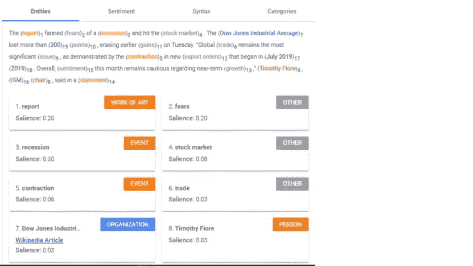
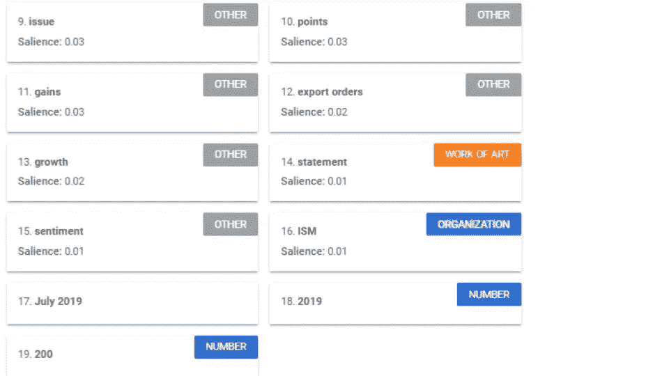
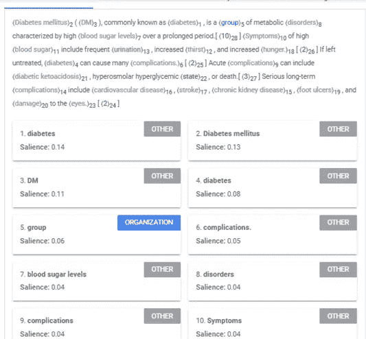
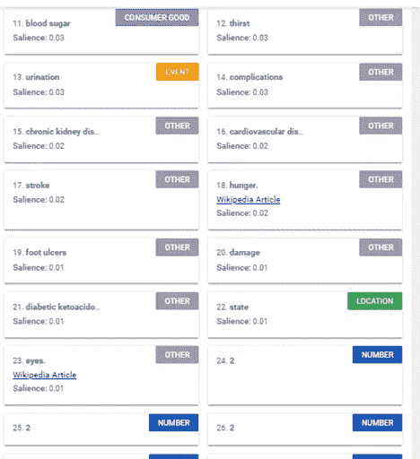

# 自然语言处理人工智能的最佳命名实体识别和实体提取工具:2019 年比较

> 原文：<https://medium.com/analytics-vidhya/best-named-entities-recognition-and-entities-extraction-tools-for-ai-nlp-a-2019-comparison-b30b20cf690e?source=collection_archive---------3----------------------->

命名实体识别(NER)和实体抽取通常用于从自由文本中抽取结构化洞察。它们是任何自然语言处理(NLP)从业者的必备工具。

给定一个文本，目标是提取被提及的实体(例如，人、地点、事物、主题……)。

在 2019 年末，我们比较了 3 个工具:
* Python Spacy(开源)
*谷歌自然语言 API(付费)
* AWS 理解医疗(付费)

我们使用两个样本文本，一个是商业文本，另一个是科学文本。NER 在很大程度上依赖于它被训练的语料库，所以对不同的流派进行基准测试是很好的。

让我们开始吧！！

# 空间

Spacy 是我完成任何 NLP 任务的首选。它有一个完整的管道用于标记化、解析、分块和实体识别。

对于商务文本，我们使用美国消费者新闻与商业频道新闻摘录:

> 这份报告加剧了人们对经济衰退的担忧，并打击了股市。道琼斯工业平均指数下跌超过 200 点，抹去了周二早些时候的涨幅。“全球贸易仍然是最重要的问题，2019 年 7 月开始的新出口订单萎缩就证明了这一点。总体而言，本月市场对短期增长仍持谨慎态度。

来源:“美国制造业调查显示十年来最差读数。”美国消费者新闻与商业频道。2019 年 10 月。[https://www . CNBC . com/2019/10/01/us-manufacturing-economy-contracts-to-worst-level-in-a-decade . html](https://www.cnbc.com/2019/10/01/us-manufacturing-economy-contracts-to-worst-level-in-a-decade.html)

空间代码是:

```
# pip install spacy
# python -m spacy download en_core_web_lg**import** spacy

nlp = spacy.load(**"en_core_web_lg"**)
q = YOUR_TEXT_STRINGdoc = nlp(q)

**for** ent **in** doc.ents:
    print(ent.text, ent.start_char, ent.end_char, ent.label_)
```

产出:

200 多 104 117 红衣主教
周二 151 158 日期【2019 年 7 月 281 290 日期
本月 311 321 日期
蒂莫西·菲奥里 368 381 人
ISM 383 386 ORG

每一行都被组织为:代码段、开始字符、结束字符、实体类型。

擅长寻找严格意义上的“命名实体”:人、组织、日期...但是不提取主题实体，如“股票市场”、“衰退”、“道琼斯”、“贸易”等。

让我们试一试维基百科中关于糖尿病的医学摘录:

> **糖尿病** ( **DM** )，俗称**糖尿病**，是一组以血糖水平长期偏高为特征的代谢性疾病。[10]高血糖的症状包括尿频、口渴和饥饿感增加。[2]如果不治疗，糖尿病会引起许多并发症。[2]急性并发症可能包括糖尿病酮症酸中毒、高渗性高血糖状态或死亡。[3]严重的长期并发症包括心血管疾病、中风、慢性肾病、足部溃疡和眼睛损伤。[2]

结果呢？没什么！因为实体都是主题，而不是命名实体，所以 Spacy 什么也找不到。模特就是这么训练出来的。

然而，有一个空间可以找到你想要的主题实体。实体只是名词块:

代码(使用前面的相同 doc 对象):的
**用于**doc . noun_chunks:print(noun _ chunk . text)中的【noun _ chunk】

产出:
报告
恐惧
衰退
股市
道琼斯工业平均指数
超过 200 点
早些时候的收益
…更多

瞧啊。问题是你没有得到实体分类。您可以根据自己的分类手动标记这些，并使用 Spacy 在其上训练一个自定义模型。但也许你觉得很懒，宁愿付钱给谷歌为你做一切。

# 谷歌自然语言 API

科技寡头拥有大量数据、计算和营养丰富的工程师，而这些是普通大众无法获得的。所以也许他们做得更好？

Google、AWS 和微软都提供 NLP APIs。它们都是可比较的，所以我选择谷歌作为例子。

对于业务摘录，它产生:



对于医学文本来说，它是(略有删节):



命名实体的性能稍微好一些，而对于大多数主题实体来说，它将它们转储到一个叫做“其他”的“吃到饱”的类别中事实上，它们大多是名词块。

我很喜欢它将一些实体链接到维基百科的方式。这将使我不必将同一实体的变体标准化为标准语料库。糟糕的是，它只对一小部分实体有效。

总的来说，这比 Spacy (ents + noun_chunks)略有改进，但不是决定性的。

# AWS 理解医疗

亚马逊提供理解(普通类型)和理解医疗。截至 2019 年底，我发现 understand 比谷歌自然语言差得多。然而，intensive Medical 非常擅长对医疗实体进行分类，并且在某些情况下将它们标准化为 ICD 和药品代码——如果您的应用是在生物医学领域，这比其他工具好得多。

沈保罗
pxshen@alumni.stanford.edu
总是乐于咨询或蹦出想法！