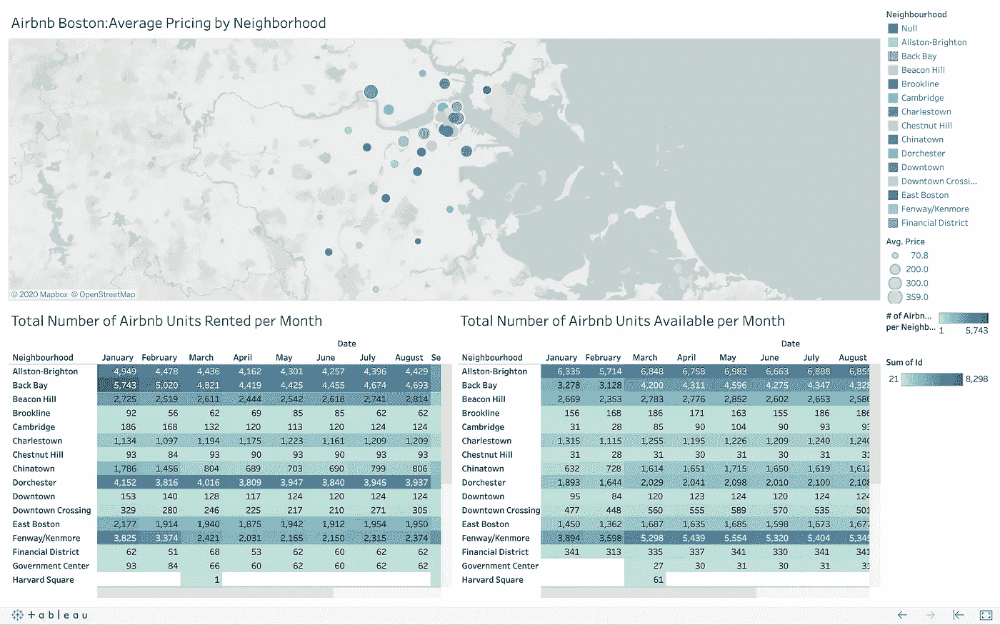

# 游览波士顿的最佳时间:分析 Airbnb 公寓的价格和可用性

> 原文：<https://medium.com/analytics-vidhya/best-times-to-visit-boston-analyzing-pricing-and-availability-of-airbnb-units-127576d5d52f?source=collection_archive---------11----------------------->

托德·肯特在 [Unsplash](https://unsplash.com?utm_source=medium&utm_medium=referral) 上的照片

作为一个经常旅行的人，我的家人总是不得不为至少四口之家购买足够大的酒店房间，有时当我们与大家庭一起旅行时，还需要额外的房间。

当我听说 Airbnb 时，我认为这是一个有趣的概念。任何人都可以把他们的住所出租给参观他们居住的城市的游客，作为一种赚钱的方式。

我对它特别感兴趣，更多的是站在一个愿意出租 Airbnb 网站上所列单元的人的立场上。当你去参观另一个城市时，这些房间给你一种更像家的感觉，而不是你在旅馆里得到的千篇一律、平淡无奇的房间。

因此，如果有人想充分利用自己游览一座新城市的经历，弄清楚预订 Airbnb 公寓是否值得将是非常重要的。

我要分析的是波士顿市在 2016 年 9 月至 2017 年 9 月期间一年的 Airbnb 数据。在我的分析中，我能够回答以下问题:

> 单位在一年中的什么时候上市，最贵的和最便宜的？
> 
> 波士顿最贵的社区是哪些？
> 
> 一年中最忙和最不忙的时间是什么时候？

关于第一个问题，我最初的假设是预订 Airbnb 公寓最贵的时间是在假期，因为那是大多数人旅行的时间。然而，当我查看每月的平均价格时，我看到了这样的情况:

该图显示，与其他月份相比，进入假日季节的单位平均价格似乎较低。

我想更深入地了解这一点，所以我决定下一个要查看的特性是可用单元数与预订单元数的对比。

这是我看到的:

看这个，这支持了我的初步假设，即在假日期间有更多的单位被预订，如橙色线所示。但这仍然不能很好地解释平均价格下降的原因，除了在假日期间有更多的房源，因此有更多的单元可以以更低的价格定价。

我决定进一步分解这个问题，研究一种可以解释不同价格点的情况，那就是看每个社区的平均价格。

真是一团糟！使用这种特定的可视化工具，您至少可以通过特定的邻域进行过滤，并消除混乱，但分析这一点是低效的。

让我们试试另一种观点:

 [## Tableau 公共

### 编辑描述

public.tableau.com](https://public.tableau.com/views/AirbnbBostonAveragepricingbyNeighborhood2/Dashboard1?:language=en&:display_count=y&:origin=viz_share_link) 

这是我用 Tableau 做的一个可视化图，通过不同大小的圆圈，可以更容易地看到地图视图中哪些社区的单元平均价格更高。这些表格显示了每个街区的可用和不可用单元的数量。

在所有这些观点的帮助下，我能够看到价格不仅在一年的不同时间波动，而且还根据你正在看的社区遵循不同的趋势。靠近市中心的街区似乎整体价格较高，但似乎在假期价格会下降。

看完这一切，每个游客都会有自己的喜好。有些人可能想住在离市中心更近的地方，有些人可能想住在不太拥挤的地方。不管怎样，最好的办法是根据你想要的特定地区的价格和供应情况，看看何时何地最适合预订。

想要预订 Airbnb 公寓的游客应该:

1.  先弄清楚你住的地方
2.  通过查看价格和可用性，确定该地点的最佳预订时间
3.  祝你旅途愉快！

我对 Airbnb 数据集的分析真的帮助我理解了应该注意什么，这将在我下次计划旅行时帮助我。Airbnb 中有更多的数据需要分析，我鼓励任何人和每个人从中获得更多的见解。

请在下面与我分享你的想法。我总是乐于学习新事物。

如果你想看我的这个项目或我的任何其他项目的代码，他们都列在我的 [GitHub](https://github.com/nsonalkar)

致谢:

Airbnb 数据集:【https://www.kaggle.com/airbnb/boston?select=reviews.csv# 