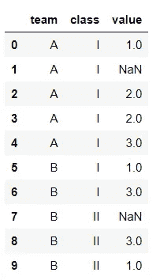
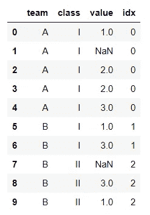
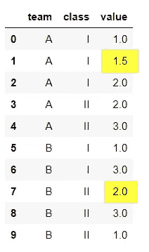
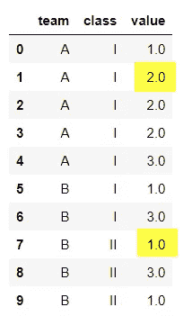
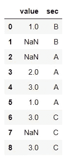
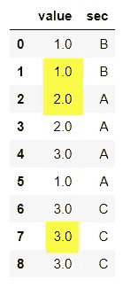

# 使用 group by-Mean & Mode 估算分类数据的最佳方法

> 原文：<https://medium.com/analytics-vidhya/best-way-to-impute-categorical-data-using-groupby-mean-mode-2dc5f5d4e12d?source=collection_archive---------0----------------------->


来源:照片由 Nate Bell 在 Unsplash 上拍摄

我们知道可以使用 fillna()将 nan 值替换为均值或中值。如果 NAN 数据与另一个分类列相关，该怎么办？

如果期望的 NAN 值是一个分类值呢？

下面是一些处理 NAN 值的有用提示。

你肯定是和熊猫和熊猫一起做的。

```
**import** **pandas** **as** **pd**
**import** **numpy** **as** **np**
```

# n 组

```
cl = pd.DataFrame({
'team':['A','A','A','A','A','B','B','B','B','B'],                   'class'['I','I','I','I','I','I','I','II','II','II'],
'value': [1, np.nan, 2, 2, 3, 1, 3, np.nan, 3,1]})
```



假设您必须填写酒类消费率数据，如果没有其他相关数据，您可以填写。

但是如果给定了这个人的年龄，那么你可以看到年龄和消费率变量的模式。因为所有人的饮酒量不会处于同一水平。

另一个例子是，工资的价值可能与年龄、职称和/或教育程度有关。

在上面的例子中，假设列 test 和 class 与 value 相关。

使用 ngroup，您可以用索引来命名组。

```
cl['idx'] = cl.groupby(['team','class']).ngroup()
```



现在你可以清楚地了解这些组了，我们用索引给这些组命名。如果您想在如此复杂的组中处理数据，这将很有帮助。例如具有 10 列复杂组的 fillna。

# 按两列分组，用平均值填充

让我们看看下面的数据:

```
cl = pd.DataFrame({
'team': 'A','A','A','A','A','B','B','B','B','B'],
'class':['I','I','I','II','II','I','I','II','II','II'],
'value': [1, np.nan, 2, 2, 3, 1, 3, np.nan, 3,1]})
```


如前所述，现在我们要用团队和班级的平均值填充 nan。

```
cl['value'] = cl.groupby(['team','class'], sort=False)['value'].apply(lambda x: x.fillna(x.mean()))
```



A 队和 I 级，1.0 和 2.0 的平均值是 1.5。类似地，其余的组。您可以看到这两个空值是用不同的方法估算的(黄色阴影值)。即每组的平均值。

# 按两列分组，并用 mode 填充

与均值和中值一样，模式与 fillna 不兼容。

Mean & meadian 返回和工作方式相同，都返回一个系列。但是 mode 返回一个数据帧。

要使用 fillna 模式，我们需要做一点小小的改变。

```
df = pd.DataFrame({'A': [1, 2, 1, 2, 1, 2, 3]})

a = df.mode()
print(a.iloc[0])
print(type(a))
```

A 1
Name: 0，dtype:int 64
<class ' pandas . core . frame . data frame '>

```
df = pd.DataFrame({'A': [1, 2, 1, 2, 1, 2, 3]})

a = df.mean()
print(a)
print(type(a))
```

a 1.714286
dtype:float 64
<class ' pandas . core . series . series '>

现在让我们用模式估算下述数据的 NAN 值。


```
cl['value'] = cl.groupby(['team','class'], sort=False)['value'].apply(lambda x: x.fillna(**x.mode().iloc[0]**))
```



1，2，2，3 的模式是 2。

# 按 1 列和 fillna 分组

数据:



```
cl1['value'] = cl1.groupby('sec').transform(lambda x: x.fillna(x.mean()))
```

以下语句也适用。

```
cl1['value'] = cl1.groupby('sec')['value'].transform(lambda x: x.fillna(x.mean()))
```

结果:



# 结论:

在这篇文章中，我们学习了更好的数据分组和填充方法。

希望你对实践我们现在所学的东西感到兴奋。

我们将看到 Python 中的一个新技巧。谢谢大家！👍

喜欢支持？只需点击拍手图标👏想吃多少就吃多少。

编程快乐！🎈