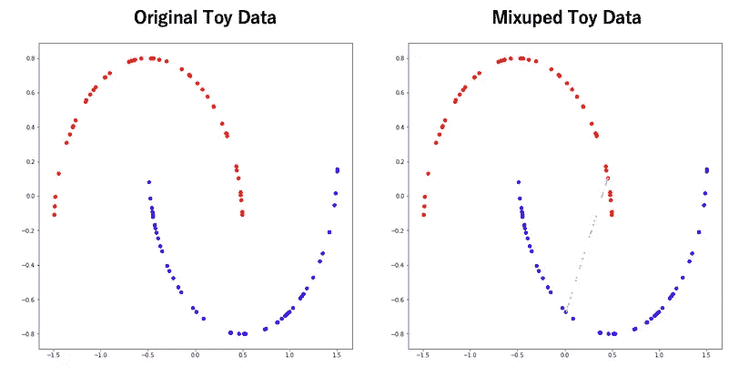
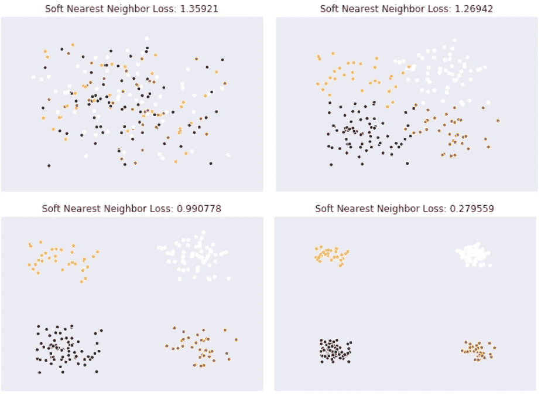
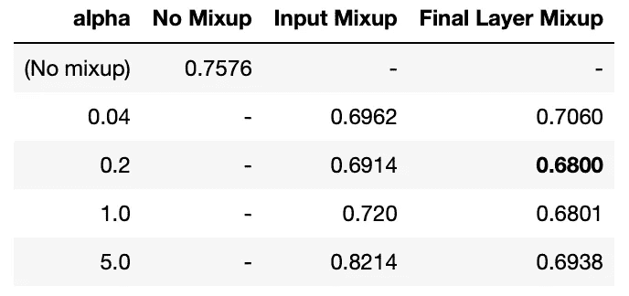

# 最终图层混合效果更好

> 原文：<https://medium.com/analytics-vidhya/better-result-with-mixup-at-final-layer-e9ba3a4a0c41?source=collection_archive---------7----------------------->

# 关于这篇文章

本文内容如下。

*   介绍了维卡斯·维尔马、亚历克斯·兰姆等人提出的在中间层混合数据的流形混合[2]，并表明在最终层混合时可能会获得更好的结果。
*   我其实是用 tensorflow 实现的，确认了确实得到了这样的结果。

# 什么是 MIXUP？

MIXUP[1]是一种数据增强方法，由张弘毅等人于 2017 年 10 月 25 日提出。基于从 Beta 分布中采样的混合比率，这是一种通过混合输入和输出来扩展数据的方法。通过使用这一点，可以说泛化性能提高了，因为判定边界变得平滑了。

从上面的公式可以看出，扩充数据是通过混合原始数据创建的。让我们试着用玩具数据来混合。原始数据为蓝色(标签=0)和红色(标签=1)点，扩充数据为粉红色。扩充数据具有介于 0 之间的标签。和 1。

下图显示了各种 alpha 的混合。您可以看到放大到接近实际数据的位置(α <1) or middle (α> 1)，以α = 1 为边界。

(左)α=0.2 时的混合(右)β分布(α=0.2，β=0.2)

(左)α=1 时的混合。(右)贝塔分布(α=1。, β=1.)

(左)α= 5°时的混合。(右)贝塔分布(α=5。, β=5.)

如果将 MIXUP 应用于整个数据，将如下所示。

# 流形混合

## 混乱的问题

但是，并不是所有由 MIXUP 生成的数据都是好数据。

在这些数据中，下图左侧可能是良好的数据扩充(标签=0。~1.)这平滑了决策边界，但是正确的不是好数据。这是因为扩充数据的标签都是“红色”(标签=1)，但是它们在蓝色数据的特征空间中(标签=0)。

流形混合[2]解决了这个问题。流形混合是一种在中间层执行混合的数据扩充方法，在中间层中，特征空间比输入空间更对齐。

(左)通常的混淆(右)流形混淆

上图是在输入层和中间层进行 MIXUP 时的概念图。在输入层混合(左)中，由于蓝色和红色的复杂特征空间，无法获得良好的增强数据。另一方面，在中间层，与输入层相比，特征空间更加一致，因此可以获得良好的扩充数据。

## 我们在哪一层执行混音？

那么哪一层是最好的混合层呢？有研究[3]似乎是一个提示。本研究在 ResNet 的中间层引入了带有温度项的软最近邻损失，并研究了它的行为。较大的软最近邻损失值表示按类划分的要素相互交织，较小的值表示按类划分的要素。

软最近邻损失

软最近邻损失的特征图及其值

下图显示了 ResNet 的每个块中的软最近邻损失的值。ResNet 被认为是一种高性能的图像分类网络，但它表明，除了最后一层之外，每个类的特征都没有分离。

每个 Resblock 中的软最近邻损失值

鉴于此，假设出来了，如果你使用 ResNet，你应该在最后一层混淆。在流形混合论文[2]中，作者说当你混合最后一层时，效果最好。

每层的歧管混合。最后一层的混合是最好的(红色)

然而，这个数字本身存储在附录中。看起来《Manifold Mixup》的作者并没有重视结果本身。

# 实验

我比较了最终图层混合和输入图层混合。使用的数据是 CIFAR10。这个实验用的代码(Jupyter 笔记本)已经上传到[我的 github](https://github.com/AkiraTOSEI/Final_layer_mixup) 。

因为需要在中间层中进行混合操作，所以混合层被创建如下。通过将两个输入和一个比率作为输入，图层根据比率混合数据。

通过使用这一层，输入混合(正常混合)和最终层混合(在最终层中执行的流形混合)可以实现如下。我在[这里](https://github.com/AkiraTOSEI/tf__resnet)用的是 ResNet18。

# 培训代码实施

代码摘录如下。随机数是根据每个时期的 beta 分布生成的，并且以该比率执行混合。(第 95 行)

# 结果

下表显示了 mixup α = [0.04，0.2，1.0，5.0]的实验中的最终有效损耗。

各种混淆及其有效损失

最好的事情是最终的层混合，alpha 为 0.2，但是即使 alpha = 1.0，结果也几乎没有变化。

输入混音应具有较小的α，当超过 1.0 时，精度会急剧下降。另一方面，当α较大时，最终层混合也更差，但不如输入混合差。这种差异被认为反映了要混合的特征空间是否对齐。

即使在流形混合中，精度也会随着较大的α而下降。如果特征空间是对齐的，则认为最终层中的特征空间如下。表示插值数据不一定是好的。

使用 Softmax 和交叉熵的特征映射[4]

# 结论

在这篇文章中，我介绍了在中间层混合的流形混合，并展示了在最后一层混合可以获得良好的结果。我想这可能是实践中的一个重要结果。

***碎碎念***

 [## 阿基拉

### akira 的最新推文(@AkiraTOSEI)。机器学习工程师/数据科学家/物理学硕士/…

twitter.com](https://twitter.com/AkiraTOSEI) 

# **参考**

1.  张弘毅，混合:超越经验风险最小化，arXiv:1710.09412 (2017)
2.  维卡斯·维尔马，亚历克斯·兰姆等。流形混合:通过插值隐藏状态的更好表示 arXiv:1806.05236(2018)
3.  Nicholas Frosst 等人。使用软最近邻损失分析和改进表示，arXiv:1902.01889 (2019)
4.  Munawar Hayat，具有高斯相似性的最大间隔类不平衡学习，arXiv:1901.07711 (2019)