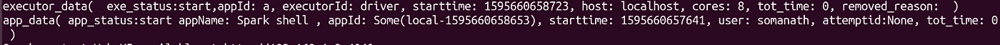
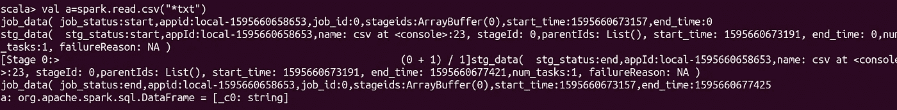
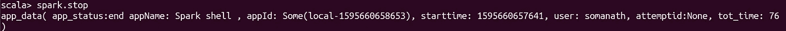

# 利用火花监听器实现更好的火花记录和监控

> 原文：<https://medium.com/analytics-vidhya/better-spark-logging-and-monitoring-with-spark-listener-c2c5fe86547a?source=collection_archive---------3----------------------->

这是我在火花深潜系列中的一个故事。

 [## 索玛纳特·桑卡兰培养基

### 阅读索马纳特·桑卡兰在媒介上的作品。对 python 和 spark 感兴趣的大数据开发者。每天，索马纳特…

medium.com](/@somanathsankaran) 

大家好，一旦你熟悉了 spark。运行 spark 应用程序面临的一个问题是调试它的故障。

监控 spark 作业最简单的方法是 spark UI，但是 Spark UI 的问题是，在应用程序完成的情况下，很难理解失败的确切原因。

如果我说我们可以定制 spark 应用程序，我们可以看到我们在 spark 代码中编写的每一行从应用程序到任务级别的 spark 元数据属性，这在调试应用程序时非常方便，只需在 spark submit 中添加一行即可

**SparkListener 接口:**

它是 spark 提供的开发人员 api 接口之一，我们可以通过扩展该接口来利用它，以便更好地理解我们的应用程序。在这篇教程中，为了更好地记录日志，我使用了下面的方法，这样我就可以看到我用 spark 写的每一行都发生了什么

1.  onJobStart —作业开始时需要触发什么
2.  onJobEnd-作业开始时需要触发什么
3.  应用程序启动时需要触发什么
4.  应用程序结束时需要触发什么
5.  onStageSubmitted —提交需要在舞台上触发的内容
6.  舞台结束-舞台结束时需要触发什么

**如何使用 Spark 监听器？**

步骤 1:我们可以通过扩展 spark listener 并覆盖默认实现来使用 spark listener，如下所示

步骤 2:当我们覆盖阶段完成时，我已经定义了一个自定义的阶段完成，它将打印阶段元数据的详细信息，这些信息可以用于更好的日志记录

在上面的例子中，我只是打印了开始和完成后的阶段元数据

我在第 2 行使用 case 类来定义 stg 元数据

在 stg 添加，我只是打印像阶段名称，开始时间，结束时间等 stg 信息

**向 Spark 应用程序添加 Spark 监听器**

spark LIstener 的最大优点之一是这个类不需要任何代码更改，我们可以通过使用-conf spark . extra listeners = com . spark monitor . spark monitor 来添加，如下所示

> home/somanath > spark-shell—jars/home/somanath/. m2/repository/com/spark monitor/spark health monitor/1.0-SNAPSHOT/spark health monitor-1.0-SNAPSHOT . jar—conf spark . extra listeners = com . spark monitor . spark monitor

**可视化我们的监听器输出**

**执行器数据-** 我们可以看到添加执行器时的主机和内核数量

**应用数据**-应用开始时间应用名称、用户 Id 等

**阶段和工作细节**

我使用 read csv 触发了一个作业，您可以找到如下详细信息

作业何时开始，作业的阶段是什么，作业何时结束，阶段何时结束，如下所示

**应用程序结束时间:**我已经使用 spark.stop 结束了应用程序，我的本地应用程序运行了 76 秒

结论:

如果我们有一个非常复杂的应用程序，Spark listener 会非常方便，我们可以看到如下细节

1.  阶段和任务的开始和结束时间
2.  调试失败的应用程序可能非常容易，因为我们也有失败的原因
3.  我们可以增强应用程序数据，并将其存储在一些数据库中，用于火花监测

今天就到这里吧！！:)

**学习并让别人学习！！**