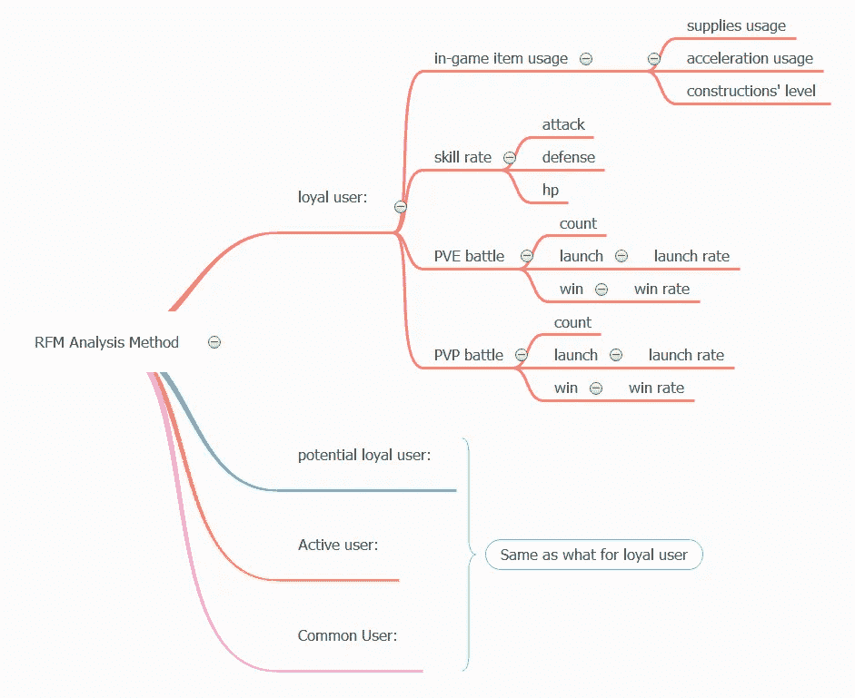
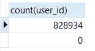
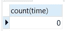
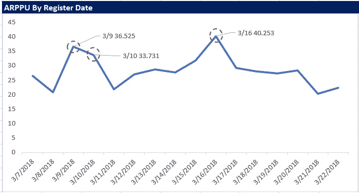
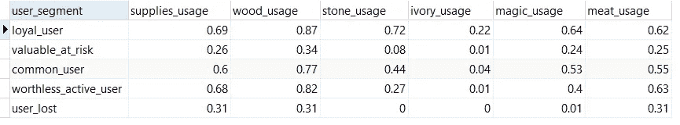
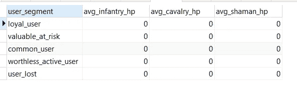

# 用户行为研究:了解手游《野蛮时代》中用户的游戏习惯

> 原文：<https://medium.com/analytics-vidhya/better-understanding-the-users-gaming-habits-in-mobile-game-brutal-age-db2263f3f8fa?source=collection_archive---------4----------------------->


[https://public.tableau.com/profile/yuwei7134#!/viz home/mobile game _ 15927926924300/dashboard 1](https://public.tableau.com/profile/yuwei7134#!/vizhome/mobilegame_15927926924300/Dashboard1)

# 一、背景和目的

**背景:**

《野蛮时代》:部落入侵是一款免费的 MMO 战略手机应用游戏。玩家可以通过建立前哨站，扩张领土，和来自世界各地的玩家一起竞争来建立一个强大的部落。在游戏中，你可以从 0.99 美元到 99.99 美元之间的任何地方购买。根据你购买了什么，它可以补充你的游戏或快速跟踪它。Tap4fun 提供的数据集包括新用户在前 7 天的游戏信息。

**用途:**

我们的目标是提供关于广告、促销和运营的见解和可行的技巧，并通过了解新用户的游戏习惯来增强个性化的用户体验。

# ⅱ方法

本报告将通过使用 Navicat 和 MySQL 来回答这些问题。

**状态问题:**

**1。游戏对于新用户来说运行的好吗？跟踪关键指标，概述“野蛮时代”的发展。**
追踪这些用户的指标包括新用户数、平均会话时长、活跃用户率、PU(付费用户率)、ARPU(每用户平均收入)、ARPPU(每付费用户平均收入)。通过使用注册日期、付费用户、非付费用户等来概述游戏的运行状况:


**2。不同的注册日期会影响这些关键指标吗？**

数据集包括连续 16 天。通过分析日新增用户数、日用户付费、日活跃率，可以搞清楚一些特殊事件，以及具体事件对游戏产生了什么影响。


**3。用户的游戏习惯是什么？**

[RFM 方法](/@yjiang30/multiple-analysis-method-5d1431da9e2b)可以帮助我们准确定位忠诚的、潜在的忠诚客户，同时了解用户价值。付费用户的平均在线分钟数、平均付费次数和平均付费价格用于设置近期、频率和货币的高水平和低水平。大于平均值的值被视为高水平。小于平均值的值被认为是低水平。

之后，让我们在 PVE 之战、PVP 之战、游戏内道具使用、技能率这四个不同的方面，寻找忠实用户和其他用户在游戏习惯上的差异。



图 2.3 RFM 方法

# ⅲ了解数据集

总共有 828934 个观察值和 108 个变量，包括用户 id、注册时间、供应品(木头、石头、象牙、肉、魔法等)。)、兵种(步兵、骑兵、萨满)、加速物品(普通、建筑、研究、训练、治疗)、建筑、研究、PVP、PVE、avg_online_minutes、付出代价、付出计数等等。

**变量分类:**所有变量均为新用户注册游戏后前 7 天的游戏信息。我们可以把这些变量分成 7 组。


**变量详情:**


图 3.2

# 四、数据准备

1.  **数据导入**

将数据导入 MySQL 数据库，添加主键，并格式化列的数据类型。pay_price decimal(50，2)，avg_online_minutes decimal(50，8)，register_time varchar(50)，根据其他列的值将它们的数据类型更改为 int(11)，tinyint(4)。


图 4.1


图 4.2

2.**数据清理和数据转换**

检查是否有任何数据丢失或重复。
如表 4.1 所示，有 828934 行，没有缺失值。

```
select count(user_id) from data;
select count(distinct user_id) from data;
select count(user_id) from `data` where user_id is null or user_id =’’;
```



表 4.1

将 register_time 列从字符串转换为时间戳。

```
**/*creat a new column to store the register_time in timestamp*/**
alter table `data` add time TIMESTAMP not NULL;**/*update the new colomn with register_time*/**
update data set time = 
from_unixtime(round(unix_timestamp(register_time),0));**/*check if there's missing value*/**
select count(time) from `data` where time is null union select count(time) from data where time =’’;
```



表 4.2:丢失寄存器时间的计数

# 五、数据分析

## 1.游戏现在运行的好吗？跟踪关键指标，概述“野蛮时代”的发展。

## 关键指标

*   *日均新增用户:51808*

```
**/* average daily new user from 3/7 to 3/22*/**
select avg(n) from (select count(distinct user_id) as n from data group by date(time))as temp;
```


表 5.1 **日均新增用户**

*   *平均时长:11.74 分钟*

```
**/*Median,mean, Q1,Q3, min, max of average session length for all new users during 3/7-3/22*/**
select round(avg(avg_online_minutes),2) as avg, round(min(avg_online_minutes),2) as min ,
(select round(avg_mins,2) from 
(select row_number() over (order by avg_online_minutes asc) as ranking ,avg_online_minutes as avg_mins from `data`) as temp 
where ranking =828934/4+0.5) as Q1,
(select round(avg(avg_mins),2) as median_session_length from(select avg_mins from 
(select row_number() over (order by avg_online_minutes) as ranking ,avg_online_minutes as avg_mins from `data`) as temp 
where ranking =828934/2 union 
select avg_mins from 
(select row_number() over (order by avg_online_minutes) as ranking ,avg_online_minutes as avg_mins from `data`) as temp 
where ranking =828934/2+1 ) temp2) as Median,
(select round(avg_mins,2) as avg_mins_Q3 from 
(select row_number() over (order by avg_online_minutes desc) as ranking ,avg_online_minutes as avg_mins from `data`) as temp 
where ranking =828934/4-0.5) as Q3, 
 round(max(avg_online_minutes),2) as max from data;
```

所有用户的 avg_online_times 的 5 位数总结:75%的用户平均在线分钟数不到 5 分钟。大部分用户都不是很活跃。


表 5.2:所有新用户的平均会话长度的平均值、最小值、Q1 值、中值、Q3、最大值

*   *活跃率(至少登录游戏的比率，avg _ online _ minute>0):97.9%*

```
**/* overall active rate= number of active user/ number of all user */**
select round((select count(distinct user_id) from data where avg_online_minutes>0)/count(distinct user_id),2) as ‘log_in(%)’ from data;
```


表 5.3

*   非常活跃率(平均在线时间> 5 分钟的用户):24.95%

```
select (select count(distinct user_id) from data where avg_online_minutes>10)/ count(distinct user_id) as very_active_rate from data;
```


*   *付费用户百分比(PPU): 2.41%* **占**付费用户**的百分比**(PPU = DPU/DAU)，代表**付费用户**占全部**日活跃用户**的比例**。**

```
**/*compute PPU*/**
select (select count(user_id) from data where pay_count>0 and avg_online_minutes>0) /count(user_id) as PPU 
from data where avg_online_minutes>0
```

****

**表 5.5**

*   **每个活跃用户的平均收入(ARPU):0.69 美元
    **每个用户的平均收入** ( **ARPU** )是每个**活跃**用户使用你的应用产生的(平均)收入。**

```
select sum(pay_price)/count(distinct user_id) as ARPU from data where avg_online_minutes>0;
```

****

**表 5.6**

*   **每位付费用户的平均收入(ARPPU):28.49 美元**

```
select sum(pay_price)/ count(distinct user_id) as ARPPU from data where pay_count>0;
```

****

**表 5.7**

*****总结:*** *据“*[”game analytics '第二届年度移动游戏基准报告](https://pages.gameanalytics.com/rs/686-EPV-320/images/H1-2019-Mobile-Benchmarks-Report-GameAnalytics.pdf)，“野蛮时代”是一款领先的多人游戏，整体表现非常好。**

****

**表 5.8**

**虽然付费用户比例在角色扮演类游戏中名列前茅，但付费用户比例仅为 0.0241%，较低，仍有提高空间。**

*****建议:*** 调查不同的客户背景数据和地理数据，提供更多面向用户的促销和策略。**

****2。这些关键指标会受到不同注册日期的影响吗？****

*   **按注册日期列出的新用户**

```
**/*count of daily new users */** select count(distinct user_id) as n_DailyNewUser, date(time) as Date from data group by date(time) order by date(time);
```

****

**图 5.1 每日新增用户**

## **事实**

1.  **我们可以清楚地看出，2018-03-10 日，日新增用户数几乎是其余 15 天的两倍。这种突然增加是不正常的。我们将调查是什么使这一天的新用户激增。**
2.  **我们还可以算出 2018 年 3 月 10 日之后，日新增用户数回到正常水平。我们应该调查是什么让这个数据这么快恢复正常。**
3.  **在 2018 年 3 月 13 日和 2018 年 3 月 16 日的新注册用户数上还有另外两个小高峰。**

## **调查**

****问题:为什么 3/9、3/10/、3/11 日新用户的线路与其他日子有明显不同？为什么 3/13 和 3/16 会出现两个小高峰？****

**① ***在营销层面发展一个假设:
这几天是放假还是周末？*****

```
select '2018-03-09' as Date, DAYOFWEEK('2018-03-09')union 
select '2018-03-10', DAYOFWEEK('2018-03-10') union
select '2018-03-11', DAYOFWEEK('2018-03-11') union 
select '2018-03-13' ,DAYOFWEEK('2018-03-13') union
select '2018-03-16' ,DAYOFWEEK('2018-03-16');
```

****

**表 5.9**

**在 MySQL 中，DAYOFWEEK 函数结果，1 代表星期日，2 代表星期一。
从 SQL 结果来看，2018–03–09 是周五，03–10 是周六，3–11 是周日，3–13 是周二，3/16 是周五。3/9，3/10，3/11，3/16 是周末。结果支持假设；然而，3/13 不是周末，也不是假日。**

**② ***在产品层面发展一个假设:
游戏在这几天有特别的活动。*****

**通过搜索《野蛮时代》的脸书邮报，发现在 2018 年 3 月 9 日，有一个新的《野蛮时代》发布版本。新版本包括一个新功能:3D 显示狂战士，这是野蛮时代的关键人物。新的 3D 显示模式吸引了许多新用户。证据支持这个假设。**

**发现 3 月 12 日疯狂猛犸象会出现在你的哨站传送门附近。这种增长仍在继续。证据支持这个假设。**

**3/16，野蛮时代将于 3 月 16 日至 3 月 19 日举办圣帕特里克节特别活动。在此期间，将提供专属物品、装饰品和怪物！有足够的证据支持这个假设。**

**3 月 9 日、3 月 10 日、3 月 11 日新用户的增加是因为有了新的 3D 显示模式，而且这几天是周末。3 月 13 日、3 月 16 日新用户的增加也是由一个特殊事件引起的。**

**此外，周末的日新增用户可能高于工作日。然而，16 天的数据不足以断言结果。我们需要更多的数据来做周末和工作日的新用户分析。**

*   **每天不同时间段的新用户**

```
**/* Hourly new user from 3/7 to 3/22*/**
select count(user_id) as n,DATE_FORMAT(time,’%m-%d’) as day,DATE_FORMAT(time,’%H’) as hour 
from `data` group by DATE_FORMAT(time,’%m-%d’) ,DATE_FORMAT(time,’%H’) order by day, hour;
```

****

**图 5.2: **每天不同时间段新增用户****

****事实****

1.  **如图 5.2 所示，在这些天的大部分时间里，新用户的数量在 17:00-22:00 之间不断增加。新用户数量的高峰通常在 21:00。根据新用户的数量，我们可以知道大多数用户在 21:00 玩这个游戏。**
2.  **此外，在图 5.2 中，3/9、3/10、3/11、3/13 线与其他线不同。新用户数量从 3/9 17:00 快速增加到 3/11 6:00。3/11 6:00 后，新用户数放缓，变得正常如常。**

****调查****

**UTC 时间 3 月 12 日 14:00 会有疯狂的猛犸象出现在前哨站入口附近。因此，让我们回头看看图 5.2，看看 3 月 13 日新用户的增加是否发生在 3 月 12 日。3 月 12 日的队伍从 21 点一直排到 23 点 59 分。这种增长仍在继续。**

*   ***按注册日期统计的平均会话长度。***

```
**/*average session length of new users group by date */** select round(avg(avg_online_minutes),2) as avg_session_length, date(time) from `data` 
GROUP BY date(time) order by date(time);
```

**将数据导出到 Excel 并可视化数据:**

********

**图 5.3:按日期分组的新用户的平均会话长度**

## **事实**

1.  **在 3 月 9 日、3 月 10 日、3 月 11 日、3 月 13 日注册的用户的平均会话长度小于在平常一天注册的用户。**
2.  **3 月 16 日和 3 月 19 日注册的用户的平均会话长度比其他日期长。**

****调查****

**我们知道 3D 展示模式可以吸引大量用户，但不能带来更多的活跃用户。游戏应该考虑如何让更多的用户被 3D 显示所吸引。**

**此外，提供专属物品、装饰品和怪物的事件可以提高该游戏的粘性。**

*   ***按登记日期的有效利率:***

```
**/* active rate by register date  */**
select a.date, round(a.n/b.n*100,2) as log_in from 
(select count(distinct user_id) as n ,date(time) as date from data where avg_online_minutes>0 group by date(time) order by date(time)) as a left join 
(select count(distinct user_id) as n, date(time) as date from data group by date(time))as b on a.date=b.date;
```

*   ***非常活跃率(平均在线分钟数的用户比率> 5):***

```
select a.date, round(a.n/b.n*100,2) as 'very_active_rate%' from 
(select count(distinct user_id) as n ,date(time) as date from data where avg_online_minutes>5 group by date(time) order by date(time)) as a left join 
(select count(distinct user_id) as n, date(time) as date from data group by date(time))as b on a.date=b.date
```

**导出数据和可视化:活跃率和非常活跃率按注册日期**

************

**图 5.4:按注册日期划分的活跃利率**

****事实****

1.  **对于在不同日期注册的用户，活动费率几乎是相同的。**
2.  **当谈到非常活跃的比率(平均在线分钟数> 5)，3/10 的低于其他日子。**
3.  **3 月 12 日和 3 月 13 日的活跃率高于其他日期。**

****调查****

**根据 1-3，我们可以知道不同的事件会带来不同的影响。新的外观，新的 3d 模型可以吸引更多的用户注册游戏。野猎事件可以带来更多的活跃用户，有助于提高游戏的粘性。**

*   ***注册日付费用户百分比(PPU)***

```
select a.Date, a.n/b.n as PUR from 
(select date(time) as Date, count(distinct user_id) as n from data where pay_count>0 group by date(time) ) as a 
left join (select date(time) as Date ,count(distinct user_id) as n from data where avg_online_minutes >0 group by date(time)) as b on a.Date=b.Date
```

******

图 5.5** 

****事实****

1.  **很明显，3/10 和 3/13 的 PPU 与其他日期相比相对较低。**
2.  **3/16 的 PPU 比其他日子高一点点，这意味着在那一天可以获得的专属物品、装饰品和怪物可以让用户购买它们。**

****调查****

**新的 3D 模型和野生狩猎活动不会带来更多的付费用户。独家单品的发布，可以激起新用户的购买欲望。**

*   ***每活跃用户平均收入(ARPU)***

```
select date(time) as Date ,sum(pay_price)/count(distinct user_id) as ARPU from data where avg_online_minutes>0 group by date(time);
```

******

图 5.6** 

**如图 5.6 所示，3 月 16 日的 ARPU 非常高，这意味着 3 月 16 日的活动非常成功。用户喜欢这些在那一天可以得到的独家物品、装饰品和怪物。他们愿意在这上面花很多钱。**

*   ***每位付费用户的平均收入(ARPPU)***

```
select date(time) as Date, sum(pay_price)/ count(distinct user_id) as ARPPU from data where pay_count>0 group by date(time);
```

******

图 5.7** 

**如图 5.7 所示，3/9 和 3/10 的 ARPPU 高达 3/16。暗示着 3/9、3/10 有更多的优质用户更愿意在游戏注册上花钱。**

***概要:***

**新的外观或 3D 显示模型可以吸引大量用户；虽然它不能持续很长时间，并且在这些新出现的用户中，活跃用户以及付费用户较少，但高质量的付费用户较多。**

**野猎事件并不能带来更多的付费用户和高质量的付费用户。不过这个事件可以提高游戏的粘性。那些为此事件注册游戏的用户具有较高的活跃率。**

**3/16 提供的专属物品、装饰品和怪物不仅可以吸引新用户，还可以激发用户的购买欲望。**

***建议:***

**当游戏发布新的外观或 3D 模型时，它还可以提供 3 月 16 日可用的独家物品和装饰品。新外观吸引的优质用户有很大的购买力。他们会比其他用户购买更多。**

> ****2。用户的游戏习惯是什么？****

# **用户群**

**这里我们将使用 RFM 方法来分析用户价值。avg_online_ minutes、pay_count 的平均值用于设置最近、频率的高水平和低水平，付费用户的中值 pay_price 用于设置货币水平。大于平均值或中值的值处于高水平。小于平均值或中值的值处于低水平。**

*****因此，近因分两个等级:***
高(avg_online_minute≥11.74)，
低(0<avg _ online _ minute<11.74)**

**所有用户的平均在线次数的 5 位数摘要:**

****

**表 5.10**

****两个级别的频率:**
高(pay _ count≥0.07)
低(pay_count < 0.07)
这里所有用户的平均付费计数近似为 0。然后为了简化分析过程，我将结合频率和货币。**

```
**/*avg, min, Q1, median,Q3, max for all user's pay_count*/**
select avg(pay_count) as avg,min(pay_count) as min, 
(select pay_count from data  order by pay_count limit 1 OFFSET 207234) as Q1, 
(select pay_count from data  order by pay_count limit 1 OFFSET 414468) as median,
(select pay_count from data  order by pay_count desc limit 1 OFFSET 207234) as Q3,
max(pay_count) as max
 from data  ;
```

**所有用户的 pay_count 的 5 位数摘要:**

****

**表 5.11 所有用户 pay_count 的平均值、最小值、Q1 值、中值、第三季度值和最大值**

****三个级别的货币:**
高(pay_price > 1.99)
中值(0 < pay_price≤1.99)
低(pay_price =0)**

```
**/*avg, min, Q1, median,Q3, max for paying user's pay_price*/** select avg(pay_price) as avg,min(pay_price) as min, 
(select pay_price from data where pay_count>0 order by pay_price limit 1 OFFSET 4887) as Q1, 
(select pay_price from data where pay_count>0 order by pay_price limit 1 OFFSET 9775) as median,
(select pay_price from data where pay_count>0 order by pay_price desc limit 1 OFFSET 4887) as Q3,
max(pay_price) as max
 from data where pay_count>0;
```

**支付用户 pay_price 的 5 位数字摘要:**

****

**表 5.12:支付用户支付价格的平均值、最小值、Q1、中值、第三季度、最大值**

**在设置了最近和货币的级别后，用户可以被分成五组。“忠实 _ 用户”是在游戏上付出很多、花费很多时间的用户(高 R、高 M)。“有价值用户(valued _ user _ at _ risk)”也是在 7 天内支付很多但在游戏中花费时间较少的有价值用户(低 R，高 M)。“Common_users”是在游戏上花费平均时间和金钱的用户(高/低 R，中等 M)。“无价值 _ 活跃 _ 用户”是指经常玩游戏但在游戏上花费不多的无价值用户(高 R，低 M)。以下是用户群:**

****

**表 5.13:用户群**

**为了便于进一步分析，在 MySQL 数据库中创建了不同用户群的视图:**

```
create view loyal_user as 
select * from data where avg_online_minutes>=11.74 and pay_price>1.99;
create view valuable_at_risk as 
select * from data where avg_online_minutes<11.74 and pay_price>1.99;
create view common_user as 
select * from data where pay_price<=1.99 and pay_price >0;
create view worthless_active_user as 
select * from data where avg_online_minutes>=11.74 and pay_price=0;
create view user_lost as 
select * from data where avg_online_minutes<11.74 and pay_price=0;
```

**计算每个用户群的百分比:**

```
select 
(select round(count(user_id)/828934*100,2) from loyal_user) as 'loyal_user(%)',
(select round(count(user_id)/828934*100,2) from valuable_at_risk) as 'valuable_at_risk(%)',
(select round(count(user_id)/828934*100,2) from common_user) as 'common_user(%)',
(select round(count(user_id)/828934*100,2) from worthless_active_user) as 'worthless_active_user(%)',
(select round(count(user_id)/828934*100,2) from user_lost) as 'user_lost(%)'
```

****

**表 5.14:用户群百分比**

****表 5.14 表示****

1.  **从 3 月 7 日到 3 月 22 日，85.58%的新用户具有较低的新近性、频率和金钱分数。我们已经失去了这些用户，或者说我们将来会失去他们。**
2.  **只有 1.1%的新用户是忠实玩家。
    ***温馨提示:*** *用特效奖励他们外貌，留住这些用户。***
3.  **0.05%的新用户在会话时长低的游戏上花钱。他们是有价值的用户，但游戏有失去他们的风险。游戏公司应该关注这些用户。**
4.  **1.21%的新用户成为我们不能失去的普通用户。它们的近期价值和货币价值高于平均水平。**
5.  **12.06%的新用户是不花钱玩游戏但经常玩的无价值活跃用户。**

**将进一步分析了解玩家的付费习惯，提高活跃用户的在线分钟数和 pay_price。**

# **游戏中的物品**

**游戏中的物品可以分为补给、加速物品、技能等级和 PVP、PVE 活动。**

## **资源使用**

**在这个游戏中有 5 种资源:木头，肉，石头，象牙，魔法。它们被用来建立前哨基地，扩大领土。**

```
**/*add column and compute values for resource usage */**
ALTER TABLE data DROP supplies_usage ;
alter table `data` add supplies_usage DECIMAL(10,2) not NULL;
update data set supplies_usage = 
ifnull(round((wood_reduce_value+stone_reduce_value+ivory_reduce_value+magic_reduce_value+meat_reduce_value)/
(wood_add_value+stone_add_value+ivory_add_value+magic_add_value+meat_add_value),2),0);alter table `data` add wood_usage DECIMAL(10,2) not NULL;
update data set wood_usage =ifnull(round(wood_reduce_value/wood_add_value,2),0);alter table `data` add stone_usage DECIMAL(10,2) not NULL;
update data set stone_usage = ifnull(round(stone_reduce_value/stone_add_value,2),0);alter table `data` add ivory_usage DECIMAL(10,2) not NULL;
update data set ivory_usage = ifnull(round(ivory_reduce_value/ivory_add_value,2),0);alter table `data` add magic_usage DECIMAL(10,2) not NULL;
update data set magic_usage = ifnull(round(magic_reduce_value/magic_add_value,2),0);alter table `data` add meat_usage DECIMAL(10,2) not NULL;
update data set meat_usage =ifnull(round(meat_reduce_value/meat_add_value,2),0); **/*Compute the average supplies usage */**
select 'loyal_user' as user_segment,
round(avg(supplies_usage),2) as supplies_usage, round(avg(wood_usage),2) as wood_usage, round(avg(stone_usage),2) as stone_usage, round(avg(ivory_usage),2) as ivory_usage, round(avg(magic_usage),2) as magic_usage, round(avg(meat_usage),2) as meat_usage
from loyal_user
union 
select 'valuable_at_risk' as user_segment,
round(avg(supplies_usage),2) , round(avg(wood_usage),2), round(avg(stone_usage),2), round(avg(ivory_usage),2), round(avg(magic_usage),2), round(avg(meat_usage),2) 
from valuable_at_risk
union 
select 'common_user' as user_segment,
round(avg(supplies_usage),2), round(avg(wood_usage),2), round(avg(stone_usage),2), round(avg(ivory_usage),2), round(avg(magic_usage),2), round(avg(meat_usage),2)
from common_user
union 
select 'worthless_active_user' as user_segment,
round(avg(supplies_usage),2), round(avg(wood_usage),2), round(avg(stone_usage),2), round(avg(ivory_usage),2), round(avg(magic_usage),2), round(avg(meat_usage),2)
from worthless_active_user
union 
select 'user_lost' as user_segment,
round(avg(supplies_usage),2), round(avg(wood_usage),2), round(avg(stone_usage),2), round(avg(ivory_usage),2), round(avg(magic_usage),2), round(avg(meat_usage),2)
from user_lost
```

**供应品的使用情况包括总体使用情况、木材使用情况、石头使用情况、象牙使用情况、魔法使用情况以及每个用户群的肉类使用情况:**

****

**图 5.15**

****

**图 5.8**

****如图 5.8 所示****

1.  **“有价值但有风险”的用户的资源使用率最低，其次是“丢失的用户”。这两类用户有一个共同的特点:新近性低。这意味着低新近性导致低供应使用。**
2.  **木材在每个用户群中的使用率最高。这表明木材是玩家经常需要的资源，其次是肉。随着玩家在线时间的增加，他们对石头和魔法的需求也会增加。**
3.  **不管象牙、石头和魔法的使用量如何，总的供应品使用量总是接近木材和肉类的平均使用量。这种木头和肉是游戏中最常见的大量资源。综合②，显而易见，木材和肉类并不稀缺，需求量也很大。**
4.  **忠实用户的象牙使用率远远高于其他用户。这意味着象牙是一种高档用品，不经常使用的开始或非付费用户。忠实用户对象牙的需求更高。**

## **加速使用**

**为了提升游戏中的建筑、研究、训练和治疗的等级，不仅需要最后部分列出的 5 种资源，还需要几秒到 24 小时的时间。当等级上升时，升级过程会更长。所以玩家用加速物品来加快升级的过程。**

```
**/*add column and compute values for acceleration usage */**
alter table `data` add acceleration_usage DECIMAL(10,2) not NULL;
update data set acceleration_usage = 
ifnull(round((general_acceleration_reduce_value+building_acceleration_reduce_value+reaserch_acceleration_reduce_value+training_acceleration_reduce_value+treatment_acceleration_reduce_value)/
(general_acceleration_add_value+building_acceleration_add_value+reaserch_acceleration_add_value+training_acceleration_add_value+treatment_acceleration_add_value),2),0);alter table `data` add generalac_usage DECIMAL(10,2) not NULL;
update data set generalac_usage =ifnull(round(general_acceleration_reduce_value/general_acceleration_add_value,2),0);alter table `data` add bdac_usage DECIMAL(10,2) not NULL;
update data set bdac_usage = ifnull(round(building_acceleration_reduce_value/building_acceleration_add_value,2),0);alter table `data` add researchac_usage DECIMAL(10,2) not NULL;
update data set researchac_usage = ifnull(round(reaserch_acceleration_reduce_value/reaserch_acceleration_add_value,2),0);alter table `data` add trainingac_usage DECIMAL(10,2) not NULL;
update data set trainingac_usage = ifnull(round(training_acceleration_reduce_value/training_acceleration_add_value,2),0);alter table `data` add treatmentac_usage DECIMAL(10,2) not NULL;
update data set treatmentac_usage =ifnull(round(treatment_acceleration_reduce_value/treatment_acceleration_add_value,2),0);**/*Compute the average acceleration usage */**
select 'loyal_user' as user_segment,
round(avg(acceleration_usage),2)as acceleration_usage, round(avg(generalac_usage),2)as generalac_usage, round(avg(bdac_usage),2) as bdac_usage, round(avg(researchac_usage),2) as researchac_usage, round(avg(trainingac_usage),2)as trainingac_usage, round(avg(treatmentac_usage),2) as treatmentac_usage
from loyal_user
union 
select 'valuable_at_risk' as user_segment,
round(avg(acceleration_usage),2), round(avg(generalac_usage),2), round(avg(bdac_usage),2), round(avg(researchac_usage),2), round(avg(trainingac_usage),2), round(avg(treatmentac_usage),2)
from valuable_at_risk
union 
select 'common_user' as user_segment,
round(avg(acceleration_usage),2), round(avg(generalac_usage),2), round(avg(bdac_usage),2), round(avg(researchac_usage),2), round(avg(trainingac_usage),2), round(avg(treatmentac_usage),2)
from common_user
union 
select 'worthless_active_user' as user_segment,
round(avg(acceleration_usage),2), round(avg(generalac_usage),2), round(avg(bdac_usage),2), round(avg(researchac_usage),2), round(avg(trainingac_usage),2), round(avg(treatmentac_usage),2)
from worthless_active_user
union 
select 'user_lost' as user_segment,
round(avg(acceleration_usage),2), round(avg(generalac_usage),2), round(avg(bdac_usage),2), round(avg(researchac_usage),2), round(avg(trainingac_usage),2), round(avg(treatmentac_usage),2)
from user_lost
```

****

**表 5.16**

****

**图 5.9**

****图 5.9 表示****

1.  **除了“user_lost”部分之外，总体加速使用情况没有显示出用户部分之间的显著差异。“忠实用户”的整体加速使用率略高于其他细分市场。**
2.  **“bdac_usage”在每个用户群中的使用率最高，其次是“researchac_usage”，这意味着玩家最希望加快升级建筑的时间，其次是他们希望加快的研究过程。**
3.  **付费用户对建筑加速项目的使用率超过 100%，这意味着对它的需求非常大，通过完成日常任务获得的建筑加速量无法满足需求。用户可能会为建筑加速项目付费。**
4.  **结合②和③，很明显提升建筑的等级是一个游戏初学者的核心任务。**
5.  **“acceleration_usage”接近于“generalac_usage”。这意味着玩家拥有最多的加速物品是普通加速物品。**

***建议:***

1.  **一般加速项目可用于加速所有类型的升级过程。因此，为了简化游戏和改善游戏体验，删除加速项目用于研究、训练和治疗。只保留建筑加速项和一般加速项。**
2.  **试玩游戏后可以知道，如果没有“建筑大师”的 buff，用户是无法同时升级两个建筑的。很难知道和找到在哪里添加缓冲。要提高用户体验，把威武之石移到中间。**

## **建筑水平**

**游戏中有 16 种不同类型的建筑。**

```
**/*compute values for average building level and average of maximum building level */**
select 'loyal_user' as user_segment,
round(avg(avg_bd_level),2) as avg_bd_level, round(avg(max_bd_level),2) as avg_maxbd_level
from loyal_user
union 
select 'valuable_at_risk' as user_segment,
round(avg(avg_bd_level),2) as avg_bd_level, round(avg(max_bd_level),2) as avg_maxbd_level
from valuable_at_risk
union 
select 'common_user' as user_segment,
round(avg(avg_bd_level),2) as avg_bd_level, round(avg(max_bd_level),2) as avg_maxbd_level
from common_user
union 
select 'worthless_active_user' as user_segment,
round(avg(avg_bd_level),2) as avg_bd_level, round(avg(max_bd_level),2) as avg_maxbd_level
from worthless_active_user
union 
select 'user_lost' as user_segment,
round(avg(avg_bd_level),2) as avg_bd_level, round(avg(max_bd_level),2) as avg_maxbd_level
from user_lost
```

****

**表 5.17**

****

**图 5.10**

****如图 5.10 所示，****

**①忠诚用户比其他用户群有更高的建筑水平。其次是平均花费金钱和时间的用户群。
②“有价值的高风险用户”的构建水平似乎远低于除“失去的用户”之外的其他用户群。**

****问题:为什么“有价值的风险”用户的建设水平远远低于其他用户群？****

**① **在用户层面发展一个假设:
升级建筑需要时间。他们不像其他用户群花那么多时间。** 通过对建筑等级和在线分钟数进行相关性分析，相关系数为 0.95。建筑等级和在线时间有很强的正相关关系。如表 5.29 所示，“高风险”用户的在线分钟数很低。有足够的证据支持这个假设。**

****

**图 5.11**

****

**表 5.18**

**② **在产品层面发展一个假设:
升级建筑，需要大量资源。“有价值的风险”用户正在努力获取和使用资源。** 如图 5.21 所示，整体供应使用率低于其他用户细分。结果支持了假设。**

****建议:****

**①在游戏中，它不能同时升级 2 个建筑，以改善“有价值 _ 有风险”的用户体验，使他们更投入游戏，当没有建筑升级时，给出关于获得和使用资源的弹出指令。
②将水晶尖塔，一个需要添加 buff 的地方，移动到地图中间，使其更加明显。可以鼓励玩家使用，然后付费。**

## **技能等级:攻击，防御，生命值**

**在这个游戏中有许多类型的技能比率，有些是士兵的，有些是研究人员的，有些是人物的等等。我选择“攻”“防”“hp”来分析是因为这三个技能率通常反映了一个角色的整体属性。**

```
**/*compute average attack level of sodiers for each user segment */**
select 'loyal_user' as user_segment,
round(avg(sr_infantry_atk_level)) as avg_infantry_atk,round(avg(sr_cavalry_atk_level)) as avg_cavalry_atk, round(avg(sr_shaman_atk_level)) as avg_shaman_atk
from loyal_user
union 
select 'valuable_at_risk' as user_segment,
round(avg(sr_infantry_atk_level)) as avg_infantry_atk,round(avg(sr_cavalry_atk_level)) as avg_cavalry_atk, round(avg(sr_shaman_atk_level)) as avg_shaman_atk
from valuable_at_risk
union 
select 'common_user' as user_segment,
round(avg(sr_infantry_atk_level)) as avg_infantry_atk,round(avg(sr_cavalry_atk_level)) as avg_cavalry_atk, round(avg(sr_shaman_atk_level)) as avg_shaman_atk
from common_user
union 
select 'worthless_active_user' as user_segment,
round(avg(sr_infantry_atk_level)) as avg_infantry_atk,round(avg(sr_cavalry_atk_level)) as avg_cavalry_atk, round(avg(sr_shaman_atk_level)) as avg_shaman_atk
from worthless_active_user
union 
select 'user_lost' as user_segment,
round(avg(sr_infantry_atk_level)) as avg_infantry_atk,round(avg(sr_cavalry_atk_level)) as avg_cavalry_atk, round(avg(sr_shaman_atk_level)) as avg_shaman_atk
from user_lost
```

****

**表 5.19**

```
**/*compute average defense level of sodiers for each user segment */**
select 'loyal_user' as user_segment,
round(avg(sr_infantry_def_level)) as avg_infantry_def,round(avg(sr_cavalry_def_level)) as avg_cavalry_def, round(avg(sr_shaman_def_level)) as avg_shaman_def
from loyal_user
union 
select 'valuable_at_risk' asuser_segment,
round(avg(sr_infantry_def_level)) as avg_infantry_def,round(avg(sr_cavalry_def_level)) as avg_cavalry_def, round(avg(sr_shaman_def_level)) as avg_shaman_def
from valuable_at_risk
union 
select 'common_user' as user_segment,
round(avg(sr_infantry_def_level)) as avg_infantry_def,round(avg(sr_cavalry_def_level)) as avg_cavalry_def, round(avg(sr_shaman_def_level)) as avg_shaman_def
from common_user
union 
select 'worthless_active_user' as user_segment,
round(avg(sr_infantry_def_level)) as avg_infantry_def,round(avg(sr_cavalry_def_level)) as avg_cavalry_def, round(avg(sr_shaman_def_level)) as avg_shaman_def
from worthless_active_user
union 
select 'user_lost' as user_segment,
round(avg(sr_infantry_def_level)) as avg_infantry_def,round(avg(sr_cavalry_def_level)) as avg_cavalry_def, round(avg(sr_shaman_def_level)) as avg_shaman_def
from user_lost
```

****

**表 5.20**

```
**/*compute average hp level of sodiers for each user segment */**
select 'loyal_user' as user_segment,
round(avg(sr_infantry_hp_level)) as avg_infantry_hp,round(avg(sr_cavalry_hp_level)) as avg_cavalry_hp, round(avg(sr_shaman_hp_level)) as avg_shaman_hp
from loyal_user
union 
select 'valuable_at_risk' asuser_segment,
round(avg(sr_infantry_hp_level)) as avg_infantry_hp,round(avg(sr_cavalry_hp_level)) as avg_cavalry_hp, round(avg(sr_shaman_hp_level)) as avg_shaman_hp
from valuable_at_risk
union 
select 'common_user' as user_segment,
round(avg(sr_infantry_hp_level)) as avg_infantry_hp,round(avg(sr_cavalry_hp_level)) as avg_cavalry_hp, round(avg(sr_shaman_hp_level)) as avg_shaman_hp
from common_user
union 
select 'worthless_active_user' as user_segment,
round(avg(sr_infantry_hp_level)) as avg_infantry_hp,round(avg(sr_cavalry_hp_level)) as avg_cavalry_hp, round(avg(sr_shaman_hp_level)) as avg_shaman_hp
from worthless_active_user
union 
select 'user_lost' as user_segment,
round(avg(sr_infantry_hp_level)) as avg_infantry_hp,round(avg(sr_cavalry_hp_level)) as avg_cavalry_hp, round(avg(sr_shaman_hp_level)) as avg_shaman_hp
from user_lost
```

****

**表 5.21**

****表 5.19、5.20、5.21 揭示了****

1.  **士兵对忠诚的攻击等级为 2，高于其他用户群。对于每个用户群，所有其他技能的级别为 0。**
2.  **这意味着攻击，防御，hp 技能在开始时很难升级，并且它不是新用户的核心任务。**
3.  **在游戏上花费更多金钱和时间的忠实用户会有更快的升级速度。**

## **PvE 战& PvP 战**

> ****PvE** ，玩家对环境(在一些社区也称为玩家对怪物，或 PvM)，是网络游戏，尤其是 MMORPGs 中使用的一个术语，指的是与计算机控制的敌人战斗——与 PvP(玩家对玩家)相对。**

```
**/*compute average PVE count , launch rate, win rate for each user segment */**
select 'loyal_user' as user_segment,
round(avg(pve_battle_count)) as avg_pve_count, round(avg(pve_lanch_count/pve_battle_count),2) as avg_pve_launchrate ,round(avg(pve_win_count/pve_battle_count),2)as avg_pve_winrate
from loyal_user
union 
select 'valuable_at_risk' asuser_segment,
round(avg(pve_battle_count)) , round(avg(pve_lanch_count/pve_battle_count),2) ,round(avg(pve_win_count/pve_battle_count),2)
from valuable_at_risk
union 
select 'common_user' as user_segment,
round(avg(pve_battle_count)) , round(avg(pve_lanch_count/pve_battle_count),2) ,round(avg(pve_win_count/pve_battle_count),2)from common_user
union 
select 'worthless_active_user' as user_segment,
round(avg(pve_battle_count)) , round(avg(pve_lanch_count/pve_battle_count),2) ,round(avg(pve_win_count/pve_battle_count),2)from worthless_active_user
union 
select 'user_lost' as user_segment,
round(avg(pve_battle_count)) , round(avg(pve_lanch_count/pve_battle_count),2) ,round(avg(pve_win_count/pve_battle_count),2)from user_lost
```

**以下是 PvE 信息，包括每个用户群的平均 PvE 数量、启动率和成功率:**

****

**表 5.22**

> **玩家对玩家，更好地称为 **PvP** ，可以广泛地用于描述任何游戏，或游戏的一个方面，其中玩家相互竞争。**

```
**/*compute average PVP count , launch rate, win rate for each user segment */**
select 'loyal_user' as user_segment,
round(avg(pvp_battle_count)) as avg_pvp_count, round(avg(pvp_lanch_count/pvp_battle_count),2) as avg_pvp_lauchrate,round(avg(pvp_win_count/pvp_battle_count),2) as avg_pvp_winrate
from loyal_user
union 
select 'valuable_at_risk' asuser_segment,
round(avg(pvp_battle_count)), round(avg(pvp_lanch_count/pvp_battle_count),2),round(avg(pvp_win_count/pvp_battle_count),2)
from valuable_at_risk
union 
select 'common_user' as user_segment,
round(avg(pvp_battle_count)), round(avg(pvp_lanch_count/pvp_battle_count),2),round(avg(pvp_win_count/pvp_battle_count),2)
from common_user
union 
select 'worthless_active_user' as user_segment,
round(avg(pvp_battle_count)), round(avg(pvp_lanch_count/pvp_battle_count),2),round(avg(pvp_win_count/pvp_battle_count),2)
from worthless_active_user
union 
select 'user_lost' as user_segment,
round(avg(pvp_battle_count)), round(avg(pvp_lanch_count/pvp_battle_count),2),round(avg(pvp_win_count/pvp_battle_count),2)
from user_lost
```

**以下是 PvP 信息，包括每个用户群的平均 PvP 数量、启动率和成功率:**

****

**表 5.23**

****

**图 5.12**

****如图 5.25 所示****

**①大部分用户更容易发生 PvE 大战。PvE 数量几乎是 PvP 数量的两倍。
②“有价值的风险”用户倾向于进行 PvP 战斗。**

****

**图 5.13**

****如图 5.26 所示****

**③对忠实用户的投放率为 53%。暗示一个忠实用户喜欢发起 PvP 战，而不是接受别人发起的 PvP 战。它是唯一一个启动率超过 50%的用户群。
④忠诚用户胜率最高。他们花在游戏中物品上的钱帮助他们更有竞争力。
⑤“有价值 _ 有风险”的用户倾向于 PvP 战；然而，他们的胜率最低，这极大地影响了他们的游戏体验。**

# **摘要**

> **[GameAnalytics 的第二份年度移动游戏基准报告](https://pages.gameanalytics.com/rs/686-EPV-320/images/H1-2019-Mobile-Benchmarks-Report-GameAnalytics.pdf)称:排名前 25%的游戏的平均会话时长为 7-8 分钟。对于顶级表演类型，角色扮演，多人游戏和策略占据主导地位，ARPPU 高达 25 美元。普通游戏的玩家转化率略低于 0.3%(2018 年为 0.4%)，顶级角色扮演游戏的转化率约为 1.8%-3.6%(付费用户率)。**

****通过关键指标评估的游戏性能总结****

1.  **2018 年 3 月 7 日至 2018 年 3 月 22 日新增用户总数为 828934 人。日均新增用户 51808。**
2.  **97.90%的新用户是活跃的，至少登录了游戏。平均会话长度为 11.74 分钟。**
3.  **活跃用户中，付费用户占比(PPU)为 2.41%。**
4.  **每活跃用户(ARPU)的平均收入是 0.6862，每付费用户(ARPPU)的平均收入是 28.49。**
5.  **事件的影响**

****

***总体而言，以上四个关键指标对《野蛮时代》的表现非常好。这是一个角色扮演游戏。每个事件都有一个特定的目标。***

****用户细分汇总****

1.  **从 3 月 7 日到 3 月 22 日，我们失去了 85.58%的新注册用户。他们花很少的时间和金钱在游戏上。**
2.  **只有 1.1%的新用户是忠实玩家。
    *温馨提示:
    奖励忠诚玩家有价值的外貌或有特效的护甲来留住这些用户。***
3.  **0.05%的新用户在会话时长低的游戏上花钱。他们是有价值的用户，但游戏有失去他们的风险。其他都是普通活跃用户。**

***小贴士:
设计询问游戏体验的问卷。从那些有可能离开这款游戏的有价值用户那里获得反馈，找到他们在游戏上花费时间少的原因。
发送个性化电子邮件以重新建立联系，提供续订服务，提供有用的资源。***

****用户游戏习惯汇总****

1.  **木头和肉是非常常见的资源，在游戏中很容易获得，消耗也很大。**
2.  **象牙是一种高级资源，在开始时不会经常使用，特别是对于非付费用户。忠实用户对象牙的需求更高。**
3.  **升级建筑是初学者的核心任务。他们很可能会为建筑加速项目买单。**
4.  **攻击，防御，hp 技能在开始时很难升级，对于新用户来说这不是核心任务。忠诚用户的攻击、防御、hp 技能高于其他用户。**
5.  **用户喜欢在 17:00-22:00 玩游戏。在线人数的峰值通常出现在 21:00。**
6.  **新用户更容易发生 PvE 战斗。**
7.  **在线分钟数较少的有价值用户倾向于 PvP 对战，但胜率较低。游戏应该改进对战系统。**
8.  **总的来说，忠实用户的游戏体验更好。他们胜率很高。**

***温馨提示:
在发布这个新版本后，游戏要推出一个特别的活动来维持那个游戏作为流行趋势，并在用户之间建立联系，最好能持续两周。例如，任何人在 7 天内登录游戏都会得到一个邀请码。在两周内，向朋友发送邀请码的人，以及用此邀请码申请的朋友可以在活动结束时获得一份有价值的游戏内礼物。使用同一密码的人数不同，礼物的价值也不同。***

***每晚 21:00 发起多人 PvE 对战，提高活跃率。***

**这是这份报告的演示文稿。**

****************************************************************