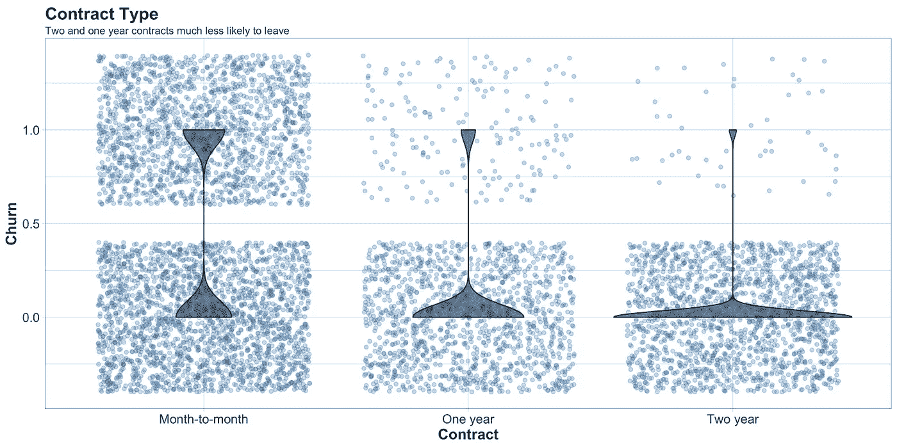
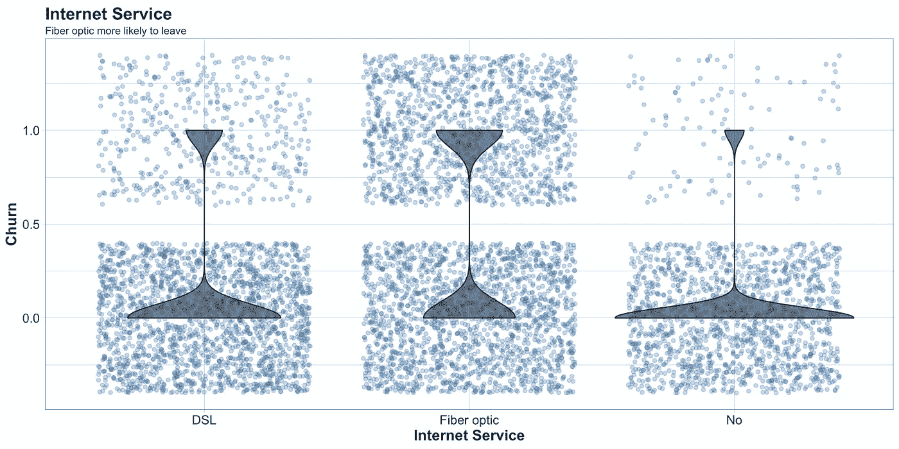
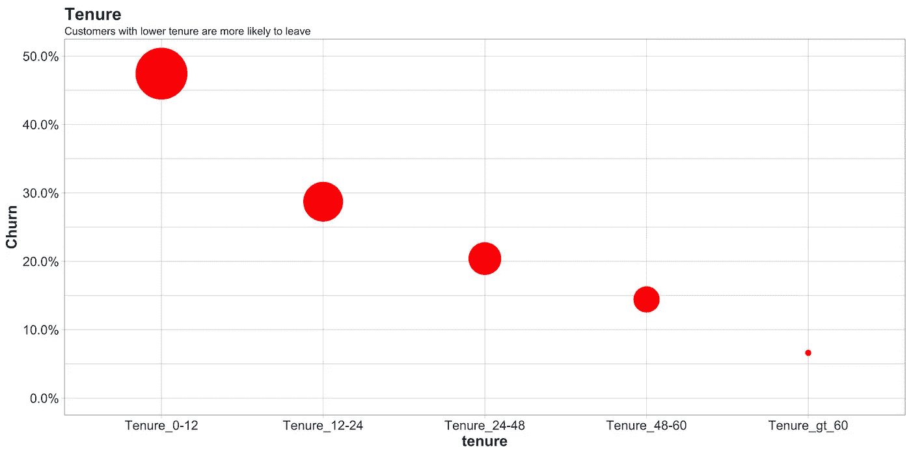

# 超越模型估计:以可视化方式报告效果

> 原文：<https://medium.com/analytics-vidhya/beyond-model-estimates-reporting-effects-in-a-visual-way-91c43469d9de?source=collection_archive---------30----------------------->

## 了解、预测并最大限度减少客户流失

([https://www.istockphoto.com](https://www.istockphoto.com/nl)

# 介绍

对于许多企业来说，与现有客户建立持续的关系可能是一个重要的收入来源。客户流失到竞争对手手中可能会大大减少公司的收入。管理这一现象，采取积极措施防止客户“流失”是许多企业的当务之急。因此，向组织中的决策者传达数据科学见解至关重要。组织中的大多数决策者不是数据科学家，但这些人在日常工作中做出重要决策。因此，这是最重要的，那些渴望使用机器学习技术的人需要避免黑箱综合症:一个非常准确的模型很好，但当你试图理解一种情况时，一个有洞察力的模型更好。更高级模型的挑战通常是它们的输出更复杂，难以解释。

 [## 将定义 2020 年就业前景的五大数据科学和机器学习趋势|数据驱动…

### 数据科学和 ML 是 2019 年最受关注的趋势之一，毫无疑问，它们将继续发展…

www.datadriveninvestor.com](https://www.datadriveninvestor.com/2020/02/19/five-data-science-and-machine-learning-trends-that-will-define-job-prospects-in-2020/) 

# 商业分析和机器学习

数据科学是一门手艺。与许多工艺一样，有一个明确定义的过程可以帮助增加成功结果的可能性。这个过程是思考数据科学项目的重要概念工具。为了说明复杂的机器算法如何应用于商业分析，考虑一组可能出现的问题以及适合回答这些问题的机器学习算法。这些问题都是相关的，但每一个都有微妙的不同。理解这些差异是很重要的，以便理解一个人需要采用什么机器学习算法，以及可能有必要咨询什么人。

1.  谁是真正的顾客？
2.  我能描述它们吗？
3.  谁是最赚钱的客户？
4.  盈利客户和一般客户真的有区别吗？
5.  某些特定的新客户会盈利吗？

# 客户流失预测模型

作为数据科学家，一个人通常通过分解项目来处理项目，从而揭示一个或多个规范任务，为每个任务选择解决方案技术，然后组合解决方案。我已经介绍了预测建模的概念，它需要解决上述问题，这是数据科学的主要任务之一，其中建立了一个模型，可以估计新的未知示例的目标变量的值。在这个过程中，我们引入了数据科学的一个基本概念:寻找和选择信息属性，以及建立一流的机器学习模型。例如，我们收集客户在合同到期后不久离开或没有离开公司的历史数据，进行属性选择，并最终对该数据集进行机器学习建模。

你可以参考我以前的博客“解开行为秘密，克服极端客户流失:[了解](https://towardsdatascience.com/unlocking-behavioural-secrets-to-overcome-churn-extremes-9c12a7ccc875)、[预测](/swlh/building-comprehensible-customer-churn-prediction-models-ca61ecce529d)和**最大限度地减少**客户流失”，以了解企业中存在的对客户流失的各种看法。

# 无模型方法

如上所述，我们已经分析了客户流失数据，我发现解释客户离开公司的两个最重要的因素是合同类型、总费用和互联网服务。我们使用了特性重要性图，它显示了特性重要性的等级。更进一步，我们可以使用一个图表，以更直观的方式来报告我们的效果。实际上，现在我们知道了什么是重要的影响，我们甚至可以使用一种不依赖于统计数据的方法来帮助观众理解这种情况。这被称为无模型方法。

让我们首先陈述一个雇员与电信公司的“合同类型”的例子。这一特征与选择留下的人明显相关。拥有一年和两年合同的客户不太可能流失。因此，对于决策者来说，这提供了一个明确的机会来促进转换到长期合同。

但是我们也可以看到，有些变量在第一点没有意义。拥有光纤服务的客户更有可能流失，而没有互联网服务的客户则不太可能流失。虽然我们预计这会让客户留下来，因为它为他提供了快速的互联网，但我们的模型却不这么认为。在这种情况下，深入挖掘并获得数据的一些背景信息是很重要的。对于业务经理来说，这可能是一个重要的洞察力和客户不满意度的关键指标。

让我们再举一个例子，员工在公司花费的“时间”以及它与客户流失的关系。因此，我们可以汇总这些价值，并根据在公司工作的时间来计算平均流失率。然后我们得到了这张图，它要好得多。我们看到了什么？

不出所料，任期较短的客户更有可能离开公司。随着任期的增加，流失率下降。这与文献一致，因为更多的**满意的顾客**不太可能流失，即具有更长的生命周期(Anderson 和 Sullivan 1993 哈洛韦尔 1996；博尔顿 1998 年)。事实上，Anderson 和 Sullivan (1993)发现，满意度较高的公司保留质量的弹性较低，也就是说，这些公司不会受到短期质量负偏差的影响。

# 结论

总结客户流失分析，我想强调一下我们是如何得出我们所展示的结果的。我们首先建立一个模型，并确保该模型是可靠的。然后，我们确定最重要的因素，并直观地报告与结果的关系。我们最终使用了我们结果的无模型表示。您可能已经注意到，在这篇博客中，我们没有直接使用 XGBoost 模型的结果来制作图表。XGBoost 模型用于确定最重要的因素，只有在那时，我们才直观地报告这些因素的影响，但不再直接使用估计值。因为我们所看到的与他们的统计模型结果一致，所以是可靠的。但是多亏了这种无模型的方法，我们可以在解释上更进一步——从而得出结论——使用允许观察复杂效应的视觉线索。它不需要你的观众了解任何关于统计学的东西。

这种方法将证明有助于扩展我们对机器学习建模的理解。因此，可以被复制到任何类型的部门、任何类型的应用和任何类型的变量。此外，更先进的模型是统计技术与视觉呈现的洞察力的结合，这将允许我们与您的观众建立现实的共享表示。因此，有一个明确的关键，以确保成功的任何变化，你想实现你的业务。

👋感谢阅读。如果你喜欢我的作品，别忘了喜欢，跟着我上[传媒](/@rashidkazmi)。这将激励我为媒体社区提供更多的内容！😊

# 参考资料:

Ascarza 等人(2018):追求增强的客户保持管理:回顾、关键问题和未来方向。斯普林格科学+商业媒体有限责任公司 2017

安德森和沙利文(1993 年)。企业顾客满意的前因和后果。营销科学，12(2)，125–143 页。

布拉特伯格等人(2008):《数据库营销:分析和管理客户》。起拱石

博尔顿，R.N. (1998 年)顾客与持续服务提供商关系持续时间的动态模型:满意度的作用。营销科学，17(1)，45–65 页。

哈洛韦尔，R. (1996 年)。顾客满意、顾客忠诚与盈利能力关系的实证研究。国际服务业管理杂志，7(4)，27–42。

[" gist-syntax-themes ":https://github . com/lone Korean/gist-syntax-https://business science . github . io/correlation funnel/articles/introducing _ correlation _ funnel . html](https://business-science.github.io/correlationfunnel/articles/introducing_correlation_funnel.html)