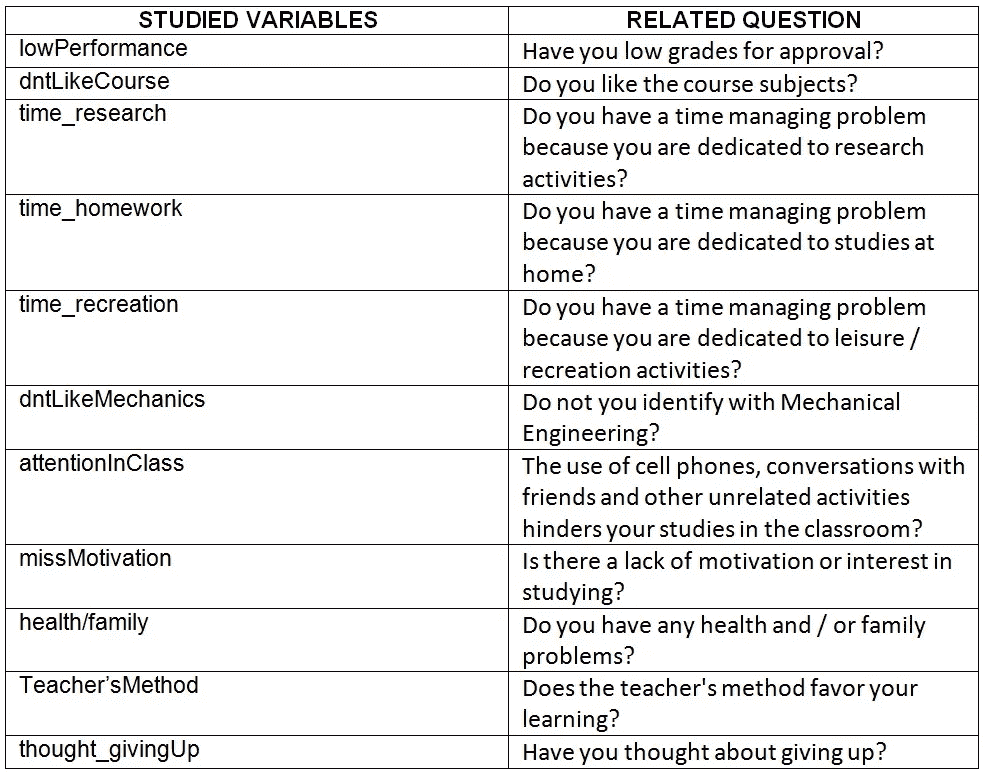
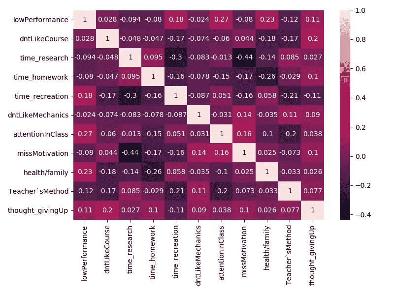
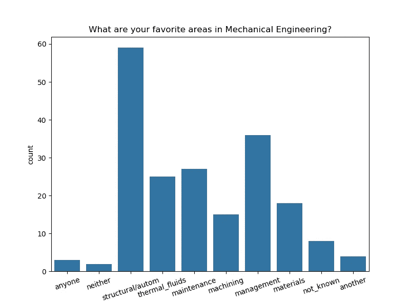
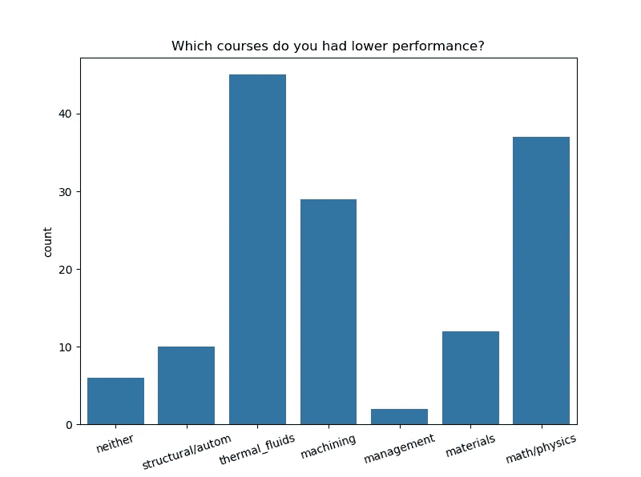
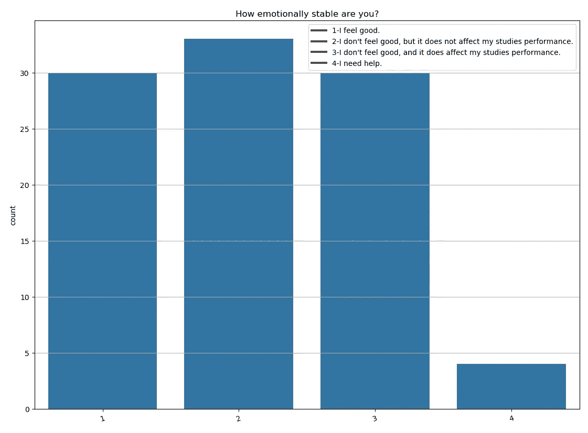
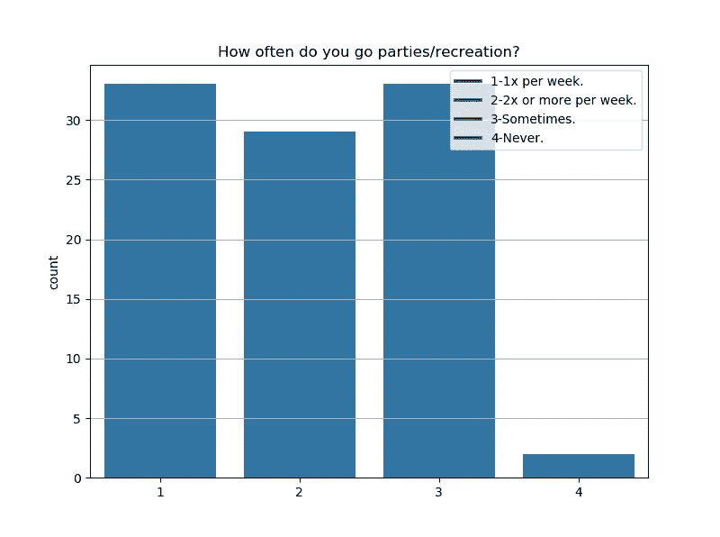
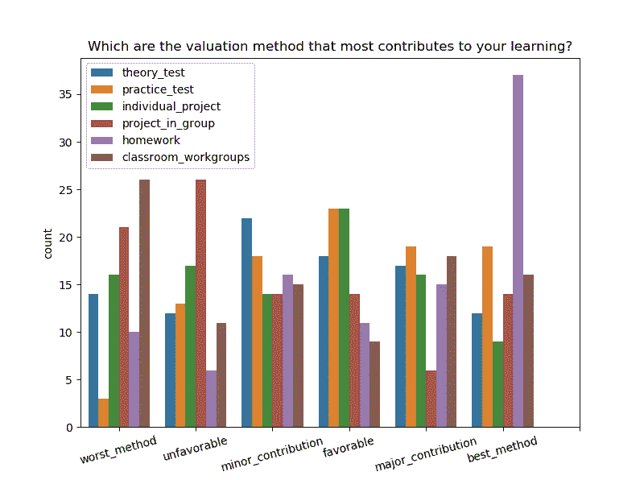
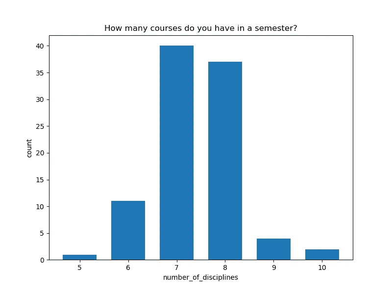
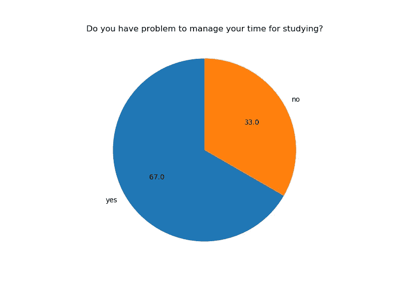

# 超越代数:我们的工科学生到底怎么了？

> 原文：<https://medium.com/analytics-vidhya/beyond-the-algebra-what-is-going-on-with-our-engineering-students-35cbdd7bedf?source=collection_archive---------15----------------------->

当开始攻读工程学位时，学生面临的一些最大挑战是微积分和代数科目。目前，在巴西 tringulo Mineiro 联邦大学的机械工程课程中，平均有 50%的学生在第一次学习时无法完成这些科目。

课程期间遇到的困难与学生过去遇到的困难没有什么不同，但是每天都有越来越多的学生考虑放弃一至四年级的课程。

除了历史上一直是一个挑战的数学科目的困难，这项工作试图计算一些统计数据，以了解为什么学生现在放弃毕业？

从二年级到四年级，对 96 名机械工程专业学生进行了调查。结果显示了这些学生面临的一些重大挑战。

学生为什么会辍学？

进行的第一次分析表明，56.3%的学生已经在第一年到第四年的某个时候考虑过放弃这门课程。为了了解导致学生考虑退出该课程的主要原因，在变量之间创建了一个关联矩阵:

表 1:研究变量。

对于表 1 中的每个问题，学生可以回答“是”或“否”。除了“低绩效”和“思考 _ 给出”变量，学生最多可以在 3 个问题中回答“是”，以确定哪些因素对他们个人影响最大。根据提供的答案，获得了图 1 中的相关性。

图 1:关联矩阵的热图。

在图 1 中，我们最初观察到“思考 _ 放弃”的相关性，如果学生已经想过放弃，则对应于“是”，否则对应于“否”。它的主要相关性是关于:“dntlikeccourse”(0.2)、“低绩效”(0.11)、“时间 _ 娱乐”(0.11)、“时间 _ 家庭作业”(0.1)和“错过 _ 动机”(0.1)。

**学生不喜欢这门课:**

学生想放弃的主要原因是学生不喜欢某些科目，这可以用内容甚至不喜欢老师来解释。

另一个问题是问学生，他们的结果可以说明为什么学生不喜欢这些科目:“你最喜欢机械工程的哪个领域？”给学生一些可能的选择，他选择了一些他将来想从事的领域。图 2 显示了获得的结果。

图 2 —学生最喜欢的领域。

在 UFTM 大学的机械工程专业，学生在 5 年中有 4 门课程与“管理”相关。尽管工作量很短，但这个主题似乎是第二大选择，仅次于“结构/自动化”，与振动和机器人等学科相关。这意味着大多数时候学生没有与他想从事的领域直接相关的学科，这也是“学生不喜欢这门课”的原因之一。

当学生开始一门工程课程而不确定该领域的专业人员在做什么的时候，这个因素被放大了。因此，在整个课程中，学生并不认同学科或未来的职业，导致他放弃了这门课程。

**部分学科成绩低:**

与考虑退学的学生最相关的第二个变量是这些科目的低分。数学和物理科目的高不及格率是问题的一些原因，如图 3 所示。

图 3——数学和物理成绩差。

问题的根源，可以举出高中以来的低成绩。在某些情况下，学生甚至没有学到必要的内容。在这种情况下，学生自然会失去继续学习的动力。

在图 1 中，变量“低绩效”也与“注意力/课堂”(0.27)、“健康/家庭”(0.23)、“时间/娱乐”(0.18)和“教师方法”(0.12)高度相关。

成绩低和上课注意力不集中之间的关系是显而易见的。在当前学生不断联系的时代，注意力在不同时期被社交网络所分散。

健康和家庭问题也可以解释分数低的原因。另一个问题是:“你的情绪有多稳定？”。答案如图 4 所示。

图 4 —学生的健康状况。

图 4 显示了高达 30%的学生说“我感觉不好，这确实影响了我的学习成绩。”另外 35%的人说“我感觉不舒服，但这不影响我的学习成绩”，几乎 5%的人说“我需要帮助”。如果加上，几乎 70%的学生都有一些情绪和/或心理问题。这些数字令人恐惧，应该会引发整个学术界的警觉。这些数字难道不是我们当前社会的反映吗？

在与低分数相关的变量之后，出现了“时间娱乐”。为了量化学生的休闲活动，所问的问题是:“你多久参加一次聚会/娱乐活动？”结果如图 5 所示。

图 5 —娱乐时间。

在图 5 中，可以观察到超过 60%的学生每周参加一次或多次聚会。拥有闲暇时间对于良好的生活质量至关重要，然而学生们并不总是能够很好地管理他们的时间，最终将他们的学业抛在脑后。安排课堂学习、家庭作业、研究项目和闲暇时间对那些工科学生来说是额外的学习经历。

图 1 还显示,“时间娱乐”是与其他变量最相关的变量，在所分析的 11 个变量中，有 7 个变量的值大于+/- 0.1。

最后一个与学生低分数相关的分析变量是“老师的方法”。教师需要让学生对内容感兴趣，这可以从例子和实践活动中做到。教师对学生的评价方法也是一个重要因素。每个学生都有自己的特点，通过不同的技巧可以学到更多，如图 6 所示。为了获得图 6 的结果，向学生提出的问题是:“哪种估价方法对你的学习最有帮助？'

图 6-估价方法。

据观察，“家庭作业”是最有助于学生学习的评估方法。在具有“主要贡献”的方法中，那些其次导致学习的方法中，观察到相似的结果，并且在不同的方法中很好地划分。这证实了学生的多样性和教师应用不同方法以促进学生学习的必要性。

**时间管理:**

从已经呈现的结果中可以看出，时间管理是影响工程专业学生生活的一个因素，根据图 1,“时间 _ 作业”是与课程辍学最相关的第二个变量。

学生每学期学习的科目越多，课堂内外的学习数量就越多，这使得时间管理更加困难。为了映射这个参数，会问这样一个问题:‘你一个学期有多少门课？’结果如图 7 所示。

图 7 —一学期中不同科目的数量。

平均来说，学生每学期选修 7 门课程，但也有学生每学期选修 9 门甚至 10 门不同课程的情况。考虑到每个学科每周平均有 3.3 个小时在教室里，学生可以有 33 个小时在教室里，这将留下可计算的时间在家学习，同时仍然安排休闲活动。

问学生的最后一个问题是:“你在管理学习时间方面有问题吗？”结果如图 8 所示。

图 8 —时间管理。

图 8 中的结果显示 67%的学生在时间管理上有问题。结果只能是低分、缺乏动力和辍学。通过这种方式,“错误动机”在与退出课程相关的变量中成为最后一个被强调的变量，如图 1 所示。

有趣的是，对于所提出的问题，一个可能的解决方案以变量“time_research”的形式出现，这是图 1 中相关性最高的一个变量。负值-0.44 和-0.3 分别与缺乏动力和难以管理休闲活动专用时间相关。负值表明变量的行为成反比，也就是说，学生花在研究活动上的时间越多，他就越不会感到没有动力，也就越不会在管理时间上遇到麻烦。在一般的研究活动中，学生致力于他们喜欢的研究，所以其他问题似乎被最小化了。

**结论**

本文简要分析了通过对机械工程专业学生进行问卷调查所获得的数据，问卷的目的是回答这个问题:**学生为什么辍学？**

缺乏动力似乎是与考虑放弃最相关的变量之一。在所分析的 11 个变量中，有 6 个变量的相关值大于+/- 0.1。

一个有动力的学生能够克服任何挑战，无论是缺乏理论概念还是缺乏时间。此外，教师和社会的责任也出现在结果中。很多学生目前有情绪问题，这导致他们退出了这门课程。

问题出现了，现在:我们正在做什么来改变这一现实？

赞美诗:可在 https://github.com/ViniciusAbrao/student_survey[的](https://github.com/ViniciusAbrao/student_survey)查看计算结果