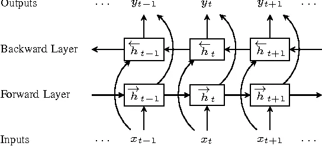
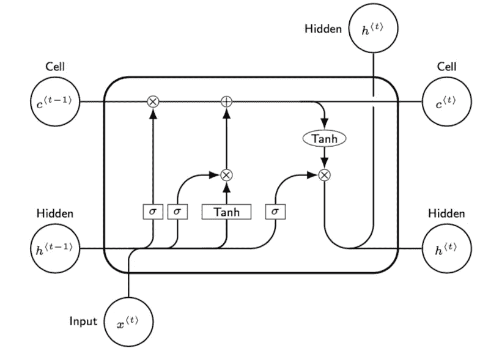

# 双向 RNN & LSTM 和 GRU 的基础

> 原文：<https://medium.com/analytics-vidhya/bi-directional-rnn-basics-of-lstm-and-gru-e114aa4779bb?source=collection_archive---------0----------------------->

在我之前关于[递归神经网络](/@madhuramiah/deep-learning-recurrent-neural-networks-463dbb9db8be)的博客中，我们讨论了消失和爆炸梯度。在这篇博客中，我们将讨论如何处理这些问题，以及我们将使用什么模型。除此之外，我们还将讨论双向 RNN 以及它们的使用场合。

在我继续讨论双向 RNN 之前，让我们稍微讨论一下在线-离线模式。在文本摘要中，你基本上需要看到整个文本，然后才能对其进行摘要。这就是所谓的' ***离线*** 模式。同时，当您在撰写电子邮件时考虑自动撰写功能时，它不能访问任何未来的单词，而只能访问以前的单词(序列)。这种类型叫做' ***'在线*** '模式。当我们考虑离线序列模型时，虽然我们事先知道整篇文章，但 RNN 只是从头到尾一个字一个字地学习。但是，如果模型还能知道未来的单词，那就更好了，这样它就能更有效地解决问题。对于这种情况，我们使用 ***双向 RNN 的*** 。

## 双向递归神经网络；

在双向 RNN 中，我们考虑两个独立的序列。一个从右到左，另一个以相反的顺序。但是，现在的问题是，你如何将两个 RNN 结合在一起。看下图就清楚明白了。

用于单词序列的双向 RNN

考虑单词序列“我爱芒果汁”。前向层将这样馈送序列。但是，后一层将按照相反的顺序“果汁芒果爱我”来馈送序列。现在，输出将通过每次连接单词序列并相应地生成权重来生成。这也可以用于词性标注问题。

## LSTM(长短期记忆)

当我们有一个小的 RNN，我们将能够有效地使用 RNN，因为没有消失梯度的问题。但是，当我们考虑使用长 RNN 的没有太多我们能做的与传统的 RNN 的，因此它没有被广泛使用。这就是导致发现 LSTM 氏病的原因，该病基本上使用稍微不同的神经元结构。这是基于一个基本的想法创建的——即使序列非常大，渐变也不应该消失。

1.  在 LSTM，我们将一个神经元称为 ***细胞。*** 在传统的 RNN 中，模型能够记住某些东西的唯一方式是通过更新隐藏状态和它们各自的权重。但是，在 LSTM，这个问题是通过使用一个用于学习和记忆任务的显性记忆单元来解决的。它储存与学习相关的信息。
2.  它还使用称为 ***【门控机制】*** 的东西来管理网络存储的信息——如果它必须将信息传递到下一层或忘记它拥有的信息 ***。***
3.  ***恒定误差转盘*** 是 LSTM 的另一个很重要的特点。它允许 LSTM 在传播时有一个平滑和不间断的梯度流。

LSTM 建筑

1.  这个大矩形框叫做“ ***单元格*** ”，它取时间 t 的一个 ***输入 x(t)*** ，一个 ***前一个隐藏层 h(t-1)和一个前一个单元格状态 c(t-1)*** 。细胞状态只不过是外显的记忆单位。
2.  该单元给出 2 个输出- 1 是隐藏状态 h(t)的输出，另一个是在任何给定时间 t 的单元状态 c(t)的输出。
3.  恒定误差转盘负责将梯度从 c(t-1)平滑地转移到 c(t)
4.  sigmoid 函数将输出介于 0 和 1 之间的值，而 tanh 函数将输出介于-1 和 1 之间的值。这是我们将在 LSTM 使用的两个主要激活功能。
5.  我们将来自 x(t)和 h(t-1)的输入组合成一个 sigmoid 激活函数，并将其与先前的单元状态 c(t-1)进行乘法运算。这种乘法运算称为“ ***门*** ”。如果 sigmoid 函数的值接近于 1，那么乘法将得到接近于 c(t-1)的值，这意味着只擦除以前的一小部分记忆，但保留大部分记忆。相反，如果 sigmoid 函数接近于 0，那么乘法将产生接近于 0 的值。这意味着从先前的单元状态(存储器)中擦除几乎所有的内容。这整个部分叫做**‘忘门’**
6.  下一个门叫做“**更新门**，它使用一个 sigmoid 和一个 tanh 函数，两个门都有一个乘法门，后面跟着一个加法门，输出来自“忘记门”。“tanh”函数控制下一个单元状态的值增加或减少多少。sigmoid 函数决定应该向新的单元状态 c(t)写入多少信息。
7.  下一个也是最后一个门称为“**输出门**”。这将具有一个 sigmoid 函数，其后是一个具有 tanh 激活函数的乘法门，从而将值释放到前馈侧和递归侧的隐藏状态。这里，sigmoid 函数和 tanh 函数的值越高，传输到下一个隐藏状态 h(t)的值就越高。
8.  在 LSTM，你可以看到所有的 3 sigmoid 和 1 tanh 激活函数，其输入是 h(t-1)和 x(t)的连接，具有不同的权重，比如 w(f)，w(i)，w(c)和 w(o)。那么训练 LSTM 模型所需的总参数是正常 RNN 的 4 倍。因此，计算成本非常高。为了解决这个问题，他们发明了一种叫做 GRU 的东西。

## 门控循环单元(GRU)

1.  这是最近在 2014 年成立的，他们减少了来自 LSTM 的参数数量，但为了以防 GRU 不能很好地工作，我们将不得不回滚到 LSTM。
2.  在 GRU，有 ***没有明确的记忆单位。*** 记忆单元是随着网络结合在一起的。
3.  GRU 中没有遗忘门和更新门，它们被组合在一起，从而减少了参数的数量。
4.  当比较 GRU 和 LSTM 时，它表现良好，但在准确性上可能略有下降。但是我们仍然具有较少数量的可训练参数，这使得使用起来很有利。

## **结论:**

我们谈到了双向 RNN 氏症。但是现在，大多数香草 RNN 被 LSTM 和 GRU 所取代。在这项发明之后，我们在以极其有效的方式处理序列数据方面取得了飞跃。在我的博客中，我将解释如何在 Keras 中使用 RNN 的词性标注应用程序。

希望你喜欢我的博客。感谢阅读:)请在下面留下您的评论或问题，或者在 [LinkedIn](https://www.linkedin.com/in/madhu-ramiah-a66a4b48/) 上联系我