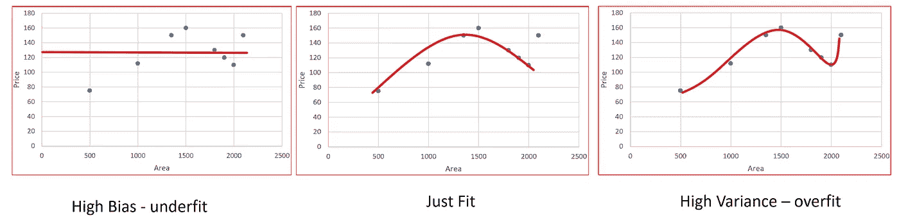
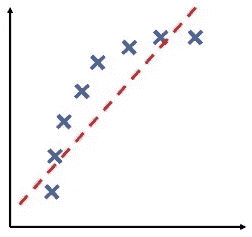
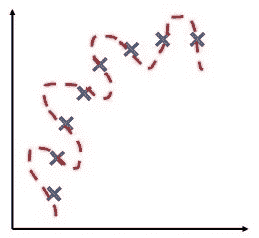
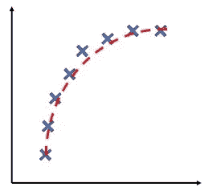
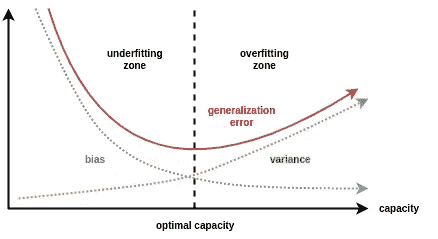
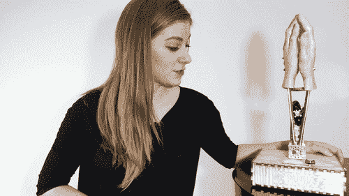

# 偏差和方差

> 原文：<https://medium.com/analytics-vidhya/bias-and-variance-98203110e8bd?source=collection_archive---------12----------------------->

如果你运行一个学习算法，但它的表现不如你所希望的那样好，那将是因为你要么有一个高偏差问题，要么有一个高方差问题，换句话说，要么是一个**欠拟合**问题，要么是一个**过拟合**问题几乎一直存在。

了解这两个问题中的哪一个是偏差或方差，或者两者兼而有之，这一点至关重要，因为了解这两个问题中的哪一个正在发生，将为尝试**到** **改进** **算法**的有前途的方法提供非常强的指示。

## 高偏置:

*   该图有一个过度的低阶多项式来拟合数据。假设不会很好地拟合训练集，在这种情况下，我们需要更高次的多项式来拟合数据。
*   训练集错误和交叉验证错误**两者**都将为**高**。
*   交叉验证误差将接近或略高于训练集。
*   ***欠拟合*** *就是这种情况。*

**欠配合**

如果这些是征兆，那么你的算法可能有很大的偏差。

## 高方差:

*   该图的多项式次数**太大，无法拟合数据。假设不会很好地适合训练集，在这种情况下，我们需要一个低次多项式来拟合数据。**
*   数据将非常好地拟合训练集*，即*训练集误差通常将**低**，但是交叉验证集的误差将**比训练误差大得多**。
*   ***过拟合*** *就是这种情况。*

**过拟合**

*如果这些是迹象，那么你的算法可能会受到高方差的影响。*

## 低偏差和低方差:

理想情况:低偏差和低方差

*如果我们拟合一个***的多项式，可以更好的拟合数据，其中* ***既有*** *的训练集误差&交叉验证误差***。***

## **显示偏差和方差权衡的图表:**

****

## **通过以下方式修复高差异:**

*   **获取更多培训示例。**
*   **尝试更小的功能集。**
*   **使用正则化(**增加λ** )解决过拟合问题。**

## **通过以下方式修复高偏置:**

*   **添加功能**。****
*   **添加多项式要素。**
*   **使用正则化(**减少λ)** 解决欠拟合问题。**

****模型复杂性效应:****

*   **低阶多项式(低模型复杂度)**具有高偏差和低方差**。在这种情况下，模型的一致性很差。**
*   **高阶多项式(高模型复杂度)非常适合训练数据，而非常不适合测试数据。这些在训练数据上有**低偏差**、**但**、**非常高方差**。**
*   **实际上，我们希望选择一个介于两者之间的模型，既能很好地概括，又能合理地拟合数据。**

# **诊断神经网络**

*   **参数较少的神经网络**容易出现欠拟合**。这也是**计算成本更低的**。**
*   **具有更多参数的大型神经网络**容易过拟合**。这也是**计算上昂贵的**。在这种情况下，您可以使用正则化(增加λ)来解决过度拟合问题。**

**使用单一隐藏层是一个很好的开始默认。 ***您可以使用交叉验证集在多个隐藏层上训练您的神经网络。然后，您可以选择表现最好的一个。*****

**如果你喜欢这篇文章，请用你的 ***掌声*** 支持它。你可能也喜欢博客上的****。*** 谢谢！***

****

**如果你能帮忙把它分享到 ***LinkedIn、Twitter*** 或 ***脸书*** 上，我会非常感激。**