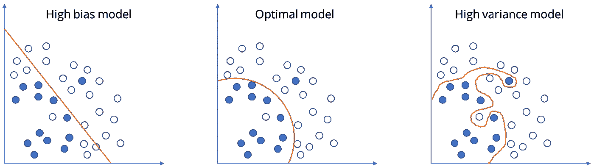

# 偏差和方差:机器学习的核心概念

> 原文：<https://medium.com/analytics-vidhya/bias-and-variance-the-core-concept-of-machine-learning-to-improve-models-performanc-f9d6eca7f800?source=collection_archive---------12----------------------->

偏差和方差是很容易学会但很难掌握的概念之一。在机器学习中，当我们想要优化模型预测时，理解描述误差和准确性的参数是非常重要的，在机器学习中，任何模型的性能都基于其正确的预测以及它在训练数据(可见数据)、测试数据和验证数据(不可见数据)以及实时数据上的概括程度。

让我们看看这意味着什么:

来源:谷歌图片

**偏置**

在第一张图中，如果我们对数据拟合一条直线，也许我们会得到一个逻辑回归拟合。这不是一个很好的数据拟合，所以这是一个高偏差类，我说这是**欠拟合**数据。

在现实生活中，假设你要进行一次测试，你得到了一张小抄，但你对学习不感兴趣，所以你只是随机正确回答问题，得到了 50%的结果。那就是偏高的问题。

**如果模型在测试和训练测试中表现不佳，那么我们称之为欠拟合模型。这种情况的一个例子是对非线性数据建立线性回归模型。**

***方差***

在第三张图中，如果我们拟合一个极其复杂的分类器可能是一个深度神经网络或具有所有隐藏单元的神经网络，也许我们可以完美地拟合数据，但这看起来也不太适合。所以有高方差的分类器，这是**过度拟合**数据。

根据前面的例子，有一个学生记住了小抄上的所有问题，但是试卷中有一些他从未见过的问题。因此，他的表现明显下降。

**模型在训练数据上表现良好，但在测试集上表现显著下降的情况称为过拟合模型。**

中间可能有一些中等复杂程度的分类器，比如(见图 2)可能适合它。

在这样一个 2D 的例子中，只有两个特征，x1 和 x2，我们可以绘制数据并可视化偏差和方差。在高维问题中，我们不能绘制数据和可视化决策边界，相反，有几个不同的指标有助于理解偏差和方差。

为了理解偏差和方差，两个关键数字是训练集误差和偏差集误差。所以继续猫的分类例子，发现一只猫是正面例子，发现一只狗是反面例子。我们假设在预测猫的时候，人类的误差接近 0%或者是最优误差或者是贝叶斯误差。

来源:谷歌图片

*   因此，假设训练集误差为 **1%** ，开发集误差为 **11%。S** o 我们在培训方面做得很好，但在开发方面做得相对较差。因此，这看起来像我们可能有**过度拟合**训练集，不知何故，我们没有很好地概括整个交叉验证集，这是一个发展集，这是**高方差。**
*   例如，如果训练集误差为 **15%** ，而我们的开发集误差为 **16%** ，那么我们知道该模型在训练集上表现不佳，那么这是**数据拟合不足**，因此算法具有**高偏差**。但相比之下，这实际上在合理的水平上概括了开发集，而开发集的性能只比训练集差 1%。
*   现在假设，我们有一个 **15%** 的训练集误差，这是一个相当高的偏差，但当您评估 dev 集时，它甚至更差，可能有 **30%** 。所以在这种情况下，算法有一个**高偏差**，因为它在训练集上做得不好，并且有一个**高方差**。所以这真是两全其美。
*   在最后一个示例中，如果训练集误差为 **0.5%** ，偏差集误差为 **1%** ，那么我们只有**低偏差和低方差。**

*要点是，通过查看我们的训练集误差，我们可以了解我们的拟合程度，至少是训练数据，这样可以告诉我们是否存在偏差问题。然后看看我们的误差上升了多少，当我们从训练集到开发集时，这应该会让我们感觉到方差问题有多糟糕，所以我们将很好地从训练集推广到开发集，这让我们感觉到了我们的方差。所有这些都是在假设贝叶斯误差非常小，并且我们的训练集和开发集来自同一个分布的情况下进行的*

***改善模型性能的配方***

如果算法有很高的偏差，**不太适合训练集，我们可以尝试选择一个网络，例如更多的隐藏层或更多的隐藏单元，或者我们可以训练它更长时间或尝试一些更高级的优化算法。**我们可以尝试许多不同的神经网络架构，也许我们可以找到一种更适合这个问题的新网络架构，但不能保证这一步会奏效，但可以尝试。**尽管获得更大的人际网络几乎总是有帮助的，训练时间长并不总是有帮助的，但这肯定不会有坏处。**

现在，当我们查看 dev set 性能并且算法具有高方差时，解决高方差问题的最佳方法**是获取更多数据**，但是获取更多数据并不总是容易的。我们可以尝试**正则化**这是一种非常有用的减少方差的技术**我们也可以尝试许多不同的神经网络架构。**