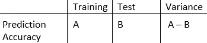
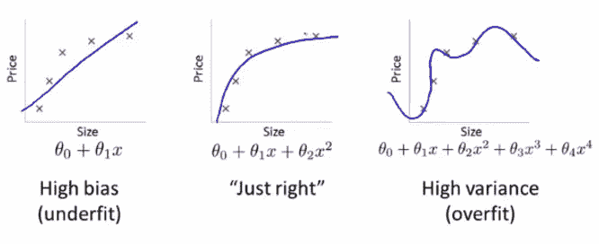
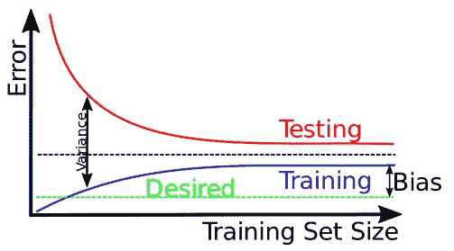

# 偏差和方差权衡

> 原文：<https://medium.com/analytics-vidhya/bias-and-variance-tradeoff-3e55d83790a1?source=collection_archive---------27----------------------->

当谈到模型预测的准确性时，必须考虑预测误差。许多数据科学家已经证明，在偏差和方差之间总是存在权衡。一个完美的建模者不可能同时具有低偏差和低方差。理解这些错误有助于避免欠拟合和过拟合的错误，从而建立有意义的模型。

**什么是偏差和方差？**

> 偏差和方差是预测误差。也可以解释为实际值和我们的预测之间的差异或差距。

## 偏见

它是我们模型的平均预测和实际值(我们试图预测的)之间的差异。以下是我们可以从偏见中得出的推论。

o 高偏差:这意味着，预测值的平均值与实际值之间存在巨大的差距，因此显然我们的模型对给定数据的关注度较低。

o 低偏差:预测值的平均值与实际值之间的差距极小，我们可以说我们的模型在给定数据上表现良好。

> 好吧，这样想
> 
> 持有偏见的人更有可能做出错误的假设，因此预测会不准确。你可以想象一个高度偏见的政治人物，他的决定会如何将整个国家置于危险之中。

# 差异

我们的模型预测对于给定数据点或**的可变性是训练数据和测试数据之间 ML 模型预测准确度的变化。**

如果我的模型对训练数据的预测精度为(A ),对测试数据的预测精度为(B ),那么我的方差为(A-B)

高方差:这意味着模型更加关注训练数据，而在测试数据上表现不佳(这是以前没有过的)

o 低方差:这意味着训练数据和测试数据之间的预测准确性差异很小，因此我们可以考虑使用此模型进行预测。

## 欠拟合和过拟合

**图-1:** 数据点和预测线之间的差距或差异相当大，因此偏差很大。大多数数据点或没有数据点不在预测线上。因此这是一个**欠拟合**的例子。

**图-3:** 这里我们可以看到预测线正穿过每个数据点。这通常发生在我们有高方差的时候。该模型更多地关注了训练数据，但在看不见的数据上获得高误差的机会。由于所有数据点都在预测线上，这是一个**过拟合**的例子。

**图表-2:** 现在，该图表显示大多数数据点靠近预测线，因此显然存在最小化的误差，因此偏差较低。这可以成为我们的完美模型。

## 为什么偏倚和方差之间要权衡？

如果我的算法或模型非常简单，只有很少的参数，那么我有更多的机会得到高偏差和低方差，这将导致欠拟合。然而，如果我的模型是复杂的，有许多参数，那么它将是一个高方差，低偏差，这将使我的模型处于过度拟合状态。这两种情况都会使我的模型欠拟合和过拟合。

所以为了避免这些情况，我必须在偏差和方差之间寻找一个最佳的平衡。它既不应该更加复杂，同时也不应该更加简化。

src: [Andrew Ngs 课程](https://www.coursera.org/learn/machine-learning)

只要看看上面的图片，这解释了权衡。**偏差增加，方差减少，反之亦然**。

> 这就是为什么知道和理解预测误差在机器学习中起着重要作用。

感谢阅读和快乐学习