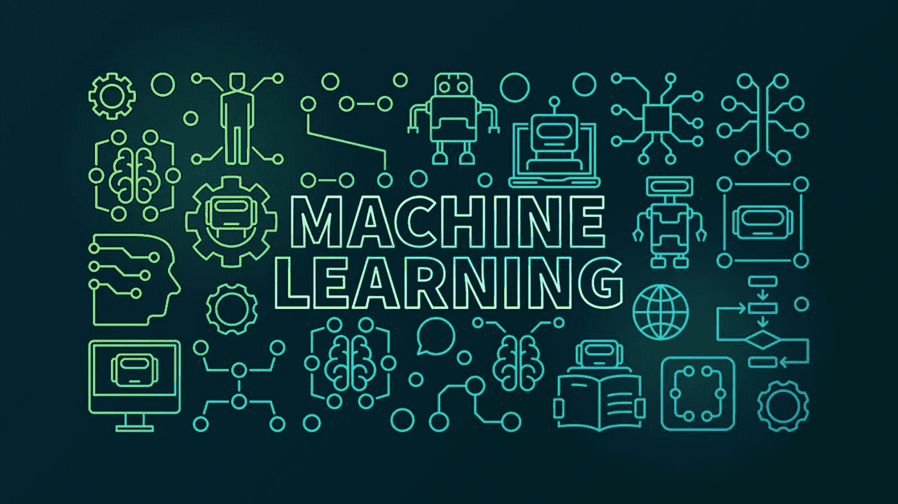
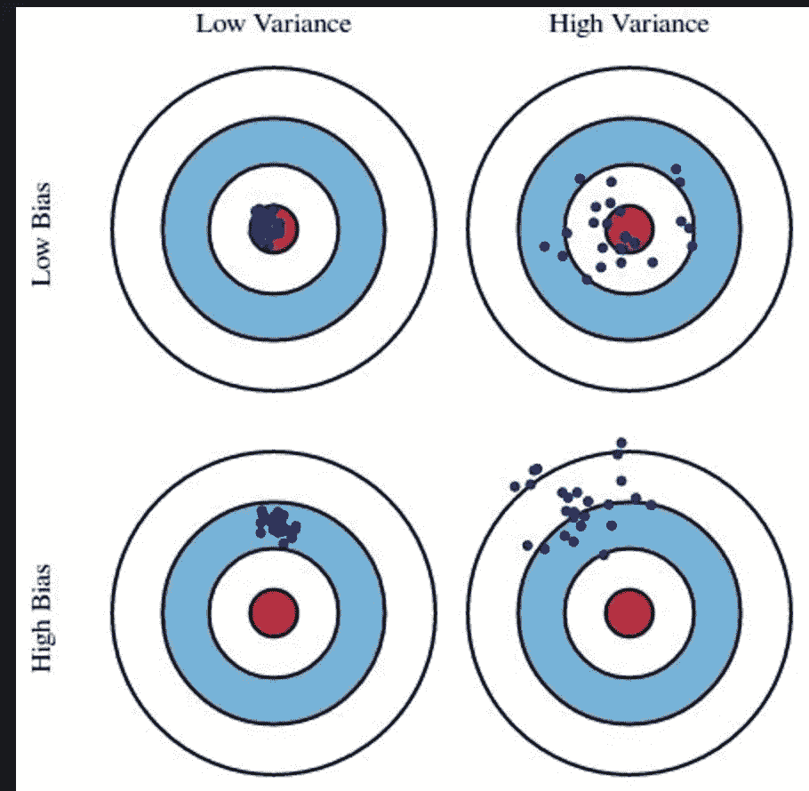
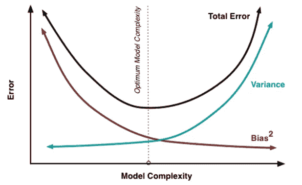

# 偏差方差及其权衡

> 原文：<https://medium.com/analytics-vidhya/bias-variance-and-their-trade-off-16d79f475728?source=collection_archive---------35----------------------->

许多模型的选择取决于模型的误差。我们开发的任何模型基本上都应该有尽可能低的误差。因此，理解误差项本身就变得非常重要。

# **机器学习中的错误**

在监督学习中，无论我们试图预测一个类别还是一个实数，即问题是分类问题还是回归问题，最终我们都会得出一个*错误。* 误差显示了我们离正确预测一个标签有多远。作为数据科学专业人员，我们必须尽量减少这一误差项。

*那么我们如何将误差降至最低呢？* 为此我们需要了解误差项实际上是由什么组成的。

假设我们试图通过使用一个特征“x”来预测房子的价格。
训练数据‘d’如下:D = { (x₁，y₁)，(x₂ ,y₂)，……..(xₙ,yₙ)}

给定“x ”,我们想要预测标签“y”。平方损失函数的误差项为:

测试点(x，y)的误差

我们看到，误差基本上取决于两项: *y，*它是实际标签， *h(x)* 它是基于我们得出的算法的预测值。

因此，一般来说，误差项是实际标签和模型预测的标签之间的差异。我们可以用数学方法写成如下:

h(x)是预测的标签

如果我们分解上面的项，我们得到下面的等式:

或者；

我们看到误差项巧妙地分解成三项，每一项都有不同的含义。

## 噪音

Err[预期标签-实际标签]

任何算法都试图找到一个分类器，它对于某个' *x'* '给出一个期望的标签。然而，我们可能仍然有一些误差。此错误可能是由于多种原因造成的，例如数据点的标签错误，或者两个数据点的' *x'* 值相同，但标签' *y '不同。*

认为噪音可以降低是一种常见的误解。我们不能完全消除噪音，但我们肯定可以减少噪音。正如我们可以看到的，预期标签是' *x '，*的函数，因此添加新特征可以帮助减少噪声。

## **方差**

方差告诉我们，如果我们改变训练数据，我们的模型会有多大的变化。
任何模型的目的都是要从一个小数据(训练数据)中学习，然后在一些测试数据上进行预测。

假设我们有一个非常大的群体 *P* ，我们从中随机挑选了一个数据集 *D，*来训练我们的分类算法。假设我们的问题是，给定一个学生每周学习的小时数，预测他是否通过考试。我们的人口是在学校学习的全国百万学生，训练数据集是来自五所学校的学生。

err[训练数据上分类器的标签-预期分类器的标签]

在上面的等式中，h𝒹(x)是我们在这个特定的训练数据集上学习的分类器， *D.* 假设我们的分类器说，每个每周学习超过 10 小时的学生都通过了考试。如果我们从我们的人群中挑选一些其他的训练数据，或者简单地选择五所不同的学校，我们就会得到一些不同的分类器。所以，所有这些 *h* 𝒹(x)都会不一样。

预期分类器(见上式)也称为平均分类器，是我们对整个群体进行训练后得到的分类器。

高方差是*过度拟合的一种情况，*因为训练数据已经学习了太多，以至于分类器不能在测试数据集上准确预测。

***方差项表明，即使我们在训练数据上有最好的分类器，我们离预期的分类器还有多远。***

## **偏置**

错误[来自平均分类器的标签-预期标签]

假设我们已经通过拥有非常大的训练数据集实现了平均分类器。这仍然不完全是预期的标签。因此，即使训练数据的预期分类器为我们提供了某些' *x'* '的标签，也与训练数据的预期标签不匹配。这是因为我们对数据做了一些不真实的假设。

因此，无论我们拥有多少数据，也就是说，即使我们对无限数据进行了训练，由于我们对数据的假设是错误的，我们也不会得到预期的标签。

错误的假设可能是，我们假设我们的数据是线性可分的，而实际上不是，或者，我们的模型过于简化数据，试图拟合一条直线，而实际上，数据是非线性的。

高偏差是*欠拟合*的情况，即我们的分类器无法理解训练数据的复杂性。

***偏差术语是模型无法正确学习数据。***

在下面的图片中，我们可以看到偏差和方差是如何发生的。目标是击中棋盘的中心。

**低偏差/低方差:**我们已经确定了中心，不管给我们什么样的飞镖，我们都要继续击中它。

低偏差/高方差:我们已经确定了中心，但是当给予不同的飞镖时，我们继续击中它周围的某个地方。

**高偏差/低方差:**我们已经错误地识别了中心，并且无论给出什么样的飞镖，我们都继续打错。

高偏差/高方差:我们错误地识别了中心，当给予不同的飞镖时，我们甚至不能击中那个点。

# 权衡

假设我们试图通过在训练数据集中添加更多数据来减少方差。然而，在这样做的时候，我们可能会使我们的训练数据更加复杂，从而增加偏差误差。因此，每当我们试图减少等式中的一项时，另一项就会增加。

那么我们如何解决这个问题呢？

***如果我们看一下这个方程，我们可以看到这三项，即偏差、方差和噪声，都是二次的。这意味着我们的总误差很可能由三项误差中的任何一项决定。***

***因此，可能是因为偏置误差很大，而其余两个误差很小，所以误差很大，反之亦然。
由于误差项是二次的，因此我们有机会大量减少一项，而不会大幅增加其他两项。***

偏差方差权衡

通常我们会权衡偏差和方差，因此得名偏差方差权衡。
因此，如果一个下降，另一个上升，但上升的幅度不同。

作为一名数据科学专业人员，了解哪部分误差项较高非常重要，只有这样我们才能减少整体误差。

在接下来的文章中，我们将研究确定问题的类型，即它是偏差问题还是方差问题。

感谢您的阅读！

*关于来源和进一步阅读:*

[http://scott.fortmann-roe.com/docs/BiasVariance.html](http://scott.fortmann-roe.com/docs/BiasVariance.html)