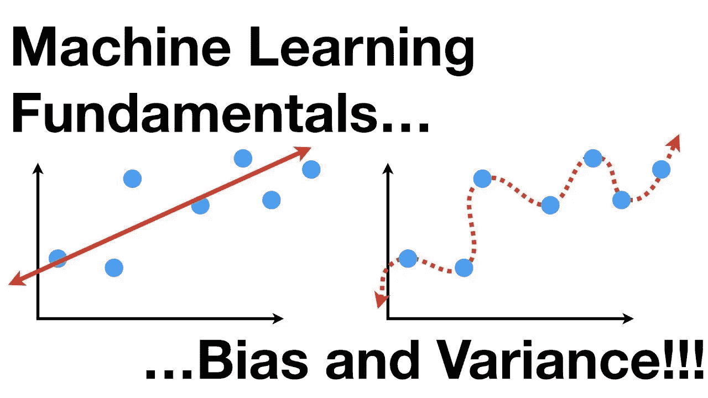
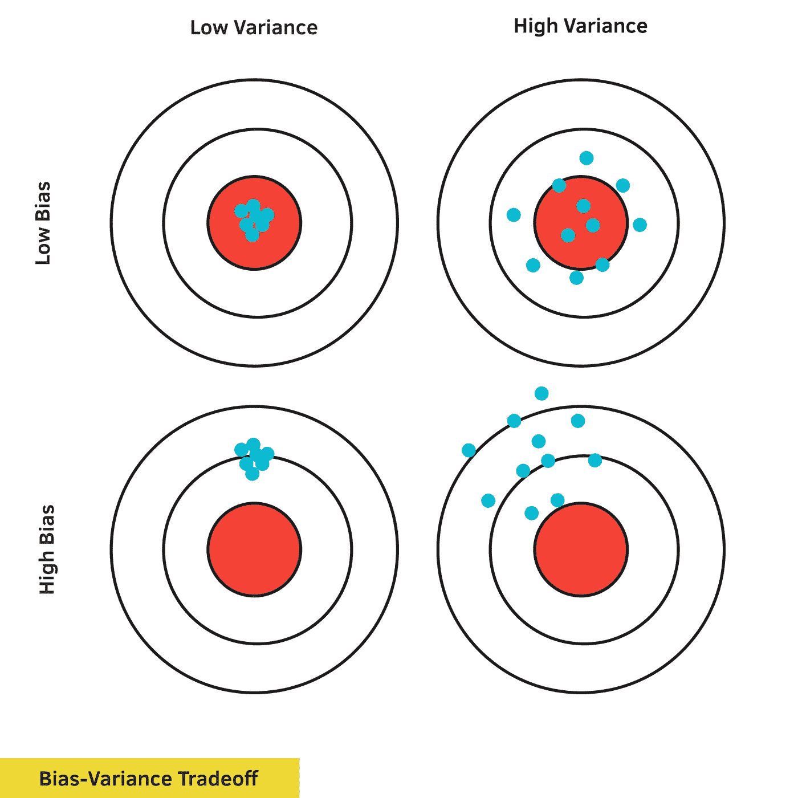
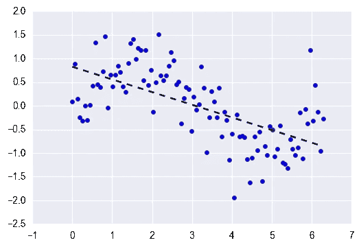

# 偏差-方差权衡

> 原文：<https://medium.com/analytics-vidhya/bias-variance-tradeoff-2b19a4926e7d?source=collection_archive---------7----------------------->

在机器学习中，**偏差-方差权衡**是一组预测模型的属性，具有较低偏差的模型在数据集上具有较高的参数方差，反之亦然。

为了清楚地理解这一点，我们来看看偏差和方差是什么意思。

## 什么是偏见？

*   偏差是由于机器学习算法过于简化而在模型中引入的误差。
*   这会导致不合身。当你在那时训练你的模型时，模型做出简化的假设，以使目标函数更容易理解。
*   ***偏差基本上就是你的模型的预期预测值和真实值之差。***

> 低偏差机器学习算法—决策树、k-NN 和 SVM
> 
> 高偏差机器学习算法—线性回归、逻辑回归

1.  **低偏差**:表示对目标函数形式的假设较少。
2.  **高偏差**:暗示关于目标函数形式的更多假设。

> 请参考本文，了解[过拟合和欠拟合模型](/analytics-vidhya/over-fitted-and-under-fitted-models-f5c96e9ac581)的含义。

## 什么是方差？

*   方差是由于复杂的机器学习算法而在您的模型中引入的错误，您的模型也从训练数据集学习噪声，并且在测试数据集上表现不佳。
*   它会导致高灵敏度和过度拟合。

> 低方差机器学习算法包括:*线性回归、线性判别分析和 Logistic 回归。*
> 
> 高方差机器学习算法有:*决策树、k 近邻和支持向量机。*

1.  **低方差**:建议随着训练数据集的改变，对目标函数的估计值进行小的改变。
2.  **高方差**:表示目标函数的估计值随着训练数据集的变化而发生较大变化。

> 通常，当您增加模型的复杂性时，您会看到由于模型中较低的偏差而导致的误差减少。然而，这种情况只会发生在特定的点上。随着您继续使您的模型变得更加复杂，您最终会过度拟合您的模型，因此您的模型将开始遭受高方差。

## 偏差、方差权衡:

任何监督机器学习算法的目标都是具有低偏差和低方差，以实现良好的预测性能。然而，你不能同时减少两者。

*   增加偏差会减少方差。
*   增加方差将减少偏差。

**但是可以用几个算法解决-**

1.  k-最近邻算法具有较低的偏差和较高的方差，但这可以通过增加 k 值来改变，k 值会增加对预测有贡献的邻域的数量，从而增加模型的偏差。
2.  支持向量机算法具有低偏差和高方差，但是这可以通过增加 C 参数来改变，该 C 参数影响训练数据中允许的违反裕度的数量，这增加了偏差但是减少了方差。

喜欢我的文章？请为我鼓掌并分享它，因为这将增强我的信心。此外，我每周日都会发布新文章，所以请保持联系，以了解数据科学和机器学习基础系列的未来文章。

另外，请务必通过 linkedIn 与我联系。

由[弗雷德里克·杜比蒙特](https://unsplash.com/@callmefred?utm_source=medium&utm_medium=referral)在 [Unsplash](https://unsplash.com?utm_source=medium&utm_medium=referral) 上拍摄的照片