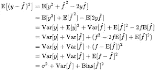

# 偏差-方差权衡

> 原文：<https://medium.com/analytics-vidhya/bias-variance-tradeoff-9ca44703bf7c?source=collection_archive---------17----------------------->

机器学习中的过拟合和欠拟合理论

*简要介绍偏差、方差、正则化以及如何选择正则化参数、过拟合和欠拟合的影响。*

我一直很难理解这个术语代表什么。但是，这很简单，每当我认为我遇到的只有一个定义高偏差导致欠拟合，高方差导致过拟合。有必要了解偏差和方差，因为它是设置超参数以解决问题的一个非常重要的概念。

在机器学习中，**偏差-方差权衡**是一组预测模型的属性，其中参数估计偏差较低的模型在样本间具有较高的参数估计方差，反之亦然。**偏差-方差问题**是试图同时最小化这两个误差源的冲突，这两个误差源阻止监督学习算法推广到它们的训练集之外

欠拟合——广义——过拟合
来源:coursera

# 什么是偏见？

**偏差**是模型做出的简化假设，使目标函数更容易逼近。它是你的模型的预测值和真实值之间的差异。它是预测值与原始值相差多远的量度。

高偏差会导致算法错过特征和目标输出之间的相关关系(欠拟合)。**偏差**是我们预测的准确性。高偏差意味着预测不准确

## 模型对训练数据的预测有多好？

*高偏差*:模型没有很好的预测训练数据。(训练数据的准确度低)。**原因:装配不足**

*低偏差*:模型很好的预测了训练数据。(列车数据的高准确性)

# 什么是方差？

**方差**是数据集中离差的度量。换句话说，它测量数据集的分布程度。

方差是如果使用不同的训练数据，目标函数的估计将改变的量。

*   该模型将训练数据的噪声和波动作为数据的潜在模式和概念来学习。
*   噪音和波动是训练集特有的
*   因此，当模型看到新数据时，它会失败。所以在测试数据上表现不佳。

## 学习模型对训练数据有多敏感？

*高方差*:改变训练数据可以彻底改变学习模型。该模型在测试数据上表现不佳。**原因:过拟合**

*低方差*:改变训练数据对学习模型影响不大。该模型在测试数据上表现良好。

偏差和方差的图示

从右下方(高偏差-高方差)到左上方(低偏差-低方差)，模型性能增加，即，

*   ***准确度增加***
*   ***不确定性减少***

通常，复杂模型具有高方差和低偏差，即具有更多参数的模型。

参数很少的模型具有低方差和高偏差，而参数较多的模型具有高方差和低偏差。

***偏差-方差***

*   ***偏差与方差是指模型的准确性与一致性。***

**欠拟合:**

*   欠拟合指的是既不能对训练数据建模也不能推广到新数据的模型。

当统计模型无法充分捕捉数据的底层结构时，就会出现欠拟合。欠拟合模型是这样一种模型，其中在正确指定的模型中会出现的一些参数或项丢失了。例如，当将线性模型拟合到非线性数据时，会出现欠拟合。欠拟合机器学习模型不是合适的模型，并且将是明显的，因为它在训练数据和测试数据上都具有较差的性能。

**以下方法也可用于解决装配不足的问题。**

1.  增加 ML 模型中参数的大小或数量。
2.  增加模型的复杂性或类型。
3.  增加训练时间，直到 ML 中的成本函数最小化。

**过度拟合:**

*   **过拟合**发生在模型或**机器学习**算法捕捉到数据的噪音时。

高方差模型非常重视训练数据，不会对以前没有见过的数据进行归纳。结果，这样的模型在训练数据上表现得非常好，但是在测试数据上有很高的错误率..过度拟合模型包含的参数比数据所能证明的要多。过度拟合是在不知不觉中提取了一些剩余的变化(噪声),好像这些变化代表了潜在的模型结构。

当模型开始记忆数据而不是学习从趋势中归纳时，就会发生过度拟合。

下面的方法也可以用来解决过度拟合的问题。

1.  减少 ML 模型中参数的大小或数量。
2.  手动或通过模型选择算法(降维)减少特征的数量
3.  **正规化**

**偏差-方差分解**是一种分析学习算法关于特定问题的预期泛化[误差](https://en.wikipedia.org/wiki/Generalization_error)的方法，它是三项之和，偏差、方差和一个称为*不可约误差*的量，由问题本身的噪声产生。

假设我们试图预测的变量是 y，特征是 x。

y=f(X) + err，其中 err 是误差项

我们把 f^(X)作为假设，所以期望平方误差是，

平方误差

通过进一步分解，

**总误差=偏差+方差+不可约误差**

学习曲线

*正规化*:

如果我们有太多的特征，学习的假设可能非常适合训练集

j(θ)=总和([h(x^i]-y^i]**2)趋向于零

但是如上所述，不能推广到新的例子。考虑一个度数为 4 的模型，

正则化成本函数 L(惩罚)

通过减少特征的数量，模型丢失了信息。所以用正则化。

*   保持所有特征，但是通过惩罚成本函数来减少参数的大小，并且使一些参数非常小，因此模型复杂度降低并且不容易过拟合。

λ(**λ)**是正则化超参数。应仔细选择**。****正则化参数**是对拟合参数的控制。

## **权衡取舍**

理想情况下，人们希望选择一个既能准确捕捉其训练数据中的规律性，又能很好地推广到看不见的数据的模型。不幸的是，通常不可能同时做到这两点。高方差学习方法可能能够很好地表示它们的训练集，但是有过度适应噪声或不具有代表性的训练数据的风险。相比之下，具有高偏差的算法通常会产生更简单的模型，这些模型不会过度拟合，但可能会对训练数据进行欠拟合，无法捕捉重要的规律。

**超参数** λ通过调整惩罚项的权重来控制这种权衡。如果λ是**增加**，模型复杂度对成本的贡献会更大。因为选择了最小成本假设，这意味着较高的λ将使选择偏向具有较低复杂性的模型。

训练误差-测试误差-总误差

Russel & Norvig 给出的成本函数:

**成本(h) =损失(h) +复杂度(h)**

**结论:**

偏差和方差的最佳平衡不会使通过调整超参数 lamdba(正则化参数)获得的模型过拟合或欠拟合。

因此，理解偏差和方差对于理解预测模型的行为至关重要。

获得通用模型的流程图

一个好的广义模型总是领先的，这就是为什么，在竞争中，在公共排行榜上名列前茅的人有时在私人排行榜上不名列前茅，而在公共排行榜上不名列前茅但广义良好的模型在私人数据上获得了很高的准确性。

偏差——方差。😀😉

快乐学习