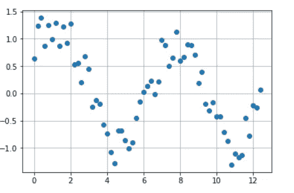
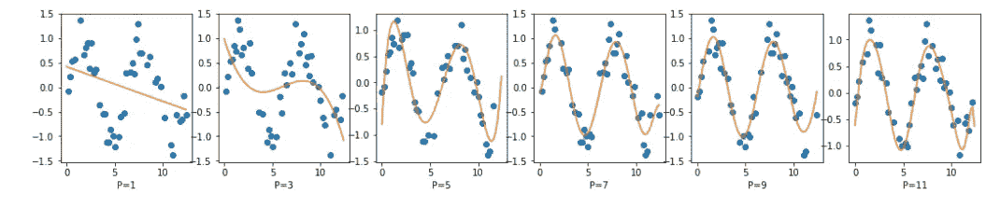
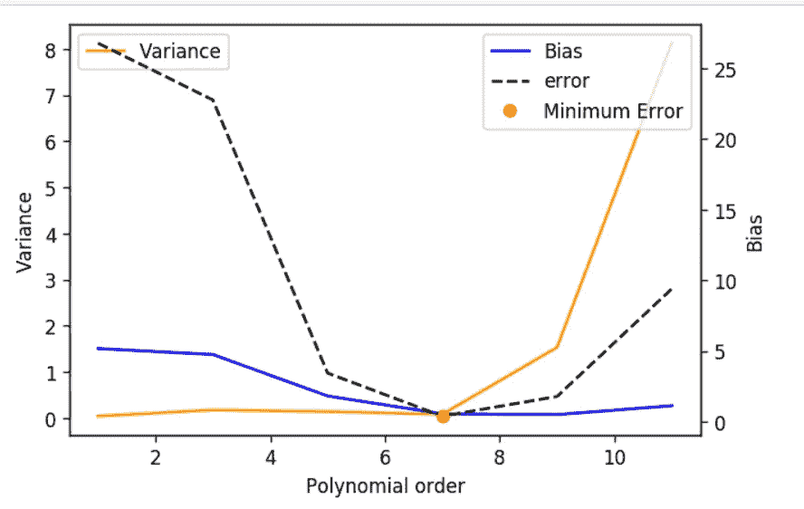

# 偏差与方差的权衡

> 原文：<https://medium.com/analytics-vidhya/bias-vs-variance-trade-off-99aa1acbe0ba?source=collection_archive---------37----------------------->

在这篇文章中，我试图解释两个关键术语，每个数据科学家都希望在决定训练模型时找到正确的平衡。在本文中，我们将浏览样本数据以及在训练模型和进行比较研究时偏差和方差的影响，并得出直观的结论。让我们开始吧。

# **偏置**:

正如我们所知，训练一个监督模型意味着给定的数据分布，其中生成数据的目标函数对我们来说是未知的。该模型旨在逼近目标函数，并产生接近数据中给出的实际/真实标签的输出。简单来说，偏差表示我们偏离真实值有多远。我们的目标是通过在训练过程中最小化损失函数来最小化偏差或误差。

损失函数公式如下:

```
MSE = np.mean(np.sum(y-y_hat)**2) for all i data points
MSE = Bias^2 + Variance + Irreducible error
```

这是最小化损失函数的基本均方误差。MSE 的另一个变量是偏差和方差。正如我们所见，误差取决于偏差和方差。为了减少误差，我们需要减少偏差和方差。然而，这样做有困难，我们将探讨如何克服这些困难。当我们浏览代码时，事情会变得更清楚。

**需要记住的要点**:偏差表示在最小化损失函数后，模型能够多好地预测输出未知数据的度量之一。

因此，高偏差表示不能依靠它对看不见的数据进行良好的模型预测。它未能捕获数据集中的输入特征与输出关系。在机器学习中，我们称之为欠拟合。

**出现欠拟合的场景:**

*   当我们只有很少的数据来建立一个精确的模型时，就会发生这种情况。
*   当我们试图用非线性数据建立线性模型或未能捕捉到相关关系时。
*   在这种情况下，我们有高偏差和低方差，并且使用简单。

**方差**:定义之一是——ML 模型在不同组训练数据之间的预测精度相对于整体训练精度的变化。它表示模型对数据波动的敏感性。简而言之，如果我们从相同的未知分布中抽取不同的训练集，对未知数据预测的预测应该不会有太大变化，但如果模型具有较高的方差，则差异会很大。这种差异就是我们所说的高方差。

高方差是什么意思？

该模型深入捕获训练数据的细节，而不是对以前没有见过的数据进行概括。因此，它在训练数据上表现良好(因为偏差较低)，但在测试数据上有较高的错误率。这种机器学习被称为过度适应。

**发生过度拟合的情况:**

*   数据有噪声，模型学习数据集中不重要的关系。
*   当我们建立一个复杂的模型，如决策树，高次多项式函数和神经网络
*   在这种情况下，我们有高方差和低偏差。为了减少过拟合，我们使用添加到损失函数中的正则化。这简化了模型的复杂性，模型本身是一个单独的话题，改天再讨论。

现在我们明白了，什么是极端“高方差和高偏差”理想情况“低偏差和低方差”，这实际上是不可能实现的，因为现实世界中的数据有噪声。所以我们需要做出权衡来建立一个好的模型。我们如何得到这样一个模型——让我们编码并理解症结所在。

# 生成数据:

```
**def** gen_data(x):
  b = 0.4
  y_og = np.sin(x) + np.exp(-x**2)
  y_noise = t + np.random.uniform(-b,b,len(x))
  **return** y_noisex = np.arange(0,4*np.pi,0.2)
y_orig = gen_data(x)

plt.plot(x,y_orig,'o')
plt.grid()
```



生成的总数据量

# 采样数据:

在这个代码片段中，如前所述，为了计算方差，我们随机抽取一个训练集样本，并拟合 p_val 变量中传递的多项式次数的数据。用多度拟合数据并不总是正确的，它取决于数据分布。在这里，保利最适合伪造数据。

接下来，我们预测原始数据并存储在 y_pred 中，我们将使用它来计算偏差和方差，因为我们在 y_orig 中有原始输出标签值可以与之比较。对于不同的多项式阶和给定的 num_trails，该过程继续进行。

```
**for** j **in** range(num_trials):
   x_sub, y= get_rand_subsets(0.7, x, y_orig)
   p = np.poly1d(np.polyfit(x_sub, y, p_val))
   P.append(p)
   y_pred = y_pred + p(x)
```

经过所有的计算，我们得到了这样的图形。



用不同的多项式次数拟合数据

***观察:***

左边简单的线性线似乎对数据进行了欠拟合，因为偏差很大。随着我们增加 poly 顺序，我们可以看到它试图学习数据，从而减少了偏差，但增加了方差。在最右边，我们可以说模型过度拟合了。在每种情况下，我们计算发生的误差，并在以后用于绘图。

# 偏差和方差计算:

```
#Bias
y_pred = y_pred/num_trials
bias = np.linalg.norm(y_pred-y_orig)
biases.append(bias)#Variance
**for** j **in** range(num_trials):
  p_t = P.pop(0)
  var = var + np.square(p_t(x)-y_pred)var = var/num_trials
variance = np.linalg.norm(var)
variances.append(variance)
```

在这段代码中，我们获得了所有训练集的 y_pred 的平均预测值，并计算了原始标签值的缺失值，以获得给定多边形阶数的偏差。

对于方差，我们检查每个试验/训练集偏离均值预测的程度，并存储给定多边形顺序的总体方差。

# **剧情与直觉:**



权衡图

正如之前在误差公式中看到的，我们可以观察到 7 阶多边形似乎是一个很好的拟合，其中误差、偏差和方差最小，并且模型处于稳定状态。

因此，适当选择适当模型的优点是:

*   防止训练复杂模型。
*   对看不见的数据进行归纳
*   由于我们的模型已经达到最小误差，我们有信心获得更好的准确性/预测。

# 结束:

这是我试图用更简单的方式来解释这个概念。我感谢 Chinmay Hedge 教授(NYU 坦登工程学院)通过代码展示的工作，更直观地解释了这个概念。

代码可在[https://github.com/Darshansol9/Bais_Vs_Variance](https://github.com/Darshansol9/Bais_Vs_Variance)找到

请随意评论，如果你喜欢这篇文章，请给我 hifi。

感谢您的阅读！

参考文献:

[](https://towardsdatascience.com/understanding-the-bias-variance-tradeoff-165e6942b229) [## 理解偏差-方差权衡

### 每当我们讨论模型预测时，理解预测误差(偏差和方差)是很重要的。有一个…

towardsdatascience.com](https://towardsdatascience.com/understanding-the-bias-variance-tradeoff-165e6942b229)