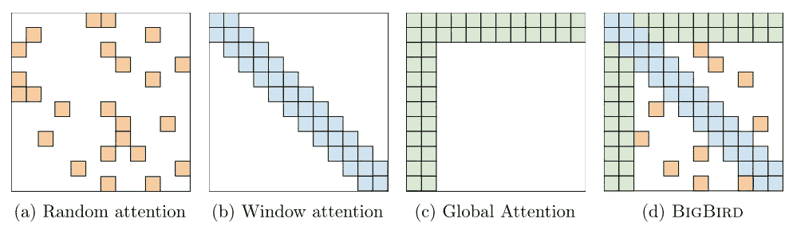
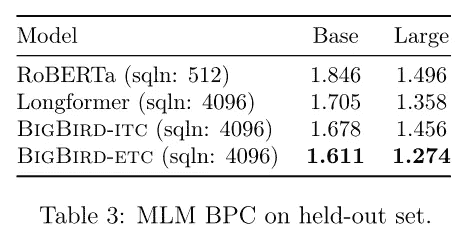
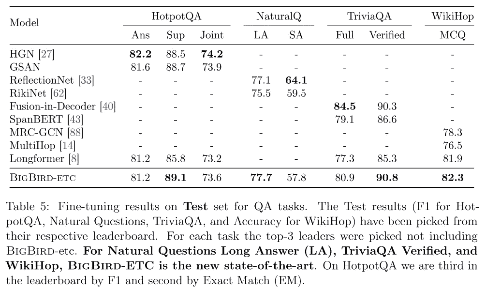
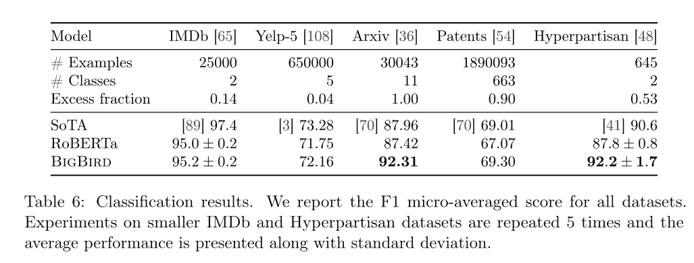
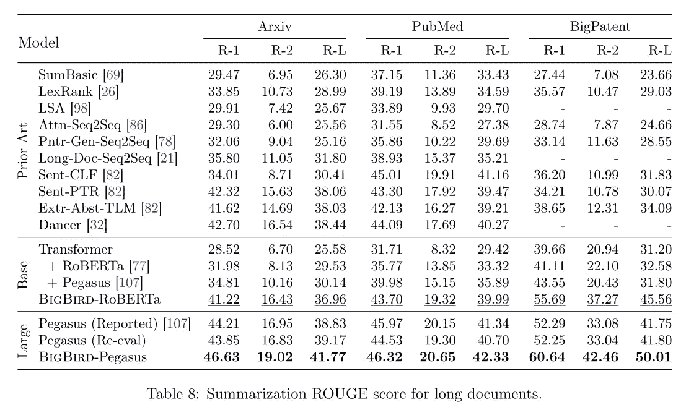

# 大鸟:更长序列的变形金刚——2020

> 原文：<https://medium.com/analytics-vidhya/big-bird-transformers-for-longer-sequences-2020-8adac1a01448?source=collection_archive---------17----------------------->

总结。通过稀疏注意力改进 Transformer 来利用更长的序列。

原文(和更好的乳胶)位于:[https://atakanokan . com/paper summaries/2020-big-bird-transformers-for-longer-sequences/](https://atakanokan.com/papersummaries/2020-big-bird-transformers-for-longer-sequences/)

# 信息

链接: [Arxiv](https://arxiv.org/abs/2007.14062)

论文作者:谷歌研究

这篇论文为什么重要？:解决了传统注意机制的二次记忆依赖性，提出了可以处理较长序列的稀疏注意。

代码:NA

# 摘要

本文通过引入稀疏注意机制，解决了 Transformer 模型使用完全注意的局限性，稀疏注意机制使用与序列长度成线性比例的内存。

# 投入

从\(\textbf{x}\)开始，这是标记化的输入序列(通过经典的空格分隔、字节对编码或单词块等)。):

\[\textbf{x} = (x_{1}，。。。，x_{n})\]

其中\(x_{1}\)对应于第一个令牌。\(n\)是序列长度。

# 稀疏的注意力

\(D\)是一个有向图，其顶点集为\([n] = {1，…，n}\)，其中有向边表示包含注意机制的内积。\(N(i)\)表示\(D)中节点\(i\)的外邻居集。

\(i^{th}\)注意机制的输出向量是:

\[Attn _ { d }(x)_ { I } = \ textbf { x } _ { I }+\sum_{h=1}^{h} \西格玛(q_{h}(\textbf{x}_{i}k_{h}(\textbf{x}_{n(i)})^{t})\ cdot v _ { h }(\ textbf { x } _ { n(I)}))\]

其中\(Q_h\)是查询函数，而\(K_{h}\)是键函数，而\(V_{h}\)是值函数。\(\sigma\)是一个评分函数(softmax 或 hardmax)。\(H\)是多头注意力模块中的头数。

Matrix \(A\) (attention matrix)是一个二进制值\(n\)x\(n\)矩阵，其中如果 query \(i\)关注 key \(j\)，则矩阵(A(i，j)=1\，否则为零。当 A 全是 1 时，它就是传统的完全注意机制。由于每个令牌都关心其他令牌，所以内存需求是二次的。

稀疏注意力由以下三个部分的合并组成(如图 1 所示):

**随机关注**

每个查询涉及超过\(r\)个随机键。数学上，\(A(i，\cdot) = 1\)表示\(r\)个随机选择的密钥。

**(滑动)窗口注意**

在 NLP 数据中存在大量的引用局部性，即关于一个令牌的信息可以从它的相邻令牌中导出。为了利用这一点，BigBird 使用了宽度为(w)的滑动窗口注意力。位置\(i\)处的查询涉及从\(i — w/2\)到\(i + w/2\)键。数学上，\(A(i，i-w/2:i+w/2) = 1\)。

**全球关注**

全局令牌是关注序列中所有令牌以及所有令牌关注谁的令牌。BigBird 以两种方式利用这个全局令牌概念:

*   BIGBIRD-ITC(内部转换器构造):使一些现有的令牌“全局化”，并使它们参与整个输入序列。
*   BIGBIRD-ETC(扩展的变压器构造):添加\(g\)附加的“全局”令牌(例如 CLS)来处理所有现有的令牌。这将矩阵\(A\)的列和行扩展了\(g\)行/列。

# 结果

稀疏注意力使得该机制能够关注 8 倍长的序列。可以使用梯度检查点来处理 8 倍以上的长序列。以下是 NLP 任务的结果。省略了基因组学相关的结果。

## 预训练和 MLM

## 仅编码器任务

**问题回答**

BigBird-ETC 优于所有其他型号。

**文档分类**

提高 SotA % 5 点。

## 编码器-解码器任务

当也使用飞马座预训练时:

*原载于 2020 年 8 月 24 日 https://atakanokan.com***。**