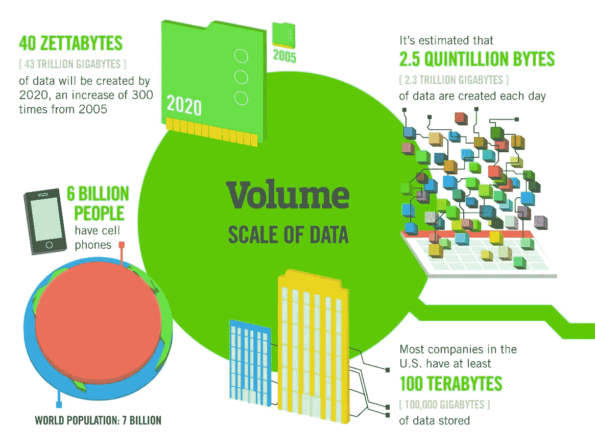
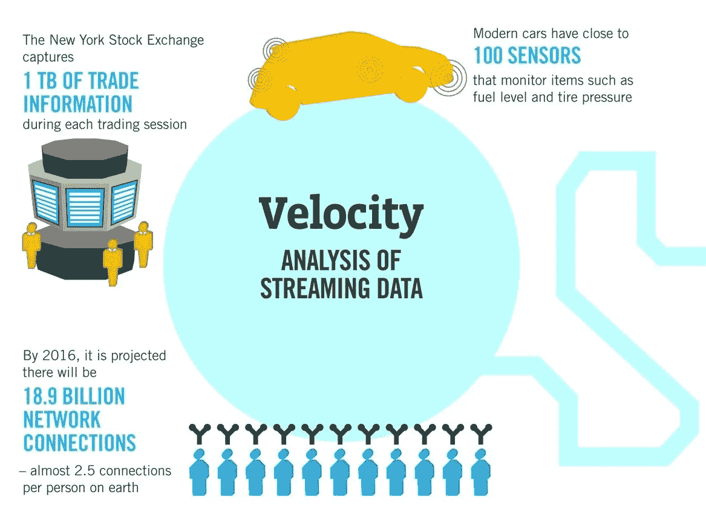
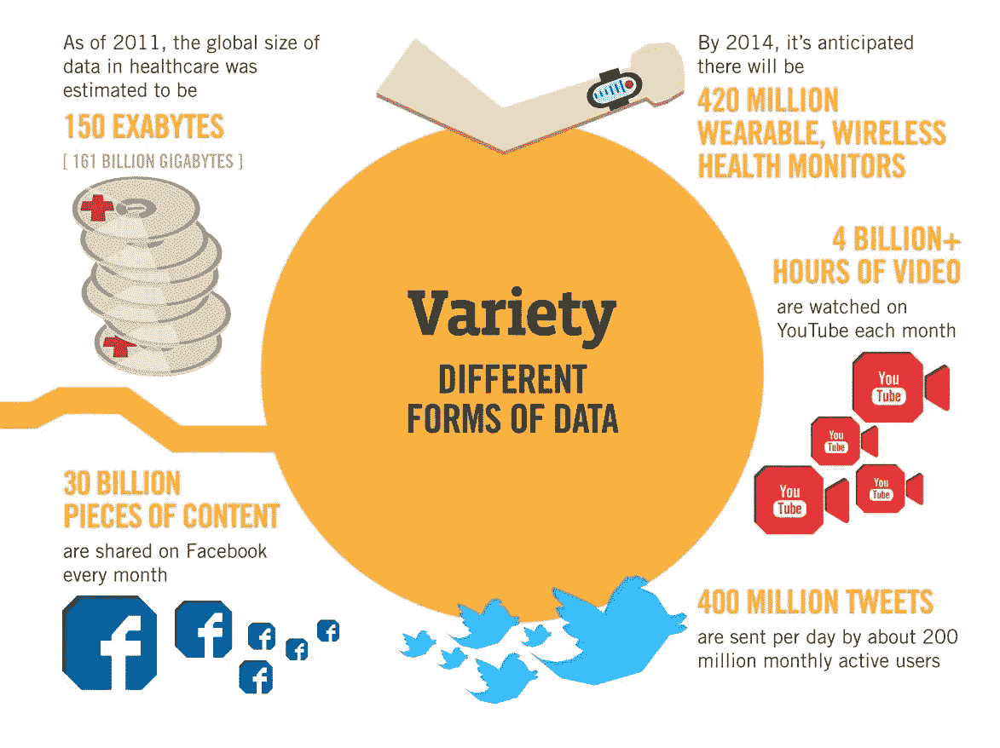
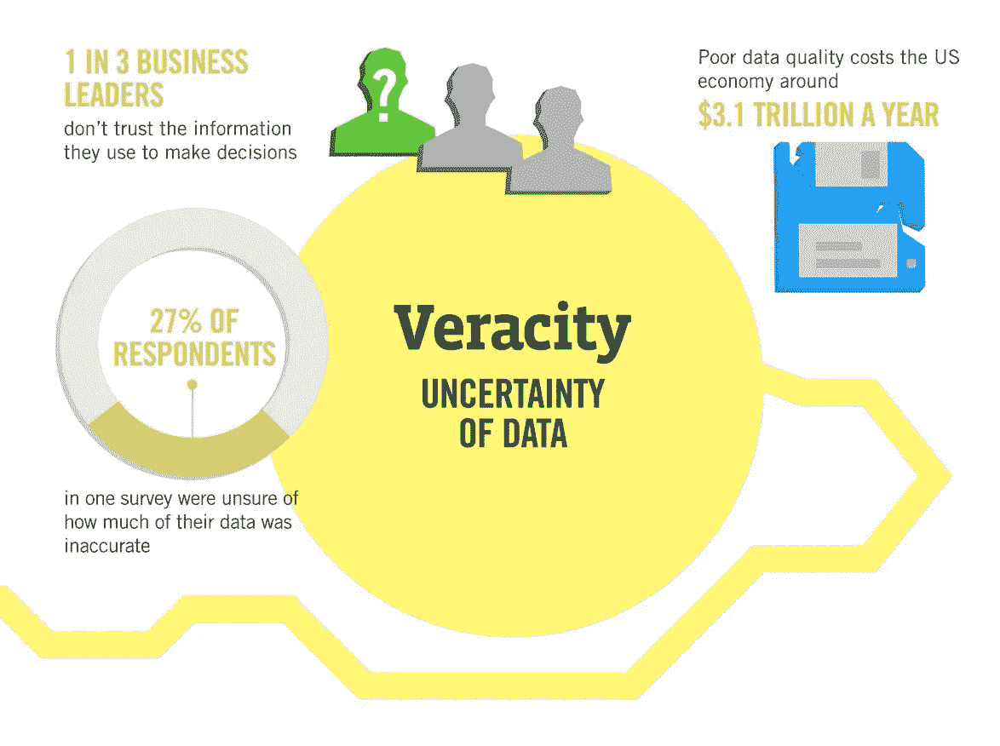

# 大数据的 3 V 和 5 V

> 原文：<https://medium.com/analytics-vidhya/big-data-3-vs-and-5-v-s-c1cae2a6d311?source=collection_archive---------2----------------------->

## 系列 2

## 大数据主要建立在五个支柱上，即数量、速度、多样性、准确性和价值。这些支柱在 3 V 和 5 V 架构中有简要描述。

> “准确和必要的数据，具有实时信息的巨大价值，有助于做出正确的决策。”
> 
> -舒巴姆·拉吉普特

多梅尼科·洛亚在 [Unsplash](/s/photos/laptop?utm_source=unsplash&utm_medium=referral&utm_content=creditCopyText) 上拍摄的照片

## 定义:

大数据是指海量数据，包括通过流或任何能够实时处理的传输方式捕获、生成或共享的各种类型的数据。

[*——舒巴姆·拉吉普特*](https://medium.com/u/7623ff4eaa5a?source=post_page-----c1cae2a6d311--------------------------------)

## 概念:

大数据就是这个世界上存在的所有数据，例如，有人在脸书上发布了一个视频，有人发布了一张图片/照片，有人在互联网上做简报，有人正在与他/她最喜欢的人聊天，甚至是你现在直接或间接看到或听到的这段文字。通过对大数据的处理，我们可以预测特定事物的行为结果。

照片由 [Lukas 在 Pexels](https://www.pexels.com/photo/person-writing-on-notebook-669615/)

最近，我们研究大数据的定义和概念。现在，问题是“如何识别大数据？”要探索这个问题的答案，请参考以下段落。

大数据的特征被归类为各种类型的 V 的概念。V 的主要类型是 3 V 和 5 V，它们简单地展示了大数据的支柱。为了识别大数据，有必要获得以下特征。这是理解“什么是大数据”和“如何识别大数据”的非常有效的方法。

> “大数据主要基于五大支柱，即数量、速度、多样性、准确性和价值。这些支柱在 3 V 和 5 V 架构中有简要描述。”

照片由 [rawpixel](https://burst.shopify.com/@rawpixel?utm_campaign=photo_credit&utm_content=Free+Stock+Photo+of+Business+Meeting+Over+Coffee+%E2%80%94+HD+Images&utm_medium=referral&utm_source=credit) 从[连拍](https://burst.shopify.com/presentation?utm_campaign=photo_credit&utm_content=Free+Stock+Photo+of+Business+Meeting+Over+Coffee+%E2%80%94+HD+Images&utm_medium=referral&utm_source=credit)

以下段落演示了 3 V 和 5 V:

## 3 个 V:

3 V 包含大数据的 3 个主要特征。这些特征是体积、速度和多样性。每个关键字都是不言自明的。每个*特征展示了独立的物理和逻辑属性。

由作者编辑/创建

**1)音量:**

> 一、在大数据中，量是具有庞大形式的庞大数据集。
> 
> 二。该卷描述了大量的数据，这些数据非常复杂，需要进一步处理才能从中提取有价值的信息。
> 
> 三。体积不描述实际大小授予它作为大数据，它有相对较大的大小。大小可以是太字节、艾字节甚至是吉字节。
> 
> 四。大数据的规模使它难以处理。

由[马库斯·斯皮斯克](https://unsplash.com/@markusspiske?utm_source=unsplash&utm_medium=referral&utm_content=creditCopyText)在 [Unsplash](/s/photos/binary?utm_source=unsplash&utm_medium=referral&utm_content=creditCopyText) 上拍摄的照片

> **数据测量行:**
> 
> 1.比特是八分之一字节
> 
> 2.字节:1 字节
> 
> 3.千字节:1 千或 1，000 字节
> 
> 4 .兆字节:一百万或 1，000，000 字节
> 
> 5 .十亿字节:10 亿或 10 亿字节
> 
> 6.万亿字节:1 万亿，即 10 亿字节
> 
> 7.千万亿分之一，即 10 亿字节
> 
> 8.十亿字节:十亿分之一，即 10 亿字节
> 
> 9.一个六次方或 10 亿分之一
> 
> 10.十亿字节:十亿分之一，即 10 亿字节
> 
> 例如:世界每天产生 2.5 万亿字节的数据。

**2)速度:**

> I .在大数据中，速度主要表现为两件事:
> 
> (1)数据增长速度(2)数据传输速度
> 
> 二。速度是指数据在资源中以特定的速度生成、增长和共享。

由作者编辑/创建

> **三。数据增长速度:**
> 
> 通过各种资源，数据与日俱增。下面解释了一些资源，
> 
> **物联网(IOT):** IOT 在大数据方面贡献突出。它通过放置在自动车辆中的 IOT 设备、数字 IOT 灯泡、基于 IOT 的机器人等产生数据。
> 
> **社交媒体:**如你所见，社交媒体上的用户与日俱增，以至于他们产生了大量的数据。
> 
> 例如许多其他资源，它们以如此高的速度生成数据。
> 
> **四。数据传输速度:**
> 
> 速度在识别大数据方面也起着重要作用。
> 
> 大数据以快速方式增长，这使得快速处理变得非常复杂，并且难以通过光纤或电磁传输方式快速传输。
> 
> 因此，这一项对于证明速度非常重要。
> 
> 例如:Twitter 每天生成 5 亿条推文，数据生成速度和数据传输速度非常快。

**3)品种:**

> 一、在大数据中，多样性无非是不同类型的数据。
> 
> 二。这个术语演示了各种类型数据，如文本、音频、视频、XML 文件、行和列中的数据等。
> 
> 三。每种类型的数据都有不同的处理方式，因此，有必要对不同类型的数据进行分类。
> 
> 四。在大数据中，数据主要分为以下三种类型:

由作者编辑/创建

> **a .结构化数据:**采用关系数据库格式，并以行列格式进行了适当结构化的数据称为结构化数据。
> 
> **b .非结构化数据:**包括音频、视频、XML 文件、word 文件等各种类型的数据。并且没有以正确的格式组织，那么它就被称为非结构化数据。
> 
> **c .半结构化数据:**半结构化数据是不言自明的，它是非完全结构化或非结构化的数据。在其中，数据是部分结构化的，并混合有非结构化格式的数据。
> 
> 举例来说:社交媒体包含巨大人物的照片、视频和文本。这个数据无非就是大数据，可以是良构的，也可以是非结构化的，也可以是半结构化的。

3 V 的概念解释了大数据的基本架构，但 5 V 的概念满足了一些更多的要求，使其得到很好的展示。以下段落解释 5 V 概念的架构。

## 5 V 的:

5 V 的包含量，速度，多样性，可变性和价值。所以简单来说 5 V 的概念就是“5 V 的= 3 V 的+准确性+价值”。准确性和价值描述如下:

由作者编辑/创建

**4)准确性:**

> 一、真实性是指真实数据的准确性、意义性和确认性。
> 
> 二。从大量不同类型的数据中提取正确的信息/数据是非常困难的。
> 
> 三。准确性是大数据处理中非常重要的术语，因为任何不准确、虚假和无意义的数据都会导致收入或所需结果的损失。
> 
> 四。因此，有必要从大数据中提取真实数据。
> 
> 例如:社交媒体上的过时数据不会预测未来的结果，因此数据具有准确性是非常必要的。

照片由 [NeONBRAND](https://unsplash.com/@neonbrand?utm_source=unsplash&utm_medium=referral&utm_content=creditCopyText) 在 [Unsplash](/s/photos/value?utm_source=unsplash&utm_medium=referral&utm_content=creditCopyText) 上拍摄

**5)值:**

> 一、大数据最重要的支柱是价值。
> 
> 二。如果数据的存在没有价值，意味着如果提取的数据不能从自身获得有价值的信息，那么它肯定不属于大数据的范畴。
> 
> 三。准确且必需的数据具有巨大的价值，有助于做出正确的决策。
> 
> 例如:如果数据是实时的、准确的，并且满足客户正确预测结果的要求，那么它为客户预测产生了更高的成本。

大数据展示了更多的 V，但是 3 V 和 5 V 的概念也简单地描述了它。因此，在本章中，我们使用 3 V 和 5 V 的概念研究了大数据的体系结构。

## 结论:

*   通过研究，我们找到了“如何识别大数据”这个问题的答案使用 3 V 和 5 V 的概念。
*   大数据主要建立在五个支柱上，即数量、速度、多样性、准确性和价值。这些支柱在 3 V 和 5 V 架构中有简要描述。

***作家:*** *舒巴姆·b·拉吉普特*

***领英:***[*www.linkedin.com/in/shubhamrajput0369*](http://www.linkedin.com/in/shubhamrajput0369)