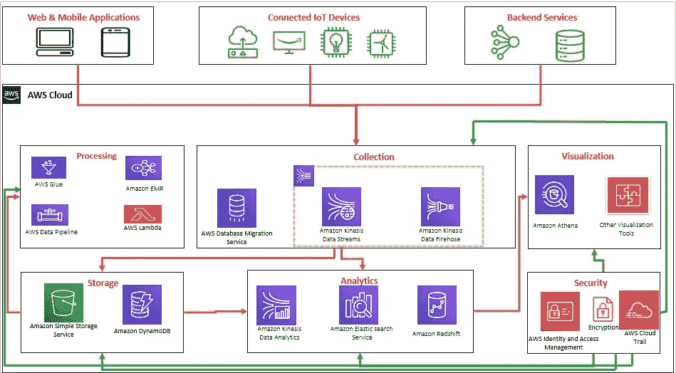
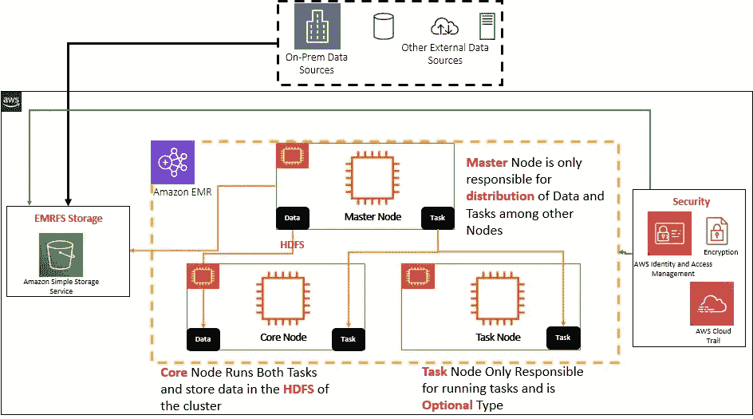
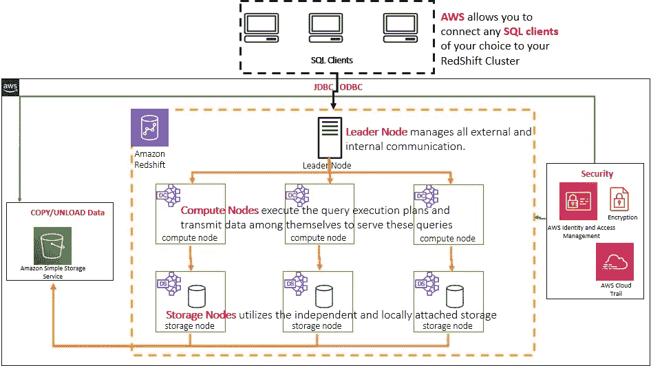
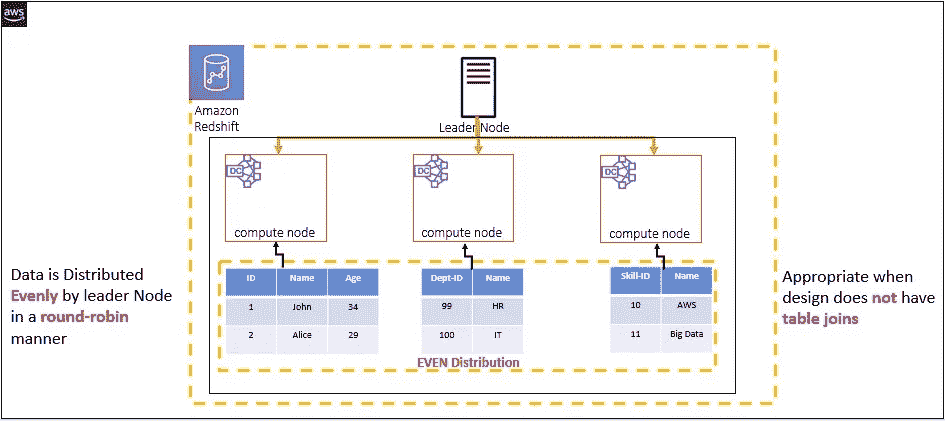
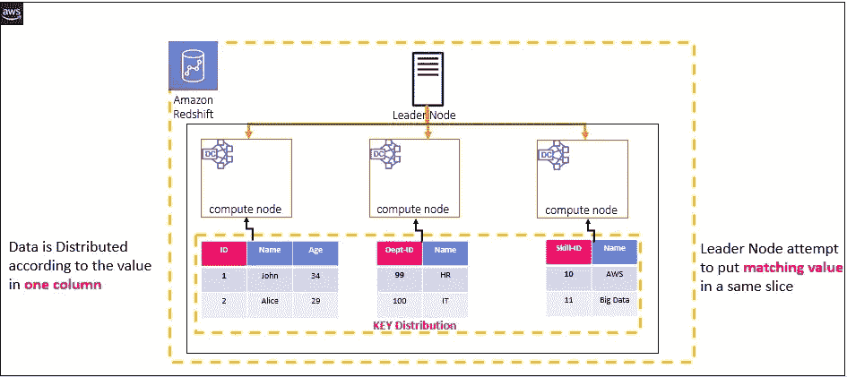
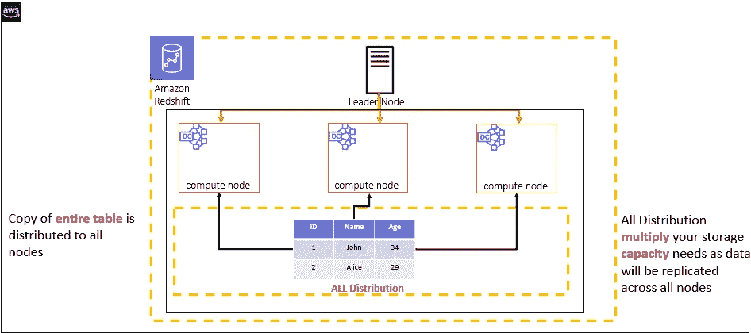

# 大数据和云—完美结合！

> 原文：<https://medium.com/analytics-vidhya/big-data-and-cloud-a-perfect-combination-56c01d65e0e2?source=collection_archive---------24----------------------->

全球各地的企业都在快速采用大数据功能来提取可操作的洞察力，以帮助其业务快速增长并满足其客户潜力，从而确保为客户提供长期价值。

如今，大数据不再是热门话题，而是企业必须将其纳入技术环境，作为业务框架的一部分。

大数据是一种高容量、高速度和/或高多样性的信息资产，需要经济高效、创新的信息处理形式，以增强洞察力、帮助企业制定决策和实现业务流程自动化。大数据有利于企业利用新的机会，最大限度地降低风险，并降低成本。

随着云计算及其灵活性的出现，企业正在快速向云迁移，将其作为支持大数据项目的首选平台。

亚马逊网络服务(AWS)为大数据提供了广泛的完全集成的服务，可以帮助企业在 AWS 上构建、保护和部署大数据项目。

AWS 大数据—逻辑架构

在下面的博客中，我将讨论一些关键领域及其高级逻辑和集成架构。

**亚马逊电子病历**

Amazon EMR 是一个 web 服务，它提供了一个托管框架，以一种简单、经济、安全的方式运行数据处理框架，如 Apache Hadoop、Apache Spark 和 Presto。

让我们以一家研究公司为例，该公司负责为其合作伙伴进行市场研究，并向他们提供建议和总结报告。公司希望建立一个庞大的机器学习计划，使用人工智能来分析来自不同来源的数据。对于上述业务能力，组织需要大量的基础架构资源来处理、训练数据、输出数据等。他们需要服务器、在线存储、网络和安全性来部署框架。

相反，Amazon EMR 提供托管服务作为云计算资源，用于处理 Pb 级的数据。这将使组织能够在不干扰运营管理部分的情况下供应 EMR 群集。

AWS — EMR 高层架构

Amazon EMR 和 Hadoop 提供了各种文件系统，您可以在处理集群步骤时使用它们。您可以通过用于访问数据的 URI 前缀来指定要使用的文件系统。例如，s3://aws-s3-bucket1/path 使用 EMRFS 引用亚马逊 s3 桶。

- **Hadoop 分布式文件系统(HDFS)** : HDFS 是一个面向 Hadoop 的分布式、可扩展、可移植的文件系统。使用 HDFS 的优势在于，它知道管理集群的 Hadoop 集群节点和管理单个步骤的 Hadoop 集群节点之间的**数据**。HDFS 有一个前缀，如 hdfs://(或者没有前缀)。任务节点不使用 HDFS，因为任务节点不存储任何数据。只有主节点和核心节点负责并存储数据。HDFS 有速度优势。它也有一个缺点，即它是一种短暂的存储，当集群结束时会被回收。HDFS 文件系统最适合缓存需求。

- **EMRFS** : EMRFS 允许集群直接从 S3 访问数据。它有一个前缀 S3:// EMRFS 提供了在亚马逊 S3 中存储持久数据的便利，以便与 Hadoop 一起使用，同时还提供了一些功能，如亚马逊 S3 服务器端加密、写后读一致性和列表一致性。

- **本地文件系统**:本地连接的磁盘被称为本地文件系统。在 EC2 实例的生存期结束后，这些本地磁盘上的数据不再持续。它仅用于需要持久化以满足临时需求的数据。

**亚马逊电子病历的优势**

以下是亚马逊 EMR 的优势

**易于使用**—Amazon EMR 易于使用，即易于设置集群、Hadoop 配置、节点供应等。

**可靠**—可靠是指它会重试失败的任务，并自动替换表现不佳的实例。

**弹性**—亚马逊 EMR 允许计算大量实例来处理任何规模的数据。它很容易增加或减少实例的数量。

**安全**—它自动配置 Amazon EC2 防火墙设置，控制实例的网络访问，在 Amazon VPC 中启动集群等。

**灵活**—它允许完全控制集群和对每个实例的根访问。它还允许安装额外的应用程序，并根据需要定制您的集群。

**性价比高**——价格容易估算。它对使用的每个实例按小时收费。

**Amazon RedShift:**Amazon RedShift 是一款完全托管的 Pb 级云数据仓库产品，专为大规模数据集存储和分析而设计。Redshift 面向列的数据库旨在连接到基于 SQL 的客户端和商业智能工具，使用户可以实时获得数据。基于 PostgreSQL 8，Redshift 提供了快速的性能和高效的查询，帮助团队做出合理的业务分析和决策。

AWS —红移高级架构

每个 Amazon Redshift 数据仓库都包含一个集群中的计算资源(节点)集合。每个红移集群都运行自己的红移引擎，并且至少包含一个数据库。

**领导节点**:

-解析器和重写器

-规划者和优化者

-任务调度程序

- WLM 使用户能够管理工作负载内的优先级

**计算节点**:

-查询执行过程

-备份和恢复过程

-复制过程

-本地存储

o 磁盘

o 切片

o 表格

*   列
*   阻碍

**AWS 红移分布样式:**

当您将数据加载到表中时，Amazon Redshift 会根据表的分布样式将表中的行分布到每个节点片上。在选择分布方式时，目标是均匀地分布数据，并在查询执行期间最小化数据移动。

## ***均匀分布***

AWS 红移-均匀分布

leader 节点以循环方式将行分布在各个片上，而不考虑任何特定列中的值。当表不参与连接时，或者在键分布和所有分布之间没有明确的选择时，均匀分布是合适的。

**密钥分发**

AWS 红移—密钥分布

行根据一列中的值分布。领导节点将匹配值放在同一节点片上。如果您在连接键上分布一对表，那么 leader 节点将根据连接列中的值来排列片上的行，以便来自公共列的匹配值在物理上存储在一起。

**所有分配**

AWS 红移-所有分布

整个表的副本被分发到每个节点。均匀分布或键分布只将表的一部分行放在每个节点上，而所有分布确保表参与的每个连接的每一行都是并置的。

**亚马逊红移的好处:**

**异常快速—** 在加载数据和查询数据以进行分析和报告时，Redshift 非常快。Redshift 拥有大规模并行处理(MPP)架构，允许您以极快的速度加载数据。此外，使用这种架构，Redshift 可以跨多个节点分布和并行化您的查询。
Redshift 为您提供了使用密集计算节点的选项，这些节点是基于 SSD 的数据仓库。使用它，您可以在很短的时间内运行最复杂的查询。

**高性能—** 如前一点所述，Redshift 通过大规模并行、高效数据压缩、查询优化和分布获得了高性能。MPP 支持 Redshift 并行执行数据加载、备份和恢复操作。此外，您执行的查询分布在多个节点上。Redshift 是一个列存储数据库，针对大量重复类型的数据进行了优化。使用列存储大大减少了磁盘上的 I/O 操作，从而提高了性能。Redshift 为您提供了一个为数据压缩定义基于列的编码的选项。如果用户没有指定，redshift 会自动分配压缩编码。数据压缩有助于减少内存占用，并显著提高 I/O 速度。

**水平可伸缩—** 可伸缩性对于任何数据仓库解决方案来说都是至关重要的一点，而 Redshift 在这方面做得非常好。红移是水平可伸缩的。每当您需要增加存储或需要它运行得更快时，只需使用 AWS 控制台或集群 API 添加更多节点，它就会立即升级。在此过程中，您的现有集群仍可用于读取操作，因此您的应用程序不会中断。在扩展操作期间，Redshift 在新旧集群的计算节点之间并行移动数据。因此使得过渡能够尽可能平稳和快速地完成。

**海量存储容量—** 正如数据仓库解决方案所预期的那样，红移提供了海量存储容量。一个基本的设置可以给你一个 Pb 范围的数据存储。此外，Redshift 让您可以选择密集存储类型的计算节点，这些节点可以使用硬盘驱动器以非常低的价格提供大存储空间。您可以通过向您的集群添加更多节点来进一步增加存储，并且它可以远远超出 Pb 的数据范围。

**SQL 接口** — Redshift 查询引擎基于 ParAccel，ParAccel 具有与 PostgreSQL 相同的接口，如果你已经熟悉 SQL，开始使用 Redshift 的查询模块不需要学习很多新技术。因为 Redshift 使用 SQL，所以它可以与现有的 Postgres JDBC/ODBC 驱动程序一起工作，可以轻松连接到大多数商业智能工具。

**安全** —亚马逊红移配备了各种安全功能。有一些选项，如用于网络隔离的 VPC、处理访问控制的各种方法、数据加密等。数据加密选项在 Redshift 的多个地方可用。要加密存储在集群中的数据，您可以在启动集群时启用集群加密。此外，要加密传输中的数据，您可以启用 SSL 加密。从 S3 加载数据时，redshift 允许您使用服务器端加密或客户端加密。最后，在加载数据的时候，S3 或红移复制命令分别处理解密。

亚马逊红移集群可以在你的基础设施内部启动虚拟私有云(VPC)。因此，您可以定义 VPC 安全组来限制对红移集群的入站或出站访问。

使用 AWS 强大的访问控制系统，您可以授予特定用户权限或维护特定数据库级别的访问权限。此外，您甚至可以定义用户和组来访问表中的特定数据。

> **更多来了！**