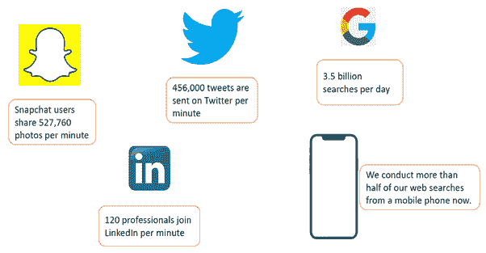
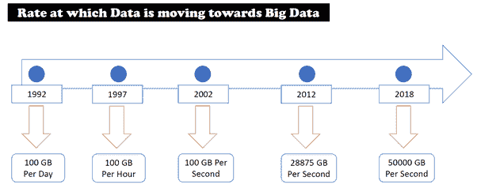
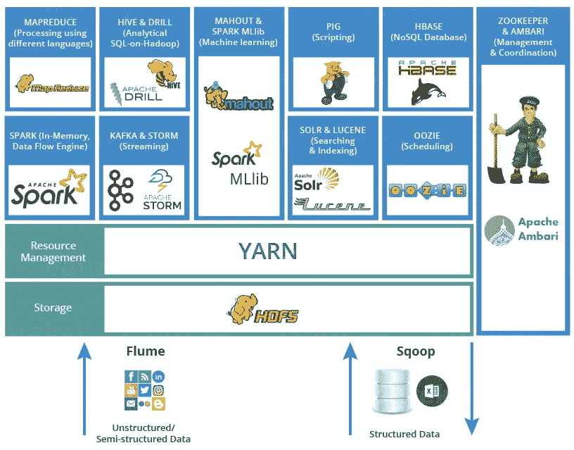

# 什么是大数据以及所有 Hadoop 技术的简要介绍:

> 原文：<https://medium.com/analytics-vidhya/big-data-and-hadoop-918f8a13f3f0?source=collection_archive---------17----------------------->

大数据通常被认为是需要存储和处理的海量数据。海量的不同品种的数据都可以认为是大数据。数据正以前所未有的速度改变着我们的世界和生活方式。大数据是通过处理大量相关数据来分析和预测人类和机器行为的新科学。大数据是指结构化、半结构化和非结构化数据量的快速增长。据估计，2019 年每秒将产生 50，000 GB 的数据。当今的企业正在生成大量数据，这些数据主要有 3 个属性:

卷:—数据的大小，我们这里指的是 GB 和 TB
速度:—数据生成的速率
种类:—来自多个来源和多种类型的数据

传统框架无法处理这种增加的复杂性，因此 Hadoop(不是唯一的解决方案)Hadoop 是一种并行处理编程框架，在 MapReduce 中工作。Apache Hadoop 是处理大数据的工具之一。它是运行在商用硬件上的开源软件框架。

**我们为什么要讨论 Hadoop？**

*   我们之所以这么说，是因为在 hadoop 框架上，我们可以存储任何类型的数据，无论是结构化、半结构化还是非结构化数据，都可以存储在 Hadoop 分布式文件系统[HDFS]层中。
*   Apache hadoop 是开源的，这意味着你在商业使用时不需要支付许可费。
*   Apache Hadoop 运行在商用硬件上，这意味着您不需要依赖单一供应商。您可以选择任何供应商，他们以低成本提供基础架构。
*   考虑一个问题，你需要计算一本 5 磅重的书的字数。对一个人来说是非常困难的，但是如果你撕开书页，分发给几百个人。每个人将计算他们“页面”中的字数，然后你可以简单地合计每个人的字数，很快就可以算出总字数。

**为什么用 Hadoop 做实时例子？**

假设您有一个非常大的文件(例如 50 gb 的日志文件),您想解析它，对它进行一些过滤并查看结果。有哪些选择？

1.如果你有一台 ram 超过 64 gb 的计算机(假设额外的 16 gb 将用于操作系统和其他进程),你可以写一些代码来完成它。仍然会超级慢。如果文件更大(Pb 级)，这甚至是不可行的。目前还没有 petabye 规模的内存

2.将文件解析成较小的文件(可能有 10000 个文件，每个文件都以兆字节为单位)并按顺序读取它们

3.使用方法 2，但使用多线程，每个线程读取一个较小的文件，最后合并线程并计算结果

Hadoop 只是第三步，只是与分布式计算有点关系。你有一堆电脑。其中一台计算机为主节点，其余为从节点。所有这些节点形成一个集群。这就是 hdfs 或者 hadoop 分布式文件系统。你上传了一个巨大的文件到集群。这个巨大的文件被分割成一定大小的小文件块(例如每个 X 兆字节)。这些区块按照复制因子在整个集群中复制。然后使用一个名为 mapreduce 的编程框架，对文件块的内容进行操作，并获得想要的结果。

**Hadoop 生态系统:**

它由在 Hadoop 中执行不同任务所需的各种工具组成。

这些工具为您提供了许多 Hadoop 服务，可以帮助您更高效地处理大数据。

有一些流行的工具是 Hadoop 生态系统的一部分:

**:代表 Hadoop 分布式文件系统，是 Hadoop 的存储单元。[详细讲解 HDFS 以及数据如何读写到 hdfs](/@msdilli1997/all-about-hadoop-and-its-ecosystem-d17ef4760dba) 。**

**纱线:它代表又一个资源协商者。它处理集群资源管理。为不同的应用程序分配 RAM、内存和其他资源。**

**[**MapReduce**](/@msdilli1997/all-about-hadoop-and-its-ecosystem-d17ef4760dba):MapReduce 以并行分布的方式处理大量数据。**

****HBase:** 它是一个面向列的非关系数据库管理系统，运行在 Hadoop 分布式文件系统(HDFS)之上。HBase 提供了一种存储稀疏数据集的容错方式，这在许多大数据用例中很常见。它非常适合实时数据处理或对大量数据的随机读/写访问。**

****Sqoop** 和 **Flume** 用于数据收集和摄取: **Sqoop** 用于在 Hadoop 和外部数据存储(如关系数据库和企业数据仓库)之间传输数据。**

****Flume** 是用于收集、聚合和移动大量日志数据的分布式服务。**

****Pig** : Pig 在 Hadoop 中用于分析数据。它提供了一种高级数据处理语言来对数据执行各种操作。**

**配置单元(Hive):配置单元使用 SQL(配置单元查询语言)来帮助读取、写入和管理驻留在分布式存储中的大型数据集。**

**Spark 是一个开源的分布式计算引擎，用于处理和分析大量的实时数据。**

****Mahout** : Mahout 用于创建可扩展的分布式机器学习算法。它有一个库，包含用于协作过滤、分类和聚类的内置算法。**

****Ambari** : Ambari 是一个开源工具，负责跟踪正在运行的应用程序及其状态。**

****Kafka** : Kafka 是一个分布式流媒体平台，用于存储和处理记录流。它构建了实时流数据管道，可以在应用程序之间可靠地获取数据。**

****Storm** : Storm 是一个处理引擎，以非常高的速度处理实时流数据。它能够在一个节点上几秒钟内处理一百多万个作业。**

**Oozie 是一个工作流调度系统，用于管理 Hadoop 作业。它有两个部分:工作引擎和协调引擎。**