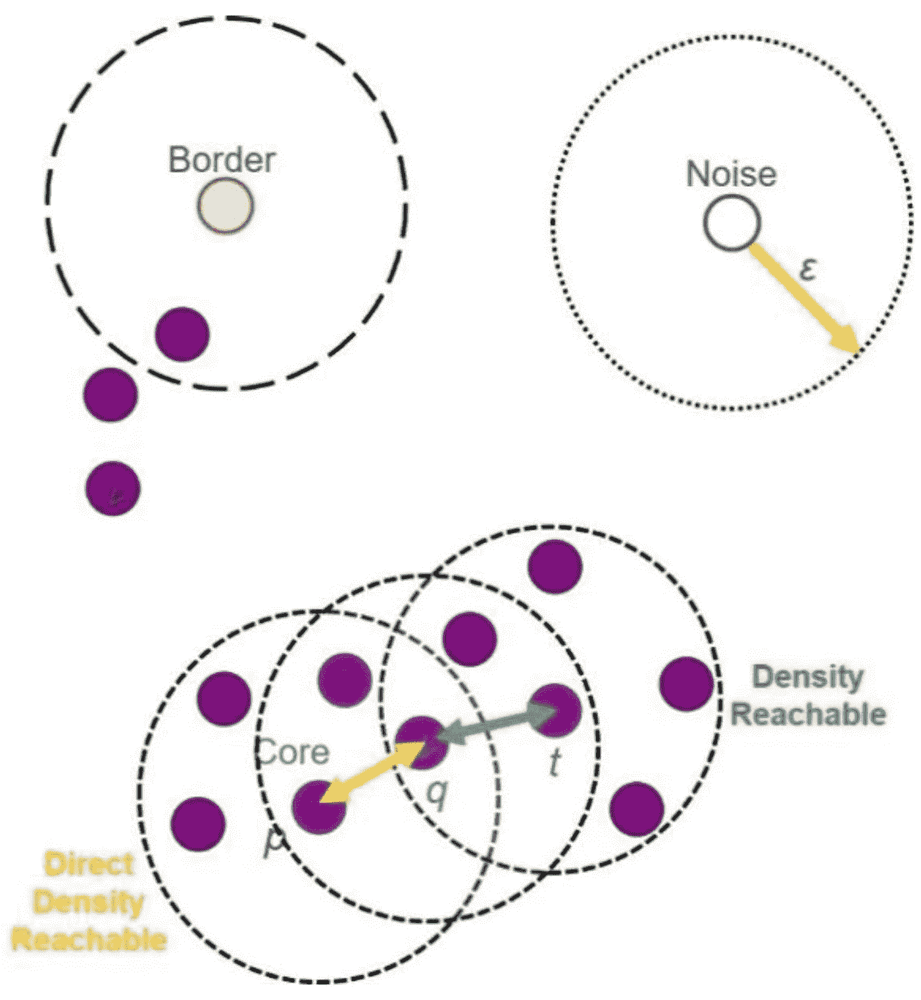
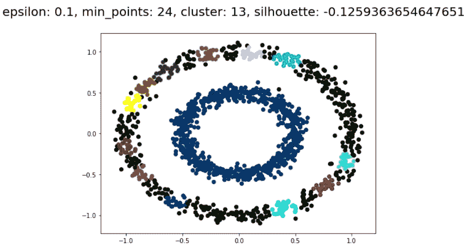

# 大数据集群:使用 Python 从头开始 MR-DBSCAN

> 原文：<https://medium.com/analytics-vidhya/big-data-clustering-mr-dbscan-from-scratch-using-python-f5a89c6d33b3?source=collection_archive---------1----------------------->

基于密度、形状和大小等基本标准的聚类非常常见。类似地，DBSCAN 是基于密度的聚类算法的扩展方法。

参考:[https://www.mdpi.com/2076-3417/9/20/4398/htm](https://www.mdpi.com/2076-3417/9/20/4398/htm)

对于 MapReduce，查看这篇文章([https://medium . com/@ rrfd/your-first-map-reduce-using-Hadoop-with-python-and-OSX-ca 3b 6 F3 dfe 78](/@rrfd/your-first-map-reduce-using-hadoop-with-python-and-osx-ca3b6f3dfe78))

算法描述:

1.  选择一个随机点 p。
2.  获取从 p 到 eps 和 minPts 密度可达的所有点。
3.  如果 p 是一个核心点，则形成一个簇。
4.  访问数据集的下一个点，如果 p 是边界点，并且没有一个点是从 p 密度可达的。
5.  重复上述过程，直到检查完所有的点。

*这里我没有使用现有的 DBSCAN 库，而是创建了一个函数。*

参考算法:[https://en.wikipedia.org/wiki/DBSCAN](https://en.wikipedia.org/wiki/DBSCAN)

步伐

# 聚类中的搜索点

# 平均类内距离(a)

# 每个样本计算的平均最近聚类距离(b)

这里我用的是剪影评分进行验证，更多细节可以找到([https://en . Wikipedia . org/wiki/Silhouette _(clustering)](https://en.wikipedia.org/wiki/Silhouette_(clustering))

绘图功能:

但是对于十亿行来说，同样的功能需要几个小时。由于大数据集，这是当今的主要挑战。

**大数据存储**

*   直接连接存储(DAS)
*   网络存储

**MapReduce**

它是在大型数据集中实现分布式和并行算法的框架。

工作:

1.  将输入数据分成块，这些块将进入并行映射阶段。
2.  然后排序操作
3.  减少是最终目标

数据块→排序→归约

它旨在避免计算机节点故障问题(容错)

参考:[https://journalofbigdata . springer open . com/articles/10.1186/s 40537-019-0236-x](https://journalofbigdata.springeropen.com/articles/10.1186/s40537-019-0236-x)

本文提供了一种使用 300GB 数据进行聚类的新方法。

他们的方法包括以下步骤:**第一层**

1.  Map-reduce(提高可扩展性)这里 M-R 把大数据分成小块，发送到 Hadoop 平台。
2.  具有减少的边界点的分区(用于分割数据的算法)这种分区算法对以均等方式分布在节点之间的数据进行分区，并且在分区中最小化边界点的数量。
3.  初始化每个维度的切片→计算每个连续切片的累积点→选择最佳切片进行分割

**第二层**

群集过程在每个节点上独立执行。每个映射器将数据作为(键，值)读取，其中键=空，值=分区

这里他们计算了*局部密度*

第三层是合并。本文给出了一个具体的方法。

在下面的文章中，我将实现这个方法。希望有用。

参考资料:

1.  [https://www . ijar CCE . com/upload/2016/2 月-16/IJARCCE%2077.pdf](https://www.ijarcce.com/upload/2016/february-16/IJARCCE%2077.pdf)
2.  [https://journalofbigdata . springer open . com/articles/10.1186/s 40537-019-0236-x](https://journalofbigdata.springeropen.com/articles/10.1186/s40537-019-0236-x)