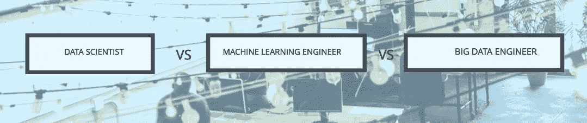
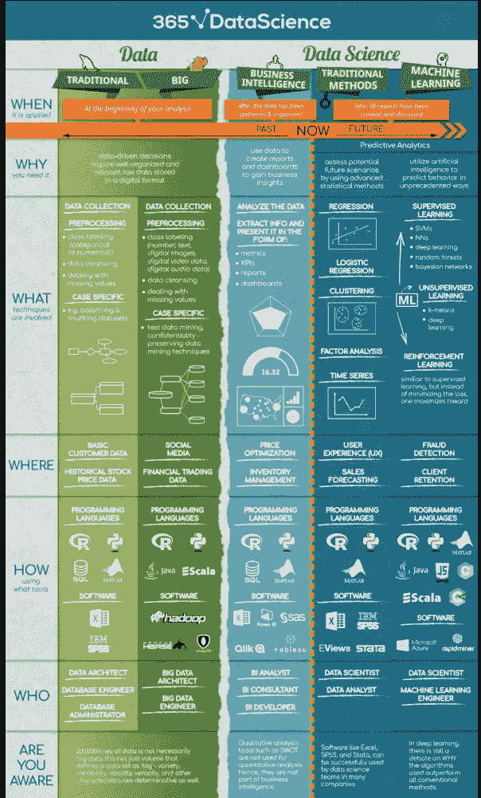
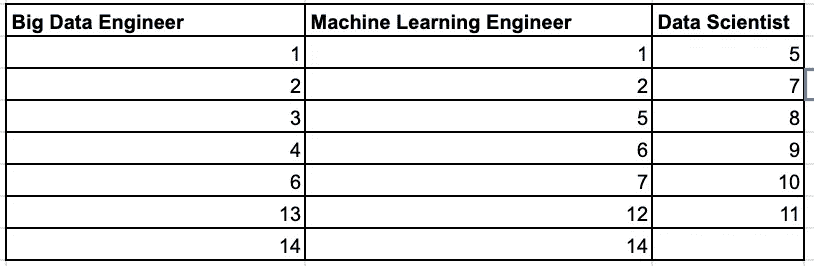

# 大数据工程师 vs 机器学习工程师 vs 数据科学家——帮助我选择道路的 14 个问题？

> 原文：<https://medium.com/analytics-vidhya/big-data-engineer-vs-machine-learning-engineer-vs-data-scientist-questions-that-helped-me-choose-f2a79ec7ffbd?source=collection_archive---------15----------------------->

嗯，这实际上是一件很有趣的事情。我相信在网上已经有很多关于这些角色的讨论，这篇文章主要是写给那些刚刚起步或正在起步的人，一般来说，有三种人:

Geetha:Geetha 是一个已经在这个领域寻求进一步提升自己技能的人。她的问题类似于“你好，我刚开始做数据工程师，我该做些什么或者我该学些什么来更好地做好我的工作”。

**拉梅什:**拉梅什是已经开始转换角色的人。他的问题是“我如何成为一名数据科学家？”

**苏雷什:**苏雷什是一个还不确定自己想换到哪里的人，他需要帮助。“他的问题更像是，嘿，我是一名 Java 程序员，我想我喜欢做 A、B 和 C，我想在数据/人工智能领域工作，什么样的角色适合我？”

所以我意识到在网上有很多对吉塔有用的帮助(比如在内容上帮助她了解角色和责任，以及她可以学习什么或她的职业道路)。

[https://365 Data Science . com/WP-content/uploads/2018/05/365-Data-Science-infograph . png](https://365datascience.com/wp-content/uploads/2018/05/365-Data-Science-Infographic.png)

需要帮助的是拉梅什和苏雷什。我们很多人都来过这里。我也在这里。随着最近一切都被市场化，人们很容易被动摇，去选择一个特定的角色，比如数据科学家，只是后来意识到你不喜欢数学和统计学。嗯，几年前我在一个副业项目中尝试过 hands，我意识到这不是我喜欢的。我坚信彼得·德鲁克的哲学，即在你擅长和喜欢的事情上变得伟大比在你不擅长的事情上变得平庸更容易。

与实际上不擅长统计的人相比，一个擅长统计的人可能自然喜欢工作和开发数据科学模型。

因此，随着时间的推移，我发现了一些问题，可以问自己是否符合 Suresh 或 Ramesh 的个人资料，使用下面的表格:

1.  编写**程序的想法让你兴奋吗？**
2.  构建可扩展的软件系统让你兴奋吗？
3.  你擅长 **SQL** 并且很好的理解数据库吗？
4.  如果你喜欢**构建**系统，你是否也喜欢尝试**探索**不同的工具，**从头开始设置**它们？
5.  你是不是喜欢**而不是**去**构建**工具来做任何**分析**，而是喜欢看能够用来解决问题的**算法**？
6.  你也喜欢在**部署**和**基础设施**端工作吗？
7.  还有要不要喜欢**核心数据结构和算法**的人？
8.  你是喜欢数学和统计的人吗？喜欢研究数学模型？
9.  你是那种喜欢查看数据，试图从中找出**见解和模式**的人吗？
10.  如果你喜欢看数据，你是否也想清楚**了解领域**并解决一个**业务**问题？
11.  说到工作，你喜欢独自工作吗？
12.  你想成为一名**牛逼的赛车手**？
13.  你想成为一名出色的赛车机械师，而不是制造汽车吗？
14.  你能接受这样一份工作吗？在这份工作中，你需要和很多人交谈来完成你的工作。

利用这些问题，我为自己建立了一个网格，看看哪个角色更适合我。

正如你所看到的，角色之间有重叠，你的兴趣可能放不进一个盒子里。每个组织的角色定义略有不同。想法是以此为骨架，探索自己想做的事情。我想在这里引用**彼得·德鲁克**的话“一个人只能从**的力量**中表演。一个人无法在自己的弱点上创造业绩，更别说在自己根本做不到的事情上了。”。所以明智地选择你的道路，而不是因为有人在做什么。记住在一天结束的时候，每个人都是不同的。