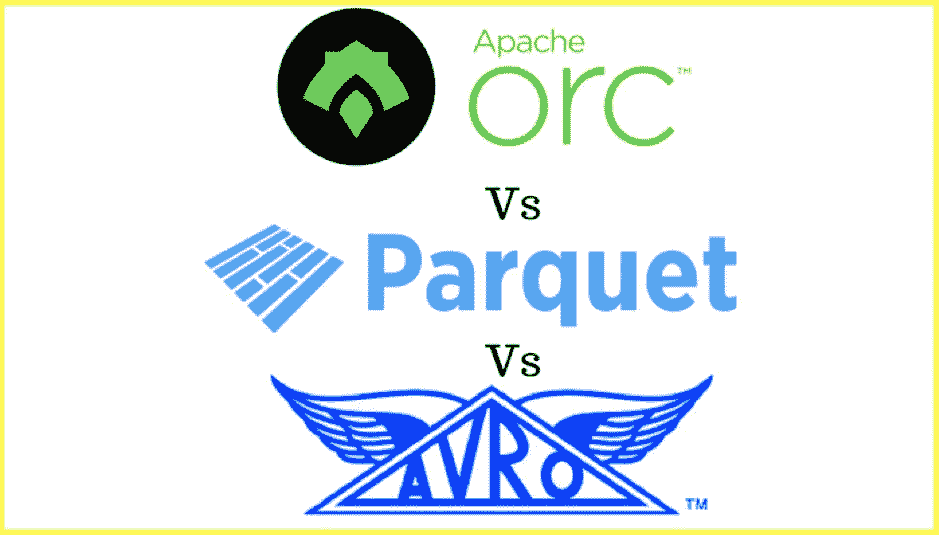
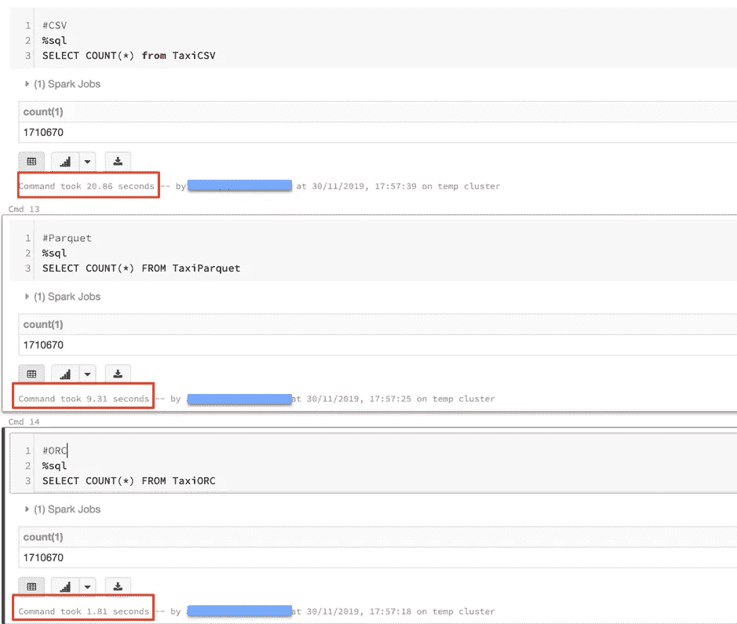
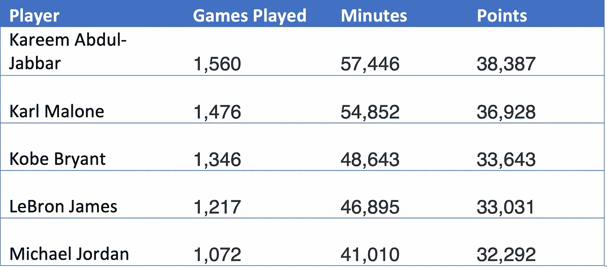
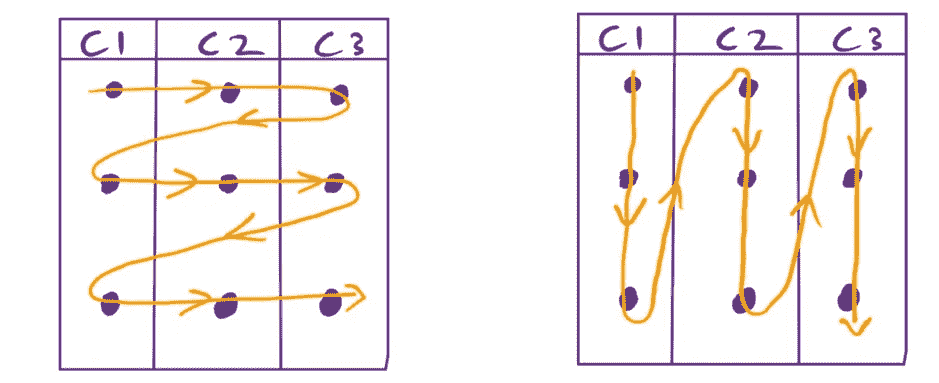
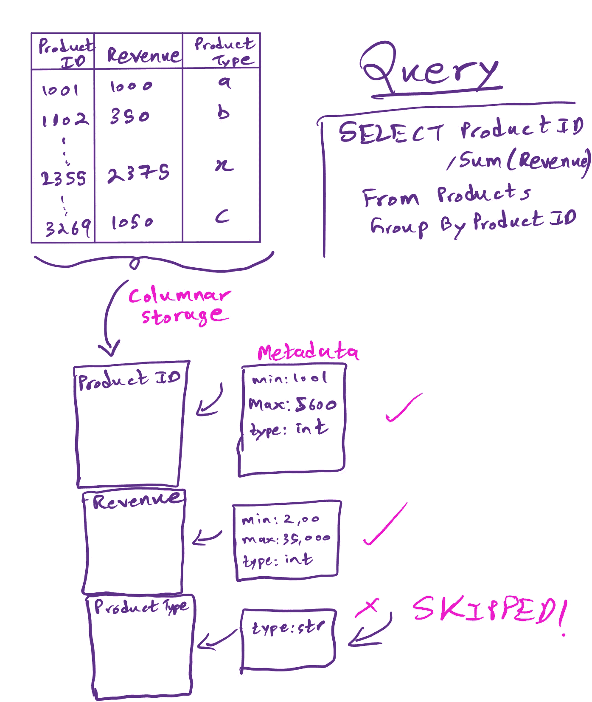
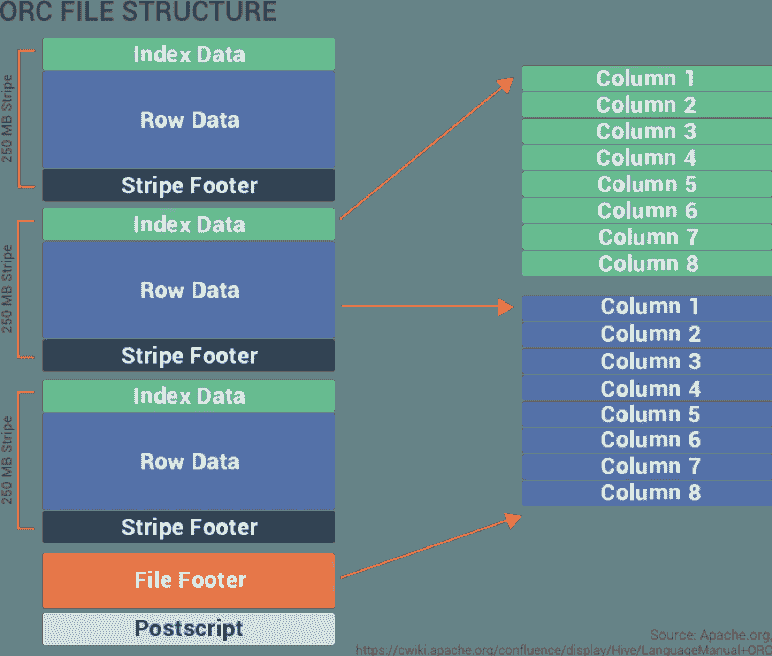
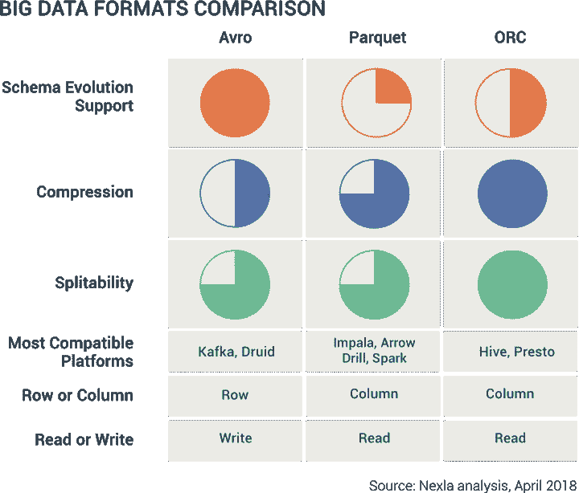

# 使用 Spark 解释大数据文件格式第 1 部分

> 原文：<https://medium.com/analytics-vidhya/big-data-formats-explained-using-spark-on-azure-gcp-part-1-a83d153c4e66?source=collection_archive---------0----------------------->

## 了解 Avro、拼花地板和 ORC 的工作原理

*图片来源:*[*【https://www.ellicium.com/orc-parquet-avro/】*](https://www.ellicium.com/orc-parquet-avro/)

在处理大型数据集时，使用传统的 CSV 或 JSON 格式存储数据在查询速度和存储成本方面效率极低。

图 1:显示了一个使用 CSV、Parquet 和 ORC 文件格式执行的简单 sql 查询。ORC 大约比 Parquet 快 10 倍，比 CSV 快 20 倍！

图 1 展示了使用正确的文件格式来查询数据的强大功能。我们看到 ORC 格式比使用 CSV 快了将近 20 倍！这里使用的数据集是 Kaggle 的滑行轨迹数据集，大小刚刚超过 1GB，包含大约 170 万条记录(数据集的完整详细信息可以在这里[获得](https://www.kaggle.com/crailtap/taxi-trajectory))。

希望这激起了您学习更多关于存储大数据的正确文件格式的兴趣。本文将讨论为存储大数据集而优化的 3 种主要文件格式，然后在出租车轨迹数据集上演示使用 Spark 的查询速度。这将在 Azure(使用 Databricks)和 Google 云平台(使用 Dataproc)上完成，所以你可以在你选择的平台上尝试。

## **大数据格式**

大数据世界主要有三种为存储大数据而优化的主要文件格式: **Avro** 、 **Parquet** 和**优化的** **行列** (ORC)。下面提到的每种格式都有一些相似之处和不同之处。

***相似之处* :**

所有这三种格式都以机器可读的二进制格式存储数据，这意味着它只能被机器理解，这与人类可读的 CSV 和 JSON 格式不同。

数据集也可以跨多个磁盘分割，从而实现大规模并行数据处理。这大大提高了处理速度

它们是自描述的格式:一个 parquet 文件的副本可以很容易地转移到另一台机器上，而不会丧失可解释性。

它们是在线格式:可以轻松地在集群中的节点之间传递数据。

***差异* :**

Parquet 和 ORC 以**列格式**存储数据，这意味着数据是为快速检索而优化的。这非常适合读取量大的分析工作负载，即只使用几列进行分析的查询或具有复杂聚合的查询。

Avro 是一个基于**行的**数据存储，这意味着数据针对“写入密集型”工作负载进行了优化，即需要显示(写入)大部分或所有行数据的查询。

虽然不全面，但在决定哪种格式适合数据集时，有 4 个主要属性需要考虑:

*   行或列存储(R)
*   压缩(摄氏度)
*   图式进化
*   可分裂性

帮助你记住它们的一个助记法是**赛跑。**

## **行 Vs 列商店**

*表 1:显示了截至 2019 年 12 月 1 日 NBA 所有时间点的前五名领先者。数据摘自***。**

*行存储逐行存储数据。以表 1 中的数据集为例，基于行的存储如下所示:*

**卡里姆·阿布杜尔·贾巴尔 1560，57446，38387，卡尔·马龙 1476，54852，36928，科比 1346，48643，33643，勒布朗 1217，46895，33031，乔丹 1072，41010，32292。**

*数据从左到右逐行存储。相比之下，基于列的数据存储如下所示:*

**卡里姆·阿布杜尔·贾巴尔，卡尔·马龙，科比，詹姆斯，乔丹，1560，1476，1346，1217，1072，57446，54852，48643，46895，41010，38387，36928，33643，33031，32292。**

*数据按从左到右的顺序逐列存储。该序列可以总结为如图 2 所示。*

**

**图 2:展示了基于行和基于列的存储格式如何存储数据。在基于行的格式中，数据从左到右逐行存储。列格式按从左到右的顺序逐列存储数据。**

*我们现在可以开始理解为什么基于列的存储对于分析目的是理想的，在这种情况下，查询往往只针对特定的列，而不是整个数据集，即读取量很大。这种列存储使得像 Parquet 和 ORC 这样的格式能够在每一列的末尾存储**元数据**(包含诸如模式、列最小值和最大值、空值等信息)，这对于基于行的存储是不可能的。使用这些信息，可以更快地跳到查询所需的相关列，因为元数据将通知查询相关数据是否出现在该列中。*

*例如，假设我们有一个产品表，并想找出哪个产品的收入最高，按产品 ID 分组。因此，您可能需要查询 product 表中的特定列(并对其执行聚合)来提取信息。将数据存储在 Parquet 或 ORC 中后，将执行**数据跳过**以仅扫描相关列(见图 3)。*

**

*图 3:数据跳过是如何工作的高级演示。*

*但是，如果查询需要返回数据集中的所有或大多数行，那么使用基于行的存储会更有效。*

*例如，假设您想预订第二天的航班。然后，您将希望看到与当天可用航班相对应的大部分/所有行数据，以及大部分/所有列，因为每列都添加了更多信息，以便您决定您将乘坐哪个确切的航班。在这种情况下，您可能希望使用基于行的格式，如为此优化的 Avro。*

## ***压缩***

*压缩数据减少了存储、查询和传输数据所需的信息量，从而节省了时间和金钱。*

*以列格式存储的数据可以实现更好的压缩，因为相似类型的数据是相邻存储的。例如，以表 1 中的数据集为例，所有字符串值数据(来自第 1 列)都存储在一起，所有整数值数据(来自第 2–4 列)也存储在一起，因此与基于行的数据存储相比，数据压缩效率更高。这将降低存储成本。*

## ***图式进化***

*数据集上下文中的“架构”是指列标题和类型。随着项目的成熟，可能需要向数据集添加/改变(新的)列，从而改变其模式。讨论的所有 3 种格式都支持某种程度的模式进化支持，尽管 Avro 在这方面远远优于其他两种格式。*

## ***分裂性***

*“可分割性”指的是将大数据集分解成更小的独立数据块的容易程度，以便它们可以由集群中运行的多个节点处理。这使得大规模并行处理成为可能，因为一台机器将没有足够的计算能力来处理整个数据集。Avro、Parquet 和 ORC 格式都经过优化，支持可分割性。*

*现在让我们更详细地研究这三种文件格式。*

# ***Avro***

*Avro 是由 Hadoop 的一个团队在 2009 年开发的，是一种基于行的高度可拆分的存储格式。Avro 的显著特点(如 Nexla 白皮书中所述)是它的模式*‘随数据一起移动’*。这是因为数据定义/模式是以人类可读的 JSON 格式存储的，而数据本身是以二进制格式存储的。这最大限度地提高了压缩和存储效率。此外，由于数据定义是以人类可读的格式存储的，这使得模式演化在修改列类型或添加新列类型方面变得非常容易。*

# ***拼花地板***

*这种格式是由 Twitter 和 Cloudera 在 2013 年开发的，是一种基于分栏的格式。由于数据存储在列中(如前所述),因此很容易压缩。Parquet 还在文件末尾存储元数据，其中包含有用的统计信息，如模式信息、列的最小值和最大值、压缩/编码方案等。这允许跳过数据，并允许在多台机器上分割数据。*

# ***优化的行列(ORC)***

**

**图 4:显示了如何使用“条带”将数据分组，然后在 ORC 中以列格式存储。条带页脚包含每个条带中用于数据跳过的列的元数据。来源:* [*Nexla 白皮书*](https://www.nexla.com/resource/introduction-big-data-formats-understanding-avro-parquet-orc/)*

*ORC 由 Hortonworks 于 2016 年开发，以列格式存储行数据，这对压缩和存储来说效率极高。这种压缩是通过 ORC 的“索引”系统实现的，该系统将数据存储在大约 10，000 行的“**条带**中。每个条带将索引(列标题)、行数据和条带页脚(包含列统计信息、模式信息等)分组到不同的列中，如图 4 所示。这使得当查询跳转到相关条带进行分析时，数据跳转成为可能。条带也相互独立，这允许数据拆分，因为一个条带可以传输到另一个节点上，而不会损失可解释性。*

*图 4 总结了选择数据格式时需要考虑的四个主要属性，以及它们在 Avro、Parquet 和 ORC 中的适用性。*

**

**图 5:总结了所讨论的大数据格式的 4 个核心属性，以及它们对不同平台的兼容性。来源:* [*Nexla 白皮书*](https://www.nexla.com/resource/introduction-big-data-formats-understanding-avro-parquet-orc/) *。**

*点击[此处](/@aqeelahamed17/big-data-formats-explained-using-spark-on-azure-gcp-part-2-b93bf59118e7)查看本文的[第 2 部分](/@aqeelahamed17/big-data-formats-explained-using-spark-on-azure-gcp-part-2-b93bf59118e7)，该部分展示了在 Azure & GCP 上使用这些高效的文件格式实现的查询速度。*

# ***参考文献***

*Nexla 白皮书:[大数据格式介绍](https://www.nexla.com/resource/introduction-big-data-formats-understanding-avro-parquet-orc/)。*

*Datanami: [大数据文件格式揭秘](https://www.datanami.com/2018/05/16/big-data-file-formats-demystified/)。*