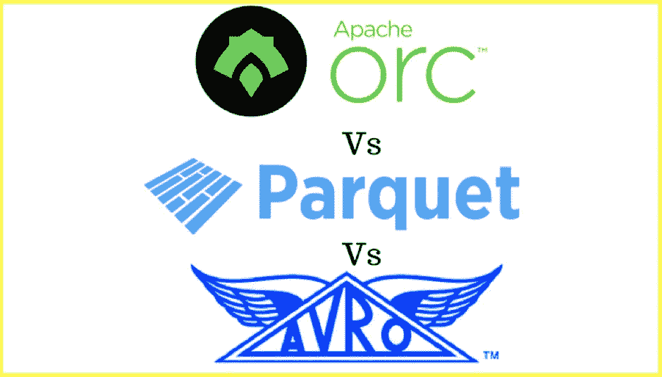
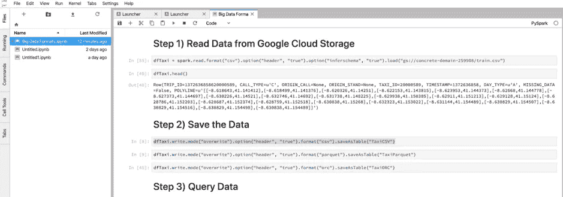

# 使用 Spark 解释大数据文件格式第 2 部分

> 原文：<https://medium.com/analytics-vidhya/big-data-formats-explained-using-spark-on-azure-gcp-part-2-b93bf59118e7?source=collection_archive---------11----------------------->

## 使用 Azure Databricks & Cloud Dataproc 的演示

## 在 Azure & GCP 上使用 Spark 的演示

*图片来源:*[*【https://www.ellicium.com/orc-parquet-avro/】*](https://www.ellicium.com/orc-parquet-avro/)

本文是第 1 部分的延续，第 1 部分讨论了所使用的各种大数据文件格式。

使用此处[找到的滑行轨迹数据集](https://www.kaggle.com/crailtap/taxi-trajectory)，我们将使用[第 1 部分](/@aqeelahamed17/big-data-formats-explained-using-spark-on-azure-gcp-part-1-a83d153c4e66)中描述的文件格式演示简单和更复杂查询的速度。

演示将在运行 Azure 或谷歌云平台的 PySpark 笔记本上进行，因此您可以在您选择的平台上运行该练习。这个练习使用的管道如图 1 所示。

*图 1 显示了用于将数据从本地存储加载到云中的管道。我们首先将数据集从本地存储加载到云存储“桶”中，然后从支持 PySpark 的笔记本中调用存储在该桶中的数据。*

一旦我们在本地机器上保存了数据集，我们就需要将它挂载到存储在云中的存储 blob 上。此后，我们将从 PySpark 笔记本中调用那个存储桶/容器，以便对其进行查询。(注:对于存储，GCP 使用“桶”这个词，Azure 使用“容器”。我们将交替使用它们)

# 使用 Azure 数据块的演示

我们将使用 Azure Databricks 来调用存储在存储 blob 中的数据。要尝试这一点，你需要使用 Azure 版本的 Databricks(点击[此处](https://docs.microsoft.com/en-us/azure/databricks/getting-started/try-databricks)注册免费试用)。一旦你启动并运行了 Databricks，首先要做的就是创建一个存储帐户来存储你的数据。

图 2:在 Azure 门户上创建存储帐户

点击 azure 门户中的存储帐户，并创建一个新的存储帐户。此后，在存储帐户中创建一个容器来保存您的数据。

为此演示创建的存储帐户名为'***taxi storage 2019***'，容器名为' ***taxicab*** '。

图 3:显示了名为“taxistorage2019”的存储帐户和名为“taxicab”的容器。

点击容器，我们就可以上传数据。本演示的数据集名为“train.csv”。在图 3 中，请注意在“设置”下，我们有“访问键”。请记下这一点，因为以后会用到它。

图 4:显示了在 Azure 的存储容器中上传的数据集“train.csv”。

现在，我们可以登录 Databricks，启动集群，并在新笔记本上查询数据集。(查看数据块[快速启动](https://docs.databricks.com/getting-started/quick-start.html)页面，了解如何创建集群和加载新笔记本)

一旦创建了集群，我们就需要使用 Azure 门户上的帐户名和访问密钥连接到存储帐户。

图 5:显示了在数据块上加载数据的步骤。

在笔记本上设置存储帐户和访问密钥凭据后，我们需要使用“wabss://<container-name>@<storage-account-name>. blob . core . windows . net/<file-location>”格式从存储帐户中读入数据。</file-location></storage-account-name></container-name>

读取数据后，我们需要将其保存为适当的文件格式。

图 6

然后，我们可以查询数据并比较性能。

图 7

正如所料，我们可以看到，对于这个简单的查询，Avro 没有 Parquet 和 ORC 快，但性能比 CSV 好得多。

让我们尝试一个更复杂的查询:

图 8

对于仅在数据集的几列上运行聚合的查询，我们看到 ORC 的性能最好(如预期的那样),大约比 Avro 快 10 倍，比 CSV 快 20 倍！

# 使用云 Dataproc 的演示

和 Azure 一样，你也可以在 GCP 上注册一个为期 12 个月的免费账户。一旦帐户设置完毕，我们将使用云存储创建一个存储“桶”来保存我们的数据。在我们访问 GCP 上的资源之前，我们首先需要创建一个[项目](https://cloud.google.com/appengine/docs/standard/nodejs/building-app/creating-project)。完成后，我们可以从左侧面板导航到**存储**并创建我们的存储桶。

图 9: *导航到云存储页面。*

我们已经创建了一个名为默认项目 ID 的存储桶，并上传了滑行轨迹数据集。

图 10:“train . CSV”数据集已经上传到存储桶。

为了能够访问 pyspark 笔记本，我们首先需要使用 Cloud Dataproc 创建一个集群。导航到左边的 Cloud Dataproc 选项卡，并单击“Clusters”。点击[此处](https://cloud.google.com/dataproc/docs/tutorials/jupyter-notebook)按照说明设置 pyspark 笔记本。

在这次演示中，我们将使用 Jupyter 实验室推出的笔记本电脑。一旦我们启动并运行了笔记本，就像 Databricks 一样，我们首先需要从 google 云存储中读取数据，使用适当的格式保存数据并查询数据。

图 11

为了从云存储中加载数据，我们需要在文件位置前面加上前缀‘GS://’。因此格式应该是**“GS://<文件位置>”。**

此后，我们可以使用所讨论的文件格式查询数据并比较速度上的差异。

图 12

Azure Databricks 和 GCP 上使用的笔记本都可以在我的 [github](https://github.com/Akeelahamed17/Projects/tree/master/Big%20Data%20File%20Formats) 上找到。

# 参考

Nexla 白皮书:[大数据格式介绍](https://www.nexla.com/resource/introduction-big-data-formats-understanding-avro-parquet-orc/)。

Datanami: [大数据文件格式揭秘](https://www.datanami.com/2018/05/16/big-data-file-formats-demystified/)。