# 大数据—实施

> 原文：<https://medium.com/analytics-vidhya/big-data-implementation-43871736491e?source=collection_archive---------12----------------------->

本博客讨论了云平台中大数据的实施、Hadoop 和 Spark 概述、其使用案例、存储、处理、分析、可视化等。在生产系统中

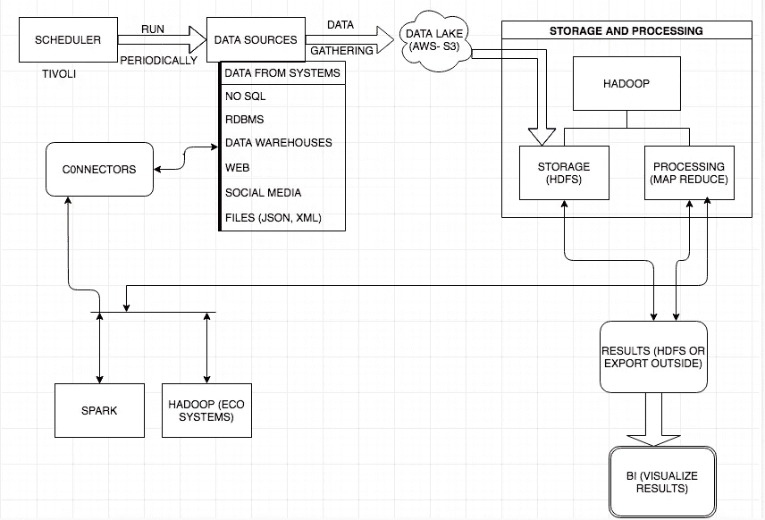

云中的大数据架构

这篇博客的目的是了解 Hadoop 和 Spark 技术(概述)以及生产系统中的用例和执行。本博客将帮助您在云环境中设计大数据项目的架构。内容针对新项目(从头开始开发)，讨论数据类型、工具解释、用例、解决方案解释等。,.

**本博客内容**:

在这里，我将介绍 Hadoop 和 Spark 平台、Hadoop 的优缺点、可能支持 ELT /ETL 的用例、Hive:分区、数据仓库、SQL 查询、NOSQL 数据库、Hadoop 发行版、流处理、Drill(查询引擎)用例、AWS 中的执行。我介绍了 5 个用例，分别是 Hive 中的 ELT 处理、使用 SQOOP 的数据摄取、使用连接器和 Spark SQL 的 NOSQL/SQL 数据处理、流处理—日志处理和钻取用例。

基于使用案例和大规模数据，我们需要决定是否可以使用大数据。

我涵盖了 Hadoop 中的 2 个用例、Spark 中的 2 个用例以及 Drill 中的 1 个用例。

通过查看标题图，您会对 AWS 中的 Hadoop 有所了解。

在云计算中执行大数据项目的步骤。

1.  行程安排
2.  数据采集
3.  存储和处理(执行分析或分析)
4.  导出结果
5.  数据可视化

你必须从头到尾阅读这篇博客，然后你会对在云环境中使用大数据平台有一个清晰的了解，这可能有助于考虑你的需求或使用案例。

让我从介绍数据来源开始这篇博客。

您的应用程序可能有不同的架构，但这是用于 Hadoop、Spark、NOSQL 平台的通用架构。

**调度器**:调度器定期运行，从不同的数据源获取数据，并将压缩数据(例如:zip 格式)移动到 AWS-S3。

**数据收集**:数据可以从不同的来源收集，如平面文件、数据库、NOSQLs、DWHs、Web &社交媒体(通过编写抓取器来提取数据)，主要存储在 AWS-S3 等数据湖中，然后转移到 HDFS。

一旦数据移动到 HDFS(这是主存储)，处理大数据的故事就开始了。

在处理数据之前，我们需要了解我们将要处理的数据类型。通常有 3 种不同类型的数据:

1) **结构化**:从 RDBMS 和 DWHs 生成的数据(它包含结构和数据)

2) **半结构化**:由 NOSQLs、XML、JSON 文件生成的数据。(与半结构和数据混合)

3) **非结构化**:数据中没有结构。例如:CSV，TXT，图像，视频等。,

一旦我们理解了数据，我们必须选择工具来处理。我们将从了解 Hadoop 和 Spark 平台中的工具开始。

让我们从 Hadoop 框架及其生态系统开始。

adoop 是一个基于 java 的分布式并行处理开源软件框架，用于存储大规模数据，并在具有不同类型模式的商用硬件集群上运行应用程序。它为任何类型的数据提供大容量存储、巨大的处理能力以及处理几乎无限的并发任务或工作的能力。

H adoop 是分布式系统，因为框架将文件分割成大的数据块，并将它们分布在集群中的节点上。Hadoop 然后并行处理数据，其中节点只处理它有权访问的数据。这使得处理比在更传统的体系结构(如 RDBMS)中更有效、更快。

Hadoop 中有 2 个主要组件 1)HDFS(用于存储)2) Map Reduce(处理)。看标题图。

**HDFS** — Hadoop 分布式文件系统，允许存储数据(处理前&和处理后)和结果。HDFS 提供了操作和管理文件的命令。

**Map Reduce (MR)** : MR 将处理数据。每一个操作或作业转换成 MR。首先它会执行 Map，然后减少。两者都是独立的实体。

在 MR 中工作要复杂得多，你必须编写自己的映射器并减少组件，以克服这种复杂性，生态系统就出现了。在生产系统中，生态系统被认为是有用的，即使生态系统内部转换成 Map 减少 MR。直接处理 MR 将较少被考虑。

Hadoop 解决了任何分布式数据处理框架面临的 3 个主要问题:

1) **并行化** *:* 一次计算数据的子集(将数据分成子集)。

2) **分发**:分发数据

3) **容错**:处理组件或节点故障。

**生态系统**:今天介绍了各种生态系统，我将列出最常见的。

1.  **Hive (DWH)** :它是 DWH 的基础设施，允许我们以 SQL 命令的形式操作数据。有各种类型的特性用于导入/导出、DDL、DML、存储、分区(静态&动态)、桶、from 语句、多插入语句等。，你必须存储和操作结构化数据。它为大型表提供了专门的查询和汇总。
2.  SQOOP :这是一个数据摄取工具，用于将数据导入 RDBMS/HDFS/从 RDBMS/导出数据。
3.  这是一个流处理工具，当数据到达时，你必须处理和存储。
4.  猪:顾名思义，它可以吃任何东西，复杂的查询可以通过分成子语句来解决。它是用于并行处理的高级脚本数据流语言和执行框架。
5.  **HBase** :它是一个分布式的、面向非 SQL 列的数据库。我们主要使用 JAVA-API 来存储和操作 HBase 中的数据。
6.  **OOZIE** :基于服务器的工作流调度系统，管理 Hadoop 作业。
7.  **Zookeeper** :在 Hadoop 环境下控制和协调系统，为大型分布式系统提供分布式 [c](https://en.wikipedia.org/wiki/Configuration_management) 配置服务、 [s](https://en.wikipedia.org/wiki/Synchronization_(computer_science)) 同步服务和命名注册表(端口)。
8.  **Ambari** :这是一个基于 web 的集群管理系统，用于为 hdfs、mapreduce 和 Hadoop 生态系统监控、管理和配置 Hadoop 集群。它提供了一个仪表板，用于查看您的 Hadoop 集群运行状况。

请注意，对于大规模数据，每个生态系统都有单独的用例。例如，要将数据从 RDBMS 摄取到 Hadoop，您可以使用 SQOOP，要处理非结构化数据进行复杂查询，您可以使用 PIG，要存储大型 SQL 表，Hive 是最佳工具。

**Hadoop 中的用例**

hive——使用分区和桶以及 **ELT** 流程的用例。在美国以州和城市的方式存储数据。

首先，我们必须了解数据仓库及其用途。

什么是数据仓库？

数据仓库(DWH)是向所有用户提供数据以进行分析、报告等的地方。一个数据仓库，也可以称为企业数据仓库(EDW)。

什么是 DWH，什么不是？

数据仓库是一个数据库，其数据包含操作数据的副本。这些数据可以从多个数据源获得，对决策制定非常有用。DWH 不包含原始数据。DWH 不仅包含历史数据，还可以由分析和报告数据组成。交易数据不存储在 DWH。

**DWH 的做法**:

传统的数据仓库设计可以使用两种常见的数据建模方法之一:维度模型(也称为星型模式)或规范化模型。

具有事实表的维度模型——数据库中关于实体(表)的不可变值或度量。它由事实和维度表组成，其中每个事实都与一个或多个维度相关联。事实表，维度方法增加了维度(即属性)——系统中实体的详细信息表，为事实提供了上下文。

一种标准化的数据仓库方法，涉及一种非常类似于 OLTP DBs 的设计。表是由实体创建的，旨在保留第三范式—属性完全依赖于主键。

使用维度方法，数据库针对查询和分析进行了优化，执行分析查询更容易、更快，而规范化方法使更新信息更容易。

下图描述了传统和 Hadoop 级别数据仓库架构的高级架构。

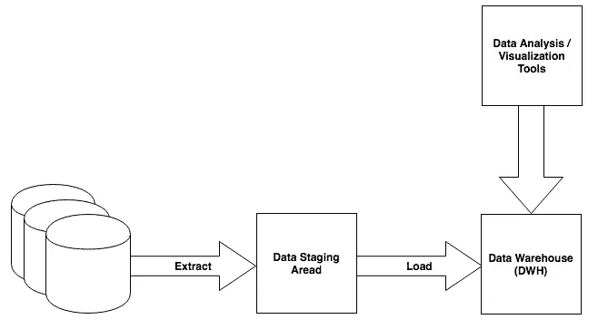

高级传统数据仓库架构

让我们浏览一下传统的数据仓库架构。

传统的 EDW 由以下组件组成:操作源系统、数据暂存区、数据仓库，将在下面稍加解释。

**运营源系统**:这些是捕获业务事务的在线事务处理数据库(OLTP)和运营数据存储。

**数据暂存区**:作为存储区和 ETL/ELT 处理的平台。数据从可操作的源系统(OSS)中提取出来并移动到暂存区，在加载到最终的数据仓库模式之前，数据在暂存区中进行转换。转换可能包括重复数据删除、规范化数据、清理数据、丰富数据等操作。分级不是固定的体系结构，而是会根据所使用的工具、处理模型和类似因素而变化。例如，在 ETL 模型中，临时区域是 DWH、平面文件或供应商特定基础设施外部的一组关系表。在 ELT 模型中，暂存区是 DWH 本身中的一组表，在数据加载到最终表之前，在这里进行转换。该区域严格用于数据处理—用户永远不会访问暂存区域中的数据来进行查询、报告等操作。在我们的用例中，对暂存区中的数据进行分区，我将在下面进行解释。

**EDW(数据仓库)**:数据仓库是供所有用户分析、报告等使用的地方。DW 中的模式是为数据分析而设计的，这通常涉及到访问多个记录。

在该体系结构的各层之间移动数据并执行转换是用 DI(数据集成)工具实现的。DI 工具如 Pentaho，Talend，SAP，IBM 等。

以下段落将解释使用 Hadoop 设计 DW(数据仓库)及其组件。

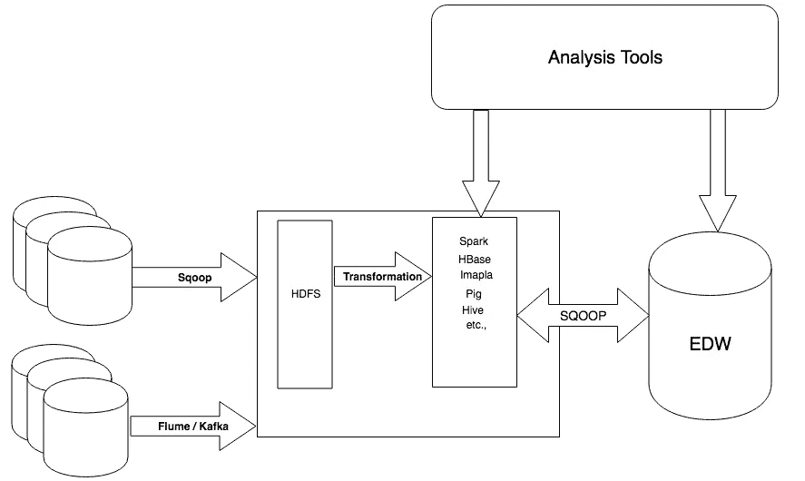

高级 Hadoop 数据仓库架构

让我们浏览一下高级 Hadoop 数据仓库架构。

**运营源系统**:这里是 OLTP 数据库，数据可以从 Sqoop 摄取工具中提取。此外，Hadoop 中还添加了不同的结构化数据源，如 web 日志、机器数据或社交媒体源。这些数据源(网络日志、机器数据、社交媒体源)通常难以用传统的 DWH 管理，但使用 Hadoop 可以轻松处理。这些数据源被称为基于事件的数据，通常使用 Flume 或 Kafka 或 Spark 流数据等工具。

简单来说:OSS——提取数据的 SQOOP，基于事件的系统——Flume、Kafka 或 Spark Streaming。

**暂存层**:源数据(操作系统或基于事件的系统)在被转换(以期望的形式)和加载到目标系统之前将被接收到 HDFS。可以使用 Map Reduce、Hive、Pig 或 Spark 进行转换。

**分析**:转换后，数据将被移入目标系统。目标系统可以是蜂巢或者黑斑羚或者出口到 DWH 做进一步分析。

**分析的可视化**:可以通过 BI 工具、分析、可视化工具访问数据。在传统的 DWH 中，分析工具从不访问暂存区中的数据。数据分析可以在 DWH 中运行，也可以在 Hadoop 中运行。

工作流:我们的处理很可能由一个工作流管理工具来编排，比如 Oozie。

**用例描述**:我有一家冷饮公司，业务遍及美国 50 个州，我想知道每个州的每月销售额。

以下是需要考虑实现的步骤。

1.  在每月第一天上午 12:00 之后从每个州获取数据:为此，我们需要在每月第一天上午 12:00 运行调度程序。
2.  收集数据湖(AWS -S3)中的数据并转移到 HDFS。(shell 脚本中的这些动人语句)
3.  最初将所有数据加载到配置单元表，即临时表中
4.  从临时表中使用多插入语句和分区(动态)来加载州级别和城市的记录
5.  编写一个查询来查找每个分区州在城市中的最高销售额
6.  使用 BI 工具进行可视化。

Hadoop 中的数据建模和存储由其他东西组成(如反规范化、更新数据、存储格式和压缩、分区等。，)设计蜂巢 DWH 时要考虑的问题，这里对蜂巢分区进行了详细解释。

这是标准且常见的大数据端到端使用情形。同样，这一过程可以扩展到我的公司分支所在的世界各地。

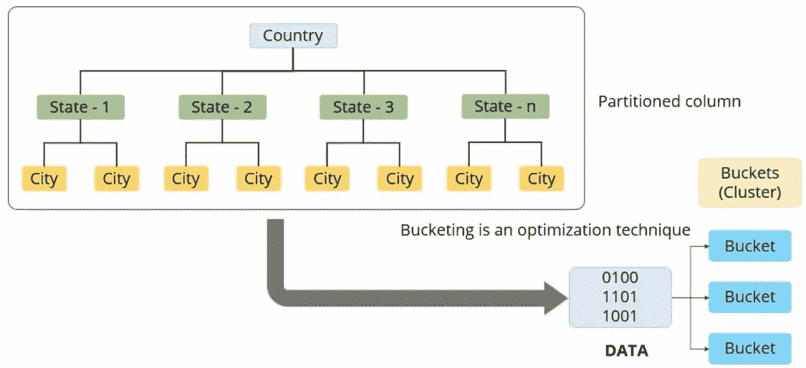

让我们简单了解一下 Hive 中的分区？

根据美国的州和城市划分数据。

**关于分区**:

对单个或多个列上的表数据或数据集进行分区。通过允许跳过评估查询不需要的部分数据，对数据进行分区消除了大量不必要的输入/输出操作。

例如:如果表在名为“ **State** ”(美国)的列上分区，我们将只查询特定的州，而不是整个表。如果总数据包含 600 万条记录，而纽约州有 50000 条记录，查询只需要评估纽约州，那么它必须处理 50000 条记录，而不是 600 万条记录。

**分区大小:**

平均分区大小至少是 HDFS 块大小的几倍。常见的块大小是 64 MB 或 128 MB，根据前面的分析，1 GB 是平均分区大小。如果数据在某一天超过 1 GB 左右，那么按小时分区。如果每天的数据少于 1 GB，则分区为每周或每月。

**数据整合:**

数据集成(DI)是一种跨数据存储移动数据或使数据可用的技术。DI 可以包括提取、验证、移动、清理、标准化、转换和加载。

**ETL 过程**:一种非常常见的处理类型是提取-转换-加载处理管道——将数据加载到 Hadoop 中，以某种方式转换以满足业务需求，然后将其移动到系统中进行进一步处理或分析或可视化等。,

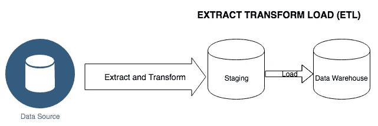

**ETL 流程**

ETL 过程依次遵循三个步骤。

1.  提取-从数据源提取的数据
2.  转型—满足业务需求的流程
3.  加载—将数据加载到端点以供进一步处理(DWH 或其他位置)。

**ELT 流程**:数据集成的另一种处理。在这里，数据从数据源中提取出来，不经转换就加载到 staging 中。之后，数据在 staging 中进行转换，然后加载到数据仓库中。在 ELT 过程中，步骤相同，但顺序不同 1)提取 2)加载 3)转换。

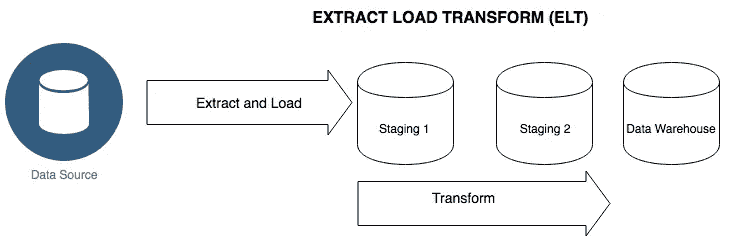

ELT 过程

在上述划分**的例子中，ELT** 过程可以定义为:

**提取**:从数据源提取数据(即我们用例的输入)，即从世界各地的所有分支机构提取数据。

**Load** :然后将数据加载到数据仓库中，也就是我们例子中的 Hive。

**转换**:根据国家、州和城市对数据进行处理、验证和过滤，使用分区存储或加载相应的国家、州和城市数据。

**SQOOP-HIVE 用例**

**问题**:分析产品销量(找出本季度销量最高的产品)。制造商是一家跨国公司。

**用例描述**:从不同的 RDBMS、DWH 现有系统(全球所有分支机构和不同地区)收集数据，在 Hadoop 中统一数据并分析数据和可视化结果。

**Sqoop 用法**:使用 Sqoop 数据摄取工具从不同的数据库系统收集数据。它将来自不同数据源的数据接收到 HDFS。通常，从我们的 OLTP 数据存储中获取数据到 Hadoop。Sqoop 可以连接多个表中的数据，并将其存储到 HDFS 中。

**Hive 用法:**将数据加载到暂存表中，对数据进行分区，启动查询

**执行**的步骤:

1.  使用 Sqoop import 语句从 DWH RDBMS 导入数据
2.  将数据加载到 HDFS(如果您知道结构并且不需要进一步过滤或分区，您可以加载到 hive)
3.  使用配置单元外部表(临时)来映射数据
4.  根据您的方便，从暂存表中过滤数据或映射到不同的分区
5.  在分区上执行查询以获得结果(可以使用 sqoop export 语句将结果或数据导出到不同的 RDBMS 或 DWH 系统)
6.  存储结果，并转发给 BI 团队以直观显示结果。

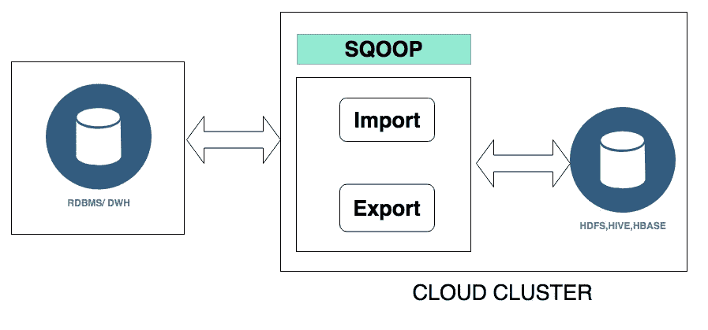

Sqoop 用于从 RDBMS/ DWH 导入数据集，在 HIVE 中处理并将结果导出到不同的 RDBMS 或 DWH

地图减少缺点:

1.  作业结果需要先存储在 HDFS，然后才能被其他作业使用。由于这个原因，MR 不适用于迭代算法。
2.  由于范式的两个步骤，许多类型的问题不容易适应，并且将每个问题分解成一系列这两个操作可能太困难。
3.  Hadoop 是一个相当低级的框架，许多高级工具(导入、导出、操纵数据、实时处理等。，)更复杂，以适应，他们带来额外的复杂性，这是复杂的任何环境。
4.  Map 减少了每次从磁盘中读取数据，对于每次操作，MR 将从 HDFS 存储或接收数据，这不是 Spark 会做的内存概念。

**Hadoop 发行版:**

Hadoop 发行版可以基于 Hadoop 及其生态系统轻松管理和安装所需的包。

**什么是 Hadoop 发行版**:由于 Hadoop 是开源的，许多公司开发了超越原始开源代码的专有发行版。通常 Hadoop 发行版通常包括 Hadoop Common、HDFS、Hadoop MapReduce、YARN。

Hadoop 发行版为客户提供了额外的价值，并解决了原始代码的问题。通常，供应商关注可靠性、稳定性和技术支持，并提供定制配置来完成特定任务。

对于猪脚本、Hive 脚本的开发，查看 HDFS、S3 的文件，Hbase 查询可以使用“*”。Hue 是一个开源的 SQL 数据库助手。你可以做以下事情。它可以被认为是 DBs 和 DWHs 的 IDE。*

*像专家一样编写 SQL，查找和连接您的数据，直观地发现见解，连接到所有数据库，等等。，以下是 Hue 的截图。*

*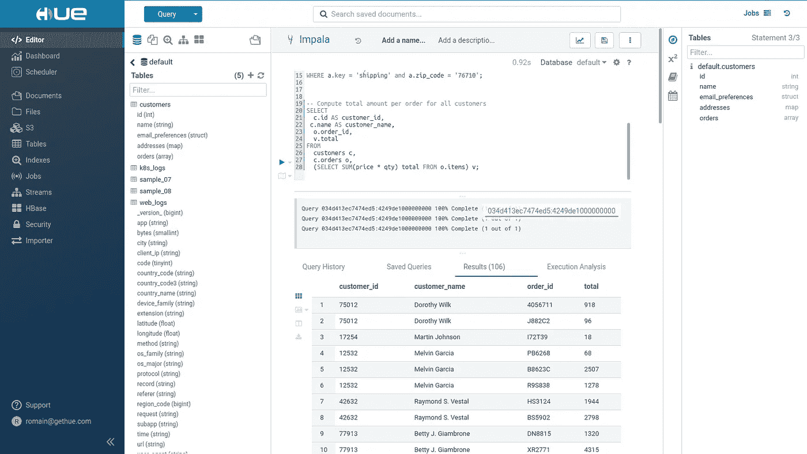*

*前三个行业选择是 Cloudera、Hortonworks 和 MapR 即使微软 Azure 的 HDInsight、AWS elastic mapreduce、IBM 开放平台、pivotal 大数据套件等。,*

*我们必须发布任何一个用于开发和生产的 Hadoop 发行版。上一节我选择了云端的 AWS EMR (Elastic mapreduce)。*

*S park:仅是数据处理引擎(无存储)，是大规模数据处理的统一分析引擎。实际上，它通常被定义为一个快速、通用的分布式计算平台。*

*Spark 建立在 Scala(函数式面向对象语言)之上。Spark 速度快，易于使用，通用性强，可以在任何地方运行(意味着在 Hadoop、Mesos、Kubernetes 上运行，独立运行或在云中运行)。*

*spark it 的优点是可以访问不同的数据源(如 DWH、NOSQL、RDBMS、平面文件),并通过连接器轻松连接。*

*Spark 将类似 MapReduce 的批处理功能、实时数据处理功能、类似 SQL 的结构化数据处理、图形算法和机器学习结合在一个框架中。这是满足大部分大数据需求的一站式商店。*

*Spark 给处理时间带来了一些开销。当处理大量数据时，这种开销可以忽略不计；但是，如果您有一个可以由单个节点处理的数据集，那么最好使用其他一些框架。Spark 不适合 OLTP(在线事务处理)应用程序(快速、大量、原子事务)。它更适合在线分析处理 OLAP:批处理和数据挖掘。*

***火花要点&火花模块**:*

1.  ***模块**:*

***Spark Core** : Spark 致力于称为 RDD 的概念(在 Spark 2.0 之前)，Spark 2.0 之后致力于数据集，但仍然支持 rdd。你必须检查版本及其局限性。*

***Spark SQL** :如果您熟悉 SQL，那么您可以轻松使用 Spark，因为它支持以编程方式以及 API 级别运行 SQL 查询。*

***使用 SQL 查询**:*

***val**sqlDF**=**spark . SQL(" SELECT * FROM table ")*

*使用 API:*

*val empdata frame = spark . read . JSON(" data/emply oees . JSON ")*

*empDataFrame.select("name ")。显示()*

*在 Spark-SQL 中，数据是以 Dataframe 的形式操作的(就像 RDBMS 表一样)。数据框提供了所有的 sql 操作。*

***Spark-Streaming** :流式传输允许我们在数据到达时进行处理。当数据到来时，你必须立即处理和存储，Spark 允许我们结合流和 SQL，灵活地处理数据。*

***Spark-ML** :旨在提供实用的可扩展且简单的机器学习。如果您的项目需要建立预测、分类数据模型，那么您不需要寻找另一个工具 spark include 本身。它还为线性代数、统计、数据处理等提供了特征、管道、持久性和实用程序。,*

*它支持其他模块，如 GraphX、结构化流等。，更多详情请访问 https://spark.apache.org/*

*2.通过使用 spark——减少了许多代码行，没有 Map 和 Reduce (Hadoop 框架的)之类的东西。*

*一般来说，Spark 可以被视为 Hadoop 的继承者和替代者。*

*Spark 正在将 Hadoop 框架的许多功能统一到一个统一的平台中。许多角色和功能可以在一个平台上协同工作。*

*Spark 可以很容易地淘汰 Hadoop 生态系统中的工具，如 Mahout、Giraph、Pig、Hive、Sqoop，因为 Spark 可以很容易地用其统一的架构风格进行替换。例如:Mahout 可以用 Spark MLlib 代替，Apache Pig，Apache Sqoop 可以很容易地用 Spark Core 和 Spark SQL 代替*

***Spark 中的用例***

***用例是统一来自 NOSQL 和 RDBMS 的数据，并对其进行分析。***

*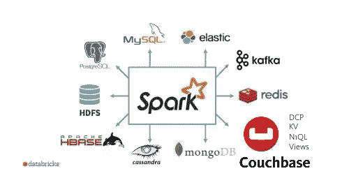*

*使用 Spark 连接器、连接不同数据库的连接器、NOSQL、搜索引擎、平面文件等可以轻松处理这个用例。,*

*连接器允许我们从 RDBMS、NOSQLs 中读取/写入数据。*

*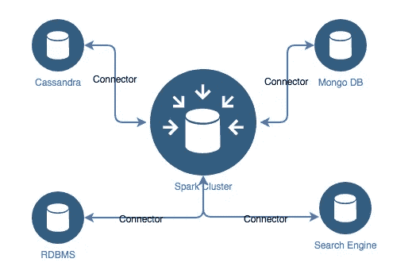*

***no SQL 的介绍***

*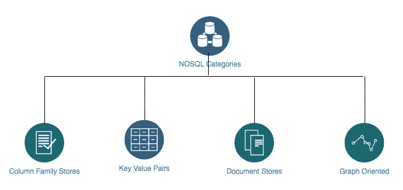*

*NOSQL 的类别*

*NoSQL(不仅仅是结构化查询语言)是一个用来描述那些应用于非结构化数据的数据存储的术语。生产系统在分布式系统中选择 NoSQL。通常，NoSQL 数据存储的强大之处在于，随着数据的增长，实现的解决方案可以通过向分布式系统添加额外的机器(节点)来扩展。*

*NoSQL 有 4 个主要类别*

1.  ***列族存储**:其用途是读写原始时间序列数据**例如:Cassandra，HBase***
2.  ***键值对**:键值对，其中的值可以是复杂的混合数据结构(如:文档)**例如:Redis，Voldemort***
3.  ***文档存储**:用于文档(每个文档中可以不同)，半结构化:通常是键和值(json 格式)。例如:MongoDB，CouchDB*
4.  ***面向图形**:用于命名实体、语义查询、关联数据集。 **Ex: Neo4j，FlockDB***

*上面的图片(Databrick 的)清楚地提到，Spark 可以很容易地连接到任何 DB | NO SQL | Flat 文件。*

*Spark 不会提供连接器，而数据库提供商必须提供。可以检查一下 Cassandra，Mongo DB 等的连接器。，在他们各自的官方网站。*

*必须执行以下步骤来完成此用例*

*1)将数据从每个 NOSQL 或 RDBMS 读入 Spark-SQL 数据帧*

*示例:从 Cassandra 读取数据*

*val user frame = sqlcontext . read . format(" org . Apache . spark . SQL . Cassandra ")。*

*选项(Map("table"->"user_visits "，" keyspace" -> "shafi_join_test "))。负荷*

*这样，您就可以从所需的 NOSQL 或 RDBMS 中读取数据*

*2)一旦你获得了与供应商(Mongo DB、Cassandra、Mysql、Oracle、SQL Server 等)相关的所有所需数据框架。,)*

*iii)您可以合并数据帧或 rdd*

*iv)一旦您将所有需要的数据框合并到一个 RDD 或数据框中，您就可以通过应用 sql 查询或 rdd 转换开始进行分析(如果您正在使用 rdd)。*

*v)您可以在任何需要的地方导出结果。*

*vi)您可以使用任何 BI 工具以图形方式查看结果。*

*请记住，除非你有大量的数据，否则不要使用 Spark。*

***Spark 的第二个用例是流媒体**:*

*在开始流用例之前，让我们详细讨论一下流。*

***什么是流**:并行处理大量数据具有巨大的优势，有时也有一些用例需要更实时(或接近实时)的数据处理，即在数据到达时进行处理，而不是通过批处理。这种处理称为“流处理”。*

*连续处理传入数据的流处理流；这些流将处理数据，只要它们保持运行，因为它与对固定数据集进行操作的批处理相反。*

*批处理—对固定数据集进行操作。*

*流处理-对到达数据进行操作。*

***流处理框架**:流行的流处理框架有 Apache Spark、Apache Flume、Samza、Flink、Storm、Apache Kinesis stream、Apache Apex。*

*流处理的一些例子是:*

*分析社交媒体馈送(例如:检测更新趋势)、分析金融馈送(例如:异常检测)、分析机器数据馈送(例如:在异常情况下发出警报)、分析视频游戏使用馈送等。,*

*正如我们所提到的，流处理指的是连续处理传入数据的系统，并且将继续处理传入数据，直到应用程序停止。*

*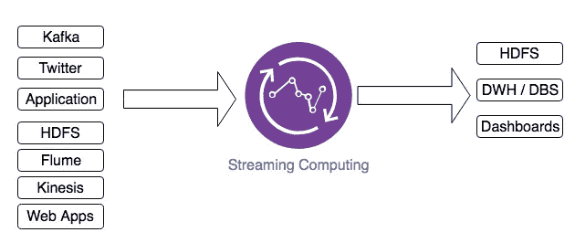*

*各种应用的流处理*

*用例是找出网上购物市场中最畅销的产品(类别和品牌)。这个用例将及时更新产品销售到仪表板，比如说几个小时。当数据及时到达时，将进行流处理，然后更新到仪表板。卖方需要此使用案例，以便计划提前预订商品，供客户使用。*

*以下步骤要求进行流式处理。*

1.  *获取日志文件中的数据:日志文件中的每个条目都包含项目细节，如售出/替换/等等。、、、创建日期时间、用户标识、地址、支付方式等。,*
2.  *我们将在日志中记录条目，并处理出售、替换等项目。，分开*
3.  *处理完数据流后，我们将把信息更新到 DWH/DB/HDFS，从这里开始应用程序更新到仪表板。*

*Spark 确实给大数据领域带来了一场革命。Spark 能有效利用内存，执行同等任务的速度比 Hadoop 的 MapReduce 快 100 倍。*

*使用 spark 感觉就像使用本地 Scala、Java 或 Python 集合，但是 Spark 引用分布在许多节点或集群中的数据。*

*Spark 解决了上述 Map Reduce 缺点。Spark 使用名为内存执行模型的概念，减少了 MR 每次从磁盘读取的时间，因为与 MR jobs 相比，Spark 可以将作业的执行速度提高 100 倍。*

***阿帕奇演习**:*

*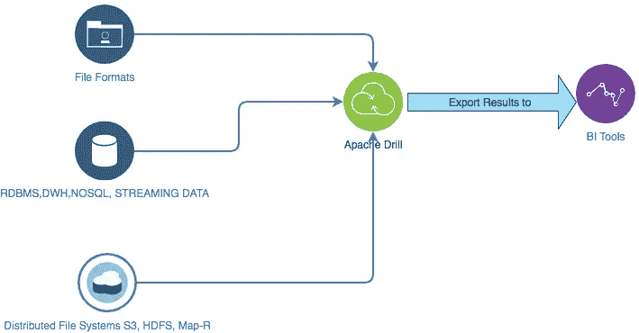*

*什么是 Apache Drill: Apache Drill 是用于 Hadoop、NoSQL 和云存储的无模式 SQL 查询引擎。它使用标准的 ANSI SQL。*

*Drill 使用一种通用语言**“SQL”方便了对各种不同数据源和格式的特别分析。***

*Drill 是通用的，支持各种文件格式、数据源和云区域。Drill 查询文件格式，如 CSV、TSV、拼花、PSV 或其他分隔数据、JSON、AVRO、Hadoop 序列文件、Apache 和 web 服务器日志、日志文件、PCAP、PCAP-NG。*

*Drill 查询不同的数据源，如 Hive，Hbase，Kafka 的流数据，Mongo DB，Map-R DB，开放式时间序列数据库，任何具有 JDBC 驱动程序的 RDBMS。*

*最后，Drill 支持分布式文件系统，如 HDFS、MapR-FS、AWS -S3。*

*Drill 使只具备 SQL 或 BI 工具(如 Tableau)知识的分析师能够分析和查询他们的数据，而不必转换数据或将其移动到集中的数据存储。*

***钻机的动力**:*

*这就是**敏捷性**:无需数据加载、模式创建和维护、转换等，您就可以获得更快的洞察力。, )*

***灵活**:您可以分析非关系数据存储中的多结构和嵌套数据，您可以直接工作，无需转换或限制数据。*

***熟悉度**:熟悉 SQL 和 BI 工具(Tableau、Qlikview、Excel 等。,)*

*Drill 不需要在查询数据之前创建模式，这也很容易做到。您可以使用 Drill 查询原始数据。它提供了复杂数据的 JSON 文档模型和列执行引擎。*

***连接不同数据存储的查询**:单个查询可以连接来自多个数据存储的数据。例如，您可以将 MongoDB 中的用户配置文件集合与 Hadoop 中的事件日志目录结合起来。*

*演练用例:从非结构化数据源收集数据，并对数据进行分析。*

*用例描述:在我们的用例中，数据已经以 json 文件格式从不同的系统中提取出来。我们需要在集群中分析这些数据(由于 json 文件形式的大规模数据)。*

*以下是执行数据分析的步骤:*

1.  *检查已经预先定义的工具，如 Hive，Pig 和 Spark。*
2.  *比方说 hive:您需要在即席查询之前首先定义模式，所以 Hive 不适合*
3.  *Pig:它是一种脚本语言:你必须热衷于拉丁脚本，并且需要将复杂的查询划分到多个语句中。*
4.  *Spark Core (or )Spark — SQL:您已经清理了数据，然后定义了模式。*
5.  *如果您考虑钻取，那么没有必要检查上述语句，只需对文件进行查询，并立即获得查询结果。例如:查询 json 数据:选择 SELECT timestamp FROM '**JSON/sales . JSON `**其中 location _ id = ' 1*
6.  *使用标准 SQL 语句执行所需的分析，最后连接到任何 BI 工具以可视化数据。就这些。*
7.  *通过使用 Apache Drill 只需要标准的 SQL。如果您有大规模的数据，那么您需要形成钻取集群，然后进行分析。*

*最后一步是在云中执行，我选择 AWS 弹性 MapReduce 分布。*

*[https://docs . AWS . Amazon . com/EMR/latest/release guide/EMR-spark-launch . html](https://docs.aws.amazon.com/emr/latest/ReleaseGuide/emr-spark-launch.html)—点击此链接创建集群、配置 spark、hadoop 等*

1.  *使用您的凭证登录 AWS 控制台[https://console.aws.amazon.com/elasticmapreduce/](https://console.aws.amazon.com/elasticmapreduce/)*
2.  *点击“创建集群”->给出集群名称，选择启动模式、s3 位置、软件配置、硬件配置、安全性等。，以下是截图。如果您想自己选择软件，请单击“进入高级选项”。*

*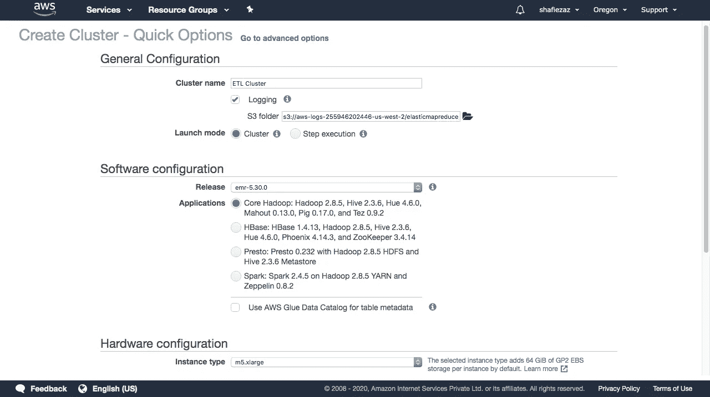**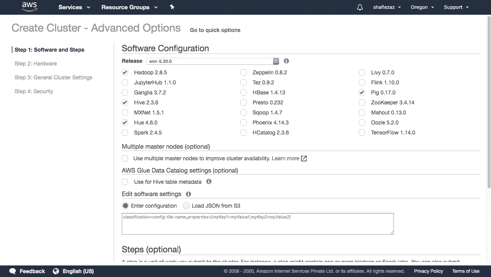*

*在 AWS 中执行应用程序后，请确保您必须停止集群，否则计费将继续，直到您停止集群。*

*在配置集群和节点数量的选择上有些力不从心，作为架构师，您必须考虑数据大小、执行时间、完成此任务所需节点数量的计算等。，注意这里要多加小心。*

***可视化数据**:数据分析完成后，BI 团队或分析师开始将分析数据可视化，以图片的形式呈现数据。有很多方法可以将数据可视化到不同的报告中(图形、直方图、条形图、饼图等)。,).市场上有很多可用的工具，如 Qlikview、Cognos、Tableau、SAP BI 等。,*

***何去何从**:以独立模式启动 do R & D，阅读 Spark 和 Hadoop 相关工具的文档，根据你要思考的用例&考虑哪些工具可以满足你的需求。尝试创建您自己的用例并应用于 Spark & Hadoop，遵循不同的架构和样本，成为专家。*

*请注意，我没有把代码分享给用例，只是高层次的架构和通常的方法。许多事情需要涵盖，但在一个单一的博客无法涵盖。*

*感谢阅读这篇文章，请留下评论或错误等。,*