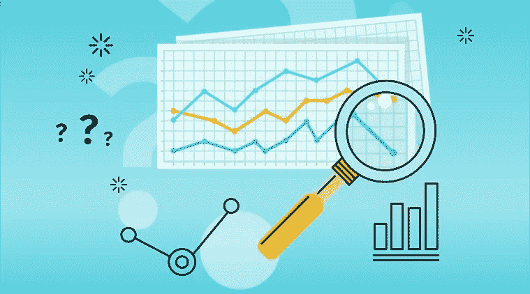
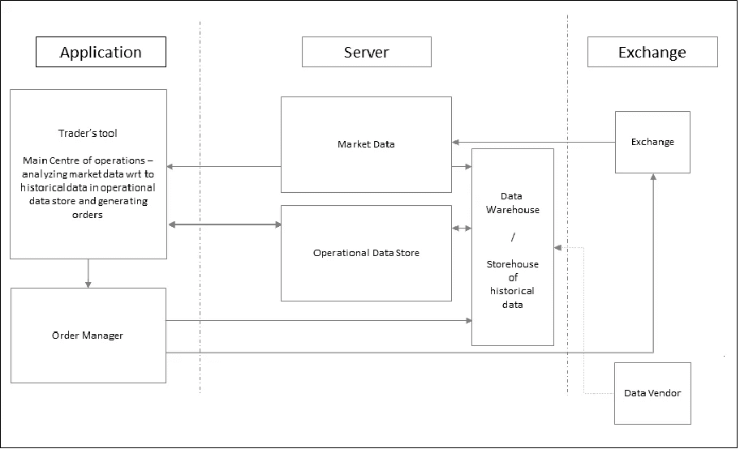
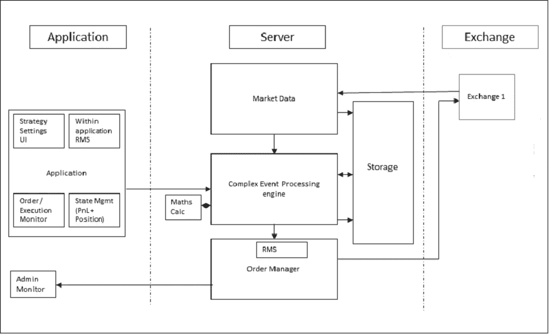
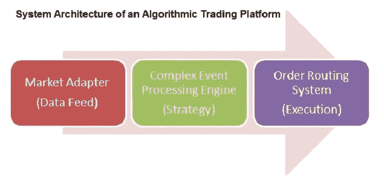
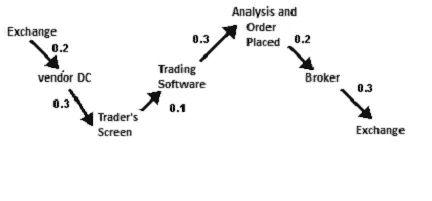
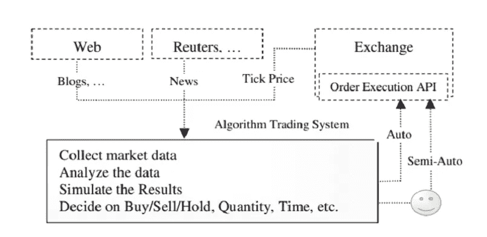

# 算法交易中的大数据

> 原文：<https://medium.com/analytics-vidhya/big-data-in-algorithmic-trading-bd0bb1f9dfca?source=collection_archive---------0----------------------->

**算法交易历史**

早在 20 世纪 80 年代，纽约证券交易所就使用了程序交易，套利交易者对订单进行预编程，以便在 S&P500 期货价格和指数价格相差甚远时自动交易。随着市场走向完全电子化，人类在交易大厅的存在逐渐变得多余，高频交易者的崛起出现了。一类特殊的算法交易员凭借其交易软件的速度和延迟优势，对订单流做出了更快的反应。

到 2009 年，高频交易公司估计占到美国股票交易量的 73%。

**什么是算法交易？**

计算机和通信技术的应用刺激了算法交易的兴起。算法交易是使用计算机程序输入交易订单，其中计算机程序决定订单的几乎每个方面，包括订单的时间、价格和数量等。

过去，投资研究是基于日常信息和模式进行的。现在市场的波动性比以往任何时候都大，因此风险因素增加了。投资银行已经将风险评估从日间增加到日间。印度央行的利率、关键的政府政策、来自 SEBI 的新闻、季度业绩、地缘政治事件和许多其他因素都会在几秒钟内对市场产生巨大影响。

投资银行使用算法交易，其中包含一个复杂的机制，可以从有洞察力的数据中得出商业投资决策。算法交易涉及使用复杂的数学以极高的速度得出衍生品、股票、外汇汇率和大宗商品的买卖指令。

算法交易系统的核心部分是估计潜在交易的风险报酬率，然后触发买入或卖出行为。风险分析师帮助银行获得交易和执行规则。风险分析师通过投资组合中资产价值的变化来估计市场风险。估计一个投资组合的风险系数所涉及的计算大约是数十亿。算法交易使用计算机程序来自动化交易行为，不需要太多的人工干预。

算法交易已经被机构投资者和个人投资者所采用，并在实践中获利。算法交易的灵魂是交易策略，它建立在技术分析规则、统计方法和机器学习技术的基础上。大数据时代即将到来，虽然利用算法交易中的大数据是一项具有挑战性的任务，但当埋藏在数据中的宝藏被挖掘出来并被利用时，就有一个巨大的潜力，即一个人可以率先获得巨大的利润。

算法交易的灵魂是交易策略，它建立在技术分析规则、统计方法和机器学习技术的基础上。大数据时代即将到来，虽然利用算法交易中的大数据是一项具有挑战性的任务，但当埋藏在数据中的宝藏被挖掘出来并被利用时，就有一个巨大的潜力，即一个人可以率先获得巨大的利润。

**大数据如何工作**

遵循大数据的 4 V，组织使用数据和分析来获得有价值的洞察力，从而做出更好的业务决策。已经采用大数据的行业包括金融服务、技术、营销和医疗保健等。大数据的采用继续重新定义行业的竞争格局。据估计，84%的企业认为，没有分析战略的企业有失去市场竞争优势的风险。特别是金融服务，已经广泛采用大数据分析来提供更好的投资决策，并获得一致的回报。结合大数据，算法交易使用大量历史数据和复杂的数学模型来最大化投资组合回报。大数据的持续采用将不可避免地改变金融服务的格局。然而，除了显而易见的优势，大数据在捕获不断增长的数据量的能力方面仍然存在重大挑战。

大数据的基础是 4 V:容量、多样性、准确性和速度。面对日益激烈的竞争、法规约束和客户需求，金融机构正在寻找利用技术提高效率的新途径。根据行业的不同，公司可以利用大数据的某些方面来获得竞争优势。大数据可以分为非结构化数据和结构化数据。非结构化数据是无组织的信息，不符合预先确定的模型。这包括从社交媒体来源收集的数据，这有助于机构收集关于客户需求的信息。结构化数据由组织已经在关系数据库和电子表格中管理的信息组成。因此，必须积极管理各种形式的数据，以便做出更好的业务决策。

# **大数据在算法交易中的作用**

1.  **技术分析:**技术分析是对价格和价格行为的研究，以图表为主要工具。

2.实时分析:自动化过程使计算机能够以人类交易员无法达到的速度和频率执行金融交易。

**3。机器学习:**通过机器学习，算法不断获得数据，并通过从过去的错误中学习，根据过去的结果从逻辑上推导出新的结论，并根据成千上万个独特的因素创造出有意义的新技术，从而随着时间的推移变得更加智能。

# **传统交易架构**

人们发现，传统的体系结构无法满足使用 DMA 进行自动交易的需求。从事件发生到订单生成之间的延迟超出了人类控制的范围，进入了毫秒和微秒的领域。订单管理也需要更加强大，能够每秒处理更多的订单。由于时间框架与人类的反应时间相比微不足道，风险管理还需要以完全自动化的方式实时处理订单。

例如，即使订单的反应时间是 1 毫秒(与我们今天看到的延迟相比，这是一个很大的延迟)，系统仍然能够在一秒钟内做出 1000 个交易决定。因此，这 1000 个交易决定中的每一个都需要在同一秒内通过风险管理才能到达交易所。你可以说，谈到自动交易系统，这只是一个复杂性的问题。

出现的另一点是，由于架构现在涉及自动化逻辑，100 名交易员现在可以被一个单一的自动化交易系统取代。这增加了问题的规模。因此，每个逻辑单元生成 1000 个订单，100 个这样的单元意味着每秒 100，000 个订单。这意味着决策和订单发送部分需要比市场数据接收器快得多，以便与数据速率相匹配。

# **自动化交易架构**

一个典型算法交易系统的数据流。首先，交易系统从交易所收集价格数据(对于跨市场套利，系统需要从多个交易所收集价格数据)，从新闻公司(如路透社、彭博)收集新闻数据。一些算法交易系统也可以从网络上收集数据用于深度分析，例如情绪分析。在收集数据的同时，系统会对数据进行一些复杂的分析，以寻找有利可图的机会，并期望从中获利。有时，交易系统会进行模拟，看看这些行为会导致什么结果。最后，系统决定买入/卖出/持有行为、订单数量和交易时间，然后产生一些交易信号。可以使用预定义的数据格式将信号直接传输到交易所，并且通过交易所公开的 API 立即执行交易指令，而无需任何人工干预。一些投资者可能想看看算法交易系统产生了什么信号，他可以手动启动交易动作，或者干脆忽略这些信号。人类的干预是一把双刃剑，一方面它可以根据人类的经验筛选掉一些无利可图的信号，另一方面人类很可能犯错误，他们不能以一致的方式交易，因为他们会疲劳，过于悲观或过于乐观，一个人的情绪会极大地影响交易。在笔者看来，如果算法交易设计得当，经过彻底验证，不如让系统来做整件事，从数据分析，到决定交易动作，到发起执行交易指令。

**算法交易总流程图**

*市场适配器(数据馈送)*

*复杂事件处理(策略)*

*订单路由(执行)*

# **大数据如何用于算法交易**

专有算法交易系统有几个标准模块，包括交易策略、订单执行、现金管理和风险管理。交易策略是自动交易系统的核心。复杂的算法被用来分析数据(价格数据和新闻数据)以捕捉市场异常，识别盈利模式，或者检测竞争对手的策略并利用这些信息。在交易策略中使用各种技术来从数据中提取可操作的信息，包括规则、模糊规则、统计方法、时间序列分析、机器学习以及文本挖掘。

⦁技术分析和规则

统计的⦁应用

⦁人工智能，基于机器学习的算法交易

算法交易的⦁文本挖掘

⦁为稳定网上贸易创造了公平的竞争环境。

算法交易是金融界的当前趋势，机器学习有助于计算机快速分析。大数据分析提供的实时画面为个人和交易公司提供了改善投资机会的潜力。

**⦁对结果和回报的估计。**

获取大数据有助于降低在线交易的潜在风险，并做出精确预测。财务分析有助于结合影响趋势、定价和价格行为的原则。

**⦁做出准确预测**

大数据可以与机器学习结合使用，这有助于根据逻辑而不是估计和猜测做出决定。可以检查数据并开发应用程序来定期更新信息，以便做出准确的预测。

**⦁回溯测试策略**

算法交易的特点之一是回测能力。交易者很难知道他们交易系统的哪些部分有效，哪些部分无效，因为他们不能根据过去的数据运行他们的系统。有了 algo 交易，你可以根据过去的数据运行算法，看看它在过去是否有效。这种能力提供了一个巨大的优势，因为它让用户在运行交易系统之前就可以消除它的任何缺陷。

# **算法交易的主要特点**

**⦁市场和公司数据的可用性。**

所有的交易算法都是为实时市场数据和报价而设计的。一些程序也是定制的，以考虑公司基本面数据，如每股收益和市盈率。任何算法交易软件都应该有实时的市场数据，以及公司数据。它应该可以作为系统的一个内置组件，或者应该可以很容易地从其他来源集成。

⦁ **连接各个市场。**

希望在多个市场交易的交易者应该注意，每个交易所可能会以不同的格式提供数据，如 TCP/IP、多播或 FIX。您的软件应该能够接受不同格式的提要。另一种选择是与第三方数据供应商合作，如彭博和路透社，它们从不同的交易所收集市场数据，并以统一的格式提供给最终客户。算法交易软件应该能够根据需要处理这些聚合饲料。

**⦁潜伏期。**

这是算法交易最重要的因素。延迟是数据点从一个应用程序移动到另一个应用程序时产生的时间延迟。考虑下面的一系列事件。报价从交易所传到软件供应商的数据中心(DC)需要 0.2 秒，从数据中心传到交易屏幕需要 0.3 秒，交易软件处理收到的报价需要 0.1 秒，分析和下单需要 0.3 秒，交易订单到达经纪人需要 0.2 秒，经纪人将订单发送到交易所需要 0.3 秒。

*总耗时= 0.2 + 0.3 + 0.1 + 0.3 + 0.2 + 0.3 =总计 1.4 秒。*

在今天的动态交易世界中，原始报价在这 1.4 秒的时间内会改变多次。这种延迟可能会成就或毁掉你的算法交易。人们需要将这种延迟保持在尽可能低的水平，以确保您获得最新和最准确的信息，而没有时间间隔。

延迟已经减少到微秒，在交易系统中应该尽一切努力使其尽可能低。一些措施包括直接连接到交换机，通过消除中间的供应商来更快地获取数据；改进你的交易算法，使分析和决策的时间少于 *0.1+0.3 = 0.4* 秒；或者取消经纪人，直接将交易发送到交易所，以节省 *0.2 秒。*

**⦁可配置和定制。**

大多数算法交易软件提供标准的内置交易算法，例如基于 50 日均线(MA)和 200 日均线交叉的算法。交易者可能喜欢用 100 日均线切换到 20 日均线来做实验。除非软件提供这种参数定制，否则交易者可能会受到内置固定功能的限制。无论是购买还是构建，交易软件都应该具有高度的可定制性和可配置性。

**⦁编写定制程序的功能。**

MATLAB、Python、C++、JAVA 和 Perl 是用来编写交易软件的常用编程语言。第三方供应商出售的大多数交易软件都提供了在其中编写自定义程序的能力。这允许交易者试验和尝试他或她开发的任何交易概念。提供你所选择的编程语言编码的软件显然是首选。

**⦁对历史数据的回测功能。**

回溯测试模拟包括根据历史数据测试交易策略。它根据过去的数据评估战略的实用性和盈利能力，证明其成功(或失败或任何需要的改变)。这个强制特性还需要伴随着历史数据的可用性，在这些数据上可以执行回溯测试。

**⦁与交易接口的集成。**

算法交易软件根据期望的标准自动进行交易。该软件应具备与经纪人网络进行交易的必要连接，或与交易所发送交易订单的直接连接。

**⦁即插即用集成。**

交易者可能同时使用彭博终端进行价格分析，经纪人终端进行交易，MATLAB 程序进行趋势分析。根据个人的需要，算法交易软件应该具有简单的即插即用集成和跨这些常用交易工具的可用 API。这确保了可伸缩性和集成性。

**⦁路透社是什么？**

路透社是一家全球信息提供商，总部位于英国伦敦，为金融、媒体和企业市场的专业人士提供服务。路透社是一家独立的全球新闻和金融信息公司，总部设在伦敦，直到 2008 年被汤姆森金融公司收购。母公司，现在被称为汤姆森路透集团，总部设在纽约市。股票在纽约和多伦多交易所上市。

**⦁什么是彭博？**

彭博是 24 小时金融新闻和信息的主要全球提供商，包括实时和历史价格数据、金融数据、交易新闻和分析师报道，以及一般新闻和体育。它的服务横跨自己的平台、电视、广播和杂志，为金融专业人士提供专业的分析工具。彭博的主要收入来源之一是彭博终端(Bloomberg Terminal)，这是一个集成平台，可将价格数据、财务数据、新闻和交易数据汇集到全球 30 多万客户。

另一种选择是与第三方数据供应商合作，如彭博和路透社，它们从不同的交易所收集市场数据，并以统一的格式提供给最终客户。算法交易软件应该能够根据需要处理这些聚合饲料。

# **用于算法交易的策略**

**⦁执行**

想象一下，如果你是一个巨大的主权财富基金，订购 1 亿美元的苹果股票。你认为你选择的价格会有足够的卖家吗？你认为在订单完成之前股价会发生什么变化？

在这种情况下，可以使用一种算法来分解订单，并在一个交易日内有策略地进行下单。在这种情况下，交易者并没有从这个策略中获利，但他更有可能为自己的进场交易获得更好的价格。

**⦁套利**

在一个市场以较低的价格买入一只两地上市的股票，同时在另一个市场以较高的价格卖出，这种差价就是无风险利润或套利。如果你看到一个香奈儿包在法国的价格是 5000 美元，在新加坡是 6000 美元，你会怎么做？显而易见的答案是在法国买入，在新加坡卖出。这是通过赚取两国之间的差价获得的无风险利润。类似地，如果一个人发现期货和现货市场的价格差异，algo 交易者可以因此得到警告并加以利用。

**⦁趋势跟随**

有很多投资大师声称拥有基于技术分析的最佳策略，依赖于移动平均线、动量、随机性等指标。一些自动交易系统利用这些指标来触发买卖指令。交易是基于理想趋势的出现而启动的，这种趋势通过算法实现起来简单明了，不需要复杂的预测分析。使用 50 和 200 日均线是一种流行的趋势跟踪策略。

**⦁指数基金再平衡**

指数基金定义了重新平衡的周期，以使其持有的资产与各自的基准指数持平。这为算法交易员创造了有利可图的机会，他们利用预期交易，根据指数基金重新平衡前指数基金中的股票数量，提供 20 至 80 个基点的利润。此类交易通过算法交易系统启动，以便及时执行并获得最佳价格。

**基于⦁数学模型的策略**

成熟的数学模型，如 delta 中性交易策略，允许结合期权和基础证券进行交易。(delta neutral 是一种由多个头寸组成的投资组合策略，这些头寸具有相互抵消的正 Delta 和负 Delta，即一种资产(通常是有价证券)的价格变化与其衍生产品价格相应变化的比率，因此相关资产的总 Delta 为零。)

**⦁交易区间(均值回归)**

均值回归策略是基于这样一个概念，即资产的高价格和低价格是一种暂时现象，会周期性地回归到它们的均值(平均值)。确定和定义一个价格范围，并在此基础上实现一种算法，当资产价格突破或超出其定义的范围时，可以自动进行交易。

**⦁成交量加权平均价格**

成交量加权平均价格策略分解大订单，并使用特定股票的历史成交量曲线向市场发布动态确定的较小订单块。目标是执行接近成交量加权平均价格(VWAP)的订单。

**⦁时间加权平均价格(TWAP)**

时间加权平均价格策略分解一个大订单，并使用在开始和结束时间之间均匀划分的时间段向市场发布动态确定的较小订单块。目标是在开始和结束时间之间以接近平均价格的价格执行订单，从而将市场影响降至最低。

**⦁体积百分比(POV)**

在交易订单完全成交之前，该算法会根据定义的参与比例和市场交易量继续发送部分订单。相关的“步骤策略”以用户定义的市场交易量百分比发送订单，并在股价达到用户定义的水平时增加或减少这一参与率。

**⦁实施不足**

执行短缺策略旨在通过权衡实时市场来最小化订单的执行成本，从而节省订单成本并受益于延迟执行的机会成本。该策略将在股价走势有利时提高目标参与率，在股价走势不利时降低目标参与率。

# **自动化对市场的影响**

**⦁波动**

在速度超快的电脑上用经过良好测试的交易软件进行零售交易，就像跳进鲨鱼出没的水域。随着市场波动加剧，基本面投资者现在更难进入市场。举个夸张的例子，想象一下打电话执行一个买单。在这几秒钟内，HFT 可以执行多名交易者，从你的最终进场价格中获利。

**⦁股市崩盘**

假设每个人都看到这个 algo 交易策略，并选择遵循它。如果由于某种原因，市场小幅下跌，并立即触发卖单以减少损失，价格可能会立即崩溃，因为市场上没有买家。1987 年的股市崩盘、2010 年的闪电崩盘以及其他许多著名的例子。

**⦁流动性**

人们很自然地认为，随着计算机自动执行交易，流动性应该会增加。然而，当市场崩溃时，问题就来了。在重大崩盘中，比如最近瑞士央行取消盯住美元政策，瑞士法郎根本没有流动性，导致价格迅速崩盘。这甚至导致几大券商瞬间破产。

谢谢大家！