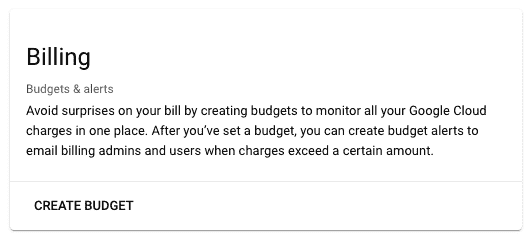
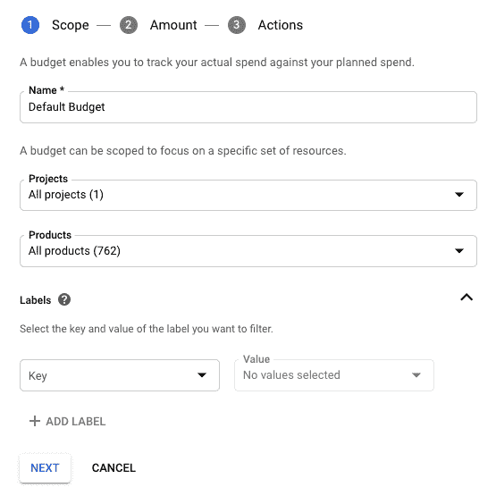
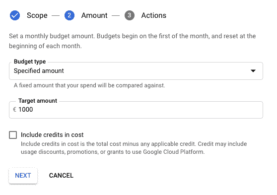
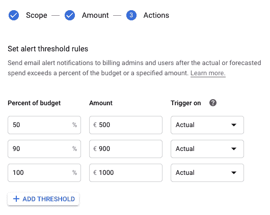
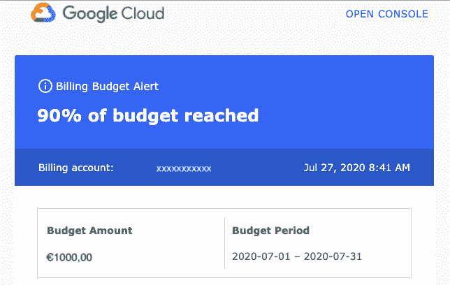

# 谷歌云中的大数据——成本监控

> 原文：<https://medium.com/analytics-vidhya/big-data-in-google-cloud-cost-monitoring-da22282f6744?source=collection_archive---------19----------------------->

这是三部曲中的第一部。

大约在 2019 年初，当我们将大数据解决方案迁移到谷歌云平台(GCP)时，我们不知何故地担心**的成本会如何根据**如何组织**而变化**，以及**我们的内部用户将如何利用提供的数据**，主要是在 BigQuery (BQ)中。此外，我们不希望我们的内部用户在使用数据时担心成本，但同时，我们也不希望愚蠢的错误给我们带来不必要的成本，因为我们选择了按需成本模型。

所以这篇文章是关于我们如何解决成本问题的故事。

[https://pix abay . com/photos/savings-budget-investment-money-2789137/](https://pixabay.com/photos/savings-budget-investment-money-2789137/)

我想先告诉你我们做了什么，按什么顺序，为什么。此外，如果我们犯了任何错误，那么我将分享我对这些错误的想法，并谈谈我们当时的想法和我们现在认为需要改进的地方。

重要的是，尽管当时团队中没有人有使用 GCP 的经验，即使在使用了一年多之后，我确信我们还有很多要学习的。

# 培训内部用户

大部分成本来源将由团队直接管理，除了可能成为我们成本的一大块，也就是 BigQuery。我们有产品分析师、数据科学家、业务分析师和许多其他人，他们利用我们的流程生成的数据。在迁移的时候，他们都习惯于配置单元，并且使用我们当时的配置，他们所做的任何事情都不会产生额外的成本。现在，任务是让他们轻松过渡到 BQ，并指导他们如何意识到成本。

## BigQuery 降低成本的一般准则

鉴于 BigQuery 是按使用的数据量收费的，我们向内部用户提供以下通用指南:

*   **优先考虑手头的任务**，而不是成本；
*   **如果您需要的只是对数据有所了解，请使用预览**；
    不收费。
*   **利用为本地表提供的消耗预测**；

消费预测的一个例子

*   完成目标所需的数据越少越好。

下面是一些减少查询使用的数据量的方法:

*   **按分区过滤表；**
    可以根据需要配置一个表。
    对于外部表格，也可以通过特殊字段*_ 文件名*进行过滤，只加载匹配的文件，降低成本。
    ⚠️关于外部表，它会扫描所有需要的文件来满足您的查询(并为此向您收费)，**所以不要被显示以下内容的消费预测**所迷惑:

*   **只选择必要的列；**
    这就是为什么视图有时不太理想，因为它们将对所有列收费，而不管最终查询使用了多少列。
*   **用 _TABLE_SUFFIX 伪列**过滤通配符表；
*   **重用缓存的查询；**
    使用缓存中数据的查询不收费。
    虽然有很多限制([https://cloud.google.com/bigquery/docs/cached-results](https://cloud.google.com/bigquery/docs/cached-results))，但总的原则是**查询和数据必须保持不变**,**查询不能使用非确定性函数**，比如 CURRENT_DATE()。
    ⚠️通配符表没有被缓存。
*   使用**限制**不影响成本。

# 预算

很明显，仅仅培训我们的用户是不够的，我们要担心的不仅仅是 BigQuery。因此，从一开始，我们就希望有一些关于成本的警报系统。我们发现实现这一目标的最简单方法是设定预算。
(参见[https://cloud.google.com/billing/docs/how-to/budgets](https://cloud.google.com/billing/docs/how-to/budgets))

> *预算使您能够对照计划支出跟踪实际的谷歌云支出*

这真的很简单，可能足以满足您的需求。这个想法只是为了建立你预计到每个月底要花多少钱(或者以上个月为基础)，并设定一些门槛规则。当成本达到这些阈值或百分比时，将会发送一封电子邮件。

设定预算的步骤(如果你有权限的话):

1 转到计费
2。预算&警报
3。点击“创建预算”

4.填写表格

5.设置金额

6.设置阈值规则

每当您的当前费用达到您配置的阈值时，您都会收到一封如下所示的电子邮件:

这是第一部分。
在我们接下来的两篇文章中，我们将看到:
- [谷歌云中的大数据-成本监控(第二部分)
导出日志数据和计费数据；](/@leonardoaugusto.campos/big-data-in-google-cloud-cost-monitoring-part-ii-a78615627af9)
- [谷歌云中的大数据——成本监控(第三部分)将数据点发送到云监控并创建警报](/@leonardoaugusto.campos/big-data-in-google-cloud-cost-monitoring-part-iii-13dd5e9f36ac)。

如果您有任何问题、意见或建设性的反馈，请在评论中留下。