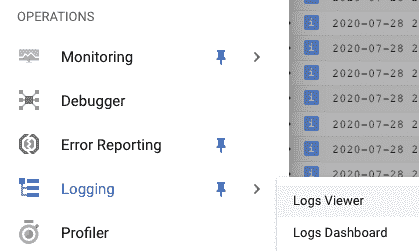
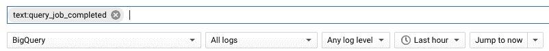
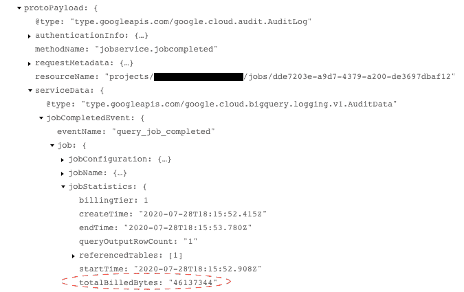
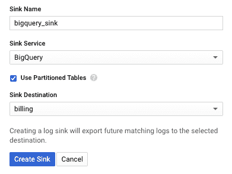
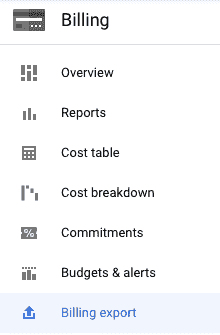
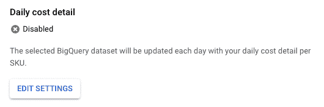
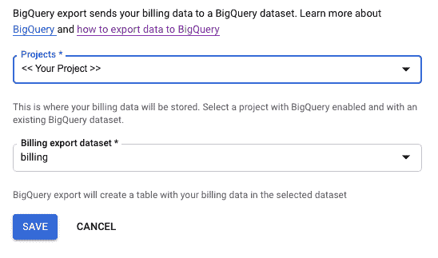

# 谷歌云中的大数据——成本监控(第二部分)

> 原文：<https://medium.com/analytics-vidhya/big-data-in-google-cloud-cost-monitoring-part-ii-a78615627af9?source=collection_archive---------16----------------------->

这是三部分中的第二部分。

在我们的上一篇[帖子](/@leonardoaugusto.campos/big-data-in-google-cloud-cost-monitoring-da22282f6744)中，我们主要讨论了如何在成本方面有意识地使用 BigQuery (BQ)的**指南的使用，以及**如何建立简单的预算**以便在达到某个阈值时得到警告。**

在本帖中，我们将讨论控制成本的下一步，即将与成本相关的来源导出到 BQ。


[https://pix abay . com/photos/euro-coins-currency-money-yellow-1353420/](https://pixabay.com/photos/euro-coins-currency-money-yellow-1353420/)

# 将云审计日志数据导出到 BigQuery


记录

我们从一开始采取的另一个行动是设置一种方法，将云审计日志中的 BigQuery 生成的日志数据导出回 BigQuery 本身。这将允许我们使用这些数据为我们自己和我们的内部用户提供几乎实时的成本信息。

有了 BigQuery 中的这些数据，我们已经可以这样做了:

*—检索用户在给定日期产生的费用
从“billing.bigquery_usage”中选择 SUM(TotalCost)其中 DATE(日期)= ' 2020–07–28 '和 userId = '*[*user@example.com*](mailto:user@example.com)*'*

或者

*—检索给定日期的前 5 个最昂贵的查询
从“billing.bigquery_usage”中选择查询总成本，其中 DATE(DATE)=“2020–07–28”ORDER BY 总成本限制 5*

这里描述的方法很大程度上受到了这篇文章([https://cloud . Google . com/blog/products/Data-analytics/taking-a-practical-approach-to-big query-cost-monitoring](https://cloud.google.com/blog/products/data-analytics/taking-a-practical-approach-to-bigquery-cost-monitoring))的启发，但 Data Studio 部分除外，它是我们在很久以后才建立的。

在这篇文章中，我们将采取一种实际的方法，一步一步的行动。但是，在开始行动之前，让我们快速地看一下我们将要构建这个解决方案的原始数据源。

# 记录数据

1 -转到日志记录>日志查看器



2 -在筛选器上，写下“查询 _ 作业 _ 已完成”并选择 BigQuery



3 -每个返回的项目都有“totalBilledBytes”



# 导出日志记录数据

好了，现在我们知道了从哪里获取数据，让我们把它移到 BQ。

步骤:

1 -转到 BigQuery 并创建一个名为“billing”的模式(或者您喜欢的任何名称)

2 -在日志查看器页面上(记录数据的步骤 1)，单击页面顶部的“创建接收器”链接。


3 -创建水槽。
重要提示:选择 BigQuery 并勾选“使用分区表”。对于接收器目标，使用步骤 1 中使用的相同名称。



4 -创建接收器几分钟后，您选择的模式上将出现一个表。


如果您没有选中“使用分区表”，那么它将每天创建一个后缀表，这并不坏，因为您可以使用“通配符表”


在上面的示例中，它将(510)显示为已经创建的表的数量。
当你点击它时，你会看到一个组合框来选择你想要的:


5 -创建一个视图:
一旦你有了上面的表格，按照以下步骤操作:

将以下查询粘贴到 BigQuery 中；

```
SELECT
 timestamp AS Date,
protopayload_auditlog.authenticationInfo.principalEmail AS UserId,
protopayload_auditlog.servicedata_v1_bigquery.jobCompletedEvent.job.jobConfiguration.query.query AS Query, protopayload_auditlog.servicedata_v1_bigquery.jobCompletedEvent.job.jobStatistics.billingTier AS BillingTier,(protopayload_auditlog.servicedata_v1_bigquery.jobCompletedEvent.job.jobStatistics.totalBilledBytes / 1000000000) / 1000 AS TotalBilledTerabytes, ((protopayload_auditlog.servicedata_v1_bigquery.jobCompletedEvent.job.jobStatistics.totalBilledBytes / 1000000000) / 1000) * 5 AS TotalCost
FROM `YOUR_PROJECT.billing.cloudaudit_googleapis_com_data_access`
WHERE
protopayload_auditlog.serviceName = ‘bigquery.googleapis.com’
AND protopayload_auditlog.methodName = ‘jobservice.jobcompleted’
AND protopayload_auditlog.servicedata_v1_bigquery.jobCompletedEvent.eventName = ‘query_job_completed’
```

⚠️:请注意，我们使用一个“神奇的数字”5 乘以总计费字节数，得出总成本。这是每 TB 的成本，只要价格不是 5，就应该改变。

在查询**中将 YOUR_PROJECT** 字符串替换为项目的真实名称；

如果您选择了“使用分区表”,那么只需进入下一步，否则，您应该在 FROM 子句中的表名末尾添加一个 **_*** ;

6 -在“保存视图”中单击

选择“计费”作为模式

将其命名为“bigquery_usage”。

# 将帐单信息导出到 BigQuery

还有一个与成本相关的重要数据来源，那就是账单。这在本文(
[https://cloud . Google . com/billing/docs/how-to/export-data-big query？_ga=2.224218008。-206288519](https://cloud.google.com/billing/docs/how-to/export-data-bigquery?_ga=2.224218008.-2062880994.1552839519))

让我们直接进入步骤:

1 -接入计费>>计费导出



它将显示此页面:



2 -点击“编辑设置”



3 -点击“保存”

好吧，很简单，对吧？大概在第二天，您应该会看到所选模式上的一个表，如下所示


标识符是计费帐户 Id

查询示例(用您的账单账户 Id 替换标识符):

*WITH groupedByService AS(SELECT service . description，SUM(Cost)Cost FROM ` billing . GCP _ billing _ export _ v1 _<<IDENTIFIER>>` WHERE _ partition time = ' 2020–08–03 ' GROUP BY service . description)
SELECT * FROM groupedByService WHERE Cost>10 ORDER BY Cost desc*

我不得不承认，在一年多的时间里，我们能够忍受的只是预算、账单页面上的报告以及我们如上所述导出到 BQ 的信息。我们还设置了个人提醒来每天检查这些数据，但是过了一段时间，我们开始忽略我们的提醒🙈。

所以我们真的需要一些警报系统，这导致了我们的下一篇文章:
-[Google Cloud 中的大数据——成本监控(第三部分)向云监控发送数据点并创建警报](/@leonardoaugusto.campos/big-data-in-google-cloud-cost-monitoring-part-iii-13dd5e9f36ac)。

如果你错过了我们之前的另一篇文章:[谷歌云中的大数据——成本监控](/@leonardoaugusto.campos/big-data-in-google-cloud-cost-monitoring-da22282f6744)

如果您有任何问题、意见或建设性的反馈，请在评论中留下。