# 谷歌云中的大数据——成本监控(第三部分)

> 原文：<https://medium.com/analytics-vidhya/big-data-in-google-cloud-cost-monitoring-part-iii-13dd5e9f36ac?source=collection_archive---------22----------------------->

这是三部曲中的第三部曲

在我们最近的两篇帖子[第一部分](/analytics-vidhya/big-data-in-google-cloud-cost-monitoring-da22282f6744)和[第二部分](/analytics-vidhya/big-data-in-google-cloud-cost-monitoring-part-ii-a78615627af9)中，我们已经看到了我们如何处理将大数据服务迁移到谷歌云平台(GCP)的成本问题。这是关于我们如何指导我们的内部用户在处理 BigQuery (BQ)时在成本方面的良好做法，我们如何使用预算来建立一个基本的警报系统，以及我们如何从计费和云审计日志(CAL)向 BQ 导入数据。

[https://pix abay . com/插图/营销-扩音器-广告-3740526/](https://pixabay.com/illustrations/marketing-megaphone-advertisement-3740526/)

在本帖中，我们将讨论我们当前的状况:

一个全功能的成本监控系统，它可以指示一些事情，如单个查询超过了某个阈值，或者某一天的成本增加超过了可配置的百分比。

# 云监控

通过前面提到的帖子中显示的步骤，我们已经奠定了基础，现在我们可以拥有一个成熟的警报系统。虽然听起来很复杂，但主要思想非常非常简单。都是把数据点发送到[云监控](https://cloud.google.com/monitoring) (CM)。

所以出现的问题是:

*   什么是“数据点”？
*   怎么发给 CM？
*   如何设置预警？

## 什么是“数据点”？

根据[数字海洋](https://www.digitalocean.com/community/tutorials/an-introduction-to-metrics-monitoring-and-alerting)，

> 数据点是单个指标的单个测量值。

好吧，这些“数据点”到底是什么意思？

让我们以我们的“*当天最昂贵的查询*”策略为例:

每天，我们会在 BQ 中自动运行一次查询，返回开销较大的查询的值，如下所示:

> SELECT ROUND(MAX(TotalCost)，2) FROM billing.bigquery_usage 其中 DATE(DATE)= DATE _ SUB(CURRENT _ DATE()，间隔 1 天)；

这个查询的单一结果将是我们将要发送给 CM 的“数据点”的值。除了值之外，我们还需要一个时间戳来附加到数据点(在我们的例子中是我们运行查询的时间)。

## 怎么发给 CM？

仅举一个例子，我实现了一个简单的 Java 实用程序类及其客户端，以展示如何将这些数据点发送到云监控。这些可以在我的 [GitHub 账号](https://github.com/leocampos/blog/tree/master/src/main/java/de/campos/bigdata/monitoring)里找到:

 [## Leo Campos/博客

### 我的中型博客的代码片段。在 GitHub 上创建一个帐户，为 Leo Campos/博客的发展做出贡献。

github.com](https://github.com/leocampos/blog/blob/master/src/main/java/de/campos/bigdata/monitoring/MetricSender.java) 

首先，检查 MetricSender.java:
我们需要创建一个 TimeSeries 对象，第 50–60 行。这个对象将包装我们已经创建的另外两个重要的对象，指标和数据点(在这个例子中，每次运行只有一个数据点)。

再根据[数字海洋](https://www.digitalocean.com/community/tutorials/an-introduction-to-metrics-monitoring-and-alerting)，

> 时间序列数据是一系列代表时间变化的数据点。大多数指标最好用时间序列来表示，因为单个数据点通常表示特定时间的值，产生的一系列点用于显示一段时间内的变化。

创建了时间序列后，我们可以创建一个请求(CreateTimeSeriesRequest ),最后使用客户机(MetricServiceClient)将它发送给 CM。

在您的代码可以发送“数据点”之前，您的服务帐户应该具有“监控指标写入者”角色。

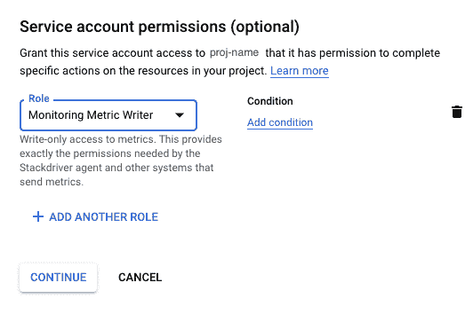

将数据点发送到云监控所需的角色

## 如何设置预警？

1.转到监控>概述

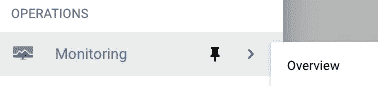

如果这是您第一次使用 CM，您可能需要等待一段时间来创建工作空间，如下图所示。

工作区的创建

2.检查您的指标

一旦工作空间准备就绪，最好的第一步就是查看您的数据。

转到度量浏览器。

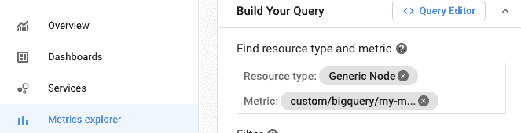

对于*度量*，键入您选择的度量的名称，在我们的示例中，它是“custom . Google APIs . com/big query/my-Metric-name”，对于*资源类型*，键入“Generic Node”。

这是我用不同的“数据点”值和不同的标签测试得到的结果。

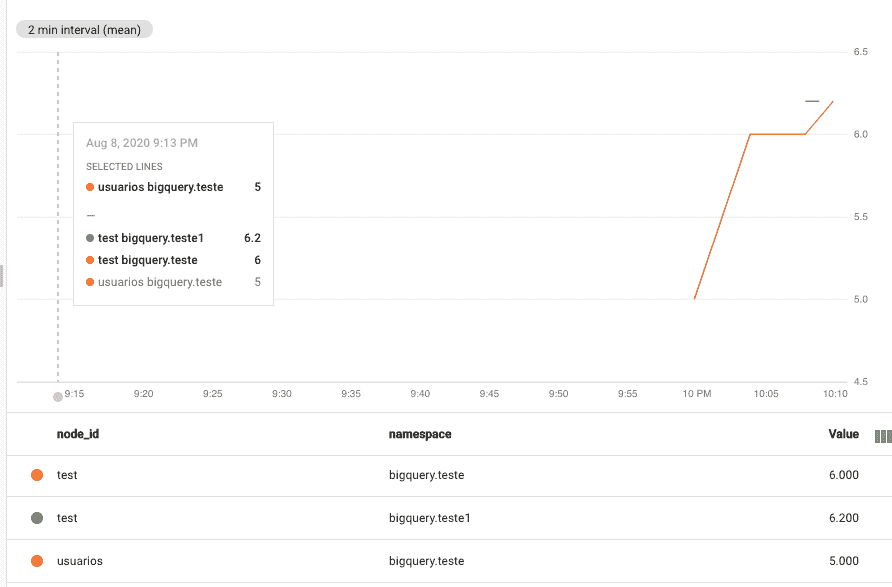

一旦数据点在 CM 中，并且您已经掌握了它们，就只需要使用工具本身来创建警报，在我们的例子中，它会写入一个 slack 通道。

3.创建通知渠道

如果您还没有配置任何“通知通道”，那么这应该是您的第一个任务:

转到“报警”

在最上方，点击“编辑通知渠道”

您将看到一个包含几种不同类型频道的页面。因为我们使用电子邮件和 Slack，所以我们把重点放在它们上面。

**配置邮件为通知渠道:**

要添加电子邮件，点击“添加新的”，弹出一个与被显示:

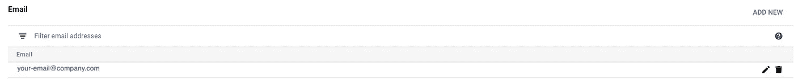

电子邮件列表

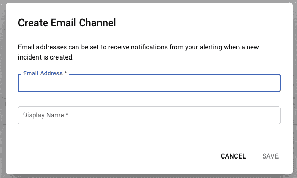

填写所需的“电子邮件地址”和“显示名称”，然后单击“保存”。

**用于将 Slack 配置为通知渠道:**

在松弛部分，点击“新增”

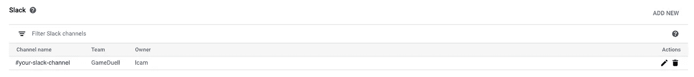

它将重定向到您自己的备用帐户，并要求许可

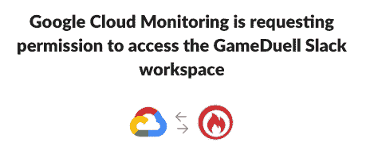

点击“允许”，填写显示的几个字段，然后就可以了。

4.创建策略
现在是创建策略的时候了，转到“Alerting ”,单击“Create Policy”按钮。

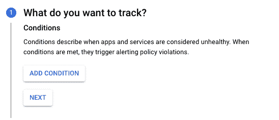

点击“添加条件”

这就像度量浏览器一样

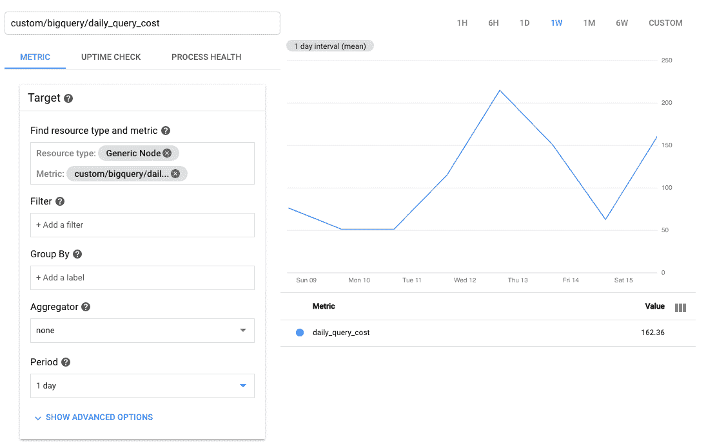

然后配置条件本身

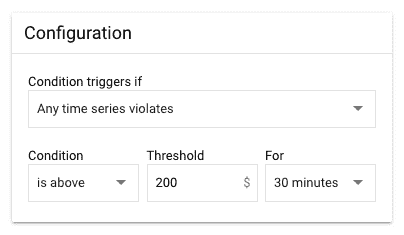

看看可能的配置，它们的含义很容易理解。在本例中，如果该值在至少 30 分钟内高于 200，则将向之前配置的通知通道发送通知。

这是我们更昂贵的查询策略的一个例子

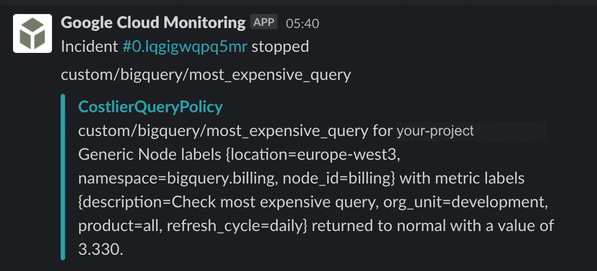

在空闲时间收到的消息

因此，在这篇文章中，我们试图向你展示我们用来创建一个成本监控系统的主要思想。当然，这是一个非常灵活的解决方案，您可以考虑对我们在上一篇文章中收集到的任何数据发出警报。

我们还跳过了如何从 BigQuery 中检索数据的部分，因为这不是这一系列帖子的核心，但是如果您在克服这一部分方面有问题，请留下评论，我很乐意帮助您。

这是关于谷歌云成本监控系列的第三篇也是最后一篇文章。前两个可以找到:

[谷歌云中的大数据—成本监控](/analytics-vidhya/big-data-in-google-cloud-cost-monitoring-da22282f6744)
[谷歌云中的大数据—成本监控(下)](/analytics-vidhya/big-data-in-google-cloud-cost-monitoring-part-ii-a78615627af9)

如果你有任何问题，意见或建设性的反馈，请在评论中留下。