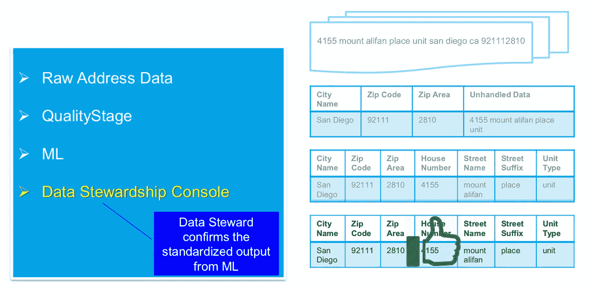
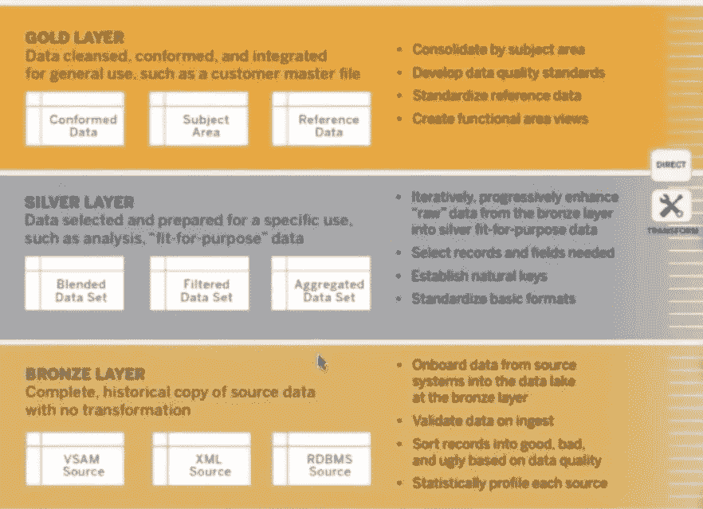

# 分析挑战—大数据管理和治理

> 原文：<https://medium.com/analytics-vidhya/big-data-management-governance-bce5f72821c1?source=collection_archive---------9----------------------->

在 [t](/@ckayay/data-fabric-for-analytics-part-1-699920120ed9) 何[的上一篇文章](/@ckayay/analytics-challenges-21e15be9d855)中，我列出了当今大多数组织面临的分析挑战。在本文中，我将讨论数据管理&治理…

管理企业中所有数据的生命周期需要数据治理。因此，数据治理应该定义流程和规则，以管理如何检索、验证、集成、维护、保护、查找、访问、共享和废弃数据等

数据通常以几种形式来源于遗留系统、记录系统、外部云系统、内部系统。
在拥有数百个这样的系统的企业中，正确地管理和维护整个数据资产是信息架构和数据治理的主题。大多数组织没有运行数据治理计划，也没有信息架构，因为这些计划非常复杂且成本高昂。

相反，所有数据都可以被拉入集中式大数据和分析平台，在那里可以对数据进行清理、控制、管理和处理。

**简而言之，本文将讨论大数据治理……**

**大数据治理&管理架构**

大数据治理解决方案可能会考虑以下因素…

# 治理:

*   数据治理一直被认为是一种开销。
*   数据治理不是一种技术解决方案，而是对数据管理的强制实施。
*   您的组织可能已经有一些可以改进的数据管理和治理实践，或者它是一个绿地分析平台，可以在第一时间建立 DG。因此，需要一个启动和维护数据治理的策略。其中一种方法是非侵入式数据治理。
*   非侵入式方法建议将 DG 流程嵌入到现有流程中，而不是在不引入太多开销的情况下引入新流程。
*   非侵入式 DG 定义了包含重要数据及其所有者的数据域/主题领域，以及数据对业务的影响，以确定相关成本(如果该数据未得到适当治理)—创建业务案例。
*   一旦支持 DG 计划的业务案例获得批准，就可以定义数据治理运营模型。
*   数据治理机构确定数据组原则和数据政策，例如:
    *数据管理政策
    *数据保护政策
    *数据合规性要求& GDPR 政策
    *数据质量标准
*   数据治理机构分配数据管理者，并确定每个领域的权威(数据所有者)。
*   为了推动数据互操作性，数据管家使用企业范围的协议定义数据术语表(也称为分类法),并填充业务数据目录。
*   数据管理员还将管理参考数据。

# 入职培训:

*   假设，业务分析师需要开发一个报告并搜索业务数据目录(其中所有报告都由从报告工具提取的元数据定义),如果没有，她/他请求报告所需的新数据集。这将启动入职工作流。
*   业务分析师指定新数据资产的数据所有者。如果必须创建新的数据资产来交付报告，还会为所需的新数据源提供相关的技术元数据(模式)、业务元数据(针对每一列:上下文、分类、数据敏感度、数据质量验证规则)。
*   作为工作流程的一部分，数据工程小组创建相关报告后，数据所有者批准数据访问请求。

# 摄入、验证、储存:

*   Data Engineering Squad 使用相关的模式和业务分析师提供的业务元数据创建相关的数据管道。
*   在接收过程中，敏感数据会根据业务元数据标记为 PII，并且敏感数据会受到数据隐私/保护解决方案和策略的保护(数据屏蔽、无状态令牌化等)。
*   对于源提要中的每一行，都会为提要创建一个 UUID，并为每一行创建一个代理键，然后附加到数据集中，以便以后在转换过程中对其进行标识。
*   在摄取过程中(作为转换的一部分)创建的可操作元数据被捕获到具有其沿袭的元数据存储库中。
*   最后，数据作为原始数据存放在暂存区，并标记为青铜色。摄取在这个阶段不能保证复制。
*   根据模式和数据质量验证规则(在业务元数据中定义)对原始数据进行质量验证。一个数据质量框架(运行在 Spark、Apache Griffin 等上的 Deequ。)
*   摄取的数据将被标记为青铜，并根据验证结果被标记为好、坏、丑之一。
*   或者，您可能会想到一种基于 ML 的解决方案，它可以自动提取元数据、标记、质量验证和分析数据。
*   在此阶段，业务数据目录显示数据源，如下所示:

业务数据目录示例

# 策展:

*   在删除重复项(使用代理键)后，需要将数据从暂存(原始)层提升到管理层，基于规则或 ML 算法对数据进行标准化(如果在摄取期间尚未完成)，并集成到通用模型中。

*   在数据监管活动期间，需要在监管层创建标记为**银**的表格，可能需要数据管理员批准这些表格中的数据(如果涉及 ML 算法等)。).
*   所有相关的元数据、沿袭和标记都在元数据存储库中捕获。

# 转型与和解:

*   在 ETL 处理(转换)过程中，带有技术和操作元数据的附加表将被创建，并带有将填充元数据存储库的相关血统。
*   在 ETL 期间，数据质量规则将验证数据质量维度，并将问题报告到数据质量仪表板中。
*   作为最后一步，将根据从源系统捕获的 KPI 以及每个数据馈送运行协调作业。对账问题将(针对每次失败)报告到数据质量仪表板中。
*   在所有验证之后，数据被提升为数据集市、OLAP 立方体，非规范化的实体进入语义层，并被标记为**黄金**。黄金数据已准备好提供给外部用户。
*   数据管理员需要定期验证**银、金**标签。还可以在数据目录中执行标记，该数据目录应反映到大数据平台的访问管理组件上。

# 数据访问:

*   对数据的每次访问都应受到 MFA 的保护并进行记录。青铜级、白银级、黄金级中的数据将受到保护，只能通过访问策略通过 Hive 视图进行访问。

# 数据沿袭和查找能力:

*   可以在业务数据目录中搜索所有提要和实体(ETL 期间创建的表)以及带有标签的相关元数据，并且可以监督从源(broze)到最终数据产品(gold)的相关谱系。
*   所有用户将使用众包方法进一步标记数据，以提高数据的质量/可信度。

# 合规性:

*   将从访问管理组件中提取相关审计报告，以符合 SOC II。GDPR 合规部要求从业务数据目录(针对特定客户)和 PII 中搜索 PII 数据，以确定数据的位置。

# 数据安全性:

*   如上所述，敏感数据在摄入过程中已经被屏蔽。
*   数据受到静态自动加密的保护。

# 数据保留和报废:

*   根据在接收过程中捕获的业务元数据，保留作业会将每一层(原始、整理、语义)的旧数据移动/删除到归档/冷存储。

# 结论:

在本文中，我概述了作为数据管理的一部分，数据是如何加载、验证、存储、集成、保护、查找、访问、归档和废弃的。

数据治理团队还需要定义数据管理的规则和策略，例如:

*   参考数据管理—定义如何创建、管理参考数据等。
*   内部/外部数据的规则和流程等。
*   数据管理、保护、合规性等政策。
*   …

**参见相关的** [**分析挑战**](/@ckayay/analytics-challenges-21e15be9d855) **了解更多关于这个系列的文章。**

**问题联系人:ckayay@gmail.com**