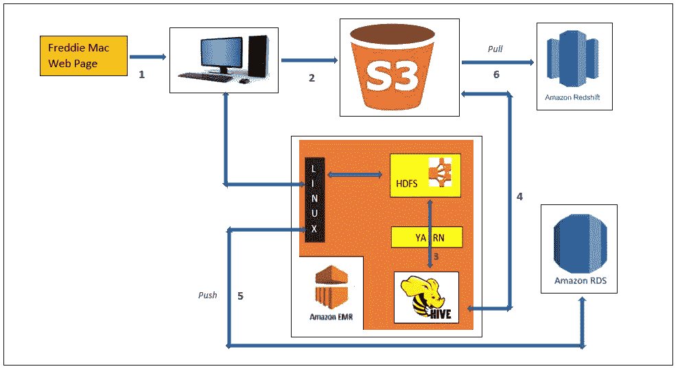
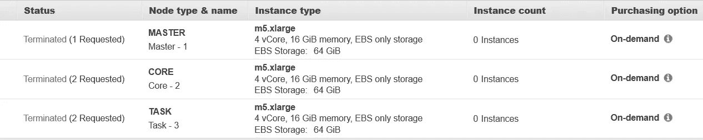

# AWS 中的大数据和 ML 管道介绍。

> 原文：<https://medium.com/analytics-vidhya/big-data-ml-pipeline-using-aws-533dc9b9d774?source=collection_archive---------5----------------------->

**大数据&使用 AWS 的 ML 管道。**

## **这个故事代表了 AWS 中以下项目的简单路径:**

1.  为静态和流数据构建大数据管道。
2.  使用 Hive 在 Apache Hadoop 中处理数据。
3.  将处理过的数据加载到 Redshift 等数据仓库解决方案和 MySQL 等 RDS 中。
4.  使用像 Kinesis Streaming 和 Kinesis Firehose 这样的 AWS 服务收集流数据。
5.  使用 Kinesis Analytics 对实时流数据进行实时分析。
6.  使用 SageMaker 和 API 构建和部署图像分类器 ML 模型。
7.  使用 Flask 构建和部署一个实时 Web 应用程序来推断图像分类器。

# 内容:

1.  静态数据收集和预处理流水线。
2.  流式数据收集和预处理流水线。
3.  构建、部署、监控和推断 ML 模型。

# 使用的工具/软件:

1.  服务— EC2、EMR、Hive、Kinesis 数据流、FireHose & Analytics、Lambda、SageMaker、API Gateway、CloudWatch、Jupyter Notebook。
2.  存储— S3、Hdfs、RDS 和红移。
3.  语言— FS Shell、HQL、SQL 和 Python。

**静态数据**是从具有超过 10 亿条大小大于 80 GB 的记录的房地美单一家庭贷款级别数据集收集的。EMR 和 Hive 用于收集和预处理数据。处理后的数据然后被加载到 S3 进行机器学习。除了 S3 之外，处理后的数据还会加载到 SQL 和 Redshift 中，以便用于构建报告和仪表板。

**流数据**从实时数据发生器收集。使用 Kinesis 数据流消费实时数据。Kinesis 数据分析用于使用 SQL 进行实时数据分析和转换。Lambda 用于下一步的数据转换，FireHose 用于将最终数据写入 S3。类似的管道可以用于服务器日志分析或 Twitter 分析。

作为 **ML** 的一部分，使用 AWS SageMaker 训练、构建和部署图像分类器来实时分类图像。还开发了一个前端 web 应用程序，用于使用 Flask 从外部 AWS 进行实时推断。

# 1.静态数据收集和预处理:

**从静态源采集、预处理和加载数据。**

在处理 80 GB 的原始数据时，使用 EMR 和 Hive 进行预处理。在 EMR 中还可以使用 Spark 对大量数据进行预处理，比 Hive 快得多。这是因为，Spark 使用内存而不是磁盘进行中间处理。预处理步骤可以根据特定的机器学习要求进行修改。

**EMR 集群用于处理数据。**

收集和预处理静态数据的步骤如下:

> *步骤— 1:* Web 报废房地美数据网站，查找 1999 年至 2017 年每一个季度文件的确切位置。所有的文件都被下载并解压到本地电脑。它花了大约 60 分钟，大小是 81 GB。代替 EC2 或 EMR，PC 被用来节省一些钱。需要在房地美创建一个帐户来下载数据。
> 
> *第二步:*生吃。然后，从本地 PC 使用 AWS CLI 命令将 txt 文件加载到 S3。将原始数据传输到 S3 大约需要 60 分钟。

**本地 PC 向 S3 传输数据。**

> *步骤— 3:* 在 Hive 中使用 S3 作为文件位置创建原始文件和已处理文件的外部表。创建外部表是为了即使在删除表后也能保留数据。使用位置参数，因为原始数据已经在 S3，而处理后的数据需要移动到 S3 进行机器学习。
> 
> *步骤— 4:* 对采集数据进行数据转换等预处理。将 2500 万条记录加载到以 S3 为数据位置的已处理采集表需要大约 140 秒。原始和处理后的采集文件大小分别为 3.7 和 3.8 GB。
> 
> 作为快速 Hive 查询的一种优化技术，采集数据也每年加载到一个分区表中。

**将数据加载到分区表。**

> 在性能数据上，执行数据转换和排序等预处理。将 13 亿条记录加载到已处理的性能表需要大约 3.5 小时。原始和处理后的采集文件大小为 78 和 140 GB。其他预处理步骤可以用于特定的用例。

**将已处理的数据加载到配置单元。**

> *第 5 步:*在 AWS RDS 中创建 MySQL 表，并使用 EMR Linux 中的 Sqoop 从 S3 加载数据。传输具有 2500 万行的 3.7 GB 的已处理采集数据大约需要 723 秒。由于空格同时作为行结束符和字段值出现，所以很少出现错误。数据格式化后加载成功。

**加载采集数据后的 SQL 记录计数。**

> *步骤— 6:* 创建红移表，并使用复制命令将处理后的数据从 S3 拉入红移。提取 140 GB 经过性能处理的数据需要大约 3 个小时。卸载可用于相反的情况。

**加载性能数据后的红移记录计数。**

使用的语言有 Python，AWS CLI，HQL，SQL，Sqoop *。* [***Git 链接为静态数据。***](https://github.com/abhilash499/Big-Data-ML-Pipeline-using-AWS./tree/master/Static%20Data)

# 2.流式数据收集和预处理:

**采集、预处理和加载来自流媒体源的数据。**

虚拟数据是从随机用户流 URL 收集的。AWS Kinesis 系列用于采集和预处理流数据。对于任何特定用例，可以使用类似的管道来消耗大量的实时数据。在这里，数据存储到 S3 进行进一步的 ML 处理，但也可以将处理后的数据从 Firehose 发送到 RDS、Redshift、DynamoDB 和 EMR。Firehose 还可以直接使用流数据，以避免数据流和分析导致的任何延迟，代价是不将流数据存储到磁盘中。

> *步骤— 1:* 使用 AWS Kinesis 控制台创建数据流。使用的碎片数量是一个，因为这里的流数据小于 1mb/秒。数据流使用碎片来收集和传输数据。
> 
> *步骤— 2:* 在本地 PC 上使用 AWS 凭证执行的 python 脚本，从实时流中读取数据并写入数据流。一旦脚本被成功触发，Kinesis 数据流将接收从数据流监控控制台验证的记录。在 python 脚本中，Put_Record 与数据记录和分区键一起用于将数据加载到数据流中。
> 
> *步骤 3:* Kinesis Analytics 用于从 Kinesis 数据流中提取数据，使用 SQL 执行实时查询，并根据需要转换数据。分析能够自动确定输入记录的模式。如果没有，也可以定义自己的模式。
> 
> 改造后，Kinesis Analytics 用于创建两个不同的数据流。一个用于 SQL 查询转换的数据，一个用于错误。这两股不同的水流分别被输送到不同的消防水龙带输送水流，以便进一步输送。
> 
> *步骤— 4:* 一旦数据被推送到 Firehose Delivery-Stream，就会调用 Lambda 函数(Python 脚本)对 SQL 转换成功的数据执行进一步的数据转换。在这种情况下，每条记录后都会添加一个新的行字符。转换后，Lambda 函数将转换后的记录返回给 Firehose，以便进一步传输。上一步的失败记录被直接写入 S3，供以后处理。
> 
> 一旦达到在传送流设置期间定义的特定缓冲区大小，传送流就将处理过的数据加载到 S3。任何由 Lambda 函数记录的转换失败也通过 Delivery Stream 写入 S3。

一旦所有的设置都正确完成，转换后的数据就会到达 S3。如果有任何失败记录，无论是在 SQL 期间还是在 Lambda 转换期间，都会被写入 S3 以供进一步处理。

使用的语言是 Python 和 SQL。所有 Kinesis 系列设置都是使用 AWS 控制台完成的。 [***流数据的 Git 链接。***](https://github.com/abhilash499/Big-Data-ML-Pipeline-using-AWS./tree/master/Stream%20Data)

# 3.构建、部署、监控和推断 ML 模型:

**AWS sage maker 中的机器学习生命周期。**

作为机器学习的一部分，建立一个图像分类器来分类图像是不是企鹅。从 web 应用程序实时部署和推断最终模型。

> 第一步。原始图像数据从谷歌收集并保存在 S3。SageMaker Jupyter Notebook 用于执行分析和预处理，如调整大小、格式化、合成更多样本、将数据拆分为训练和验证列表。经过处理后，数据连同。lst 文件存储到 S3 以备将来使用。125 幅原始图像被转换成 2500 个经过处理的样本。
> 
> 当使用实际图像文件进行训练时，AWS 图像分类器算法需要使用实际图像进行训练和验证列表。。lst 是一个列表文件，包含实际图像的序列号、标签和位置。请参考 AWS 文档，了解特定于算法的内置算法 i/p 和 o/p 格式。预处理应该在 Linux 环境中完成。创建的 lst 文件具有精确的文件夹位置，并以“/”作为文件夹分隔符，将由 SageMaker 使用，SageMaker 也是 Linux。

**。SageMaker 图像分类器的 lst 文件。**

> 第二步。一旦训练和验证数据在 S3，通过使用 SageMaker 训练触发训练作业来执行模型训练。触发培训作业时，提供算法 ECR 详细信息、EC2 实例类型、超参数、培训通道和 o/p S3 位置等参数。
> 
> 这里使用的细节是 SageMaker 内置算法图像分类、GPU 实例 ml.p2.xlarge、超参数，如类别数、图像维数、训练实例计数等。根据 AWS 的要求，四个通道(如 train、validation、train_lst 和 validation_lst)定义了精确的 S3 位置。O/P 位置作为一个 S3 存储桶提供，用于存储最终的模型工件。训练工作花费了大约一个小时来训练和存储大小为 6GB 的模型工件到 S3，训练准确率和验证准确率分别为 97%和 94%。

【SageMaker 的培训工作日志。

**保存到 S3 的模型文物。**

**保存在 S3 的模型。**

> 步骤 3:在工件被保存到 S3 之后，SageMaker 推理被用于在线部署。在 AWS 中部署在线模型需要三个步骤，如模型创建、定义端点配置和端点创建。对于模型创建，提供了诸如用于训练的 ECR 容器的确切位置和已训练模型工件的 S3 位置之类的细节。一旦创建了模型，就定义了一个端点配置，该配置包括创建的模型、实例类型和实例数量等细节。这里 ml.m4xlarge 用于配置。在最后一部分，使用上一步中定义的配置细节创建一个端点。
> 
> 步骤 3.1:一旦成功创建，就可以使用“AWS sage maker-runtime invoke-endpoint”从 AWS 网络内部直接访问端点。o/p 是一个 json 文件，包含对象所属的每个类的概率，如下所示。

从 AWS 内部调用端点。

> 步骤 3.2:为了从 AWS 外部访问 SageMaker 端点，使用了 Lambda 和 API 网关。作为 Lambda 的一部分，定义了一个 python 脚本，它将接受 Base-64 编码的字符串，解码为 Base-64，创建有效负载，并调用 SageMaker 端点进行推理。一旦推断出结果，将比较每个类的概率，最终返回企鹅或非企鹅的实际类名。这里最重要的部分是定义 lambda 的安全角色和访问 SageMaker 的策略。接下来，用 POST 方法创建一个 Rest API。在创建该方法时，它与先前创建的 Lambda 函数相集成。一旦方法被创建，API 最终被部署，现在可以从任何地方访问它。

最终 API 网关。

> 步骤 3.3:为了通过加载图像来访问 API，使用 Flask 开发了一个小的 web 应用程序。Web 应用程序将从用户上传图像，将 I/p 图像处理为 ML 模型正在寻找的正确格式，将 I/p 图像编码为 Base-64 字符串，调用端点，最后通过解码来自 AWS API 的 json 响应来显示结果。

**烧瓶 Web App 进行最后的推断。**

使用的语言是 Python。所有 SageMaker 设置都是使用 AWS 控制台完成的。 [***用于机器学习的 Git 链接。***](https://github.com/abhilash499/Big-Data-ML-Pipeline-using-AWS./tree/master/Machine%20Learning)

请访问 Git Hub 获取所有必要的脚本。欢迎提问和建议。

这标志着 AWS 大数据和 ML 管道介绍的结束。

**此处使用的 AWS 服务将产生费用。*

感谢阅读。欢迎提问和建议。

问候

阿比。