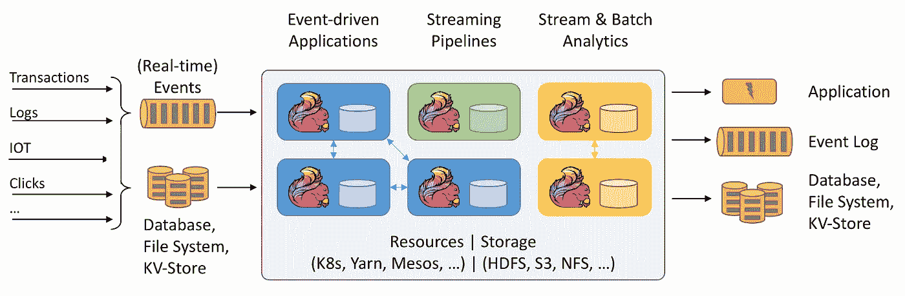
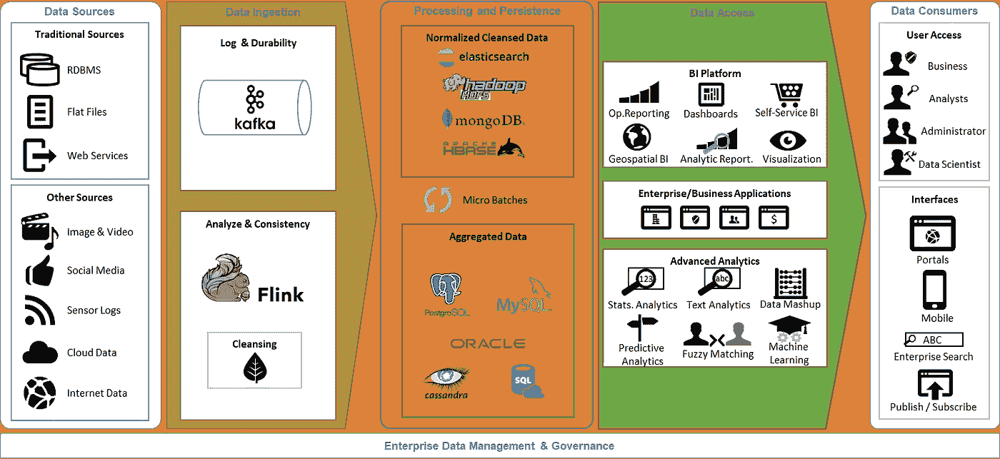
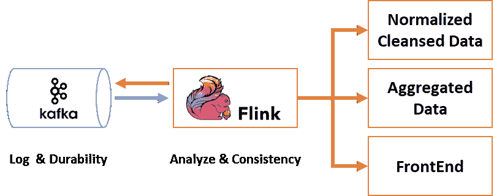
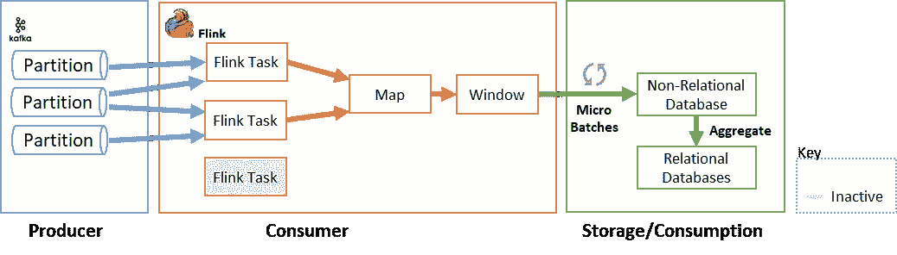
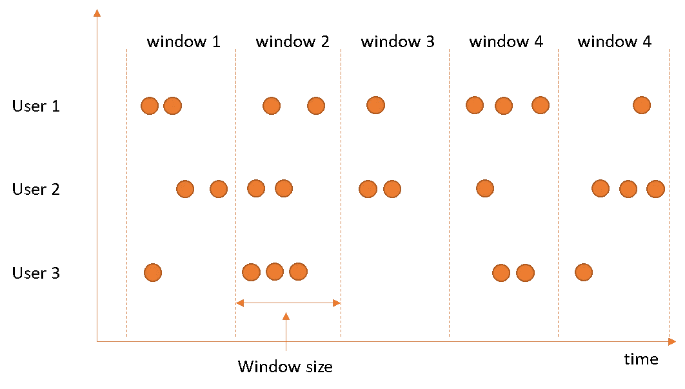
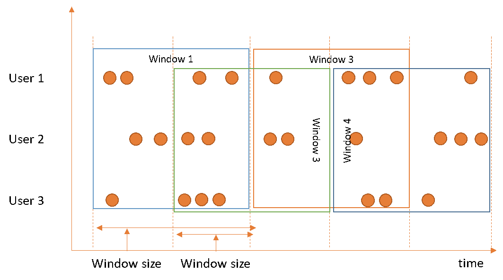
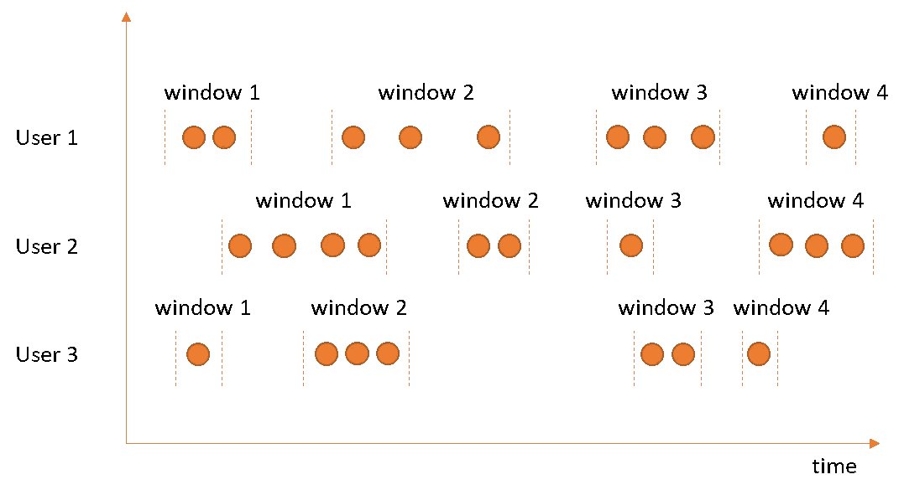
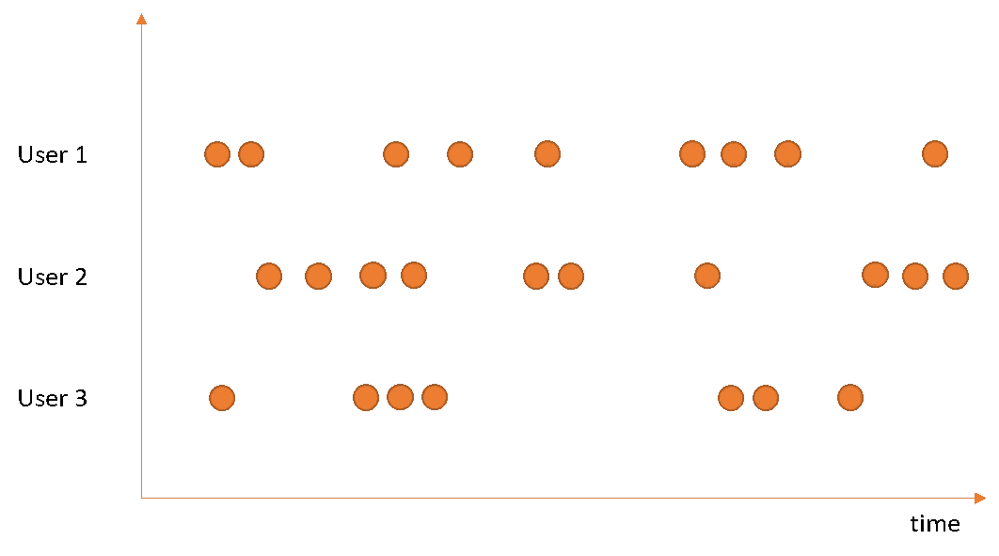
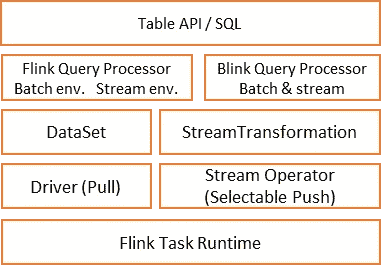

# 大数据流

> 原文：<https://medium.com/analytics-vidhya/big-data-streaming-c483195751ee?source=collection_archive---------13----------------------->

实时或流式数据分析是当今的一种趋势，因为公司往往更重视来自不同来源的数据(例如物联网、传感器或社交媒体)或只是因为关键利益相关者希望即时获得洞察并进行趋势预测，而不想等待一夜或批量流程来运行。

为了支持这种说法，诸如 [**【优步】**](https://eng.uber.com/kappa-architecture-data-stream-processing/) 、 [**阿里巴巴**](/@alitech_2017/alibaba-blink-real-time-computing-for-big-time-gains-707fdd583c26) 或 [**【网飞】**](https://www.datanami.com/2018/04/30/how-netflix-optimized-flink-for-massive-scale-on-aws/) 等公司已经采用了微批处理和窗口技术，在实时处理环境中为客户提供有价值的指标，以提供最新的定价、反欺诈、改进个性化并提供运营见解。

这种类型的数据管理架构既可以在关系数据库上使用，也可以在大数据上使用(如果数据量很大的话)。在本文中，我们将深入研究这些新技术，并增强它的一些功能。

几个技术是这个话题的趋势，但是让我们把重点放在阿帕奇 Flink 和阿帕奇 Kafka 上。这两种技术已经足够成熟，可以在任何实时数据流架构中实现，并且已经证明了自己，已经被一些提供商或公司采用，如 Azure、AWS 或 Cloudera。

Apache Flink 是一个分布式处理引擎和数据分析框架，创建于 2016 年，可以处理多个数据点或事件，并提供预测性见解。尽管如此，Apache Kafka 围绕流处理和分析提出了他们自己的相关用例集。Flink 采用流优先(over batch)方法来大规模处理大容量数据流，同时支持状态流、内置容错/弹性和高级窗口技术等关键功能。

图 1 - Apache Flink 架构

Apache Flink 的一些用例是:

*   **电信网络监控:**根据来自网络的流数据，使用复杂的窗口逻辑，通过预先计算的固定 ETA 响应来获取客户投诉
*   **欺诈检测:**从各种数据源中检测欺诈模式
*   **推荐引擎:**需要向最终用户提供推荐和搜索结果的服务
*   **点击流分析:**高流量电子商务网站基于实时点击流数据收集和提供最佳客户体验
*   **应用程序监控:**评估了数千个可定制的指标和日志流警报规则，并检测异常情况。

另一方面，在 Apache Kafka 中——创建于 2011 年——支持生产者-消费者消息流处理器，该处理器从输入主题中获取连续的数据流，对该输入执行一些处理，并产生连续的数据流以输出主题。

Apache Kafka 的一些用例是:

*   **网站活动跟踪:**将用户活动跟踪管道重建为一组实时发布-订阅提要
*   **推荐引擎:**从 RSS 源获取新闻文章内容，并将其发布到“文章”Kafka 主题，处理该内容以标准化或移除重复内容，并将净化后的文章内容发布到新主题，并向用户推荐该数据。

既然我们已经接触了这两种技术，那么它们如何参与数据流架构呢？

图 2 -高级大数据流架构

如图 2 所示，数据流来自 Apache Kafka，为数据流提供持久性和发布者/订阅者功能。Kafka 和 Flink 之间通常的协同作用始于事件流被推送到 Kafka，然后被 Flink jobs 消费。这些工作从简单的数据导入/导出转换到更复杂的应用程序(在 windows 中聚合数据或实现复杂事件处理(CEP)功能)。我们所说的窗口是指将数据流分成小批量或有限的流，以便对其应用不同的转换。

这些作业的结果可以输出回 Kafka，供其他服务或几个目标系统(存储、消费层或面向用户的 web 前端)使用。

在最后一层中做出的选择代表非关系数据库，以利用存储大量数据的能力，并在需要时对这些数据和关系数据库进行处理和聚合，以使用简单的 JDBC 连接器或传统商业智能世界中使用的仪表板/报告工具来访问聚合的见解。

图 Apache Kafka 和 Flink 协同的深入分析

对于消费或存储层，使用微批处理是一种有价值的解决方案，因此集成了容错功能，它本质上是一个批处理和吞吐量，用于高处理和检查点，针对一组记录一次性完成。但它会有一些延迟，感觉起来不像自然的流，保持有效的状态是一个挑战。

在负载分布上，Flink 提供一致的数据移动和计算，Kafka 以队列的形式提供日志记录、持久性和消息顺序。

1.  这两种技术的集成保证了以下关键点:
2.  事件的有效交付
3.  减少对期望的数据流产生阻力或压力的机会
4.  确保始终有计算资源可用于完成所需的计算任务
5.  作为加速创建其他数据管道的基础/框架。

从更广的角度来看，要创建 Kafka 主题，用户必须定义分区的数量。这些分区被分配给 Flink 的任务实例，这些任务实例利用并行处理，并且只有在分配了 Kafka 分区时才会工作，否则它们将挂起并等待分区进行处理，如图 4 所示。

图 4 -分区和 Flink 任务集成

Apache Flink 中的 Kafka 消费者与 Flink 的检查点机制相结合，作为一个状态操作符，其状态是分区中的 read 事件。当触发检查点时，存储每个分区的偏移量，并且检查点机制确保操作员任务的所有状态(例如基于相同的输入数据)。

当所有操作员任务成功存储它们的状态时，检查点完成，这意味着系统提供恰好一次的状态更新，保证从系统故障重启时的有效性。

在处理方面，Flink window 在第一个数据元素到达时打开，在满足关闭窗口的条件时关闭。它可以基于时间、消息计数或更复杂的条件。

有不同类型的窗口策略—翻转、滑动、会话和全局窗口。此外，您可以创建除预定义实现之外的自定义实现。

**翻滚窗口:**将每个元素分配给一个指定窗口大小的窗口。滚动窗口有固定的大小，不会重叠。例如，如果您指定一个大小为 5 分钟的滚动窗口，将评估当前窗口，并且每五分钟启动一个新窗口。

图 5 -滚动窗口说明

**滑动窗口:**给固定长度的窗口分配元素。类似于翻转窗口分配器，窗口的大小由窗口大小参数配置。一个附加的窗口滑动参数控制滑动窗口启动的频率。因此，如果幻灯片小于窗口大小，滑动窗口可能会重叠。在这种情况下，元素被分配给多个窗口。

例如，您可以将大小为 10 分钟的窗口滑动 5 分钟。这样，每隔 5 分钟就会出现一个窗口，其中包含最近 10 分钟内发生的事件。

图 6 -滑动窗口说明

**会话窗口:**根据活动的会话分配组元素，与滚动窗口和滑动窗口相比，不重叠且没有固定的开始和结束时间。相反，当会话窗口在一段时间内没有接收到元素时，即当出现不活动间隙时，会话窗口关闭。可以用静态会话间隙或会话间隙提取器功能配置会话窗口分配器，会话间隙提取器功能定义多长时间不活动。当该时间段到期时，当前会话关闭，后续元素被分配给新的会话窗口。

图 7 -会话窗口说明

**全局窗口:**将所有具有相同关键字的元素分配给同一个全局窗口。只有在您还指定了自定义触发器的情况下，这种窗口方案才有用。否则，将不会执行任何计算，因为全局窗口没有我们可以处理聚集元素的自然终点。

图 8 -全局窗口解释

近年来，有一种趋势是将 SQL 查询融入大数据技术，试图覆盖更广泛的受众，并利用传统 BI 方法中的知识。

就像 Spark 一样，Flink 通过集成 Blink SQL 查询处理器，做了将 SQL 集成到其架构中的努力。这强化了流 SQL，并通过 Apache Hive(数据仓库软件，便于使用 SQL 读取、写入和管理驻留在分布式存储中的大型数据集)集成和 TPC-DS(决策支持基准，模拟决策支持系统的几个普遍适用的方面，包括查询和数据维护)覆盖将成熟的批处理引入 Flink，所有这些都通过表 API 和 SQL 实现，如图 9 所示。

图 9 -闪烁 SQL 查询处理器组织

简而言之，Apache Flink 是一个框架和分布式处理引擎，用于无界和有界数据流上的有状态计算，是在数据驱动世界的时代发挥作用并受到更多关注的许多技术之一，可以为解释和处理数据的人提供多种优势，而不管最终目的是什么。

这个故事的一些来源: [**阿帕奇·弗林克**](https://flink.apache.org/) ， [**阿帕奇·卡夫卡**](https://kafka.apache.org/) ， [**维韦里卡**](https://www.ververica.com/) ， [U **ber 工程**](http://eng.uber.com/) ， [**Cloudera**](https://www.cloudera.com)