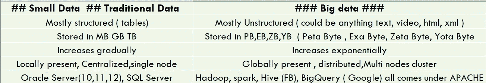

# 大数据与小数据/传统数据

> 原文：<https://medium.com/analytics-vidhya/big-data-vs-small-data-traditional-data-c91acc62b1fc?source=collection_archive---------23----------------------->

术语**大数据**最近引起了很多关注。所以，伙计们，我试着给你们一个简短的总结。

大数据就是让我们的 Excel 崩溃的数据。这实际上是我们必须处理应用程序的大量数据的时候。让我们对小数据和大数据做一个小小的比较，以便更好地理解

