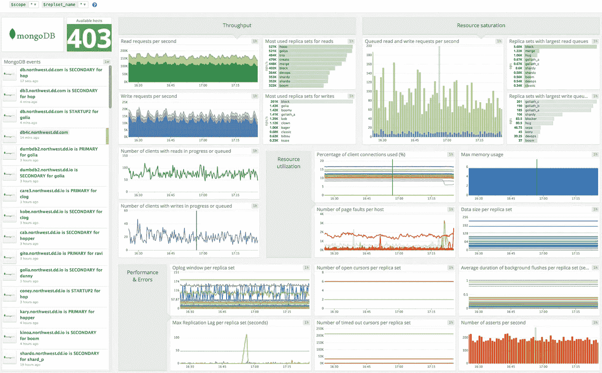
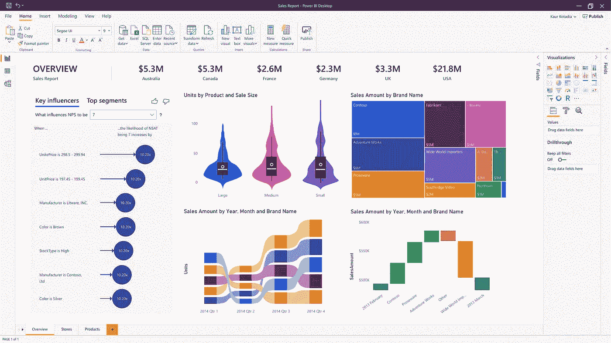

# 大数据武器:工具

> 原文：<https://medium.com/analytics-vidhya/big-data-weapons-tools-f1ad7845d684?source=collection_archive---------18----------------------->

## 系列 4

## 正如战士在战争中需要强大的武器一样，大数据工程师/分析师需要专业、先进和神奇的工具！

让我们看看数据科学的武器！

> 战士需要强大的武器来应对战争，就像大数据工程师/分析师需要专业、先进和神奇的工具来在大数据、分析和预测技术的世界中创造自己的创造力。
> 
> - [舒巴姆·拉吉普特](/@shubhamrajput0369)

专业人士需要很强的心态和技能来创造这个领域的生产力。让我们来探索一下吧！

# 技能和心态

> **1)分析型思维方式:**具备思维方式原因的分析性质非常重要，分析性质有助于专业人士以研究/讲故事的方式进行思考。
> 
> **2)数据可视化技巧:**可视化是一种可以用图形表示大量数字或见解的方式，以及使用能够快速查看见解的分析器的方式。
> 
> **3)业务领域知识:**强大的业务领域知识有助于专业人士创造洞察力，这可能有利于他们各自的组织做出重要决策。
> 
> 解决问题的天性:解决问题的技巧让专业人士保持清晰的路线图，找到解决问题的方法。它不允许分析人员不管问题解决方案如何都挖掘有效的见解。

# 技术-工具:-

大数据包含以下 7 个主要流程:

1.数据存储和管理

2.数据清理

3.数据挖掘

4.数据可视化

5.数据报告

6.数据摄取和采集

7.数据分析

# 数据存储和管理

大数据要求先进、灵活、支持各种数据集的结构化数据库。它需要一个灵活的数据库结构，能够存储结构化、半结构化和非结构化数据/数据集。关系数据库系统不支持大数据存储需求，因此，需要发明这样一种数据库，它没有预结构化的体系结构，没有 SQL 关系支持，并且易于检索、管理海量数据库。

为了克服这个问题，人们发明了 noSQL 数据库！然后 MongoDB 和这样的数据库使它存在于数据科学和大数据的世界中。

订单和销售分析-照片由 [Shubham Rajput](/@shubhamrajput0369) 拍摄

> ***1) MongoDB***
> 
> MongoDB 就是 noSQL 数据库！这里 noSQL 的意思是“不只是 SQL”！它支持所有类型的数据库进行处理、检索、存储和管理。它没有任何预结构化的架构，它提供了根据数据集的性质创建数据库的灵活性。MongoDB 是跨平台的面向文档的数据库程序，存储在 JSON 文档数据库中。
> 
> **开发人员:** MongoDB Inc .
> 
> **支持的操作系统:** Windows vista 及更高版本、Linux、OS X 10.7 及更高版本、Solaris、FreeBSD
> 
> **写于:** C++，go，JavaScript，python。

[照片](https://docs.datadoghq.com/integrations/mongo/?tab=host)

> ***2) Apache HADOOP***
> 
> Apache Hadoop 是一组开源软件实用程序，能够存储和处理高达 Pb 的数据。Hadoop 使用 MapReduce 编程模型为大数据的分布式存储和处理提供了软件框架。Hadoop 集群化了一组计算机，用于并行且更快速地分析巨大的海量数据集。
> 
> **开发人员:** Apache 软件基金会
> 
> **支持的操作系统:**跨平台。
> 
> **写于:** Java
> 
> **其他工具:**卡珊德拉、HDInsight 微软、neo4j、阿帕奇 HBASE、Talend、阿帕奇 ZooKeeper 等。

# 数据清理-

数据清洗是非常重要的，因为它分析。拼写错误的单词、顽固的尾随空格、多余的前缀、不恰当的大小写和非打印字符会给人留下不好的第一印象。

为了克服它，一些工具被广泛使用，如 Excel 和 Refine open 等。

数据清理工具

> ***1) Excel***
> 
> Excel 提供了具有各种功能的各种能力来克服如上所述的数据清理问题。Excel 提供了各种库和功能，用于拼写检查、删除重复行、查找和替换文本、更改文本大小写、删除文本中的空格和非打印字符、固定数字和数字符号、固定日期和时间、合并和拆分列、转换和重新排列列和行、通过连接或匹配来协调表格数据等。
> 
> **开发者:**微软
> 
> 支持的操作系统:微软的 Windows
> 
> **写于:** C#，C++，微软基础类库，。NET 框架

擅长

> **2)open refine**
> 
> OpenRefine 是开源桌面应用程序，在它被称为 Google refine 和 Freebase Gridworks 之前。OpenRefine 轻松探索大型数据集。它提供了被 open refine 描述为探索数据、清理和转换数据、协调和匹配数据的工具。
> 
> **开发者:** Freebase，Google，现在开源社区
> 
> **支持的操作系统:**微软 Windows、Linux、macOS
> 
> **写于:** Java

# 数据挖掘

数据挖掘是从大量原始数据中提取有用数据的过程。

它分析大批量数据中的数据模式。数据挖掘有着广泛的应用，它应用于科学技术领域。在企业界，企业使用数据挖掘技术来了解客户的满意度和需求，以便更好地利用客户资源。

> ***1)TeraData***
> 
> Teradata warehouse miner 将帮助您发现新有意义的数据模式和趋势。它包含一系列数据分析和挖掘功能，从数据探索和转换到直接在 Teradata 数据库中执行的分析模型开发和开发。
> 
> **开发单位:** Teradata 公司
> 
> **行业:**数据库仓储
> 
> **用于:**数据挖掘，挖掘富有成效的见解

[照片](http://assets.teradata.com/resourceCenter/downloads/Brochures/eb1719.pdf)

> ***2) Rapidminer***
> 
> RapidMiner 是 RapidMiner 开发的数据科学软件平台。它为数据准备、机器学习、深度学习和具有预测分析的文本挖掘提供了一个集成的环境。RapidMiner 提供了一个 GUI 来设计和执行分析工作流程。这些工作流程在 RapidMiner 中称为流程，由多个“操作员”组成。每个操作者在流程中执行一项任务，每个操作者的输出构成下一个操作者的输入。
> 
> **开发人:** RapidMiner
> 
> **支持的操作系统:**跨平台
> 
> **写于:**爪哇

# 数据可视化

以有效的格式表示数据非常重要。

因为，这是有点难以捕捉的数字格式的数据图片，因此，它是使用图表，世界地图分析，进度条等。以便更容易获取和比较数据集。

> ***1)表***
> 
> Tableu 是一个数据可视化软件，用于数据科学和商业智能。Tableu 具有各种功能来以洞察的形式可视化数据，通过它可以轻松地以各种展示方式(如图表、世界地图点状结构、进度条等)分析记录。Tableau 具有绘图功能，能够绘制经纬度坐标并连接到空间文件
> 
> 克里斯蒂安·沙博特、克里斯·斯托尔特、安德鲁·比尔斯、帕特·汉拉汉
> 
> **支持的操作系统:** Windows、mac
> 
> **写于:**它是用一种叫做 VisQL 的专有语言开发的。

[照片](https://library.bc.edu/newsletter/?p=504)

> ***2)阴谋地***
> 
> Plotly 为个人和合作提供在线绘图、分析和统计工具，以及 Python、R、Matlab、Perl、Julia、Arduino 和 REST(表述性状态转移)的科学绘图库。Plotly 本身就是一家技术计算公司。开发人员:亚历克斯·约翰逊、杰克·帕默、克里斯·帕默、马修·桑德奎斯特
> 
> **支持的操作系统:**微软的 Windows
> 
> **写于:** Python，Django 框架，JavaScript for frontend，可视化库 D3。Js，HTML 和 CSS。
> 
> **其他工具:** IBM 沃森分析

# 数据报告

数据报告包括收集数据和提交对数据集的准确分析。

不准确的数据分析和报告会导致大量基于错误证据的无知决策。数据报告是数据可视化之前的过程，准确分析数据后进入报告阶段。

以便组织可以基于它做出富有成效的决策。

[照片](https://powerbi.microsoft.com/en-us/)

> ***1) PowerBI***
> 
> PowerBI 提供商业分析服务。它有更好的能力来更有效和图形化地可视化数据。PowerBI 在商业智能中创造了它们的存在，它将数据集转换成有吸引力的仪表板和 PowerBI 报告。
> 
> **开发人员:**微软
> 
> **支持的操作系统:**微软的 Windows
> 
> **编写于:**语言 DAX，M，R，DAX 代表数据分析表达式，是 Power Pivot 中最初使用的查询语言。

# 数据摄取和采集

在较大的平台上，数据的可用性非常重要，因此，由于数据量较大，需要较大的仓库。数据摄取只不过是将数据传输到数据仓库，以便相关人员可以轻松访问。

数据采集是在将数据放入数据仓库之前，对数据进行收集、过滤和清理的过程。

数据采集主要由 4 V 控制，这在之前的大数据架构系列中有所解释。即数量、速度、种类和价值。

> ***1) Sqoop***
> 
> Sqoop 是一个命令行界面应用程序，用于在关系数据库和 Hadoop 之间传输数据。导出可用于将数据从 Hadoop 放入关系数据库。
> 
> “SCOOP”名称展示了“SQL 到 Hadoop”的概念。Scoop 也是由 Apache 软件基金会开发的。
> 
> **开发人员:** Apache 软件基金会
> 
> **支持的操作系统:**跨平台
> 
> **写于:** Java

[照片](https://www.google.com/imgres?imgurl=https%3A%2F%2Fi.ytimg.com%2Fvi%2F72M5lMP8dMg%2Fmaxresdefault.jpg&imgrefurl=https%3A%2F%2Fwww.youtube.com%2Fwatch%3Fv%3D72M5lMP8dMg&tbnid=C06NUUBPFNXThM&vet=12ahUKEwjj6JrGm5jsAhUbA7cAHZZtAwsQMygEegUIARCsAQ..i&docid=zWFV4vpfrujNNM&w=1280&h=720&q=sqoop%20architecture&hl=en&ved=2ahUKEwjj6JrGm5jsAhUbA7cAHZZtAwsQMygEegUIARCsAQ)

> **T3)2)阿帕奇风暴 **
> 
> Apache Storm 使可靠地处理无限数据流变得容易，为实时处理做了 Hadoop 为批处理做的事情。Apache Storm 有许多用例:实时分析、在线机器学习、连续计算、分布式 RPC、ETL 等等。Apache Storm 速度很快:基准测试显示每个节点每秒处理超过一百万个元组。
> 
> **开发人员:** BackType，Twitter
> 
> **支持的操作系统:**跨平台
> 
> **用:**主要用 Clojure 编程语言编写。
> 
> **其他工具:**水槽等。

# 数据分析

数据分析是对数据集进行检查、清理、转换和建模的关键过程，目的是获得有用的见解和数据集的细节，这将有利于组织本身做出清晰而富有成效的决策。

数据分析师是组织中负责处理和执行所有这些任务的人。在数据分析中，从数据中提取有用信息后，再从操作环境中检索数据。

然后，这些有用的信息被转化为智能见解，以获得更有成效的结果。

> ***1)阿帕奇火花***
> 
> Apache Spark 是一个开源的分布式处理系统，主要用于大数据工作负载。Spark 是用于大规模数据处理的快速通用引擎。
> 
> Apache spark 支持多种语言，允许开发人员用 Java、Scala、R 或 Python 编写应用程序。
> 
> **开发人员:**阿帕奇 Spark
> 
> **支持的操作系统:**微软的 Windows，macOS，Linux
> 
> **写于:** Scala

[照片](https://databricks.com/spark/about)

> ***2)蜂巢***
> 
> Apache Hive 是一个构建在 Apache Hadoop 之上的数据仓库项目，用于提供数据查询和分析。Hive 提供了一个类似 SQL 的接口来查询存储在与 Hadoop 集成的各种数据库和文件系统中的数据
> 
> **开发者:**贡献者，如脸书、网飞、亚马逊
> 
> **支持的操作系统:**跨平台
> 
> **写于:** Java
> 
> **其他工具:** Hadoop MapReduce，Pig 等。

> 以上所有流程探索的都是大数据和数据科学！下一篇文章是一个例子，它有效地陈述了所有这些过程。
> 
> 即“产品未来需求预测”是我目前从事的“数据科学项目”之一！
> 
> 所以，敬请期待！:)

***作家:*** *舒巴姆·b·拉吉普特*

***领英:***[*www.linkedin.com/in/shubhamrajput0369*](http://www.linkedin.com/in/shubhamrajput0369)