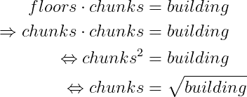
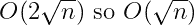
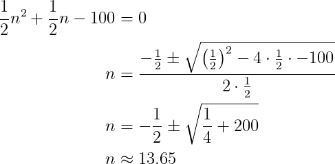
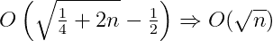
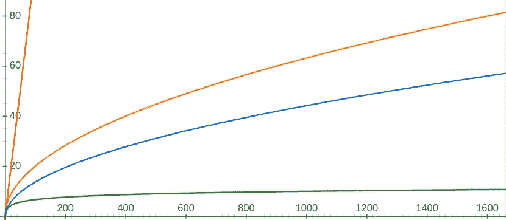
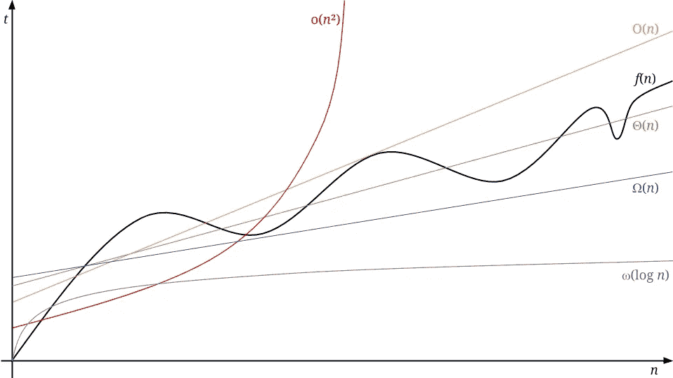

# 大 O &算法分析

> 原文：<https://medium.com/analytics-vidhya/big-o-algorithm-analysis-2b92174c17e7?source=collection_archive---------27----------------------->

我们都知道如何编码。我们可能知道如何编写“干净的代码”，或者至少我们知道是什么让代码变得干净([Bob 叔叔](https://www.amazon.com/Clean-Coder-Conduct-Professional-Programmers/dp/0137081073)肯定知道)。但是性能呢？如何预测算法是否快速且内存高效？我们如何分析算法并相互比较？原来，大 O 符号就是为此而存在的！

> *简而言之，算法的效率就是你的代码执行一项任务的步骤数。*

例如，如果我们要创建一个显示其输入的函数，对于一个字符串，我们将做一个动作，对于一个 100 的数组，我们将做 100 次打印，对于 *n* 我们将做 *n* 。我们可以注意到 O( *n* )或者“大 O 的 *n* ”。

然而，如果我们采取的动作的数量不依赖于输入，例如访问数组的 *n* ᵗʰ 项(无论数组的大小如何，它总是只有一个动作)，那么你的算法将在常数时间内运行，因此可以写成 O(1)。

我们不一定对给定输入的实际精度和实际步骤数感兴趣，也不一定对运行代码所需的实际时间感兴趣，而是对输入的大小感兴趣。我们实际上是在比较 O(log₂ *n* 比 O( *n* )更好还是更差。

如果我们真的要看看`print`函数的实际复杂度，我们假设它在 O(1)中工作，我们就大错特错了。`print`函数将一个字符串作为参数记录在控制台中。`print`函数最有可能使用 POSIX `write`函数，这是一个系统调用，将一定量的数据转储到文件描述符(表示文件或终端等)...).在我们的例子中，数据是一个`string`，它基本上是一个 char 数组。知道字符串的长度意味着从字符串的开头到 O(n)的`null`字符(即`\0`)。从一个字符到另一个字符意味着增加一个变量(这有计算成本 *t* ₐ),我们只需要做一次。我们还需要检查计算成本为*t*ₜₛₜ*t13】的当前 char 的值，以及计算成本为 *tⱼₘₚ* 的 jump(循环)的值。从一个字符串的第一个字符开始移动的实际计算代价其实是 o(*n*(*t*ₐ+*t*ₜₛₜ+*tⱼₘₚ*))。这只是没有我们调用并返回一个值的函数:`while(str[i++]);`。*

给出算法效率洞察的是 *n* ，而不是常数。从长远来看，100 个 *n 个*总会比 *n 个* /2 好。在这方面，我们总是可以丢弃非确定性因素，用 O( *n* )代替 O(100 *n* )，用 O( *n* )代替 O( *n* /2)。

# 练习:鸡蛋掉落问题

我们有两个鸡蛋和一座 100 层的大楼。鸡蛋会在几层打破？

两者完全相同。一个人可以把鸡蛋扔出窗户无限次，如果第一次没有打破，它就不会打破了。永远不会。在这一层和那些风箱上。永远不会。进行这项测试并了解其结果是有科学意义的。我们有一台传送机，可以让我们立即进入每一层。

# 只有一个鸡蛋…

用两个鸡蛋解决问题并不容易。先从一个开始解吧。凭直觉，我们会从地面开始，尝试每一层，直到它打破。这意味着:

*   最好的情况是:我们在一楼扔一次
*   最坏的情况是:鸡蛋在第 100 层打破…

用这个程序，如果我们有一个 1000 层的建筑，我们至少要做 1000 次投掷。又用一座 *n* 层高的建筑， *n* 扔过来。

这种方法是在 O( *n* )中进行的

# 有无限的蛋…

这是最直观的方法，也是大多数人使用的方法。

你从 50 楼开始。如果鸡蛋破了，你就去 25 楼。如果它没有破裂，到 38 楼(取决于你如何回合)，等等…也就是说，你把建筑一分为二，并尝试在中间。对于每一次迭代，如果鸡蛋没有打破，你就把剩下的上半部分分成两半，如果鸡蛋打破了，你就把剩下的下半部分分成两半。

如果我们有一栋 32 层的建筑，我们将测试 16 层、8 层、4 层、2 层以及最后一层:

*   16 = 32/2¹
*   8 = 32/2²
*   4 = 32/2³
*   2 = 32/2⁴
*   最后 1 = 32/2⁵.

因此:

那么复杂度将是 O(log *n* )。

*   对于一个 100 层的建筑，我们有 7 次投掷，
*   对于一个 1000 层的建筑，我们有大约 10 次投掷

这比我们以前的尝试好多了。然而，我们没有无限数量的蛋，而是两个。

# 回到两个鸡蛋…

我们需要一种两者兼而有之的方法。

如果我们把建筑分成相等的几块，试着每一块的顶部，我们会知道如果鸡蛋打破了，我们必须试着那块的每一层，这将对两个鸡蛋起作用。10 块似乎是一个有吸引力的数字，但在使用之前，让我们确保它是正确的。

我们希望在我们尝试的楼层数和组块数之间取得平衡，也就是说，组块数必须等于该组块中的楼层数:

在我们的例子中是 10，幸运。现在，我们最糟糕的情况是 99 层，因为我们必须测试 10、20、…、80、90、100 层，然后是 91、92、…、98、99 层。那是 19 次测试。

这种复杂性并不令人惊讶:

# 有更好的吗？

正如我们刚刚看到的，在最坏的情况下，我们将进行 19 次测试。但是如果楼层是 13，我们会做 6 个测试:10，20，11，12，13，14。也许我们可以重新分配楼层，这样，不管是哪一层，我们都可以保证做同样多的测试。

换句话说，对于每个已经通过的块，我们少测试一层。例如，如果第一个块是 10，下一个将是 9，下一个是 8，依此类推。这样，如果它在 9 点突破，我们将测试 10，1，2，3，…，8，9 (10 次测试)，如果它在 18 点突破，我们将测试 10，19，11，12，…，17，18 (10 次测试)等等。

因此，基本上我们需要解决 *k* + … + 3 + 2 + 1 =建筑和数字 *k* 出来。这就是 building = n(n+1) / 2，对于一栋 100 层的建筑，我们最差也要扔 14 次才能找到正确的楼层:

复杂之处在于:

这和我们之前找到的算法是一样的。我们来比较一下这四个:

*   红色:带 1 个鸡蛋:O( *n* )
*   绿色:有无限个蛋:O(log *n* )
*   橙色:我们的第二个鸡蛋解决方案:O(2 sqrt( *n* )
*   蓝色:我们的第二个 2 蛋解:O(sqrt(1/4+2 *n* ) - 1/2)

我们可以清楚地看到 O( *n* )、O(sqrt *n* )和 O(log *n* )之间的区别，而不考虑我们丢弃的常数。当然，当比较两个整体复杂度相同的算法时，常数是有意义的(对于 1600 层，在第一个两个鸡蛋的解决方案和第二个之间有 30 次尝试偏移)。

# 更进一步…

到目前为止，我们已经计算了步数。我们称之为“时间复杂度”,因为它给出了算法运行需要多长时间的感觉。

同样的逻辑也适用于算法占用的内存量:“空间复杂度”。在这种情况下，您只需要计算需要创建多少个变量。例如，如果您想计算数组中唯一条目的数量，您的第一个选择可能是使用`Set`。对于每个新条目，如果条目存在，您将检查`Set`,否则创建它。该算法将在 O( *n* )时间(因为您必须遍历每个条目)和 O( *n* )空间中运行，因为在最坏的情况下，数组充满了唯一的条目，因此您在`Set`中创建了 *n* 新条目(bloom filter 可能是 O( *n* )空间和 O(1)空间中的一个有趣的替代方案，但这会带来一些误报——我们现在不讨论这个)。

但是…还有更多。

我们不必像在本文中那样只谈论“最坏的情况”。最糟糕的情况实际上是一个算法函数的“渐近紧上限”，这意味着如果一切都出错了，这将是多么的错误。

比如你说“我 20 分钟到，堵车的话 1 小时”，1 小时就是你的上限。那基本上就是**大 O** 了。然而 20mn 是“紧下限”，或**大ω**:ω(*n*)

你可以只说“我会在一天结束前到达工作地点”，这将是一个“宽松的上限”，或 **little o** o( *n* )。但是如果你说“我马上就来”会是一个“松散的下界”或者**小ω**ω(*n*)。

如果你知道你将在 40mn 内到达，那将是“预期的平均情况”或**大θ**θ(*n*)。它实际上是函数的上界和下界。

如果我们看图，我们的算法 *f* ( *n* )运行在θ(*n*)中，有界在 O( *n* )和ω(*n*)之间。从长远来看，我们知道它不会比 o( *n* )差，也不会比ω(log *n* )好

# 常见复杂性

*   O(1):直接访问(例如，在数组或散列表/集合中)
*   O( *n* ):循环输入一段固定的时间(例如，索引查找、计数)
*   O( *n* ):对于每个输入，每隔一个输入查看一次(例如冒泡排序)
*   O(log *n* )$:划分问题(例如二叉树查找)
*   O( *n* 日志 *n* ):排序
*   o(！组合学