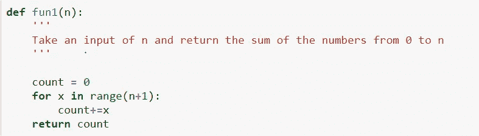
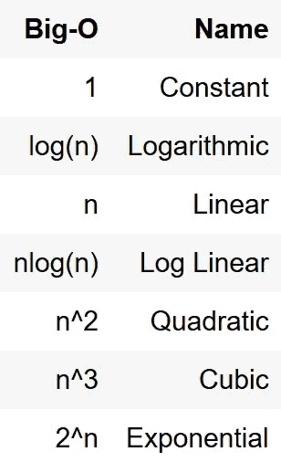
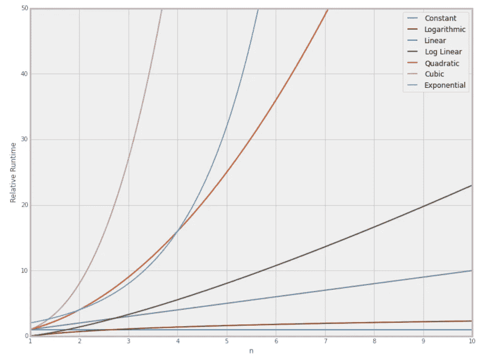

# 大 O 符号

> 原文：<https://medium.com/analytics-vidhya/big-o-notation-58614f2b6318?source=collection_archive---------22----------------------->

在之前的[博客](/@manikanthgoud123/introduction-to-algorithm-analysis-4c1228744d12)中，我们已经看到了为什么我们不能用“跑步时间”作为一个客观的衡量标准。因为那将取决于计算机本身的**速度和硬件能力**。所以我们将需要有更有效的方法来分析任何算法，这是**大 O！**

Big-O 符号描述了当输入变得任意大时，算法根据给定的输入获得期望的输出需要多长时间。

让我们更仔细地研究其中一些要点:

*   请记住，我们要比较运行时间增长的速度，而不是比较确切的运行时间，因为这些会因硬件而异。
*   因为我们想要比较各种输入大小，所以我们只关心相对于输入的运行时增长。这就是为什么我们用 **n** 表示符号。
*   当 n 变得任意大时，我们只担心当 n 变大时增长最快的项，在这一点上，Big-O 分析也被称为**渐近分析**

至于语法 fun1()可以说是 **O(n)** 因为它的运行时间随着输入大小线性增长。类似地，对于不同类型的算法，我们有不同类型的大 O 符号，如下所示:

如果我们绘制输入值对执行特定类型算法所需时间的图表，我们将得到如下图表

从上图可以看出，对于从 1 到 2 的较小值范围，运行时间没有任何区别，因为我们获得的值越大，运行时间可能会发生变化，如上图所示。在下一篇博客中，我们将讨论如何找到不同函数的运行时，以及如何关联它的大 O 符号。

如果你有任何反馈或批评，请随时与我分享。如果本演练对您有所帮助，请喜欢👏文章。干杯！🍻