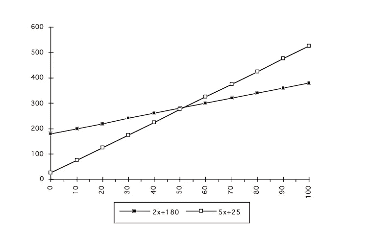

# 大 O 符号 Javascript 的时间复杂性

> 原文：<https://medium.com/analytics-vidhya/big-o-notation-time-complexity-in-javascript-f97f356de2c4?source=collection_archive---------0----------------------->

我们用一个简写的数学符号来描述一个算法的效率是大 O 符号，用字母 O 是因为一个函数的增长率也叫它的阶。

它允许 as 谈论算法的运行时间如何随着输入的增长而增长。

假设函数 A 的运行时间是 f(n)，函数 B 的运行时间是 g(n)，其中 n 是输入的大小。我们只关心函数如何增长，意思是，当 n →∞时，函数发生了什么。

在上面的示例函数中，接受输入数组并返回数组中数字的和。输入数组可以是任意长度，可以是一百个元素长，甚至十万个元素长。

现在的问题是，运行这个函数需要多少时间？这取决于各种因素，例如你的电脑有多快。你可以问下面的问题，而不是问这个问题。

随着输入大小的增加，函数的运行时间如何增长？根据数组元素的长度，运行该函数需要不同的时间。要回答第二个问题，我们需要大 O 符号。

大 O 符号一般可以归类为:

**O(1):** 运行时间与问题的输入大小无关。

**O(n):** 问题对输入中的每个元素都需要少量的处理时间。**直线**。

**O(n ):** 问题处理元素的所有对。**二次。**

**O(log n):** 当一个大问题通过某个常数分数将其转化为更小的规模来解决时。**对数。**

**O(n log n):** 当一个问题被分解成更小的子问题，独立求解，将解组合起来。**线型。**

**O(2^n)** : **指数**运行时间。要避免。

# 常数时间算法

据说一个算法以恒定的时间运行。这意味着当你增加函数的输入量时。执行时间保持不变。

该函数相对于其输入以 O(1)时间(常数时间)运行。

# 线性时间算法

函数的执行时间与输入大小成正比。函数的运行时间随着输入的增长而增长，我们将其标记为 O(n)。

O(n)表示增长率是线性的，即随着 n 的增加，处理时间以相同的速度增加。

让我们考虑等式 y= nx + z。如果 y 是对 n 个问题执行函数的成本，那么

*   z 决定了 n = 0 时的值，即执行的固定成本；
*   x 决定了随着问题规模的增加，成本增长的速度。x 是线性成本计划的比例常数。

所有线性成本程序都有相同的执行时间是不正确的:

2 倍成本增长更慢，但我们曾经考虑的所有问题可能都小于 50，所以 5 倍计划可能更好。

# 对数算法

如果一个算法的时间执行与输入大小的对数成正比，则称该算法在对数时间内运行，我们将其标记为 O(log n)。

O(log n)算法从不查看输入中的所有元素。对数时间复杂性通常适用于在每个步骤中消除大量输入元素的算法。

O(log n)算法的一个例子是二分搜索法算法。

一旦列表被排序，就可以使用分治策略对其进行搜索。二进制搜索算法找到给定元素的中间，并将其与所需对象进行比较，如果找到匹配，则搜索成功并终止。

如果不匹配，它确定中间元素大于或小于所需对象。这将消除一半的列表。它一次又一次地重复同样的过程，直到找到想要的对象。

# 二次算法

二次算法几乎是对数算法的逆算法。二次算法所需的步骤数是输入大小的平方根。如果输入大小是 2，那么所需的步骤是 4。如果输入大小为 8，则需要 64，以此类推。我们将其标记为 O(n)。

O(n)算法的一个例子是冒泡排序算法。

冒泡排序比较相邻的元素，它从前两个元素开始，如果第一个元素大于第二个元素，就交换它们。它重复相同的步骤，直到到达数组的末尾。同样的步骤将从 i+1 元素开始重复。

## 多项式算法

一个多项式算法由 O(n^c 表示)，如果一个算法的运行时间是由该算法的输入大小的多项式表达式的上界，则称该算法是**多项式时间的**，对于 c > 1。

# 线性算法

线性算法或对数线性算法比线性算法稍慢。我们把它标记为 O(n log n)。

O(n log n)算法的一个例子是合并排序算法。

合并排序使用分治策略对给定的数组进行排序，递归地分割数组，直到元素个数等于或少于两个。并且它递归地对划分后的数组进行排序。

最后一步是合并，它从每个数组中一个接一个地进行合并，使它们按升序排列。

线性算法堆排序和快速排序的其他例子。

# 指数算法

指数算法是指算法执行的计算是相对于输入大小执行的操作数量的两倍。我们把它标为 O(2^n).

O(2^n 函数的一个例子是斐波那契数的递归计算。

O(2^n)表示一种算法，其增长随着输入大小的每次增加而加倍。

# 基本规则

*   放下不断增加的东西。n+ 5 是 O(n)
*   去掉常数倍数。0.5n + 2n + 7 是 O(n)。
*   做 2n 次常数运算就是 O(n)。
*   做 O(n)运算 n/2 次就是 O(n)。

下面是所有复杂性的图表。

资料来源:bigocheatsheet

# 结论

Big-O 符号为函数增长的上限提供了一个有用的抽象，2n + 3n + 2 是 O(n)，O(2^n)和 O(n)。

大ω:下界。2n + 3n + 2 是ω(n)和ω(log(n))和ω(n)。

大θ:上下有界。2n + 3n + 2 为θ(n ^ 2)。

# #爱它，犯错误，学习，继续磨