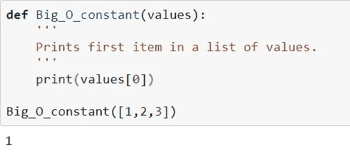
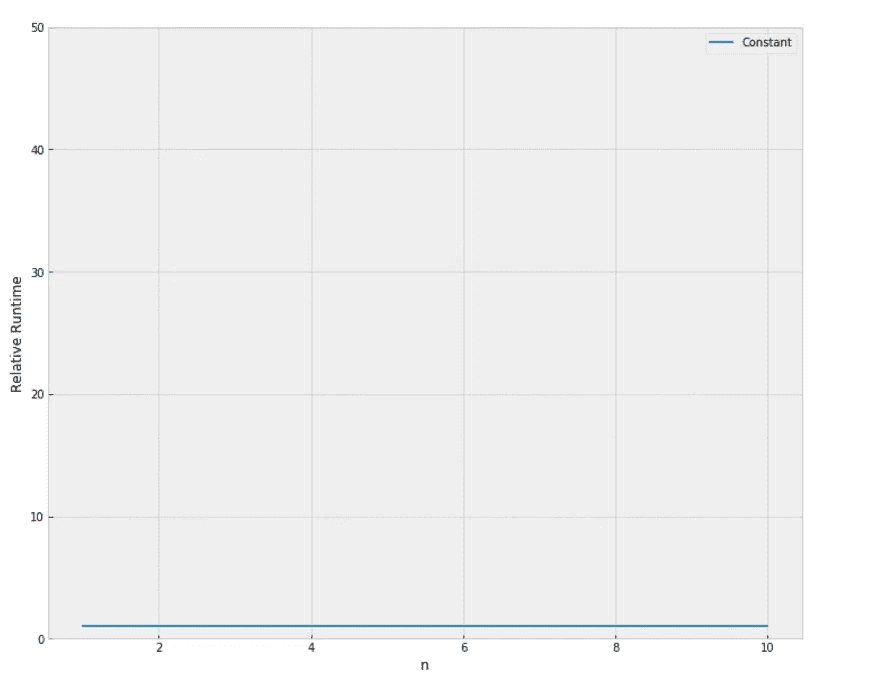
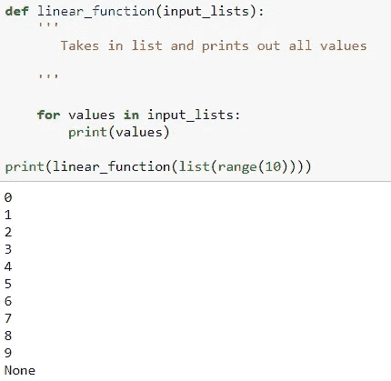
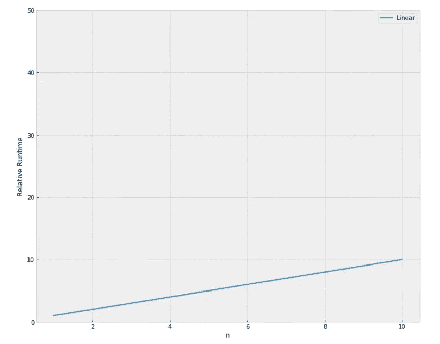
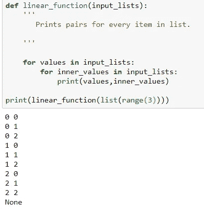
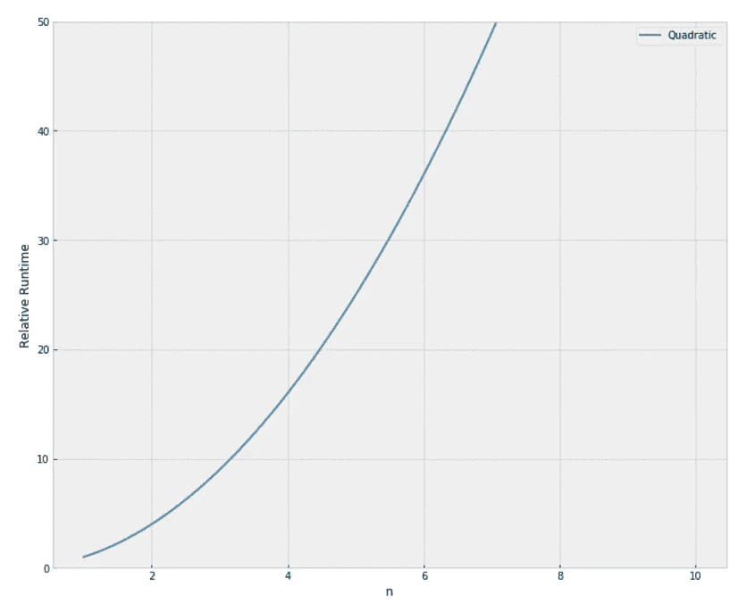
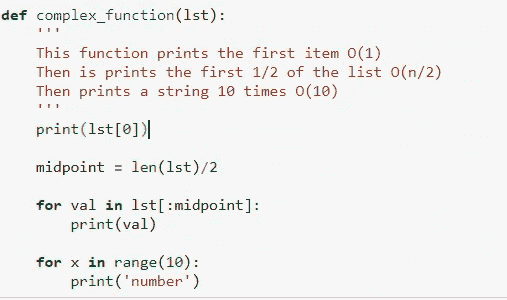
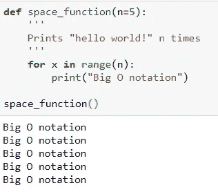
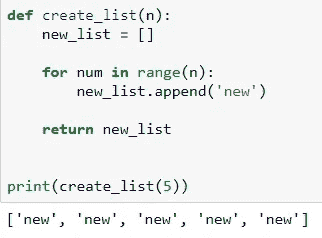

# 大 O 符号及其在 Python 中的例子

> 原文：<https://medium.com/analytics-vidhya/big-o-notations-and-its-examples-in-python-9d7e3c1ef09d?source=collection_archive---------1----------------------->

在之前的[博客](/@manikanthgoud123/big-o-notation-58614f2b6318)中，我们已经看到了为什么使用大 O 符号以及各种大 O 符号。现在我们将深入研究三种类型大 o 符号及其示例 python 代码。

# O(1)常数:

我们能想到的最简单的大 O 符号是常数。我们可以将常量的大 O 定义为无论我们的输入有多大，它总是花费相同的时间来计算事物。

请注意这个函数是如何保持不变的，因为无论列表大小如何，这个函数都只取一个恒定的步长，在本例中为 1，打印列表中的第一个值。因此我们可以看到，一个包含 100 个值的输入列表将只打印 1 项，一个包含 10，000 个值的列表将只打印 1 项，而一个包含 **n** 个值的列表将只打印 1 项！

从上面的图表中我们可以观察到，无论输入值是多少，运行时间都是恒定的

# O(n)线性:

在这种情况下，运行时间取决于它接受的输入数量。

上面的函数运行时间为 O(n)(线性时间)。这意味着发生的操作数量与 n 成线性比例，因此我们可以看到，100 个值的输入列表将打印 100 次，10，000 个值的列表将打印 10，000 次，而 **n** 个值的列表将打印 **n** 次。

从上图我们可以看出，运行时间取决于输入值，随着输入值的增加，运行时间也会增加。

# O(n)二次:

在下面的 python 代码中，我们有两个循环，一个嵌套在另一个中。这意味着对于一个包含 n 个条目的列表，我们必须对列表中的每个条目执行 n 次操作！这意味着我们总共将执行 n 次 n 次赋值，即 n。因此一个包含 10 个项目的列表将有 10 或 100 个操作。您可以看到对于非常大的输入来说这有多危险！这就是为什么 Big-O 如此重要的原因！

在下图中，我们可以观察到，与 O(1)和 O(N)符号相比，运行时的变化取决于输入值。

*   1 项:1 秒
*   10 个项目:100 秒
*   100 件物品:10000 秒

请注意，项目数量增加了 10 倍，但是时间增加了 102 倍。基本上，n=10，因此 O(n2)给出的比例因子 n2 为 102。

# 计算大 O 的规模:

一个函数可能会变得更复杂(更多的循环和条件语句),在这种情况下，我们有比大 O 符号更多的符号，如下面的代码片段所示

所以让我们来分解一下这里的操作。我们可以将每个运算组合起来，得到函数的总 Big-O:

𝑂(1+𝑛/2+10)

我们可以看到，随着 n 变大，1 和 10 项变得无关紧要，1/2 项乘以 n 也不会有太大影响，因为 n 趋向于无穷大。这意味着函数只是 O(n)。

# 空间复杂性:

很多时候，我们也关心算法使用多少内存/空间。空间复杂度的符号是相同的，但是我们不是检查操作的时间，而是检查内存分配的大小。

让我们看一个例子:

请注意，我们只对“大 O 符号”变量赋值一次，而不是每次打印时都赋值。因此，该算法具有 O(1) **空间**复杂度和 O(n) **时间**复杂度，因为它依赖于 n 值的大小

**让我们看一个 O(n)空间复杂度的例子:**

从上面的函数中，我们可以观察到 new_list 对象的大小如何随着输入 **n** 而缩放，这表明它的时间复杂度和空间复杂度都是 O(n)算法，因为每次迭代它都向列表添加“新”字符串，所以它的空间复杂度是 O(n)，如果 n 变大，运行时间也相对于 n 而增加。因此它的空间和时间的大 O 符号都是 O(n)。

如果你有任何反馈或批评，请随时与我分享。如果本演练对您有所帮助，请喜欢👏文章。干杯！🍻