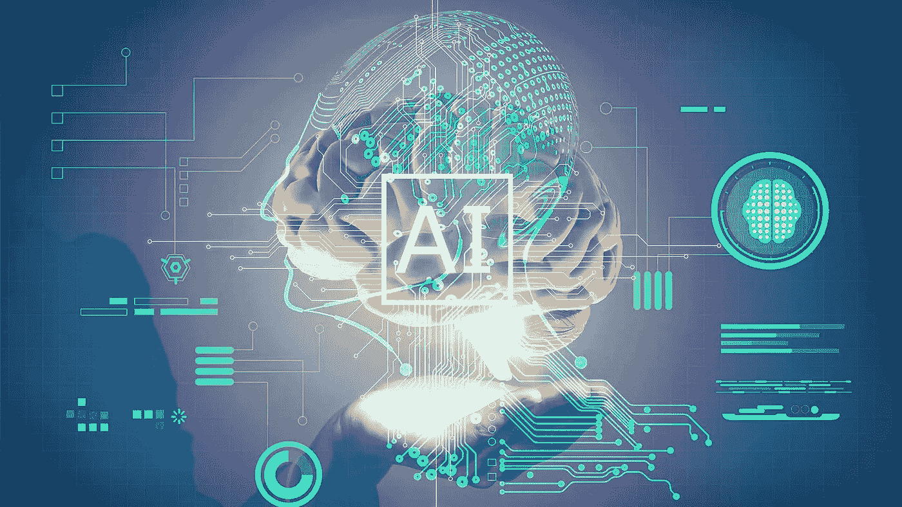
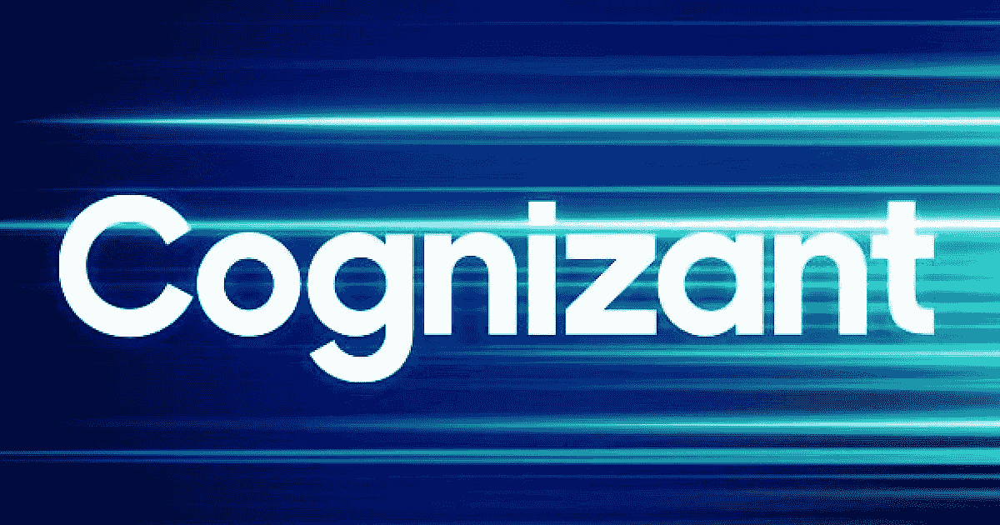
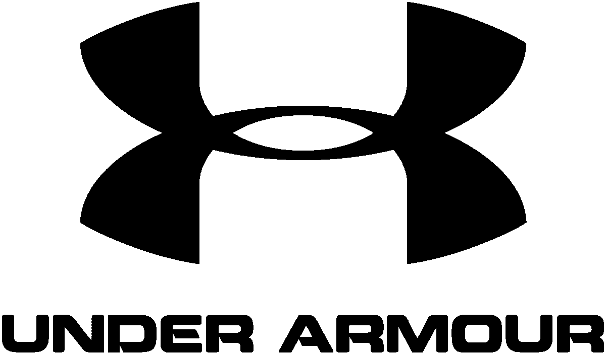

# 使用 AI/ML 受益的最大公司！

> 原文：<https://medium.com/analytics-vidhya/biggest-companies-which-get-benefitted-by-using-ai-ml-af1562d9d2f0?source=collection_archive---------18----------------------->

## 本博客旨在提供通过使用人工智能/人工智能获得巨大利益的公司的信息/案例研究。

[**来源**](https://www.google.com/url?sa=i&url=https%3A%2F%2Ftechstory.in%2Ftomorrows-tech-artificial-intelligence%2F&psig=AOvVaw1yYe7wRsd3AB2zs256KmS2&ust=1603342158029000&source=images&cd=vfe&ved=0CAIQjRxqFwoTCIib65TxxOwCFQAAAAAdAAAAABAU)

我们今天生活在一个被大量人工智能设备包围的世界，尽管手机的摄像头也使用人工智能。目前市场上的大多数设备都使用机器学习来使其产品能够学习当今一代的趋势。

甚至今天的摩托车都配备了机器学习来支持今天的技术。自动驾驶汽车也是人工智能角色出现的例子之一。

我们周围的情况就像如果你看看你周围的任何地方，你很可能会发现一些设备正在使用人工智能或人工智能。下面提到的是一些在使用 AI/ML 后获得巨大利益的公司。

# 通过使用 AI/ML 获益的公司！

[**来源**](https://www.google.com/url?sa=i&url=https%3A%2F%2Fwww.techradar.com%2Fnews%2Fmore-amazon-delivery-restrictions-are-coming&psig=AOvVaw3u_qTrCcFKmrwyTDjlVOxP&ust=1603342669424000&source=images&cd=vfe&ved=0CAIQjRxqFwoTCJDOgobzxOwCFQAAAAAdAAAAABAD)

亚马逊对 AI/ML 的使用是每个人都非常清楚的，因为今天每个人都知道 Alexa，这是一个内置在多个扬声器和耳机中的 AI 语音助手。Alexa 支持的设备今天非常受欢迎，它们给亚马逊带来了巨大的利益。而且其网站上的亚马逊推荐引擎有助于为亚马逊获取巨额利润。据调查，已知亚马逊从推荐引擎中驱动 35%的利润。

[**来源**](https://www.google.com/url?sa=i&url=https%3A%2F%2Fwww.bigcommerce.com%2Fblog%2Falibaba-faqs-security-shipping-taxes%2F&psig=AOvVaw2MmW38kqfRck2if7md-hNq&ust=1603343019601000&source=images&cd=vfe&ved=0CAIQjRxqFwoTCOjUlKz0xOwCFQAAAAAdAAAAABAD)

阿里巴巴是一个知名的中国品牌，它提供云服务，也是一个非常大的在线产品(电子商务)分销商。

它在智能机器人中使用人工智能来交付产品，这非常有效&同时也降低了运营成本。路线映射也是使用 AI 来完成产品交付的。

[**来源**](https://www.google.com/url?sa=i&url=https%3A%2F%2Fwww.thecognizant.com%2Fblog%2Fsay-hello-to-the-new-face-of-cognizant%2F&psig=AOvVaw28djQKiyMSSRe4bbnQnR6a&ust=1603343200794000&source=images&cd=vfe&ved=0CAIQjRxqFwoTCOjFiIX1xOwCFQAAAAAdAAAAABAD)

Cognizant 是一家在 IT 领域非常有名的公司。它开发了一种人工智能驱动的解决方案，通过将医生的笔记输入该组织的 EMR(电子病历)来识别潜在的寻药行为。这是一个非常有用和令人惊奇的系统，因为它在患者就诊前提醒医生确定患者的风险模式。这可以通过强大的机器学习文本挖掘算法来实现，该算法可以解析医生的笔记和患者的电子病历。

[**来源**](https://www.google.com/url?sa=i&url=https%3A%2F%2Fseekingalpha.com%2Farticle%2F4225393-jd-com-all-issues-and-how-to-read&psig=AOvVaw0ZnIvwaf0ampFtFamIL-iv&ust=1603346300623000&source=images&cd=vfe&ved=0CAIQjRxqFwoTCNC70MuAxewCFQAAAAAdAAAAABAN)

这是一家总部设在北京的公司，也被称为京东。它也是财富 500 强公司的一部分。他们使用人工智能技术来改善他们的仓库运营。人工智能机器人用于系统地整理仓库中的产品。通过利用人工智能的力量，JD.com 提高了整个过程的速度和效率。

[**来源**](https://www.google.com/url?sa=i&url=https%3A%2F%2Fen.wikipedia.org%2Fwiki%2FUnder_Armour&psig=AOvVaw3veOkMJAgRhxfvfFESMe3r&ust=1603346556681000&source=images&cd=vfe&ved=0CAIQjRxqFwoTCNiWnMaBxewCFQAAAAAdAAAAABAD)

它是一个运动品牌。这是一家美国公司，经营多种运动服装。他们利用人工智能的力量，为客户设计了一款个人健身应用。应用程序提供个性化的营养和健身建议。据报道，它推动了互联健身配件业务增长 51%，或 8000 万美元。

上面列出的是极少数受益于人工智能或 ML 的公司的例子。尽管有多个相同的例子。

***我希望我的文章用所有深刻的概念和解释来解释与主题相关的每一件事。非常感谢你花时间阅读我的博客&来增长你的知识。如果你喜欢我的作品，那么我请求你为这个博客鼓掌！***