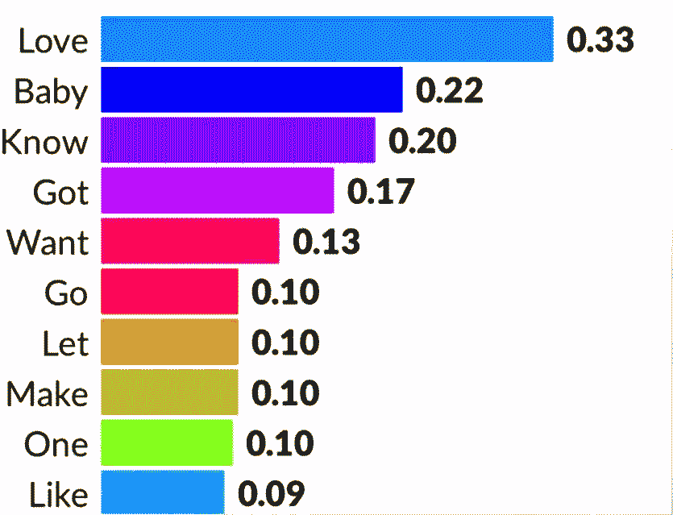

# 公告牌百强歌词分析

> 原文：<https://medium.com/analytics-vidhya/billboard-top-100-lyrics-analysis-f4ad2b35b94e?source=collection_archive---------22----------------------->

分析 1964 年至 2015 年的公告牌百强。

1.  摘要
2.  统计法
3.  嵌入空间中的性别偏见
4.  话题趋势

# 摘要:

我选择歌词分析作为我的项目主题的原因是因为我读过一篇名为“[理解不良单词嵌入关联](https://www.aclweb.org/anthology/P19-1166/)”的论文，我认为歌词中的性别偏见可能是一个有趣的发现！

# 统计方法:

## 数据中最受欢迎的 13 个单词。

一个有趣的事情是，在 1990 年之前，“爱”是一个非常长的时间里最流行的词。然而，在 2000 年，“喜欢”取代了“爱”成为第一个流行词。

## 我的假设是:

1.  音乐家用“喜欢”代替“爱”，来代表他们的感情。
2.  “像”这个词伴随着像“就像”、“像那样”…
3.  此外，一件有趣的事情是，我认为 1970 年将面临一个巨大的变化，由于嬉皮士和越南战争。然而，音乐似乎没有揭示这样的问题。

## 一首歌的长度

我的假设是:由于嘻哈音乐，说唱音乐变得流行，因为说唱音乐的歌词通常比普通歌曲长。

每十年歌曲的平均长度

## 一首歌可以产生的独特的词

我的假设是:嘻哈音乐在这些日子里变得更受欢迎，而那些老掉牙的、简短的歌曲不再流行了。例如:雪绒花

# 嵌入空间中的性别偏见:

1.  我使用 word2vec 来构建每个十年的嵌入模型。
2.  找到每个性别的目标词。我为男性设定的目标词是[男人]，为女性设定的目标词是[女士、女人、女孩](有趣的是，传统的男人 vs 女人在这种情况下并不顺利。)
3.  对于每个目标单词，使用余弦距离找到最近的 20 个单词来构建单词簇
4.  使用 T-SNE 在 2-D 平面中可视化聚类，我选择 T-SNE 而不是 PCA 的原因是，我不需要每个单词的额外关系或信息，只需要看到是否存在针对每个性别的聚类。
5.  用蓝色表示“男人”，红色表示“女人”，粉红色表示“女士”。

统计:困惑= 25，组件= 2，迭代= 3500

这张图片是我用全部数据(包括每年)建立的 T-SNE，歌词中似乎没有明显的性别偏见。

我的假设是:可能是因为我没有把爱情歌曲从数据中分离出来，因为浪漫呈现出相似的词汇属性

将 T-sne 用于性别词集

这是另一个使用“爱”这个词的例子

大多数单词彼此非常接近

# 歌词的主题处理:

我用 LDA 找出每首歌最受欢迎的主题分布，并用一个特殊的公式计算最频繁的主题分布。(实际上数字应该除以 10，但这个数字会非常小，所以我做了一点调整)

因为这是针对所有歌曲的，所以“爱”这个词仍然在话题中占有很大的比重。但是，对于歌曲的第二个话题，“喜欢”其实包含了最高的分发分数。

所以，我相信，也许《公告牌》里的歌，大部分都是关于浪漫的。

# 结论:

1.  公告牌歌词没有明显的性别偏见。然而，也许如果我把每首歌的流派分类，把爱情歌曲和其他歌曲分开，性别偏见可能会更明显。(我这样说的原因是因为我在寻找目标词的余弦距离时出现的词，除了像“宝贝”、“得到”这样的词之外，许多身体部位的词像“战利品”一样出现在女性目标词中。)
2.  爱情是旧的趋势，但在今天，“喜欢”成为音乐家的最爱。
3.  从话题趋势来看，大部分歌曲都是关于爱情的。
4.  歌曲越来越长，越来越有诗意。