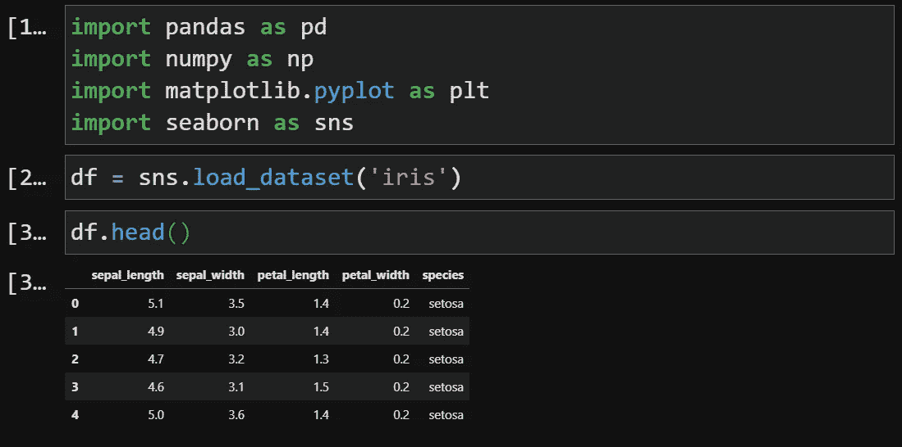
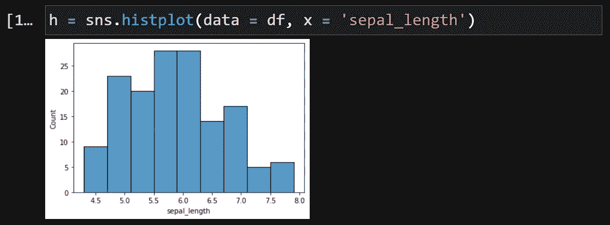
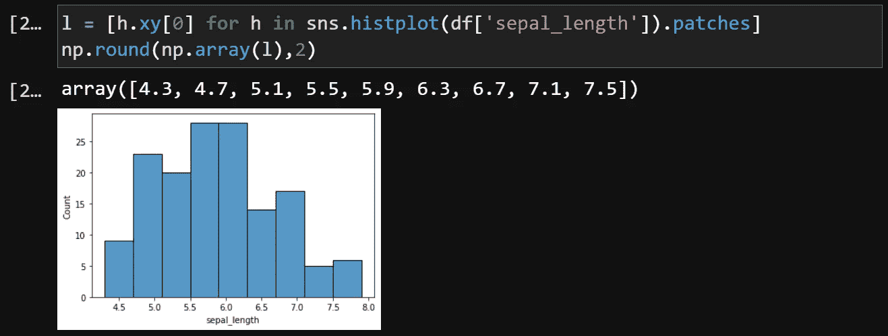
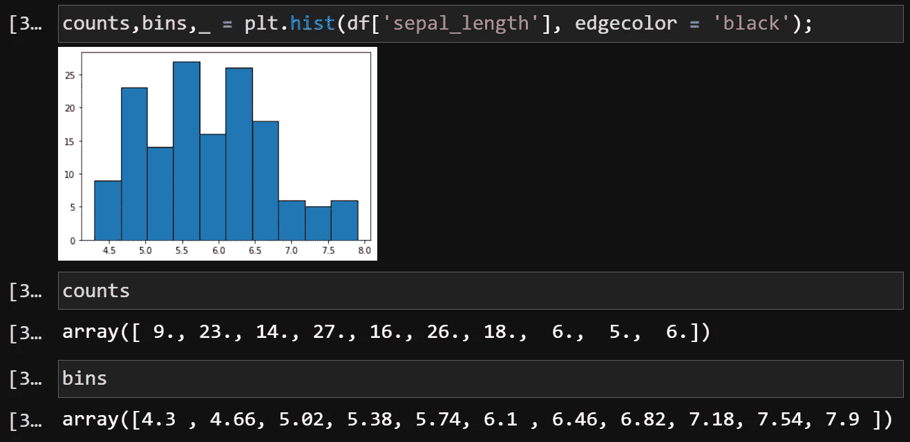
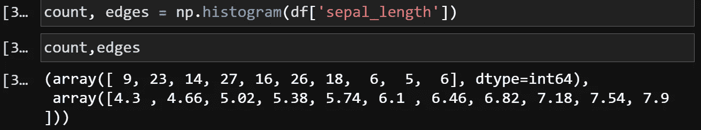
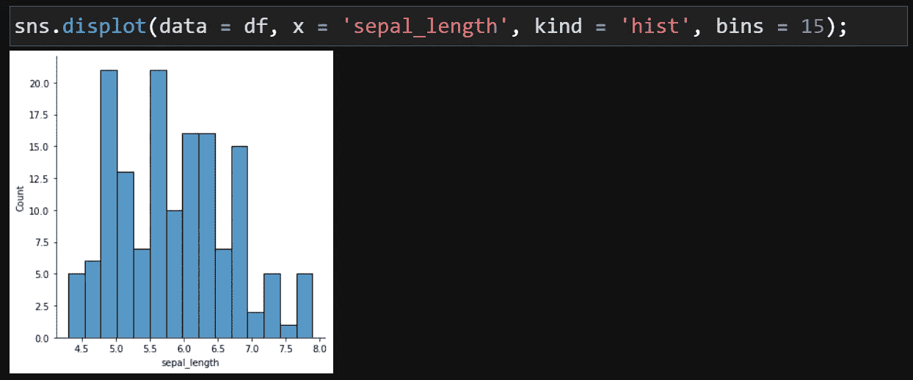
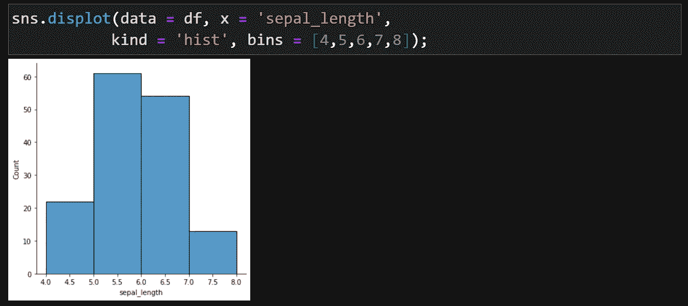

# 斌那边，搞定了！

> 原文：<https://medium.com/analytics-vidhya/bin-there-done-that-cd716663c0b7?source=collection_archive---------4----------------------->

## ..直方图背后的一瞥

在 [Unsplash](https://unsplash.com/s/photos/garbage-bins?utm_source=unsplash&utm_medium=referral&utm_content=creditCopyText) 上[paweczerwiński](https://unsplash.com/@pawel_czerwinski?utm_source=unsplash&utm_medium=referral&utm_content=creditCopyText)拍摄的照片

对于数据集中的数字要素，当我们考虑检查其分布时，我们首先想到的是直方图。直方图绘制了数值特征的每个值范围的观察值数量。这些范围被称为箱。分布的形状取决于箱的大小(宽度或边缘)。

在这篇博客中，我们将关注:

*   如何访问直方图的条块边缘
*   如何设置自定义箱宽而不是默认箱宽

我们将使用 seaborn 内置的熟悉的虹膜数据集。

让我们看看其中一个特征`sepal_length`的直方图是怎样的:

## 接近箱子边缘

现在，我们如何才能知道 seaborn 使用的确切面元边缘？这些值存储在图的 patches 属性中，该属性还包含一个图元素列表，从中我们可以访问条柱的宽度以及条柱的高度。

我们可以使用下面一行代码访问所有的 bin 边缘

使用 Matplotlib 直方图，检索条柱边缘以及每个条柱中的观察计数要简单得多。`plt.hist()`函数返回容器计数、容器边缘和补丁。

请注意，根据所使用的宁滨策略，不同功能或包装的料箱宽度可能略有不同。有关各种宁滨方法的详细讨论，您可以参考以下链接:

 [## 在简单步骤中选择直方图的箱尺寸+斯特奇规则-统计方法

### 描述性统计>如何在统计内容中选择仓位大小:在统计中，数据通常以一个…

www.statisticshowto.com](https://www.statisticshowto.com/choose-bin-sizes-statistics/) 

如果你对附带的情节不感兴趣，只想要数字，那么，看看 numpy 就知道了。

出于某种原因，如果您对默认的箱边缘不满意，那么设置箱的大小是很容易的。您可以在`bins`参数中以整数值的形式指定容器的数量，或者为容器边缘传递一个数字列表。

希望你喜欢这篇文章。您可能还会喜欢下面这些:

 [## 向 Seaborn 地块添加注释

### ..插入文本和数字

balaji4u.medium.com](https://balaji4u.medium.com/adding-annotations-to-seaborn-plots-5e5b134140c8)  [## PyCaret:机器学习的综合体

### ..满足您所有机器学习需求的一站式商店

towardsdatascience.com](https://towardsdatascience.com/pycaret-the-machine-learning-omnibus-dadf6e230f7b)  [## 拼凑——下一代 ggplots

### 进一步扩展 ggplot2 的多功能性..

towardsdatascience.com](https://towardsdatascience.com/patchwork-the-next-generation-of-ggplots-1fcad5d2ba8a)  [## Seaborn 绘图函数层次结构

### ..每个地块系列一个函数

towardsdatascience.com](https://towardsdatascience.com/seaborn-plot-functions-hierarchy-ccc865d974f2) 

感谢阅读。很高兴听到您对 bala@python4u.in 的评论和反馈。本文中的代码可以在[https://github . com/Bala-SRM/histogram _ bins/blob/main/hist _ bins . ipynb](https://github.com/bala-srm/histogram_bins/blob/main/hist_bins.ipynb)上访问