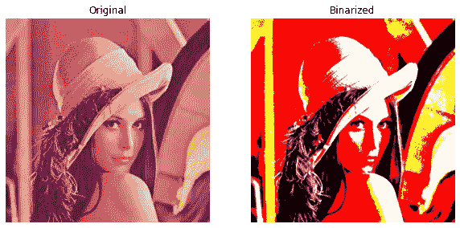

# 基于 NumPy 的图像二值化

> 原文：<https://medium.com/analytics-vidhya/binarization-of-image-using-numpy-65df2b82e189?source=collection_archive---------1----------------------->


安杰尔·桑多斯在 [Unsplash](https://unsplash.com?utm_source=medium&utm_medium=referral) 上拍摄的照片

在本文中，我们将学习如何使用 NumPy 将图像二值化，当然，我们将使用 OpenCV 读取灰度和 RGB 图像。

为了理解二进制是什么，二进制是由两种东西组成的。在计算机术语中，二进制只是**T5【0】T6**和**1。如果我们把这些图像联系起来，就像黑白图像一样**

*   ***0*** 表示**黑色**
*   ***1*** 表示**白色**。

在学习图像处理的初级阶段，我们常常把一幅灰度图像想象成一幅**二值图像**。虽然不是。但是当我们慢慢提起这个话题时，我们意识到我们错了。因此，接下来，我们将学习如何在使用库和不使用库的情况下将图像二值化(NumPy 用于矩阵运算，只是为了避免在使用常规**进行循环**时程序变慢)。除此之外，我们还将使用 Matplotlib 来绘制结果。

# RGB 和灰度概述

二元运算对灰度图像非常有效。彩色(RGB)图像的问题是，每个像素是一个向量，代表 3 个唯一的值，一个代表红色，一个代表绿色，一个代表蓝色。

一个典型的灰度图像的矩阵看起来像—

```
array([[162, 162, 162, ..., 170, 155, 128],
       [162, 162, 162, ..., 170, 155, 128],
       [162, 162, 162, ..., 170, 155, 128],
       ...,
       [ 43,  43,  50, ..., 104, 100,  98],
       [ 44,  44,  55, ..., 104, 105, 108],
       [ 44,  44,  55, ..., 104, 105, 108]], dtype=uint8)
```

一个典型的 RGB 图像矩阵看起来像这样—

```
array([[[226, 137, 125], ..., [200,  99,  90]],
       [[226, 137, 125], ..., [200,  99,  90]],
       [[226, 137, 125], ..., [200,  99,  90]],
       ...,
       [[ 84,  18,  60], ..., [177,  62,  79]],
       [[ 82,  22,  57], ..., [185,  74,  81]],
       [[ 82,  22,  57], ..., [185,  74,  81]]], dtype=uint8)
```

如果我们从上面的矩阵中分离出 R、G 和 B 像素。我们得到了。

**R 矩阵**

```
array([[226, 226, 223, ..., 230, 221, 200],
       [226, 226, 223, ..., 230, 221, 200],
       [226, 226, 223, ..., 230, 221, 200],
       ...,
       [ 84,  84,  92, ..., 173, 172, 177],
       [ 82,  82,  96, ..., 179, 181, 185],
       [ 82,  82,  96, ..., 179, 181, 185]], dtype=uint8)
```

**G 矩阵**

```
array([[137, 137, 137, ..., 148, 130,  99],
       [137, 137, 137, ..., 148, 130,  99],
       [137, 137, 137, ..., 148, 130,  99],
       ...,
       [ 18,  18,  27, ...,  73,  68,  62],
       [ 22,  22,  32, ...,  70,  71,  74],
       [ 22,  22,  32, ...,  70,  71,  74]], dtype=uint8)
```

**B 矩阵**

```
array([[125, 125, 133, ..., 122, 110,  90],
       [125, 125, 133, ..., 122, 110,  90],
       [125, 125, 133, ..., 122, 110,  90],
       ...,
       [ 60,  60,  58, ...,  84,  76,  79],
       [ 57,  57,  62, ...,  79,  81,  81],
       [ 57,  57,  62, ...,  79,  81,  81]], dtype=uint8)
```

无论我们对灰度图像进行什么运算，我们都需要对 RGB 图像进行同样的运算，但是要对 R、G 和 B 像素进行 3 次分离，最后将它们合并为一个正确的 RGB 图像。

# 编码时间到了

我们主要使用的包是—

*   NumPy
*   Matplotlib
*   OpenCV


作者图片

## 导入包

## 阅读图像

上述函数读取灰度或 RGB 图像，并返回图像矩阵。

## 用库实现代码

为了将图像转换成二值图像，我们可以简单地使用 ***cv2*** 库中的 ***threshold()*** 方法。这种方法，不管图像是什么(灰度或 RGB)都转换成二进制。它使用了 4 个参数。

*   **src** →基本就是图像矩阵。
*   **thresh** →这是一个阈值，基于该阈值像素被赋予一个新值。如果像素小于这个值，我们会将这些像素重新赋值为 ***255*** 。否则，像素将被重估为 ***0*** 。
*   **maxval** →这是典型图像可以包含的最大像素值(255)。
*   **类型→** 它基本上是给定的阈值类型，并基于该类型计算操作。手术有几种类型。

在此之后，我们将绘制结果，以查看变化，因此下面的函数。

让我们测试一下上面的函数—



作者图片


作者图片

既然我们已经看到了原始图像和二进制图像的结果，显然库代码对两者都有效。是时候让我们的手脏起来，从头开始编写相同的代码了。

## 从头开始代码实现

首先，我们将编写一个函数，将小于指定阈值的像素值重新赋值给 ***255*** 。

通过这样做，我们将会看到类似下面的东西—

我们将通过分离 R、G 和 B 值来调用上述函数三次，并最终将其合并以获得二值化图像。一旦这样做了，我们就可以像以前那样画出结果。

我们已经通过使用 NumPy 生成了二进制代码。让我们同样测试一下—


作者图片


作者图片

这就是了。无论我们想完成什么，我们都已经完成了。结果与我们使用库代码得到的结果非常相似。

因此，这就结束了本文的目的。

# 其他类似文章

1.  [图像翻转和镜像](/analytics-vidhya/image-flipping-and-mirroring-with-numpy-and-opencv-aecc08558679)
2.  [图像均衡](/analytics-vidhya/image-equalization-contrast-enhancing-in-python-82600d3b371c)
3.  [图像卷积](/analytics-vidhya/image-convolution-from-scratch-d99bf639c32a)

请务必阅读…