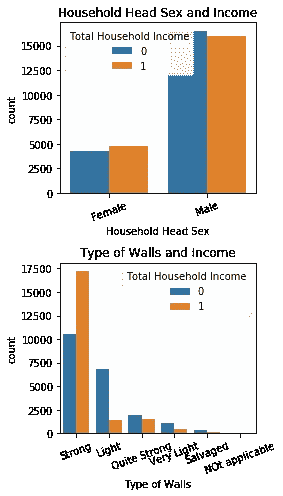
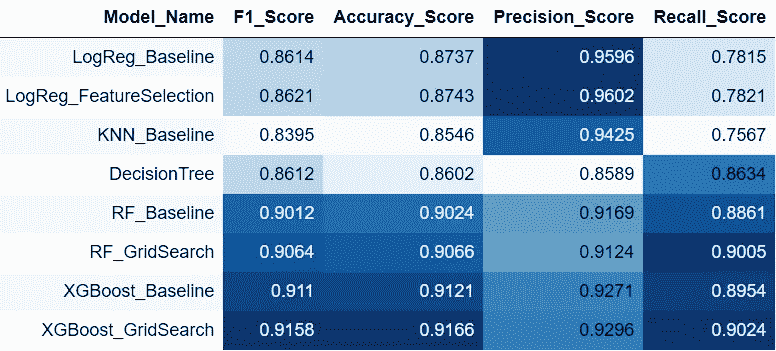
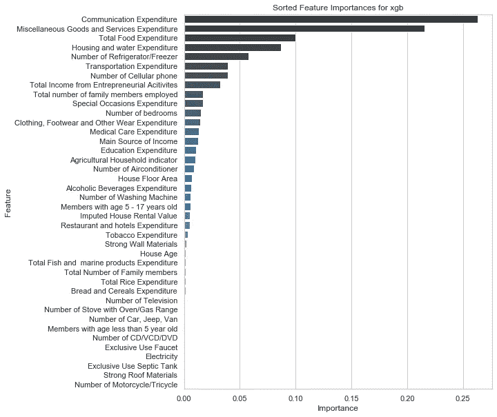

# 菲律宾家庭收入的二元分类

> 原文：<https://medium.com/analytics-vidhya/binary-classification-of-household-income-in-the-philippines-75faa7b60b69?source=collection_archive---------19----------------------->

照片由[费边布兰克](https://unsplash.com/@blankerwahnsinn?utm_source=unsplash&utm_medium=referral&utm_content=creditCopyText)在 [Unsplash](https://unsplash.com/s/photos/money?utm_source=unsplash&utm_medium=referral&utm_content=creditCopyText) 上拍摄

# **简介**

希望在美国的大多数人已经填写了 2020 年的人口普查。我这样做了，而且这是一个及时的练习，同时还处理了一组对一个国家的人口进行抽样的家庭数据。菲律宾统计局每三年进行一次名为“家庭收入和支出调查(FIES)”的调查，以收集所有 17 个地区家庭收入、生活水平和支出的信息。

菲律宾是世界上人口第十二多的国家，也是亚洲增长最快的经济体之一。严重依赖农业，所以人口集中在良田；此外，全国八分之一的人口居住在首都马尼拉。当我试图通过探索分类任务来展示我的建模能力时，由于调查中记录的广度和详细程度，这是一个探索数据和特征重要性的很好的数据集。

# 数据集

该数据集由 41，544 行组成，最初可从菲律宾统计局获得，可在 Kaggle [here](https://www.kaggle.com/grosvenpaul/family-income-and-expenditure) 上获得，我将目标列(“家庭总收入”)从连续变量改为二元变量，1 表示家庭收入高于中值。该数据集中的家庭收入中值为 164，079 菲律宾比索，平均值为 247，555 菲律宾比索。

对象和整数数据类型形式的 59 个特征列在描述典型的菲律宾家庭时范围很广。每个类别中的全套调查问题甚至更加细化，共有 81 页，记录了消费和农业活动，下至收集的鸡蛋数量和吉普尼票价的花费。我将 59 个列松散地分为四种不同的类型，如下所示。

*   **支出**:如:米、肉、酒、烟、交通、通讯、教育(食品支出的时间单位为一周，其他均为一个月，以减少记忆偏差)
*   **家庭描述**:如地区、收入来源、户主婚姻状况、子女数量、就业家庭成员数量
*   **财产**:如电视机、空调、汽车、手机、电脑的数量
*   **生活条件**:如建筑/房屋类型、屋顶类型、卫生间设施、电力、供水来源

# 图书馆

*   对于数据清理/探索:熊猫，NumPy
*   用于绘图:Matplotlib、seaborn、Scikit-plot、pydotplus、IPython
*   对于建模:scikit-learn，XGBoost

# 探索性数据分析

在探索阶段，我的主要目标是确保我有一个完整的可用特性数据集，并保留/转换与家庭收入有可见关系的对象列。由于数据集只有大约 41K 行，我想保留它的长度，并删除了两个缺少数据的对象列(户主职业和工人的
户主阶层)，它们都缺少 7，536 个值。

为了理解我对其余对象列的处理方法，请比较左边的计数图。我放弃了户主性别，因为它似乎对家庭收入没有显著影响，但对墙的类型采取了不同的方法，其中家庭收入和墙的类型似乎有更强的相关性。我没有为墙类型中的每个唯一值创建虚拟变量，而是创建了一个坚固墙的二进制列，并将所有不坚固的值一次性编码为 0。

这个过程留给我初始数据集的 49 个特征来开始建模过程。

# 建模

在我们回顾的方法中，我总共使用了以下 8 种模型。我将我的数据分成 70/30 的训练测试集，以验证每个模型，并根据测试数据的性能为每个模型的汇总数据框架添加分数。具有递归特征消除的逻辑回归模型将我的特征集从 49 个减少到 40 个，即达到最佳 F1 分数的特征数，并且每个后续模型使用这 40 个特征。

*   逻辑回归(一个香草，一个 RFE)
*   决策树
*   随机森林(一个香草味，一个带 GridSearch)
*   k-最近邻
*   XGBoost(一个香草味，一个带 GridSearch)

下面的总结说明了召回，精度，准确性和 F1 的分数。我没有处理任何类别不平衡的问题，也不想调整精度或回忆，但是 XGBoost 和 GridSearch 刚刚取代了我的基线 XGBoost 和 Random Forest 和 GridSearch。

模型性能汇总表

# 解释特征选择

进行建模练习最令人满意的部分之一是能够可视化特性的重要性。由于 XGBoost 是由弱学习器(深度有限的决策树)组成的集成算法，因此对增强每个迭代学习器的性能的变量给予重要性，并作为模型内所有决策树的重要性的平均值返回。

我们可以看到，在下面的十大功能中，支出对我们的目标有很大的贡献，尽管我很惊讶地看到通信和杂项商品和服务在列表的顶部。我深入研究了 FIES 总结文档，以便更好地理解这个调查问题中的问题。

*   通信包括互联网支出，包括预付费互联网卡、个人电话(每月服务费和新手机或固定电话安装费用)和邮政服务。随着国家的不断发展和现代化，继续探索这一支出类别如何成为家庭支出或收入能力的决定性因素是值得的。
*   杂项商品和服务包括个人护理支出，如美容产品和服务(包括化妆品)、不包括在服装、鞋类和其他衣物中的个人用品(如包和珠宝)、所有类型的保险、退休家庭支出以及其他类别中未提及的任何其他服务。对我来说最有趣的是，金融服务也是这一类别的一部分。由于海外菲律宾人是最大的散居群体之一(截至 2019 年，约有 12%的人口在国外工作)，向菲律宾汇款的规模是巨大的。如果任何相关费用都包括在这一类别中，那么这样一个既包括奢侈品又包括金融服务的广泛类别的影响与家庭收入相关联是有道理的。

# 未来的工作

这种性质的数据集有许多方向可以选择，以进一步改进我们的模型和我们解释结果和特征的能力，以及它们如何反映现代化的多元化菲律宾社会。例如，我可以使用这些数据，并将其与之前和之后的调查进行比较，以了解特性的重要性是如何随着时间的推移而变化的。或者，对农业地区、游客密集地区或城市地区的比较也有助于揭示收入差距。由于许多连续列在本质上是相似的(如食物支出和住房特征)，因此也有可能进行特征工程，以查看以这种方式进行简化是否会导致模型和特征重要性排序发生任何变化。创建要素的另一种方法可能是为生活条件创建一个等级，该等级包含所有相关列，例如屋顶类型、墙壁、卫生间设施和供水。

# 结论

这些数据和相应的摘要为探索分类或线性回归方法提供了丰富的领域，并且可以获得关于菲律宾家庭如何支出和赚取收入的深刻见解。我期待着使用这个数据集来获得持续的学习机会，并希望分享更多关于如何可视化、表达和预测菲律宾不断发展的经济的信息。如果你对这篇文章有任何反馈或者想看我的回购，请在下面评论。

## 来源

《2015 年家庭收入和支出调查》*菲律宾统计局*，2017 年 1 月，psa.gov.ph/sites/default/files/FIES 2015 年 Report.pdf 决赛。网络。2020 年 4 月 21 日。

" 2019 年 8 月，海外菲律宾人的汇款达到 2.9 Bln 美元."*新华社【2019 年 10 月 15 日，[www.xinhuanet.com/english/2019-10/15/c_138473763.htm.](http://www.xinhuanet.com/english/2019-10/15/c_138473763.htm.)网。2020 年 4 月 21 日。*

《世界概况:菲律宾》*中央情报局*，中央情报局，2018 年 2 月 1 日(2020 年 4 月 21 日更新)[www . CIA . gov/library/publications/the-world-factbook/geos/RP . html .](http://www.cia.gov/library/publications/the-world-factbook/geos/rp.html.)Web .2020 年 4 月 21 日。

"亚洲开发银行成员概况:菲律宾."*亚洲开发银行，*2019 年 7 月，[https://www . ADB . org/sites/default/files/publication/27790/phi-2018 . pdf](https://www.adb.org/sites/default/files/publication/27790/phi-2018.pdf)。网络。2020 年 4 月 21 日。

“Python 中 XGBoost 的特性重要性和特性选择”。杰森·布朗利。机器学习掌握，2016 年 8 月 31 日，[https://machinelementmastery . com/feature-importance-and-feature-selection-with-xgboost-in-python/](http://Feature Importance and Feature Selection With XGBoost in Python)。网络。2020 年 4 月 21 日。