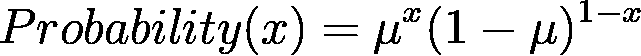
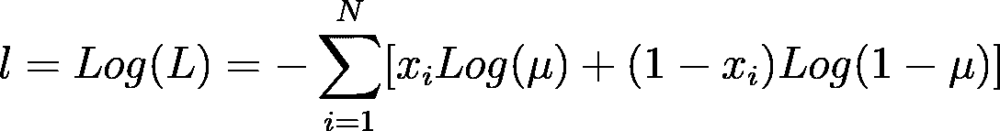

# 核心的二元交叉熵！

> 原文：<https://medium.com/analytics-vidhya/binary-crossentropy-in-its-core-35bcecf27a8a?source=collection_archive---------6----------------------->

## 这是一个在深度学习中广泛使用的损失函数，但可悲的是，每个人都只是告诉了函数的名称&可能是可以使用它的情况，没有人告诉现实中应该使用它的时候这个函数是什么，它内部是如何工作的？这个博客旨在全面深入地解释二元交叉熵的一切，涵盖其中使用的每一个公式和概念。

**来源:**[**Unsplash**](https://unsplash.com)**via**[**Shahadat Rahman**](https://unsplash.com/@hishahadat)

**二元交叉熵是仅在两个类别之间存在分类问题时使用的损失函数。**

从名称*二进制来看，它是不言自明的，*它意味着 2 个量，这就是为什么它以适合 2 个量的分类问题的方式来构造。

在开始这个损失/成本/误差函数的内部工作之前，我建议你阅读我写的关于均方误差的重要性的博客(链接就在这一段下面)，它帮助你为这个函数的工作打下更基础。

 [## 均方差在数据科学中的意义！

### 本博客旨在解释在机器学习、深度学习或其他领域使用均方差的必要性和逻辑

medium.com](/@harshitdawar/significance-of-mean-squared-error-in-data-science-4c4c08da3023) 

# 二元交叉熵的作用！

当问题中有离散输出时，这是一个损失/成本/误差函数，更具体地说，当只有 2 个离散量时，该函数是深度学习中的最佳选择。

# 二元交叉熵的内部工作原理！

由于该函数与离散量一起使用，因此在使用均方误差(如上述博客所述)时出现连续值的情况下，在该场景中使用**概率质量函数(PMF)**而不是**概率密度函数(PDF)**。

该函数中使用的 PMF 由下面给出的等式表示:

**PMF 为二进制交叉熵！【作者图片】**

在上面的等式中，x 是常数，因为它已经存在于数据中，μ是变量。

因此，来自 PMF 的**可能性(我们希望(在这种情况下，记录属于某个类别的可能性)最大化，[更多信息请参考上面提到的博客])** 可以表示为:

**似然(PMF 所有 x 的乘积)！【作者图片】**

> 现在，为了进行计算，我们应该取这个函数的对数，因为这样使用导数最小化/最大化就变得容易了。允许在处理之前获取日志的原因是日志是单调递增的函数，因此它用于简化工作。

对数可能性为:

对数可能性！【作者图片】

**由于我们希望最大化我们的期望，即每个记录落入特定类别的概率，为了实现这一点，必须在上面的对数似然方程中找出“μ”的值。**

为了使可能性最大化，我们的老朋友“微积分”会在这方面帮助我们，我相信你们都记得计算最大值的方法是通过求导&将其赋值为 0。因此，在对上述对数似然函数对“mu”取偏导数后，我们继续，输出为:

**图片作者！**

> **上述等式并不类似于所有 x 值的平均值，实际上，在该函数中，在上述等式中，x(i)的概率值为 1 或 0。例如，在掷硬币游戏中，如果我们在寻找正面，那么如果正面出现，那么 x(i)的值将为 1，否则为 0。**

这样，上述等式将计算出所有事件中预期结果的实际概率。

现在，有一个**非常重要的概念，**如果我们**最大化可能性**，或者我们**最小化负对数可能性(它是预测中的实际误差&实际值)**，这是完全相同的事情。

因此，负对数似然将为:

**负对数可能性！【作者图片】**

> 为了使上述函数成为二元交叉熵，只需改变 2 个变量，即“mu”将变成 y_pred(对应于 I 的最大概率的类)[y(I)基于最大概率被分类到的类]，这与上面的“mu”等式完全相同。第二个改变的是 x(i)，它将被写成 y(i ),这是数据中的值。这将通过二进制交叉熵来计算，以最小化误差。

因此，现在我们有:

**图片作者！**

在现实中，考虑到平均误差，现在在上面的函数中，用它除以样本数，会得到真实的二进制交叉熵代价/误差/损失函数。

**最后，二元交叉熵函数:**

**二元交叉熵函数！【作者图片】**

这就结束了深度学习二元交叉熵中非常重要的损失函数的解释和内部工作。

***我希望我的文章用所有深刻的概念和解释来解释与话题相关的每一件事。非常感谢你花时间阅读我的博客&，增加你的知识。如果你喜欢我的作品，那么我请求你为这个博客鼓掌！***