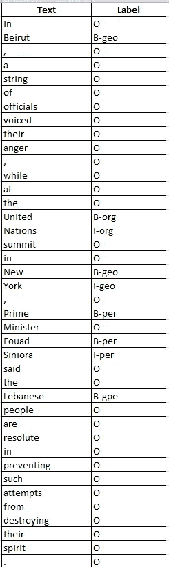

# 生物/ IOB 标记文本到原始文本

> 原文：<https://medium.com/analytics-vidhya/bio-tagged-text-to-original-text-99b05da6664?source=collection_archive---------0----------------------->


来源:https://stocksnap.io/photo/NLBN1GQQET

在这篇文章中，我们将看到如何将**简历**标签文本转换为原始文本。 **BIO / IOB** 格式(简称 **inside，outside，beginning】)是计算语言学(例如命名实体识别)。标签前的 **B-** 前缀表示标签是块的开始，标签前的 **I-** 前缀表示标签在块内。 **B-** 标签仅在一个标签后面跟一个相同类型的标签，且两者之间没有 O 标记时使用。一个 **O** 标签表示一个令牌不属于任何实体/块。**

下图显示了生物标记句子的样子:



最新的最先进的 NLP 技术称为**来自变压器的双向编码器表示(BERT)** 使用生物标记信息进行训练。并且从 BERT 返回的输出/预测被生物标记。所以现在我们应该把它转换回原来的文本，在这篇文章中我们将看到如何做到这一点。

属国

```
nltk
```

首先让我们导入依赖项:

```
from nltk import pos_tag
from nltk.tree import Tree
from nltk.chunk import conlltags2tree
```

现在我们创建变量来存储句子和标签。

```
tokens = ['In', 'Beirut', ',', 'a', 'string', 'of', 'officials',
          'voiced', 'their', 'anger', ',', 'while', 'at',
          'the', 'United', 'Nations', 'summit', 'in', 'New', 
          'York', ',', 'Prime', 'Minister', 'Fouad', 'Siniora',
          'said', 'the', 'Lebanese', 'people', 'are', 'resolute',
          'in', 'preventing', 'such', 'attempts', 'from',
          'destroying', 'their', 'spirit', '.']
tags = ['O', 'B-geo', 'O', 'O', 'O', 'O', 'O', 'O', 'O', 'O', 
        'O', 'O', 'O', 'O', 'B-org', 'I-org', 'O', 'O', 'B-geo', 
        'I-geo', 'O', 'B-per', 'O', 'B-per', 'I-per', 'O', 'O', 
        'B-gpe', 'O', 'O', 'O', 'O', 'O', 'O', 'O', 'O', 'O', 
        'O', 'O', 'O']
```

首先，我们需要用补充信息标记每个标记，比如它的词性。

```
pos_tags = [pos for token, pos in pos_tag(tokens)]
```

然后我们将 BIO / IOB 标签转换为 tree

```
conlltags = [(token, pos, tg) for token, pos, tg in zip(tokens, pos_tags, tags)]
ne_tree = conlltags2tree(conlltags)
```

最后，我们解析该树以获得原始文本

```
original_text = []
for subtree in ne_tree:
    # skipping 'O' tags
    if type(subtree) == Tree:
        original_label = subtree.label()
        original_string = " ".join([token for token, pos in subtree.leaves()])
        original_text.append((original_string, original_label))
print(original_text)
```

输出

```
[('Beirut', 'geo'),
 ('United Nations', 'org'),
 ('New York', 'geo'),
 ('Prime', 'per'),
 ('Fouad Siniora', 'per'),
 ('Lebanese', 'gpe')]
```

整个代码如下:

```
from nltk import pos_tag
from nltk.tree import Tree
from nltk.chunk import conlltags2treetokens = ['In', 'Beirut', ',', 'a', 'string', 'of', 'officials',
          'voiced', 'their', 'anger', ',', 'while', 'at',
          'the', 'United', 'Nations', 'summit', 'in', 'New', 
          'York', ',', 'Prime', 'Minister', 'Fouad', 'Siniora',
          'said', 'the', 'Lebanese', 'people', 'are', 'resolute',
          'in', 'preventing', 'such', 'attempts', 'from',
          'destroying', 'their', 'spirit', '.']
tags = ['O', 'B-geo', 'O', 'O', 'O', 'O', 'O', 'O', 'O', 'O', 
        'O', 'O', 'O', 'O', 'B-org', 'I-org', 'O', 'O', 'B-geo', 
        'I-geo', 'O', 'B-per', 'O', 'B-per', 'I-per', 'O', 'O', 
        'B-gpe', 'O', 'O', 'O', 'O', 'O', 'O', 'O', 'O', 'O', 
        'O', 'O', 'O']# tag each token with pos
pos_tags = [pos for token, pos in pos_tag(tokens)]
# convert the BIO / IOB tags to tree
conlltags = [(token, pos, tg) for token, pos, tg in zip(tokens, pos_tags, tags)]
ne_tree = conlltags2tree(conlltags)# parse the tree to get our original text
original_text = []
for subtree in ne_tree:
    # checking for 'O' tags
    if type(subtree) == Tree:
        original_label = subtree.label()
        original_string = " ".join([token for token, pos in                      subtree.leaves()])
        original_text.append((original_string, original_label))
print(original_text)
```

这样，我们可以将 BIO / IOB 标签转换为原始文本。

你可以在这里找到回购[。](https://github.com/jerilkuriakose/BIO-IOB-tags-to-original-text)

编码快乐！！！