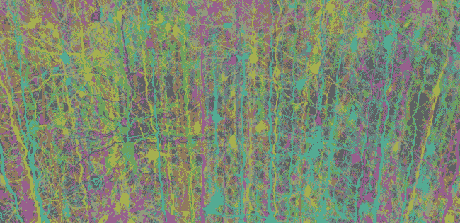
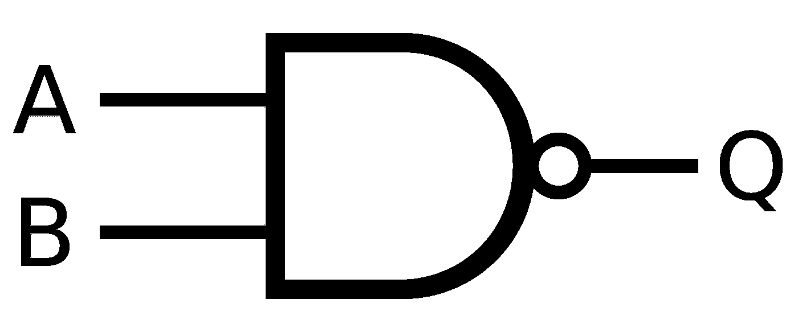
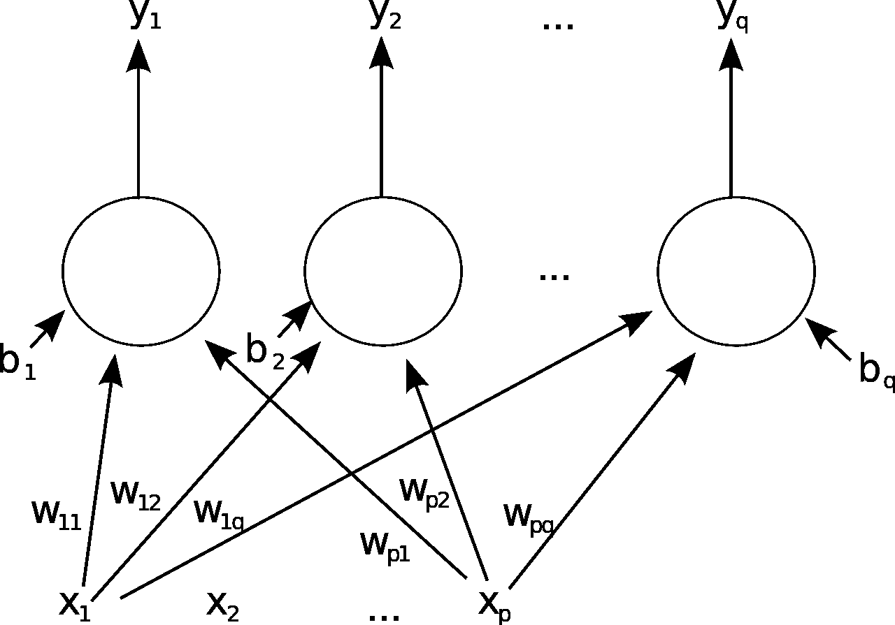

# 生物计算机:物理神经网络

> 原文：<https://medium.com/analytics-vidhya/biocomputers-physical-neural-nets-952f6c8c25d?source=collection_archive---------22----------------------->

这是基于我对自我复制机器理论的原创工作的系列文章中的第二篇。 [*第一篇*](/@calhoun137/self-replicating-computer-programs-8136bbbacc60) *讲的是生物程序，是自我复制的计算机程序。*

在这篇文章中，我为计算机设计了一种新的电子架构，从某种意义上说，它比现代计算机要高效得多。我将展示现代计算机是物理神经网络的一个特例，我称这个主题为生物计算机。我会解释我发现了什么，哪些领域需要进一步研究。

## 与非门和现代计算机

众所周知，现代计算机有一个处理指令和进行算术运算的中央处理器，但除此之外，几乎全部由与非门构成。

与非门

与非门很容易描述，它是一个晶体管，有 2 条线进来，一条线出去。输出线处于“接通”状态的条件是两条输入线不都“接通”，在这种情况下，输出线将“断开”

“物理神经元”是一个晶体管，它有任意数量的输入线和一条输出线，输出线只有在满足特定条件时才处于“导通”状态，这被称为“阈值功能”。阈值函数和进线数量是系统的自由参数。

归功于[神经网络和深度学习书籍](http://neuralnetworksanddeeplearning.com/chap1.html)对于这张图片，请查看那个链接！

生物计算机的第一个近似是一个物理对象，一个电路板，由物理神经元而不是与非门具体构成，但在其他方面与现代计算机相同。很明显，现代计算机是生物计算机的特例

## 电子架构和算法效率

众所周知，算法的效率取决于实现细节，可以用 Big-O 符号来衡量。例如，据说快速排序算法的效率为 O(nlogn)。

不太为人所知的是，算法的效率还取决于运行它的计算机的底层电子架构。这是生物计算机超越现代计算机的“指数”增益的来源。

虽然我们很快就会看到，这种效率指数增长的来源并不是任何类型的自我复制过程的直接结果，但是这种新的体系结构特别适合于本系列的[上一篇文章](/@calhoun137/self-replicating-computer-programs-8136bbbacc60)中描述的自我复制性质的程序。

一个简单的例子可以证明这一点。假设我们想写一个程序，给定任何两个小于 100 的数，它将返回第一个数除以第二个数的结果。很清楚如何在现代计算机上编写这样的程序，假设这种算法的效率为 e。我现在将演示一种构建效率为 O(1)的物理电路的方法，解决方案:为 2 个小于 100 的数字的所有 10，000 种可能组合创建一个查找表，然后无论输入哪 2 个数字，只需在表中查找即可。

为了了解这种效率上的指数增长如何与神经网络相关，我们可以将图像识别问题粗略地想象为“在 NP 类中”，但这些网络似乎至少在实验上“在 P 时间内”解决了这种类型的问题。

## 动态电子架构

更一般的生物计算机区别于现代计算机的主要方面是，随着它的使用，它的基础电子架构被修改，随着时间的推移，它变得更有效，特别是对于它更频繁使用的东西。

为了便于讨论，设想一个具有任意层数的神经网络，其中每一层中的每个物理神经元都有一个常数，比如说 25 条来自前一层的导线。

这个过程的工作方式是一种新型的处理器，它也包含在生物计算机中，将使用机器学习算法来调整所有电线的重量，以及各种节点的阈值函数，同时使用计算机。

## 进一步研究的领域

在我写这封信的时候，这个过程的许多方面我还没有完全理解，但是我相信在这方面还有很多工作要做。

主要的想法是从生物计算机的角度遵循大脑的工作方式，并使用纯数学和计算机科学的方法在物理生物计算机中复制这些类型的功能。

没有必要从动态生成新层、打开和关闭节点、进行反馈或我们在人脑中看到的任何其他事情的起点开始。

一个更好的起点是用晶体管建造一台物理生物计算机，并开始确定所需的最重要的研究领域，并为这一令人兴奋的计算机科学新领域构建一个更详细的攻击计划

在下一篇文章中，我将解释生物计算机的计算能力如何引导我对 P vs NP 问题进行新的推测

## TL；博士；医生

生物计算机是具有新型处理器的物理神经网络，随着时间的推移，它们在最常用的事情上变得更快，这为科学研究提供了新的途径。